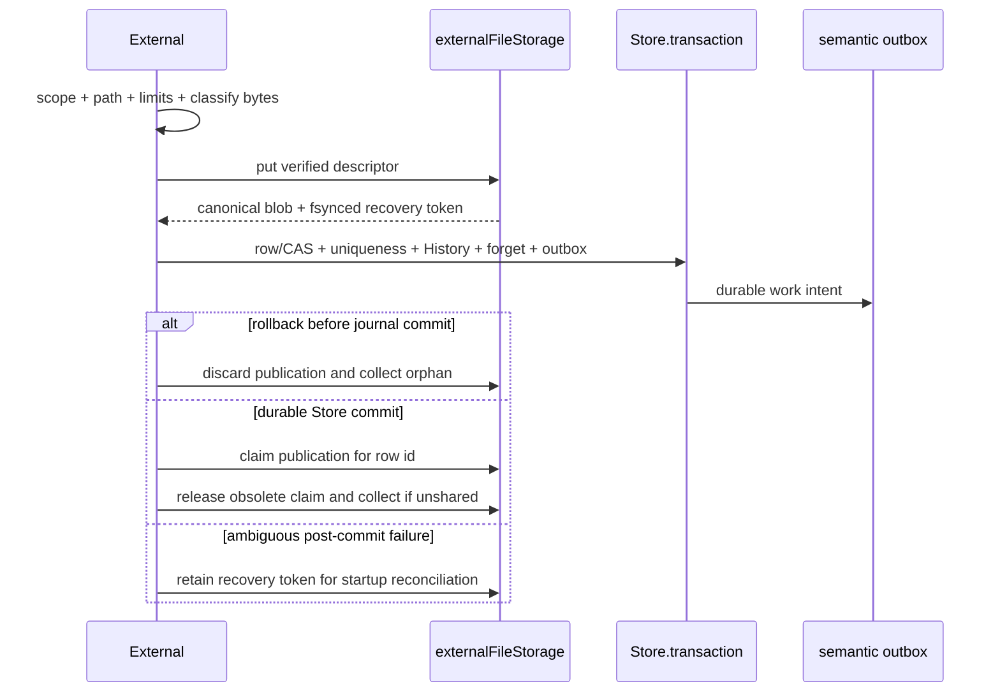

# External files

The project-scoped authority for native files. External owns upload admission,
native descriptor derivation, storage coordination, represented identity,
virtual paths/directories, lifecycle History, authorized download, typed
reference safety, re-upload, and deletion. It provides a library and manager;
it does not provide a file editor.

## Ownership

External owns:

- authenticated project/user scope for every read and mutation;
- canonical relative paths and project-local uniqueness;
- SHA-256, actual byte size, `_storage:<sha256>`, byte-first media type, and
  current `text | code | data | image | audio | video | unknown` subkind;
- the strict `externalFiles` row and its revision;
- durable lifecycle History and semantic outbox intent;
- the decision to delegate text, code, data, or image meaning;
- reference-safe deletion and post-commit native cleanup.

`external-file-storage` alone performs native filesystem I/O. The semantic
overlay reads a committed, authorized resource through External's storage port;
it never hashes uploads, chooses paths, publishes bytes, or removes blobs.

## Strict current row

Every admitted row requires exactly the current fields:

```ts
{
  _id, _creationTime, projectId,
  name, originalName, relativePath,
  mediaType, subkind,
  storageId, hash, size,
  origin, createdBy, updatedBy,
  semanticContext?, revision, updatedAt
}
```

Admission validates exact fields, canonical IDs and actors, NFC names without
control/path characters, path/name agreement, configured UTF-8 path length,
lowercase SHA-256, storage-ID/hash agreement, non-negative safe size, positive
safe revision, bounded media type and dataset context, and subkind agreement
with media type/name. There are no migrations, aliases, synthesized defaults,
old readers, or compatibility paths.

## Procedures

| Procedure | Contract |
| --- | --- |
| `readExternalFileLibrary` | Strict project inventory, virtual-directory projection, pre-indexed semantic status, and current limits |
| `readExternalFile` | One project-owned admitted row plus verified availability, typed References, and conditional semantic projection |
| `readExternalFileHistory` | Newest 200 durable project lifecycle events, including deleted files |
| `uploadExternalFiles` | Mixed-result bounded file/folder ingestion; each file independently atomic |
| `reuploadExternalFile` | CAS replacement of bytes on the same id/name/path with atomic revision, History, forget, and outbox |
| `renameExternalFile` | CAS local-name and path-leaf update through the common path rule |
| `relocateExternalFile` | CAS destination-directory change with uniqueness rejection |
| `relocateExternalDirectory` | Descendant-token CAS and one transaction for every member path, History record, semantic forget, and outbox entry |
| `updateExternalFileContext` | CAS add/clear of bounded authored CSV/TSV context with atomic semantic refresh intent |
| `removeExternalFile` | Complete typed-usage refusal, CAS deletion, atomic History/forget/outbox, then native claim release/GC |
| `readExternalFileContent` | Server-only authorization and verified native-byte resolution for the attachment route |

## Mutation protocol

Every mutation that introduces bytes follows the same publication protocol:



Upload creates revision 1. Rename, file move, context change, and re-upload
require the selected base revision and advance it once. Directory relocation
checks one token over every descendant id/revision/path and updates all members
inside one Store transaction. Deletion rechecks both revision and live usage in
its transaction. A process-local mutation queue reduces duplicate work but is
not a correctness boundary.

The Store transaction always owns the complete represented decision: External
row change, path uniqueness, lifecycle event, `forgetSemanticResourceFor`, and
`enqueueSemanticOutboxFor`. External never makes direct semantic
enqueue/retirement calls outside that unit of work.

## Native publication and recovery

`admitNativeFile` derives the descriptor. Byte signatures for supported image,
PDF/ZIP, audio, and video formats take precedence over a caller-supplied MIME
type; canonical extensions then distinguish prose, source code, and structured
data.

Storage publishes a mode-0600 fsynced recovery copy and hard-links the canonical
content address. After the Store transaction commits, the row ID becomes a
durable hash claim and the publication copy is discarded. Ambiguous completion
claims every readable row sharing that receipt; otherwise the recovery copy is
left for startup. Removal first renames
the canonical blob into a quarantine name, then rechecks claims and active
publications; a concurrent claimant restores the canonical link. Equal hashes
can therefore be shared across files and projects without premature deletion.

At startup, Store construction performs journal recovery first. Runtime then
strictly admits every External row and asks storage to reconcile those
authoritative claims. Reconciliation restores represented bytes from a complete
publication/quarantine artifact, recreates missing claims, and removes stale
temporary files, stale claims, and genuinely unreferenced blobs. A represented
row without recoverable bytes fails startup rather than silently degrading.

## Semantic routing

| Current subkind | Lane | Worker input |
| --- | --- | --- |
| `text` | exact | Verified UTF-8 prose/Markdown, one content-hashed source with exact locators |
| `code` | material | Bounded code profile; optional generated description from a deterministic source excerpt |
| `data` | material when supported | CSV/TSV bounded profile plus optional authored dataset context |
| `image` | material | Original verified pixels as a native visual facet; no generated description |
| `audio`, `video`, `unknown` | none | Stored, managed, and downloadable only |

PDF and Office/container files are retained as `unknown` with an admitted media
type and receive no extraction, OCR, preview, or semantic job. Semantic provider
work is asynchronous; outbox intent is nevertheless atomic with every source
revision.

## Complete reference safety

`EXTERNAL_REFERENCE_POLICY` is an exhaustive `Record<TableName, ...>`. Adding a
representation table is a compile error until its deletion semantics are
classified. The traversal explicitly understands current identity locations in
document/presentation leaders, spreadsheet cells, templates, resource sets, findings,
questions, hypotheses, comments, research, conversation attachments,
persona/agent/automation scopes, Derived Output state/jobs, variables, and
formulas. It does not recursively search arbitrary strings.

Activity, change sets, non-leader snapshots, template versions, semantic
history/caches, and Derived Output evidence are historical by-value records and
do not block deletion. Workspace focus is transient navigation and also does
not block. Cross-project rows are never disclosed or treated as ownership.

## User-visible shape

External is one category singleton. The Content view owns upload, Table and
Directory projections, breadcrumbs, navigation, search, filters, sorting, and
selection. Context owns Overview and durable History. Inspector owns file and
directory management actions. New Tab and Project Overview launchers open the
same singleton with a file focused; they preserve every other current resource
kind and opening behavior.

## Module map

- `types/read.ts`, `upload.ts`, `mutations.ts`, and `content.ts` define public
  contracts by operation; `types/shared.ts` contains only concepts they share.
- Each `api/<procedure>/<procedure>.ts` is one public capability chain, with a
  sibling validator where admission is non-trivial.
- Upload is a short coordinator over admission, publication/settlement,
  transaction, contracts, and outcomes. Native publication receives only the
  exact storage contract, never a wider upload descriptor.
- `api/shared/usage/` contains domain scanners for resources, investigations,
  conversations, agents, and outputs. `usage.ts` is the aggregation entry.
- Unit tests are partitioned into admission, storage lifecycle, mutations,
  replacement/context, history, and validation. Non-functional tests keep
  atomicity, ownership, concurrency, and live-reference policy separate.
