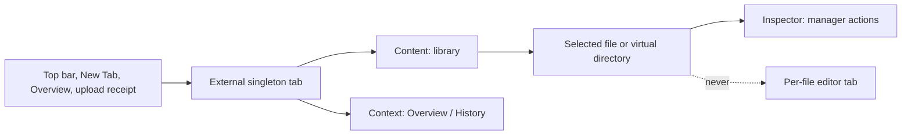
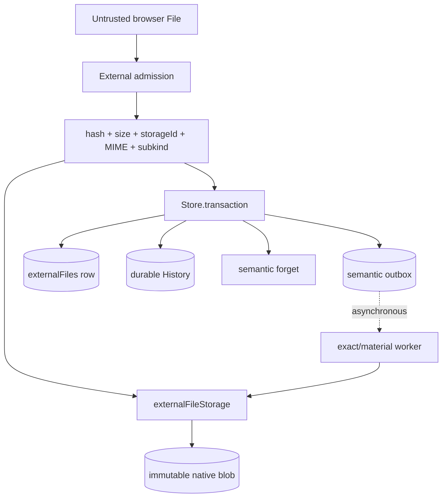
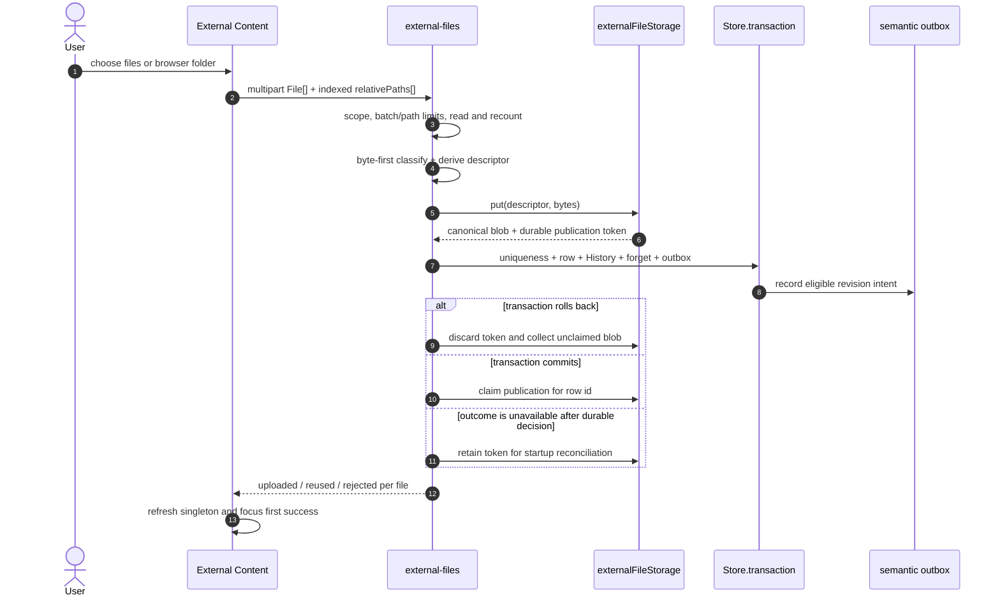
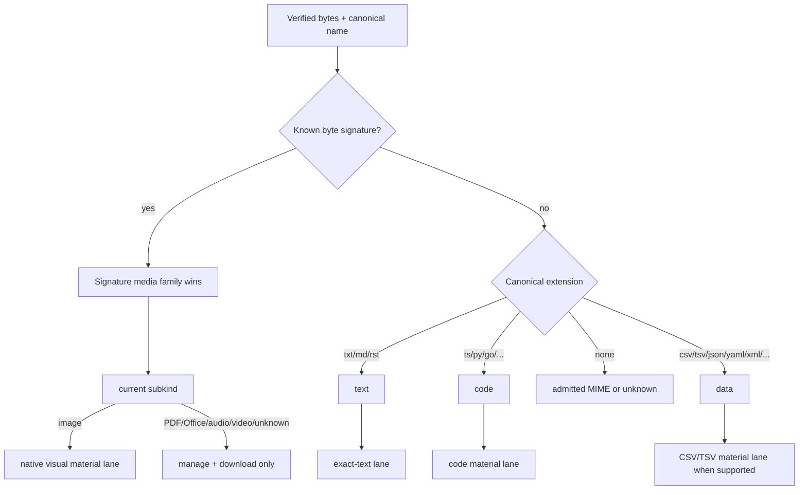
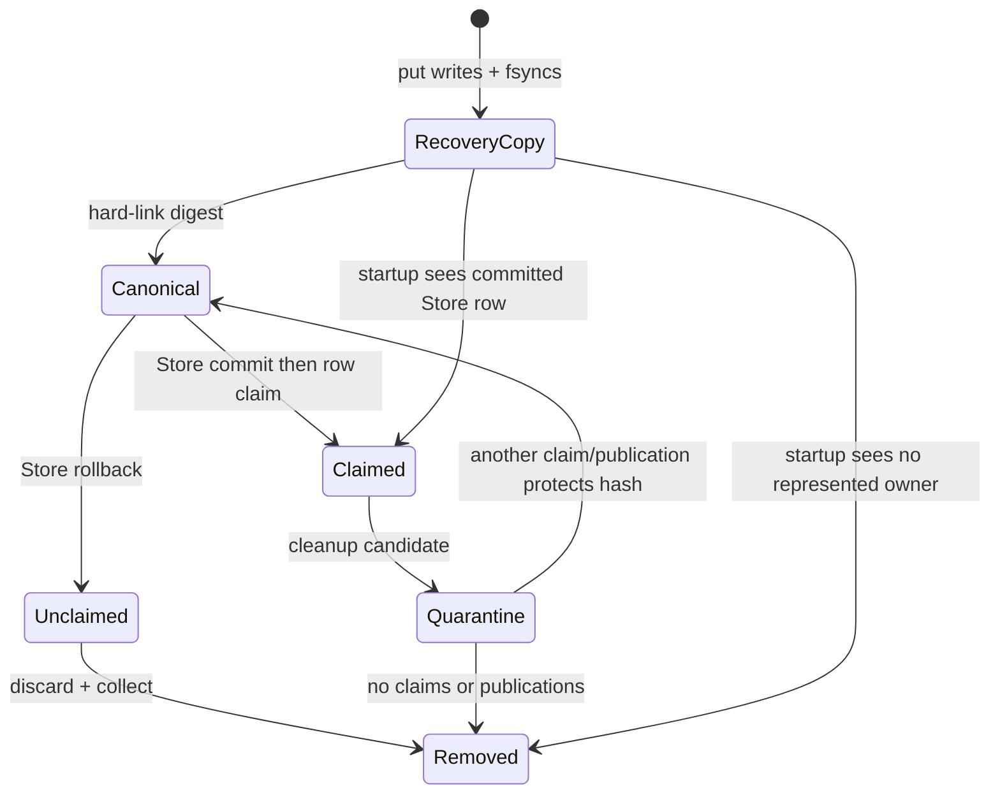
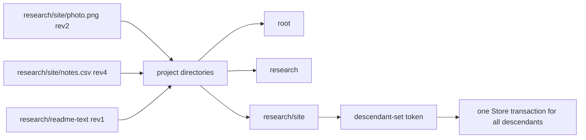

# External files — implemented reference

Status: current implementation on `work/external-files`, rebased onto
`origin/main` at `9f9a13e`. This document describes running code, not a proposed
contract and not a compatibility design.

Rendered references:

- `/demo/external-files` — ownership, invariants, and system topology;
- `/demo/external-files/ingestion` — admission, classification, transactions,
  native publication, failure recovery, and semantic routing;
- `/demo/external-files/stable-tab` — interactive Content, Context, and
  Inspector manager specimen;
- `/demo/external-files/file-plan` — implemented file/change/test ledger;
- `/demo/external-files/implementation` — consolidated lessons from building it;
- `/app/dev-project` — the actual External product surface.

## 1. Product definition

**External** is a project-scoped library for resources that do not have an
Icarus editor. It is a permanent singleton tab like Overview and Templates.
Files are managed *inside* that tab; selecting a file never opens a file-type
editor or creates another workspace tab. Findings can become another managed
kind later, but are intentionally outside this implementation.

The three panels have distinct jobs:

| Surface | Responsibility | Explicit non-responsibility |
| --- | --- | --- |
| Content | file/folder upload, Table and Directory views, breadcrumbs, navigation, search, kind/semantic filters, sort, selection, mixed-result receipts | previewing or editing file content; lifecycle controls on every row |
| Context | library Overview and durable History | file-specific actions or generated descriptions |
| Inspector | selected file/directory identity and actions; availability, details, references, dataset context, semantic status, generated description when present | source-body editing, file-type viewers, hash/storage internals |



The singleton key and `TabRecord.id` are `external`. An optional file focus and
an `external-file` or `external-directory` selection drive Inspector state, but
are not tab identity. New Tab search and Project Overview discover files by
opening this same singleton with the file focused. All existing resource types
retain their prior opening behavior.

## 2. Ownership and delegation

External is the umbrella capability for native files. It owns:

- authenticated scope and project ownership;
- hostile-input admission and configured bounds;
- canonical project-relative file paths;
- SHA-256, actual size, storage ID, media type, and subkind;
- native publication coordination and blob reclamation;
- the strict `externalFiles` representation row;
- revision/CAS and path-uniqueness decisions;
- virtual directory projection and subtree relocation;
- durable lifecycle History;
- typed reference safety and deletion policy;
- semantic forget/outbox intent for each authoritative revision;
- authorized attachment response metadata.

`external-file-storage` is External's native-I/O subsystem. It owns every
filesystem call, the content-addressed repository, publication recovery files,
represented-row claims, garbage quarantines, integrity verification, and startup
reconciliation. No other model opens native External storage.

The semantic overlay does not manage bytes. It receives a committed External
resource reference and, when eligible, borrows verified content through
`externalFileStorage` to create exact text or a material representation.



## 3. One strict current row schema

There is no legacy External schema. Reads neither migrate nor synthesize
required values. Development fixtures are current rows.

```ts
type ExternalFile = {
  _id: Id<"externalFiles">;
  _creationTime: number;
  projectId: Id<"projects">;
  name: string;
  originalName: string;
  relativePath: string;
  mediaType: string;
  subkind: "text" | "code" | "data" | "image" |
    "audio" | "video" | "unknown";
  storageId: Id<"_storage">;
  hash: string;
  size: number;
  origin: { kind: "upload" } | ConnectorOrigin;
  createdBy: Actor;
  updatedBy: Actor;
  semanticContext?: string;
  revision: number;
  updatedAt: number;
};
```

Admission checks all of these invariants:

1. Only the exact current field set is accepted; `semanticContext` is the sole
   optional field.
2. The External row ID is Store-minted in the `externalFiles:` namespace.
   Project and actor identities use the current Store's opaque, trimmed NFC,
   control-free bounded identity form; no route token is persisted as either.
   Storage identity is content-addressed as described below.
3. `name` and `originalName` are trimmed NFC text, at most 240 characters, with
   no slash, backslash, NUL, C0, or DEL control character.
4. `relativePath` is canonical NFC project metadata, never a native path. It is
   relative, contains no empty/`.`/`..` segment or control character, and obeys
   the one configured UTF-8 path-byte ceiling.
5. The path leaf equals `name` exactly.
6. `hash` is lowercase 64-hex SHA-256 and `storageId` is exactly
   `_storage:<hash>`.
7. `size` is a non-negative safe integer and every native read must recount it.
8. `mediaType` is bounded printable ASCII and `subkind` agrees with current
   classification rules for the type/name.
9. `revision` is a positive safe integer; creation/update times are finite and
   non-negative.
10. Dataset context is trimmed NFC, non-empty when present, NUL-free, and at
    most 4,000 characters.

Malformed rows are quarantined from library projections and fail strict startup
admission. There are no `legacyDirectory` reads, `data/materials` fallbacks,
text aliases, optional required values, workspace adoption, or migration paths.

## 4. Ingestion

File upload and browser-directory upload use the same capability. A directory
selection is a bounded list of files plus aligned `webkitRelativePath` values;
directories are not uploaded or persisted as rows.



The enhanced forms explicitly declare `multipart/form-data`. Directory paths are
rendered into real indexed hidden controls beside the selected files; assigning
only remote-form state does not make browser-only paths successful form controls.

Implemented configuration:

| Rule | Value |
| --- | ---: |
| files per batch | 100 |
| received bytes per file | 50,000,000 |
| received bytes per batch | 250,000,000 |
| canonical relative path | 512 UTF-8 bytes |
| authorized download response | 50,000,000 bytes |

The remote form buffers each selected `File`; v1 is bounded but not streaming or
resumable. Each candidate is independently atomic, so a batch can report mixed
success without leaving a half-created file.

An occupied project path has two outcomes: equal hash reuses the current row;
different bytes reject with a path conflict and direct the user to explicit
Re-upload. Upload never silently changes an existing identity.

## 5. Byte-first classification and semantic lanes

Caller MIME is a hint, never authority. Recognized signatures for PNG, JPEG,
GIF, WebP, PDF, ZIP, MP3, WAV, and MP4 are evaluated first. Canonical extensions
then distinguish prose, source code, and structured data. A syntactically valid
remaining MIME can describe managed-only bytes; otherwise the media type is
`application/octet-stream`.



| Family | Current subkind | Semantic behavior | Inspector behavior |
| --- | --- | --- | --- |
| Plain text, Markdown, comparable prose | `text` | exact lane; verified UTF-8 up to 5 MB, one content-hashed source with exact locators | exact semantic status; no generated summary |
| Programming source | `code` | material lane; bounded code profile and optional generated description using a deterministic 64 KB head/tail excerpt | profile/status and description only when produced |
| CSV/TSV | `data` | material lane; bounded sampled profile and optional authored context | editable dataset context, status, optional description |
| JSON/XML/YAML/TOML | `data` | stored; current material adapter may produce no seed | truthful managed/no-output state |
| Image | `image` | original verified pixels become one native visual facet when at most 5 MB | direct-visual status; no generated text summary or preview |
| PDF/Office/archive | `unknown` with admitted MIME | no semantic work | details, references, download, lifecycle only |
| Audio/video | `audio` / `video` | no semantic work | details, references, download, lifecycle only |
| Other bytes | `unknown` | no semantic work | details, references, download, lifecycle only |

Storage success never depends on provider availability. Semantic outbox intent
does commit with the authoritative row revision, while parsing, description,
embedding, and index publication remain asynchronous queue/lease work.

## 6. Atomic mutation protocol

Every represented mutation follows the same Store rule:

> In one `Store.transaction`, validate ownership and CAS, enforce path
> uniqueness, change the External row, append lifecycle History, call
> `forgetSemanticResourceFor(...)`, and call
> `enqueueSemanticOutboxFor(...)` for the resulting revision.

| Mutation | CAS / collision boundary | Row result | Native post-commit work |
| --- | --- | --- | --- |
| Upload | project path inside transaction | create revision 1 | claim new publication |
| Rename | file id + base revision; same directory/new leaf unique | update name/path, revision +1 | none |
| File move | file id + base revision; destination directory/new path unique | update path, revision +1 | none |
| Directory move/rename | opaque token over every descendant id/revision/path; every destination unique | update all descendants once, each revision +1 | none |
| Dataset context | file id + base revision; `data` only | set/clear context, revision +1 | none |
| Re-upload | file id + base revision | same id/name/path, new receipt, revision +1 | claim new publication, release predecessor claim, collect if unshared |
| Delete | file id + base revision + zero live usage | remove row; deletion outbox uses next revision | release row claim, collect if unshared |

Directory relocation does not call a public table-replacement escape hatch. It
updates every admitted descendant in a single Store unit of work, writes History
and semantic outbox intent there, and publishes one journaled transaction.

The process-local mutation queue is only an optimization. Correctness comes from
Store CAS/transactions plus durable native publication and claim state.

## 7. Native storage, crash recovery, and shared hashes

Repository entries are deliberately internal:

```text
data/external-files/
├── <sha256>                                  canonical immutable bytes
├── .publish.<sha256>.<uuid>.next             fsynced recovery copy
├── .claim.<sha256>.<digest(externalFileId)>  represented owner claim
└── .garbage.<sha256>.<uuid>.next             removal quarantine
```

Publication writes and fsyncs a mode-0600 recovery copy, then hard-links the
canonical digest and fsyncs the directory. A successful Store row claim is made
visible before its recovery copy is removed. If another file has equal bytes,
it receives its own claim while sharing the canonical blob. Ambiguous Store
completion claims the receipt for every readable owner of that hash, while an
unavailable post-commit Store leaves the recovery copy for startup.

Collection first atomically renames the canonical blob into a unique quarantine.
It then rechecks row claims and in-progress publication copies. If protected, it
restores the canonical link from quarantine and reports `claimed`; otherwise it
deletes the quarantine. This closes cross-process publication/deletion races
without treating the in-process queue as a lock of record.



Startup order is mandatory:

1. Store constructor completes transaction-journal recovery.
2. Runtime reads and strictly admits every current External row.
3. `externalFileStorage.reconcile` receives those authoritative row claims.
4. Reconciliation restores missing canonical bytes from valid publication or
   quarantine artifacts, recreates missing claims, and removes stale
   publication/quarantine/claim files and unreferenced canonical blobs.
5. A represented row with no recoverable bytes fails startup.

This covers process interruption at every post-commit Store failpoint as well as
interrupted native publication and collection. Repeated reconciliation is
idempotent.

## 8. Directory projection

Folders are calculated from admitted `relativePath` values. The projection emits
root and every ancestor with parent/name/path, direct file and child-directory
counts, descendant count, known-byte total, and an opaque revision token over
sorted descendant file ID, revision, and path. No native directory is created
and native blobs never move when project paths change.



A directory cannot move into itself, to its same path, or onto any conflicting
file path. The configured path-byte rule is applied to source, destination, and
every resulting descendant path before mutation.

## 9. Complete reference safety

Deletion does not recursively search arbitrary objects for matching strings.
`EXTERNAL_REFERENCE_POLICY` exhaustively maps every current Store table to a
reference policy. Because it satisfies `Record<TableName, ...>`, a new table is a
compile failure until its policy is declared.

The typed traversal understands references in:

- leader document bodies, headers, footers, marks, atoms, nested tables, prompts,
  formulas, and image blocks;
- leader deck themes/layouts/backgrounds, grouped/nested elements, notes, and
  content blocks;
- spreadsheet cell values and marks;
- current templates and resource sets;
- findings and their sources; questions; hypotheses;
- comment targets, bodies, mentions, research turns, and conversation
  attachments;
- persona, agent-task, and automation scopes/origins/outputs/triggers;
- current Derived Output origins, scopes, template-variable origins, last
  responses, and refresh-job selection;
- variables and formulas.

Only live identity-bearing locations block deletion. Activity, change sets,
non-leader snapshots, template versions, semantic histories/caches, and Derived
Output evidence are historical by-value records and remain readable after
deletion. Workspace focus is transient navigation, not represented usage.
Cross-project rows are never disclosed and never authorize a mutation.

## 10. Inspector and library details

File actions appear together at the top: Rename, Re-upload, Download, Move, and
Delete. Name and path/destination can also be entered from the compact identity
area. The remaining file Inspector is review-oriented:

- current local name/path and immutable original upload name;
- media type, subkind, actual size, revision, upload/update timestamps and actors;
- native availability (`available`, `missing`, or integrity failure behavior);
- references count and named typed usages;
- authored dataset context only for `data` resources;
- semantic status for the eligible exact/material lane;
- generated description only when a material descriptor really exists;
- no hash, storage ID, source editor, preview, or fake summary.

The directory Inspector shows projected counts/bytes and offers subtree Rename
and Move. A path change reorders the Directory projection after refetch.

History records `uploaded`, `re-uploaded`, `renamed`, `moved`,
`context-updated`, and `deleted`, including actor, timestamp, name/path, and a
bounded operation detail. It is project scoped, newest first, capped at 200, and
independent of the current file row, so deletion does not erase the audit trail.

Downloads are authorized per project and always attachments. The route returns
verified bytes with safe ASCII `filename`, encoded UTF-8 `filename*`, SHA-256
ETag, private/no-cache, `nosniff`, sandbox CSP, accepted single byte ranges, and
an explicit size ceiling. It never embeds or executes arbitrary file content.

## 11. Implementation structure

Stateful UI components have explicit instance-owned state objects:

- `library.state.svelte.ts` owns library query/view/filter/sort/navigation state;
- `file.state.svelte.ts` owns one file Inspector's drafts and action state;
- `directory.state.svelte.ts` owns one directory Inspector's drafts/actions.

Effectful entry chains are named modules under `procedures/effects/`; uploads,
downloads, reads, selection, file/directory mutation, and History are not inline
anonymous asynchronous commands. Pure projection/formatting work lives in
`library-query.ts` and `detail-query.ts`. This keeps each state lifetime local
and makes architecture checks describe actual ownership.

The current main architecture remains intact: Store journal/recovery and
failpoints, atomic semantic outbox, queue leases, operationFlights, and split
Derived Output resource-reading modules all remain authoritative. External was
adapted to them; none was replaced with a pre-rebase version.

## 12. What implementation taught us

1. Multipart form encoding is part of the transport contract; SvelteKit file
   fields require an explicit `multipart/form-data` form.
2. Browser directory paths exist only on `webkitRelativePath`; real indexed
   hidden controls are necessary to preserve them through enhanced submission.
3. Reactive remote-form results can have proxy identity, so receipt consumption
   uses a stable serialized signature rather than object identity.
4. A focus-restoration effect must not overwrite deliberate virtual-directory
   selection.
5. Hashing/classification belongs in External admission; filesystem persistence
   belongs in `external-file-storage`; semantic processing consumes a reference.
6. Store rollback alone cannot settle native bytes. Fsynced recovery copies,
   row-owned claims, quarantine-and-recheck GC, and post-journal reconciliation
   make the boundary crash recoverable and safe across processes.
7. History and semantic outbox cannot be follow-up calls. Keeping them in the
   row transaction prevents partial lifecycle truth at every failpoint.
8. Delete must emit semantic removal intent as well as forget current artifacts;
   the deletion revision is one greater than the removed source revision.
9. Folder relocation needs a set-level CAS token and one transaction, not a loop
   of individually durable file changes.
10. Reference safety must be table-exhaustive and type-aware. Historical copies
    are evidence, not live identities; arbitrary string matching confuses them.
11. Text and code cannot share a convenient umbrella classification: prose needs
    exact quoteability while code needs a bounded material profile.
12. Signature precedence is a security property. A PDF named `.txt` and declared
    `text/plain` must remain a PDF and must not enter exact semantics.
13. Semantic status must be indexed once per library read rather than scanning
    every semantic table once per file.
14. The Inspector is a narrow manager, so top-aligned actions and progressive
    review sections work better than an editor-shaped surface.
15. Generated descriptions are conditional data, not a promised field. Exact
    text and native images must not show invented summary UI.

## 13. Deliberate v1 boundaries

- Findings management is deferred.
- Multipart upload is bounded and buffered, not resumable/streaming.
- There is no source editor, file preview, PDF/Office parser, OCR, archive
  extraction, media playback, or transcription.
- There is no prior-revision browser or restore action after re-upload.
- Semantic providers/workers may be absent in a development environment; this
  affects downstream generation, not ingestion durability.
- The current native repository is filesystem-backed. The claim/publication
  protocol supports correctness across processes sharing that filesystem, but a
  remote object-store backend would need an equivalent conditional protocol.

These are explicit capability boundaries, not compatibility concessions.
