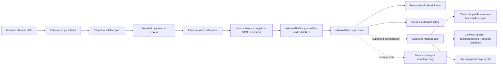

# External files — as implemented

Status: implemented and browser-tested on `work/external-files`, from the
`work/derived-output-architecture` snapshot at `1166f8e`.

This is an implementation reference, not a build contract. The rendered suite is:

- `/demo/external-files` — system boundaries and invariants;
- `/demo/external-files/ingestion` — upload, re-upload, format routing, failure and security;
- `/demo/external-files/stable-tab` — interactive Content, Context and Inspector mock;
- `/demo/external-files/file-plan` — exact implementation ledger and verification map;
- `/demo/external-files/implementation` — consolidated implementation learnings;
- `/app/dev-project` — the actual production External surface.

## Responsibility boundary

External is the umbrella capability for native files. It owns admission, identity,
classification, storage coordination, the project resource row, path management,
history, authorized download, reference-safe deletion, and delegation of supported
meaning.

The semantic material lane does not own general byte management. It receives an
authorized External resource reference, asks External's storage model for the
verified value it needs, and produces a derived profile, descriptor, or embedding.



The usable-file boundary is a verified native receipt plus an admitted
`externalFiles` row. Semantic work is downstream and never determines whether
an upload succeeded.

## Durable state

Every new `externalFiles` row writes:

- a project-scoped opaque id;
- current local `name` and canonical `relativePath`;
- immutable `originalName` from the selected File;
- server-derived `mediaType` and `subkind`;
- External-derived `storageId`, lowercase SHA-256 `hash`, and actual byte
  `size`;
- optional authored `semanticContext` for an ambiguous CSV/TSV dataset;
- upload/connector origin, creator, updater and update time;
- compare-and-swap `revision`, beginning at 1.

Older rows may lack the newer fields. Strict External admission supplies bounded
fallbacks (name-derived path, inferred subkind, unknown size, creator as updater,
revision 0) and quarantines malformed rows instead of leaking partial metadata.

Folders are not durable rows. `readExternalFileLibrary` projects root and every
ancestor directory from canonical file paths. Each projected directory has:

- parent/name/path;
- direct file and direct child-directory counts;
- descendant file count and known-byte total;
- unknown-size count for legacy rows;
- an opaque SHA-256 token over descendant file id, revision and path.

That token is the compare-and-swap boundary for a directory rename/move.

Lifecycle history is durable and separate from the current file row. External
appends project-scoped activity events for `uploaded`, `re-uploaded`,
`renamed`, `moved`, `context-updated`, and `deleted`; the read projection
returns the newest 200. A deleted file therefore remains visible in History.

## Native storage contract

External calculates the native descriptor:

```ts
{
  storageId: `_storage:${sha256}`,
  hash: sha256,
  size: receivedBytes.byteLength,
  mediaType: signatureAndNameAwareType,
  subkind: "text" | "code" | "data" | "image" | "audio" | "video" | "unknown"
}
```

`externalFileStorage` is deliberately narrow:

```ts
acquireMutation(): Promise<release>
put({ storageId, hash, size, bytes, maxBytes? }): verified receipt
read({ storageId, hash, size? }): verified Uint8Array | undefined
remove({ storageId, hash, size? }): boolean
```

It never discovers hash, size, MIME, subkind, project or actor. It defensively
checks storage id ↔ hash, hash ↔ bytes, size ↔ bytes, and the I/O ceiling; verifies
existing bytes before reuse; writes a unique complete sibling using `wx`; and
atomically renames it to the digest. Reads re-hash and optionally re-count.
Removal is idempotent.

New values live in `data/external-files`. Reads/removals also check the configured
legacy `data/materials` repository so rows written before the boundary change
remain usable. There is no eager migration.

The mutation lease serializes the interval that spans native publication and its
row claim with deletion/reclamation. This is process-local, matching the current
JSON-store deployment. Multi-process operation requires a shared claim/lock or a
transactional object-store protocol.

## Initial upload

```mermaid
sequenceDiagram
  autonumber
  actor User
  participant UI as External Content
  participant Ext as external-files
  participant Native as externalFileStorage
  participant Rows as representation store
  participant Hist as History
  participant Sem as semantic-overlay

  User->>UI: choose files or a browser directory
  UI->>Ext: multipart File[] + indexed relativePaths[]
  Ext->>Ext: scope, form/batch/path limits
  loop every candidate
    Ext->>Ext: read/recount bytes; derive complete descriptor
    Ext->>Native: put descriptor + bytes
    Native-->>Ext: verified/reused receipt
    Ext->>Rows: compare canonical project path
    alt same path + same hash
      Rows-->>Ext: reuse current row
    else same path + different hash
      Rows-->>Ext: reject and direct user to Re-upload
    else free path
      Ext->>Rows: create revision-1 row
      Ext->>Hist: append uploaded event
    end
    Ext->>Sem: enqueue only an eligible material target
  end
  Ext-->>UI: ordered uploaded/reused/rejected outcomes
  UI->>UI: refresh library and focus first success
```

The two forms explicitly declare `multipart/form-data`. A browser directory's
`webkitRelativePath` is copied into actual indexed hidden controls. This matters:
the enhanced form serializes successful DOM controls; assigning only a remote
field object caused real nested paths to disappear in Chromium.

Implemented bounds are 100 files per batch, 50,000,000 bytes per file,
250,000,000 bytes per batch, and 512 UTF-8 bytes per normalized path. The remote
form buffers each `File`; this is bounded, not streaming or resumable.

Path admission normalizes NFC and backslashes, then rejects absolute/drive roots,
NUL, empty segments, `.`, `..`, duplicate canonical paths, and excess byte
length. A relative path is display/project metadata and is never joined to the
server's native repository.

Signature checks currently recognize PNG, JPEG, GIF, WebP, PDF and ZIP. Known
CSV/TSV and textual/code extensions are canonicalized before arbitrary browser
MIME; otherwise a valid `text/*` type joins the same code-profile family. A remaining syntactically valid MIME
can be retained; otherwise the value is `application/octet-stream`. Unknown
format is a valid stored outcome.

Each candidate has its own outcome. A native failure creates no row. A row failure
after publication attempts to reclaim an unclaimed non-reused value. A semantic
enqueue failure is attached to a successful file receipt. No filesystem,
represented-store, History and semantic-store transaction is claimed.

## Explicit re-upload

Uploading different bytes to an occupied path is not an implicit update.
Re-upload is a distinct file-Inspector action:

```mermaid
sequenceDiagram
  autonumber
  actor User
  participant Inspector
  participant Ext as external-files
  participant Native as externalFileStorage
  participant Sem as semantic-overlay
  participant Row as same externalFiles row
  participant Hist as History

  User->>Inspector: Re-upload and choose new File
  Inspector->>Ext: row id + base revision + File
  Ext->>Ext: authorize, bound, derive descriptor
  Ext->>Native: publish candidate
  Ext->>Sem: retire old semantic products
  alt retirement or row update fails
    Ext->>Native: compensate candidate when unclaimed
    Ext-->>Inspector: rejected; original row remains authoritative
  else accepted
    Ext->>Row: same id/name/path/originalName; new receipt; revision + 1
    Ext->>Hist: append re-uploaded
    Ext->>Sem: enqueue supported new material
    Ext->>Native: reclaim previous hash only when unshared
    Ext-->>Inspector: same resource URL and references
  end
```

There is no prior-version browser or restore action. When old bytes are no longer
shared, successful re-upload reclaims them immediately.

## Semantic routing

External never enters the exact semantic lane. Legacy
`externalFile::text` exact sources are treated as stale.

| Family | External treatment | Material treatment |
| --- | --- | --- |
| Plain text / Markdown / XML / source code | store and manage as subkind `code` | strict UTF-8 bounded code profile; source-backed generated descriptor |
| CSV / TSV | same, subkind `data`; editable authored context | bounded sampled profile; optional descriptor incorporating context |
| Image | same, subkind `image` | original pixels embedded directly as one native visual facet; no text facets or generated summary |
| PDF / Office / archive | store, manage, download | none |
| Audio / video | store, manage, download | none |
| Unknown | store, manage, download | none |

Plain text and source code share `externalFile::code`; `text` survives only as a
legacy stored value that canonicalizes on read. The code profile produces
language and line facts plus import, export, symbol and warning facts when those
structures exist. Its descriptor receives a deterministic 64,000-byte head/tail
excerpt of verified UTF-8. The descriptor becomes its own generated facet, so a
larger summary does not dilute separately embedded identity/profile vectors. CSV/TSV
uses existing parser ceilings (20,000 rows, 200,000 cells, 256 columns) and admits
up to 4,000 characters of user context. Generated summaries appear in Inspector
only when a descriptor exists. A standalone image's vector remains pure: no
identity/profile/generated text facets dilute it.

Upload, rename, file move, dataset-context change and re-upload capture a resource
revision and queue recoverable work as appropriate. This branch contains durable
queue, processor and backfill seams but does not deploy an always-on worker.
Inspector intentionally has no manual semantic-refresh button.

## External stable library

The product name is **External**, never Resources. It is a category singleton like
Overview and Templates:

```ts
workspace.open({ category: "external", focus?: externalFileId })
workspace.inspect("external.file", { kind: "external-file", id })
workspace.inspect("external.directory", { kind: "external-directory", id: path })
```

Its `TabRecord.id` and target key are `external`; there is no file
`resourceId` on the tab. Selection changes the manager subject, not the tab
list. Restoration adopts the missing singleton into old snapshots without
replacing existing landings.

New Tab search retains every file result and opens it as `{ category:
"external", focus: externalFileId }`. Its eight-item Recent shelf keeps only the
newest file entry from this manager-only family, so a directory upload cannot
replace all recently edited documents with file cards. Project Overview file
launchers use the same singleton-focused target.

Content (`external.library`) provides file/folder upload, mixed receipts,
quarantine count, search/filter/sort, Table and Directory views, breadcrumbs,
folder entry, row selection, and loading/error/empty/no-match states. It never
renders a source body or a format editor.

Context has exactly two project-wide views:

- `external.overview`: file/folder counts, known bytes, legacy unknown sizes,
  unavailable rows, and material coverage;
- `external.history`: durable External lifecycle events, including deletions.

There is no Policy context page.

The file Inspector is a compact manager:

- top actions: Rename, Re-upload, Download, Move and Delete;
- double-click name or path to edit locally;
- top reference count plus full References list;
- Details: original upload name, type, kind, size, upload date, update date,
  creator, updater and origin—no hash or internal storage id;
- CSV/TSV dataset context editor;
- conditional material section for code/data/image only;
- confirmation and CAS/stale/error states for mutations.

The directory Inspector shows the path, direct/descendant counts, known bytes and
child listings, and offers rename/move. Directory mutation rejects root, no-op,
self-descendant, stale-token, and path-collision destinations, then commits every
descendant path in one `store.replaceRows` persistence boundary. Bytes never move.

## Serving and deletion

The GET route authorizes through External, reads and re-verifies bytes, enforces
the 50,000,000-byte response ceiling, and always uses attachment disposition. It
adds ASCII/UTF-8 filenames, `nosniff`, sandbox CSP, SHA-256 ETag,
`private, no-cache`, and one bounded byte range (`206` or correct `416`).
There is no inline quick look.

Delete:

1. scopes/admit row and compare revision;
2. refuses any represented document, deck, template, resource-set or finding
   reference;
3. retires semantic products/jobs;
4. rechecks row revision and references;
5. removes the row;
6. appends durable deleted History;
7. scans all projects for another row claiming the hash;
8. retains shared bytes, otherwise removes the native value;
9. reports a safe retained orphan if final removal fails.

Cross-user template names are masked in References while still blocking delete.

## Security boundary

- Scope is resolved before untrusted fields are admitted.
- The browser cannot author project, actor, hash, storage id, classification,
  revision, timestamps or authoritative size.
- Candidate count, bytes, total bytes, path bytes, response bytes and semantic
  parser work are bounded separately.
- Paths are metadata only; no upload path becomes a native filesystem path.
- Native values are content-addressed, atomically published and verified on read.
- Unknown/active content is served only as a sandboxed attachment.
- Archives are never expanded; there is no OCR, Office/PDF parsing, transcription,
  playback or malware-analysis claim.
- Error strings are bounded and semantic provider credentials are redacted.

## What live implementation taught us

1. Explicit multipart encoding is required for real File form enhancement.
2. Folder paths must be represented by indexed DOM controls, not only assigned
   through a form helper.
3. Remote result proxies do not have stable object identity; receipt consumption
   needs a serializable signature.
4. File-focus restoration must not overwrite an explicit directory selection.
5. Subject names must be read through External, not a generic store allowlist.
6. Native descriptor derivation and storage belong to External, not material
   content.
7. Browser tests need an independent disposable native repository in addition
   to their disposable represented store.
8. Material eligibility should prevent poison jobs. Plain text and source code
   need one `externalFile::code` path, a bounded verified source excerpt, and no
   duplicate exact lane; image vectors need no generated text facets.
9. Re-upload must preserve row identity because represented references point to
   the file object, not its current hash.
10. Folder management needs an atomic descendant rewrite without folder rows.
11. Deletion can be complete without speculative tombstones when it refuses
    references, retires semantics, records durable History, and reclaims only an
    unshared hash.
12. Stored compatibility fields cannot become required immediately; strict read
    admission must canonicalize legacy rows without leaking malformed metadata.
13. A truthful History needs durable events; a current-row Activity projection
    loses deletions and transition types.
14. A shared-hash scan needs a mutation lease around the publication/claim gap.
15. A directory upload can flood a generic Recent shelf. Keep every file
    searchable and routable to External, but collapse that manager-only family
    to its newest Recent card.

An 8 MiB real download and a copied 33-file source directory exposed several of
these integration defects that small in-memory fixtures could not.

## Deliberate limits

- Findings are deferred.
- Upload is buffered and bounded, not streaming/resumable/direct-to-object-store.
- The mutation lease is process-local.
- Native rows, History and semantic rows do not share a distributed transaction.
- There is no tombstone, retention window or prior-version restore.
- There is no always-on semantic worker deployment in this branch.
- The library query is project-wide and client-filtered, not paginated.
- Sniffing is intentionally narrow; malware scanning is not implemented.
- PDF, Office, archive, OCR, audio and video interpretation are deferred.

These limits do not prevent any admitted file from being uploaded, organized,
re-uploaded as the same object, inspected, referenced, downloaded, historically
tracked, or safely deleted.
