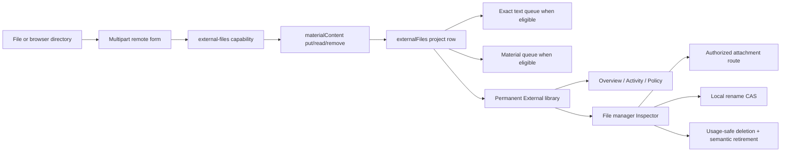
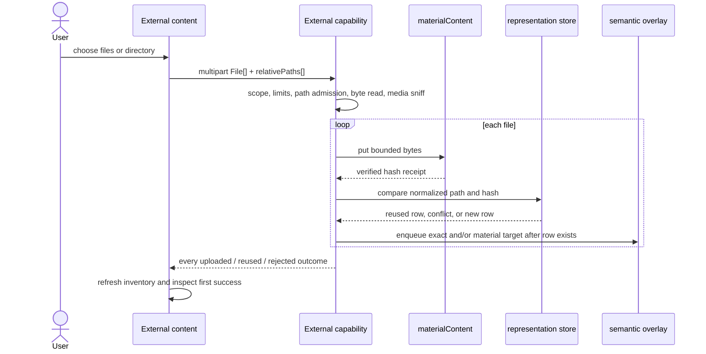

# External files — implemented architecture reference

Status: implemented on `work/external-files`, branched from `work/derived-output-architecture`.

This document and the rendered reference suite describe production code, not a future build contract. Older
external-file documents are non-authoritative where they describe the retired storage stack, missing upload,
or absent manager UI.

## Reference routes

- `/demo/external-files` — whole implemented system, ownership, invariants, and current truth.
- `/demo/external-files/ingestion` — multipart boundary, ordering, path and media admission, format routing,
  limits, failure compensation, and security.
- `/demo/external-files/stable-tab` — interactive reference specimen plus the implemented Content, Context,
  Inspector, workspace identity, restoration, and manager states.
- `/demo/external-files/file-plan` — exact path-by-path create/modify/generate ledger and validation ownership.
- `/demo/external-files/implementation` — implementation learnings, live-test discoveries, concessions, final
  contract, and deferred work.
- `/app/dev-project` — the real application; select the permanent **External** tab to exercise the feature.

## Whole-system shape



The project row is the usable-resource boundary. A valid file does not depend on semantic completion. Exact
and material semantics are independently eligible, independently processed, and reviewable derivatives.

## Representation and native storage

Every new `externalFiles` row writes:

- project-owned opaque row ID;
- mutable local `name`;
- immutable user-visible `originalName` and normalized `relativePath`;
- server-derived `mediaType` and `subkind`;
- content-addressed `storageId`, lowercase SHA-256 `hash`, and actual byte `size`;
- upload or connector `origin`;
- creator and updater actors;
- compare-and-swap `revision` beginning at `1`;
- `updatedAt`.

The new provenance/revision fields remain optional in the representation type because old stored rows exist.
The External capability strictly admits rows and supplies compatibility fallbacks: original name and path from
the old name, inferred subkind, unknown size, updater from creator, and revision `0`. Corrupt rows are returned
as bounded quarantine entries rather than being projected partially.

`materialContent` now owns three operations:

```ts
put({ bytes, maxBytes? })
  -> { storageId: `_storage:${sha256}`, hash, size, reused }

read({ storageId, hash })
  -> verified Uint8Array | undefined

remove({ storageId, hash })
  -> boolean
```

`put` enforces the caller’s byte ceiling, hashes the complete `Uint8Array`, verifies an existing hash before
reuse, writes a uniquely named sibling with `wx`, and atomically renames it to the digest. `read` re-hashes
native bytes before returning them. `remove` is idempotent. Physical resolution is by the validated hash;
internal filesystem paths never leave the model.

The runtime accepts `ICARUS_MATERIAL_DIRECTORY` for isolated harnesses. The browser server creates separate
temporary represented-row and native-material directories and removes both on exit.

## Actual ingestion workflow



The UI has two independent SvelteKit remote-form instances: `files` and `folder`. Both explicitly use
`multipart/form-data`. Folder selection copies `webkitRelativePath` values into an aligned string array before
submit; a folder is never represented as a row or interpreted as a server filesystem path.

The capability resolves scope before validating the form. The browser cannot author project, actor, hash,
storage ID, subkind, revision, or update time. The server:

1. rejects an empty selection, more than 100 files, declared batches above 250,000,000 bytes, or declared
   individual files above 50,000,000 bytes;
2. normalizes paths to NFC and `/`, rejecting absolute roots, drive roots, NUL, empty, dot, dot-dot, duplicate,
   or greater-than-512-UTF-8-byte paths;
3. reads each `File` into a bounded `Uint8Array` and verifies actual size equals declared size;
4. sniffs PNG, JPEG, GIF, PDF, and ZIP signatures, then uses useful declared MIME and filename fallbacks;
5. publishes native content and receives its trusted receipt;
6. treats same project path + same hash as idempotent row reuse;
7. treats same project path + different hash as a per-file `path-conflict`;
8. allows different rows and projects to share the same hash-addressed blob;
9. creates a complete new row when no path owner exists;
10. enqueues only supported semantic lanes after the row exists;
11. returns mixed outcomes and refreshes External plus the project resource index.

Rejections are per-file: empty, too many, file/batch too large, invalid or duplicate path, path conflict, read
failure, native-storage failure, or represented-store failure. A semantic enqueue error is reported on a
successful upload/reuse outcome and does not invalidate the file.

There is no transaction spanning the filesystem, represented JSON tables, and semantic tables. Ordering and
compensation are deliberate:

- byte failure creates no row;
- row failure after byte publication attempts immediate removal if no row claims the hash;
- compensation failure may retain a safe content-addressed orphan;
- semantic enqueue failure leaves a usable native file;
- same-hash retry can reuse an existing blob;
- an unsupported semantic type creates no poison job.

Native publication/row creation and row removal/native reclamation are serialized by the material-content
model's process-level mutation lease. This closes the race where delete sees no claimant after upload published a
hash but before upload creates its row. It intentionally matches the JSON store's process-local concurrency
model; this is not a multi-process shared-filesystem protocol.

The v1 transport buffers each browser file. Its 50,000,000-byte individual and 250,000,000-byte batch limits
are therefore part of the architecture. A streaming or direct-object-store path is separate future work.

## Format and semantic truth

| Family | Managed/downloaded | Exact lane | Material lane | Implemented limitation |
| --- | --- | --- | --- | --- |
| UTF-8 text / Markdown | yes | yes, at semantic revision `0`, 5 MB ceiling | only when recognized as code | invalid/large text fails semantics, not upload |
| Recognized source code | yes | yes when classified `text` | code profile + optional generated descriptor | classifier and language detector have partly different extension sets |
| CSV / TSV | yes | no | bounded sampled schema/profile + optional descriptor | not a spreadsheet editor |
| Image | yes | no | deterministic facets; pixels only through 5 MB | no inline preview, OCR, or image editor |
| PDF | yes | no | no | signature detected; no viewer or extraction |
| Office / archive | yes | no | no unless genuinely recognized code/CSV/image | container members are not parsed |
| Audio / video | yes | no | no | no player or transcription |
| Unknown binary | yes | no | no | attachment only |

`enqueueSemanticSync` resolves exact and material targets independently. Plain Markdown can be exact-only.
Recognized code can receive both. CSV/TSV and images can be material-only. PDF, Office, media, and unknown
content normally receive neither and display **Managed only**.

`readSemanticStatus` projects each lane as `unsupported`, `not-started`, `queued`, `running`, `failed`,
`stale`, or `current`. It exposes current exact object count, current material profile facts/warnings, generated
descriptor and its model/prompt/coverage/uncertainty provenance, and overlay generation without giving External
direct ownership of semantic tables.

Upload and rename only enqueue. This branch does not invent an always-on worker host. **Refresh semantics** in
the file Inspector enqueues and then invokes bounded exact/material queue processing for the selected file. A
provider/adapter error remains visible while native management continues to work.

`retireSemanticResource` is the deletion seam. It stages replacement exact and material indexes, archives
owned semantic objects/materials, removes sources/materials/placements/jobs, advances the overlay generation,
and is idempotent. It does not remove the source `externalFiles` row.

## External stable library

The product label and category name are **External**, never Resources. It is a permanent category singleton like
Overview and Templates:

```ts
workspace.open({ category: "external", focus: externalFileId });
workspace.inspect("external.file", {
  kind: "external-file",
  id: externalFileId
});
```

Its target key and `TabRecord.id` are `external`; the tab has no `resourceId`. The selected file is focus plus
Selection inside that stable tab. No file, extension, MIME family, or row creates an editor tab. Older workspace
snapshots are adopted by adding any missing permanent singleton landing while preserving all existing tabs and
landings.

Content (`external.library`) owns:

- real file and browser-folder upload controls;
- latest mixed-result receipt;
- all admitted project rows plus a quarantined-row notice;
- local search over name/original/path/media type;
- kind filter, semantic-state filter, updated/name/size/kind sort, and direction;
- row focus and file inspection;
- loading, query error, empty, and no-match states.

It does not decode content, render format previews, edit files, expose row-level destructive buttons, or mint
tabs. The current inventory is an all-project query with client filtering; it is not paginated.

Context owns library-wide views:

- `external.overview`: file count, known native footprint, unknown legacy sizes, quarantine count, and semantic
  coverage;
- `external.activity`: a recent projection of current rows from revision/updater/time. It is explicitly **not**
  a durable journal and cannot show deleted rows or historical transitions;
- `external.policy`: live configured limits, rename/delete rules, type coverage, attachment policy, and the
  explicit Findings deferral.

Inspector (`external.file`) is the manager screen. It owns:

- explicit local rename with Save, Cancel, Enter/Escape, pending state, and base-revision CAS;
- authorized attachment download;
- confirmed delete, disabled whenever represented usage exists;
- original name, relative path, type, kind, size, origin, actors, SHA-256, and native integrity state;
- exact/material status, deterministic profile facts/warnings, generated summary review and provenance;
- manual semantic refresh;
- represented usage from documents, slide decks, templates, resource sets, and findings.

Cross-user template names are not leaked by the usage projection; they appear as a generic private-template
reference while still blocking deletion. Generated summaries are review-only derived output, never editable
source or evidence authority.

## Rename, download, and delete

Rename validates a bounded nonempty local display name and `baseRevision`. A stale request is refused. The
successful update changes only `name`, `updatedBy`, `revision`, and `updatedAt`; original name/path, hash,
storage ID, size, origin, creator, and bytes remain fixed. Supported semantics are requeued because code/image/
data profiles and descriptions may include the display name; exact text can remain current by hash.

The GET route at `/app/[project]/external-files/[externalFile]` resolves scope through the External capability,
re-verifies native bytes, and enforces a 50,000,000-byte response ceiling. It returns:

- `Content-Disposition: attachment` with ASCII fallback and UTF-8 filename;
- admitted media type plus `X-Content-Type-Options: nosniff`;
- `Content-Security-Policy: default-src 'none'; sandbox`;
- SHA-256 ETag and `If-None-Match` support;
- `private, no-cache`;
- one bounded byte range with `206`, or `416` and `Content-Range: bytes */size`;
- no inline viewer or quick look.

Delete is a compare-and-swap ordered workflow:

1. admit the scoped row and compare revision;
2. scan represented usage and refuse if any reference exists;
3. retire semantic products and jobs;
4. re-read and recheck revision and usage to close the interleaving window;
5. hard-delete the file row;
6. scan every externalFiles row globally for the SHA-256 hash;
7. retain shared content, otherwise remove the blob immediately;
8. if physical removal fails, report `retained-after-error` after the source row is safely gone.

There is no tombstone, grace period, replacement lineage, or external-file deletion event journal in this
implementation.

## Live implementation learnings

The real Chromium flow exposed details that static architecture and unit tests did not:

1. File remote forms require explicit `enctype="multipart/form-data"` even when remote-form attributes are
   spread onto the element.
2. Remote form result values can be reactive proxies with unstable identity. Comparing object identity in an
   effect caused repeated work and an update-depth failure; the UI now consumes serializable receipt signatures.
3. `externalFiles` is intentionally forbidden in the generic store reader. The status bar must resolve a
   selected name through `readExternalFile`, preserving subject-capability ownership.
4. A temporary represented seed alone does not isolate native material bytes. Browser tests now own a second
   disposable material directory.
5. Scheduling every semantic lane makes unsupported types permanently fail. Eligibility now prevents poison
   jobs and allows exact-only/material-only work.
6. The proposed tombstone/grace-period deletion could not be honestly implemented without an audit/scheduler
   model. Synchronous usage checks, semantic retirement, hard deletion, and global hash protection produce a
   complete observable lifecycle now.
7. New row fields had to remain compatible with pre-feature persisted rows.
8. External Activity had to be labeled as a current-row projection because no durable event journal exists.
9. A shared-hash scan alone did not protect the interval between upload publication and row creation. A
   process-level material-content mutation lease now serializes that interval with deletion reclamation.

The executable browser scenario proves: permanent External activation, multipart upload, a real verified
attachment response and ETag, automatic file inspection, local rename, original-name preservation, confirmed
delete, empty-state recovery, and absence of a per-file tab.

## Explicit limits and deferred work

- Findings: deliberately not implemented; it may later add a second manager adapter and Inspector subject in
  this same External singleton.
- PDF text/page extraction, Office extraction, OCR, archive traversal, and audio/video transcription.
- Streaming/direct-object-store upload and larger response transport.
- Always-on semantic worker deployment.
- Durable External activity/audit journal, tombstone retention, and replacement lineage.
- Server pagination/virtualization for very large libraries.
- Broad deep media sniffing or malware analysis.

None of these block storing, listing, filtering, inspecting, locally renaming, safely downloading, deleting,
or honestly describing an unsupported file today.
