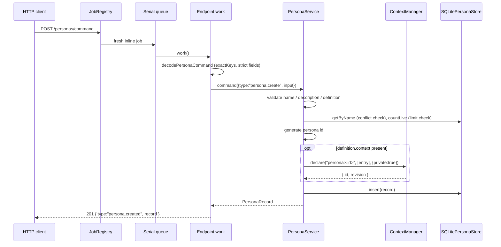

# Persona endpoint and job flows

## Common transport behaviour

`registerPersonaEndpoints`
registers exactly two exact method/path pairs. Both create a fresh inline job.
Discriminated-union bodies, no path parameters — the backend's `getEndpointKey` is exact
string equality on `` `${method} ${path}` ``.

Untrusted input is decoded exactly once, at the wiring boundary, into fully-typed domain
values. `exactKeys` rejects **unknown** keys, not just missing ones, so a client typo is a
400 rather than a silently ignored field.

## Endpoint table

| Method and path | Job name | Queue | Input | Success | Errors |
|---|---|---|---|---|---|
| `POST /personas/command` | `persona.command.v1` | serial | `decodePersonaCommand(body)` | 201 for `persona.created`, 200 otherwise | typed ladder |
| `POST /personas/query` | `persona.query.v1` | concurrent | `decodePersonaQuery(body)` | 200 | typed ladder |

### Commands

```jsonc
{ "type": "persona.create", "displayName": "Analyst",
  "description": "Reads contracts.",           // optional
  "definition": { "focus": "…", "background": "…", "approach": "…",
                  "outputPreferences": "…", "verification": "…",
                  "context": { "id": "ctx-1", "kind": "context" } } }   // optional

{ "type": "persona.update", "id": "…", "expectedRevision": 1,
  "displayName": "…", "description": "…", "definition": { … } }        // all optional

{ "type": "persona.delete", "id": "…", "expectedRevision": 1 }

{ "type": "persona.purge", "id": "…" }
```

### Queries

```jsonc
{ "type": "persona.get",       "id": "…" }
{ "type": "persona.getByName", "displayName": "Analyst" }
{ "type": "persona.list" }
{ "type": "persona.render",    "definition": { … }, "sections": ["focus"] }  // sections optional
```

`persona.render` is the authoring preview. It is pure and saves nothing, and it lets a UI
show an author the exact text a task would receive for a definition that has not been
created yet. It lives on the query side precisely because it writes nothing.

**There is deliberately no `resolve` endpoint.** Consumers are in-process and call the
capability directly. Exposing snapshot resolution over the wire would invite a caller to
treat a fetched snapshot as a pinned one, when pinning is the consumer's job and happens
in the consumer's own transaction.

### `expectedRevision` is strictly decoded

`revisionField` requires a genuine non-negative integer. Coercing a missing value with
`Number()` would yield `NaN`, which compares unequal to every stored revision and would
surface a malformed request as `409 revision_conflict` — a client implementing
retry-on-409 would retry forever. There is a regression test for this.

## Create call chain



## Freeze contract — how a consumer uses this

No consumer exists yet. This is the contract Agents will be built against.

```text
task start
  ├─ snapshot = await personas.resolve(personaId, { sections })
  ├─ scope    = await knowledge.resolveScope(scopeEntriesFor(task, snapshot))
  ├─ persist snapshot JSON + digests with the task
  │    ── before the first model call, in the same transaction as task creation
  └─ messages = [
       { role: "system", content: CONSUMER_SYSTEM },  // contract — first
       { role: "system", content: snapshot.prompt },  // persona — advisory
       { role: "user",   content: … }
     ]
```

### The empty-scope trap

Naively unioning the persona's context into the task's entries is wrong, and the failure
is silent. `resolveScope([])` means *the whole project*; `resolveScope([X])` means *only
X*. Adding a persona's context to an empty task scope would narrow the task from
everything to one context — the exact opposite of the intent.

```ts
const scopeEntriesFor = (task, snapshot): ContextEntry[] =>
  // An empty task scope already means the whole project, which subsumes anything
  // the persona could reference. Adding the persona entry here would narrow it.
  task.contextEntries.length === 0
    ? []
    : snapshot.context
      ? [...task.contextEntries, snapshot.context]
      : [...task.contextEntries];
```

This holds because a persona's context resolves to project Knowledge sources, which a
whole-project scope already contains. Persona has no way to reference material outside the
project, and no such mechanism is planned.

### Consumer laws

1. **Resolve once per task.** Never per model call, never per run.
2. **Persist before calling.** The snapshot is stored with the task before the first model
   call, so a later persona edit cannot reach work already started.
3. **Never precede the contract.** The fragment is appended to the consumer's system
   content, never placed before or in place of it.
4. **Union only.** A persona may add reference material; it may never narrow a task's
   scope.
5. **Never substitute silently.** Resolving a deleted or unknown persona is an error.
6. **Never log section text.** Logs carry ids, revisions, and digests.

### Section selection

A consumer folds in only the sections that apply to the kind of work it does. Derived
Outputs, for example, would fold in four and omit `verification` — it verifies
structurally, accepting evidence only when it matches a trusted retrieval candidate, so a
persona's prose verification section would be advice about a step the capability already
performs mechanically.

This is why sections are a fixed named vocabulary rather than author-defined headings: a
consumer cannot select what it cannot name.

## Delete, purge, and retention flows

`persona.delete` validates the current revision, logically deletes the owned private
Context wrapper, then archives the final Persona snapshot, appends terminal revision
`N + 1`, and removes the Persona from current storage in one Persona transaction. A retry
after the wrapper has already disappeared tolerates that absence and can finish the
Persona deletion. All normal Persona queries and resolution read only the current table.

`persona.purge` is irreversible. It requires an absent current Persona and terminal
deletion history, obtains the wrapper identity from the retained snapshot, purges that
Context wrapper, and then removes Persona history. A live Persona conflicts; an id with
neither current state nor terminal history is not found. The shared retention runner
prunes old snapshots for live Personas and routes expired deleted Personas through this
same ownership-aware purge path.

## Job and scheduler boundaries

There are no internal job intents, no deferred responses, no recovery pass, and no
capability-local recurring jobs. Every request operation is local, cheap, and bounded.
The backend-wide retention scheduler invokes Persona's history pruning and expired-delete
purge methods.
