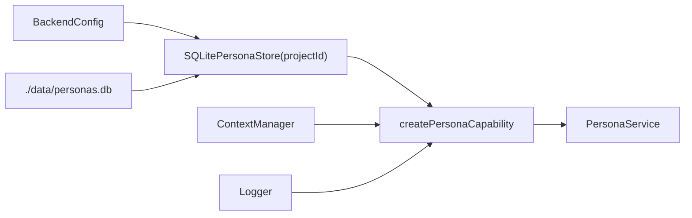

# Persona runtime

## Construction

[`createPersonaInstance`](../../../initialization/runtimes/persona.ts) opens `./data/personas.db`,
binds the configured `projectId` into `SQLitePersonaStore`, and passes the
already-constructed `ContextManager` through as `dependencies.context`.



Persona is constructed immediately after `contextManager` in
[`create-runtime.ts`](../../../initialization/create-runtime.ts) — Context is its only dependency, so
nothing else needs to exist first. There is no Persona-specific recovery step or
background worker; the backend-wide retention scheduler calls the capability's retention
methods.

```ts
interface PersonaDependencies {
  readonly context: PersonaContextPort;
  readonly logger: Logger;
  readonly limits?: PersonaLimits;   // defaults to DEFAULT_PERSONA_LIMITS
  readonly clock?: PersonaClock;     // defaults to () => new Date().toISOString()
}
```

The clock is injected rather than read from a module-level `now()`, following Activity
and Comments — it is what makes timestamps assertable in tests.

## Public methods

| Method | Work and result | Persistence / side effects | Logging |
|---|---|---|---|
| `command(cmd)` | Total switch dispatching to create/update/delete/purge | as dispatched | via the target method |
| `query(q)` | Total switch dispatching to get/getByName/list/render | reads only | via the target method |
| `create(input)` | Validates name, description, definition; checks live-name conflict and `maxPersonas`; declares the wrapper; inserts at revision 1 | one Context `declare` (if a context is present), then one store insert | info `persona.create` |
| `get(id)` | Returns the built-in for `builtin:default`, else loads a live row | read only | none |
| `getByName(name)` | Case-insensitive live lookup. Does **not** resolve the built-in. | read only | none |
| `list()` | Live records, name-sorted, case-insensitive | read only | none |
| `update(input)` | Rejects the built-in; revision check; validates supplied fields; plans and, if needed, declares a fresh wrapper; CAS-updates at revision + 1; best-effort deletes any superseded wrapper | up to one Context `declare` before the store CAS, then up to one Context `delete` after it | info `persona.update` |
| `delete(input)` | Rejects the built-in; revision check; deletes the wrapper, then archives the final snapshot plus terminal revision and removes current state | one Context `delete` (if owned), then one Persona transaction | info `persona.delete` |
| `purge(input)` | Rejects the built-in; reads the latest retained snapshot; purges its wrapper, then physically removes Persona history | one Context `purge` (if owned), then one Persona transaction | info `persona.purge` |
| `pruneHistory(cutoff)` | Removes old snapshots for Personas that remain current | one Persona transaction | none |
| `purgeExpired(cutoff)` | Finds terminal deletions before the cutoff and calls ownership-aware `purge` for each | Context and Persona purge per expired id | via `purge` |
| `render(definition, sections?)` | Pure. No I/O. | none | none |
| `resolve(id?, options?)` | Absent id → built-in. Renders, digests, and builds the snapshot. | read only | debug `persona.resolve` |

`render` is the one synchronous method on the interface. Marking it `async` would imply
it might touch the store.

## The wrapper reconciliation

`update` routes through a private `planWrapperChange(existing, definition)`:

| Before | After | Action | Wrapper fields |
|---|---|---|---|
| none | none | nothing | stay absent |
| none | present | `context.declare("persona:<id>", [entry], { private: true })` | set to the new wrapper |
| present | present, unchanged | nothing (compared by `id`/`kind`, no Context call) | unchanged |
| present | present, different | `context.declare(...)` for a **new** wrapper now; the old one is deleted only after the persona row's CAS write has committed to the new one | set to the new wrapper; old one deleted afterward |
| present | none | nothing here; the persona row's CAS write drops the fields; the old wrapper is deleted afterward | cleared |

A changed context is never applied by mutating the existing wrapper in place. A fresh
`declare()` always starts at revision 1, so it can never itself go stale — the persona
row's own CAS write is what decides whether it takes effect, and the previous wrapper is
only torn down once that has happened. See "Ordering" below for why.

## Ordering: declare-before for updates; wrapper-before for Persona deletion

`create`, `update`, and `delete` order cross-capability work so that create/update can, at
worst, leave one harmless orphaned private wrapper, while successful deletion cannot
leave a live owned wrapper:

- `create` declares the wrapper, then inserts the row. A failed insert orphans the
  wrapper; there is no row yet to reconcile against, so the caller just retries.
- `update` declares any *new* wrapper it needs **before** its own CAS write, and only
  deletes a *superseded* wrapper **after** that CAS has committed. A lost CAS abandons
  the freshly declared wrapper rather than ever repairing or mutating anything.
- `delete` deletes the wrapper **before** archiving and removing the Persona current row.
  Missing-wrapper errors are tolerated on retry; other wrapper failures stop the Persona
  deletion. A failure between the two databases is therefore recoverable by retry and
  cannot finish with the owned wrapper still current.

Every create/update "orphan on failure" path is logged as `persona.wrapper.orphaned`
(`warn`) rather than retried or repaired. Delete instead exposes a recoverable window:
after the wrapper succeeds but before Persona commits, current Persona state can still
refer to the now-absent wrapper until the same command is retried. See
[invariants.md](invariants.md) for the full reasoning.

The schema `CHECK` (`context_json`/`context_wrapper_id` both null or both set) is also
why `create` must declare before inserting rather than the reverse: a row written with a
`context_wrapper_id` before the wrapper exists would be briefly unrepresentable, and a row
written without one when a wrapper was expected would violate the pairing invariant.

## Logging

```text
persona.runtime.created  info   {}
persona.command          debug  { type, durationMs }
persona.query.completed  debug  { type, personaId?, count?, promptDigest?, durationMs }
persona.create           info   { personaId, revision, definitionDigest, sectionCount,
                                  hasContext, durationMs }
persona.update           info   { personaId, revision, definitionDigest, digestChanged, durationMs }
persona.delete           info   { personaId, revision, durationMs }
persona.resolve          debug  { personaId, revision, definitionDigest, promptDigest,
                                  sectionCount, promptChars, hasContext, isBuiltIn, durationMs }
persona.wrapper.declared info   { personaId, wrapperId, revision }
persona.wrapper.deleted  info   { personaId, wrapperId }
persona.wrapper.orphaned warn   { personaId, wrapperId, reason }
```

**Section text, rendered prompts, display names, and descriptions never appear in a log
record.** `promptDigest` exists so two runs can be compared for identical prompt bytes
without ever writing those bytes to the log. This matches the existing rule that
diagnostics do not echo prompts or provider responses, and there is a regression test
asserting it
([`persona-wiring.test.ts`](../../../../test/capabilities/persona-wiring.test.ts) →
"persona logs carry digests and never section text").

Every command and query is logged (`persona.command` / `persona.query.completed`), plus a
dedicated event per catalog operation (`get`, `getByName`, `list`, `render`). Every
individual Context write Persona makes is logged at its call site — `persona.wrapper.declared`
whenever `context.declare` is called (from `create` or from `update`'s wrapper-change
plan), and `persona.wrapper.deleted` whenever `context.delete` succeeds (from `update`'s
best-effort cleanup of a superseded wrapper, or from `delete`'s cleanup of the persona's
own wrapper). `persona.wrapper.orphaned` covers create/update paths where a wrapper ends
up unreferenced without a corresponding delete: a lost CAS race abandoning a freshly
declared wrapper, or a best-effort superseded-wrapper cleanup failing after update.

## Queue behaviour

| Endpoint | Queue | Mode |
|---|---|---|
| `POST /personas/command` | serial | inline |
| `POST /personas/query` | concurrent | inline |

Commands are serial because create, update, delete, and purge read-then-write across the
store *and* the Context port — the store cannot enforce that invariant on its own, which
is the same reasoning that puts Document and Slide commands on the serial queue. The
revision compare-and-swap is a genuine second line of defence rather than the only one.

There is no deferred work or internal job intent. Retention is scheduled centrally after
HTTP binds and stops during backend shutdown.
