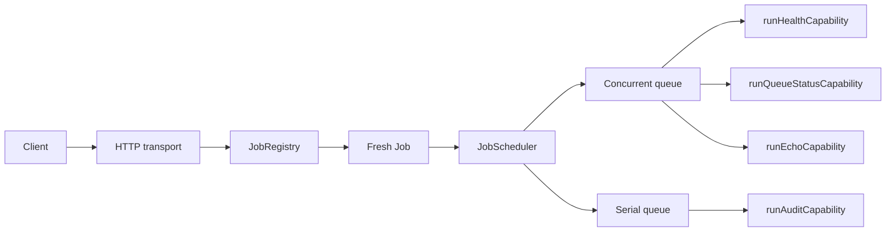

# Built-in concepts

## Capability boundary

The Built-in package is a collection of stateless operational functions. The
endpoint registry and scheduler are shared platform runtime objects, not state
owned by these functions.

## Vocabulary

| Term | Meaning in current code |
| --- | --- |
| Capability function | One async function that computes the endpoint's domain result. |
| Endpoint mapping | A method/path key mapped to a factory for a fresh job. |
| Job | A named unit with queue type, response mode, unique ID, and work. |
| Inline response | The scheduler waits for `work` before resolving the HTTP response. |
| Deferred response | The scheduler resolves `deferredWork` after dequeue, then retains the queue slot while `work` finishes. |
| Serial queue | One active job; strict dequeue order for admitted jobs. |
| Concurrent queue | Up to the configured worker count active at once. |
| Queue state | A point-in-time in-memory view of queue depth and active workers. |
| Request ID | Optional transport correlation copied onto the concrete job and execution result. |

## Ownership and lifecycle

There is no persisted aggregate lifecycle. Each request creates a new job:

1. `JobRegistry.createJob` resolves the normalized `METHOD /path` key.
2. The registered factory captures request data in a new definition.
3. The registry assigns a monotonically increasing process-local job ID.
4. `JobScheduler.admit` either rejects synchronously for capacity or queues it.
5. The scheduler starts it when its queue permits.
6. The transport receives the chosen `JobResponse`.
7. For deferred audit work only, serial ownership continues after response
   until the 250 ms audit function returns.

Process restart resets the endpoint registry's ID sequence and all queues.

## Operational meanings

- **Health** says the backend process can execute the registered job. It is not
  a dependency-readiness probe.
- **Queue status** is live scheduler/registry introspection. It is not a stable
  metrics snapshot.
- **Echo** proves normalized method, path, and body propagation.
- **Audit** demonstrates deferred response and serial follow-up semantics. It
  does not write an audit record.

## Boundary with transport

Capability code does not know about Fastify. Job wiring consumes the
framework-neutral `RequestEnvelope`; the transport owns HTTP normalization and
sending status, headers, and body. Scheduler logging supplies queue and request
correlation rather than capability-specific log calls.
