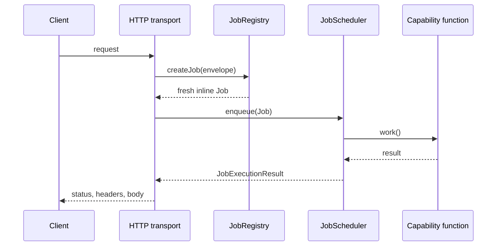
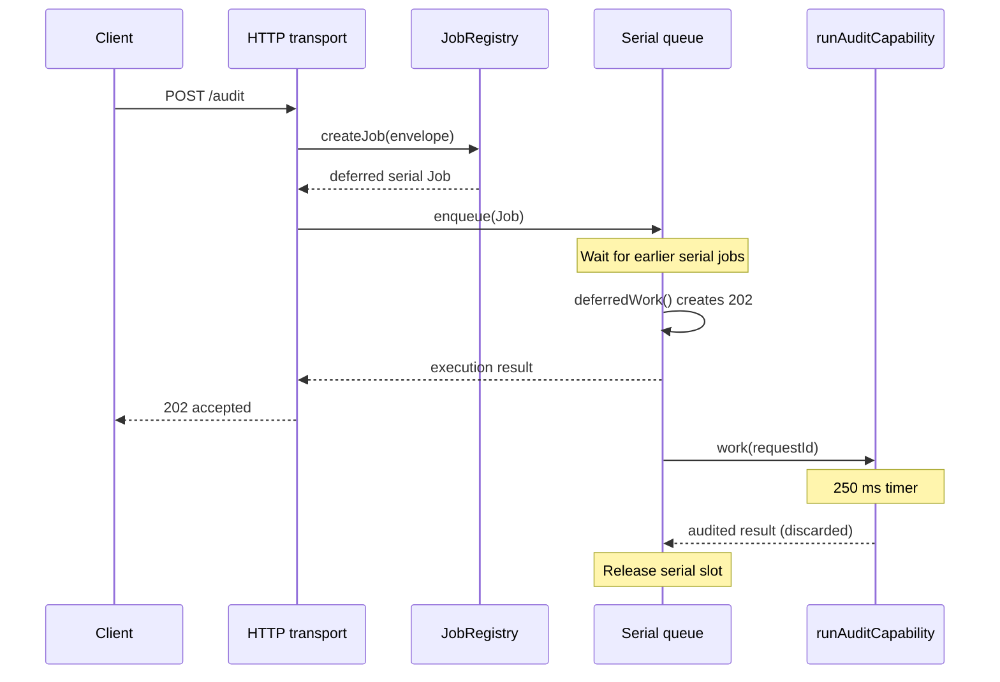

# Built-in endpoint and job flows

## Complete endpoint map

| Endpoint | Job name | Queue | Response | Capability call | Success |
| --- | --- | --- | --- | --- | --- |
| `GET /health` | `health` | concurrent | inline | `runHealthCapability()` | `200` health body |
| `GET /health/queues` | `queue-status` | concurrent | inline | `runQueueStatusCapability({ scheduler.getState(), registry.listEndpoints() })` | `200` state and endpoint list |
| `POST /echo` | `echo-inline` | concurrent | inline | `runEchoCapability({ method, path, body })` | `200` echo body |
| `POST /audit` | `audit-deferred` | serial | deferred | `deferredWork` creates `202`; follow-up calls `runAuditCapability({ requestId })` | `202 { status: "accepted", requestId }` |

All four routes are mapped in
[`registerBuiltInEndpointMappings.ts`](../../../api/routes/registerBuiltInEndpointMappings.ts).

## Inline flow

Health, queue status, and echo follow this sequence. Capacity rejection occurs
before admission; an execution error rejects completion and is handled by the
transport's shared error path.

## Deferred audit flow

The 202 is created only after the job reaches the front of the serial queue,
not at initial admission. The scheduler retains the serial slot until audit
follow-up finishes.

## Queue-status timing

The status endpoint itself occupies a concurrent worker while it reads state.
Consequently, its snapshot may include that active job, and state can change as
soon as it is returned. `registeredEndpoints` includes every endpoint in the
shared registry at call time, not only Built-in endpoints.

## Internal jobs and recovery

Built-in endpoints do not dispatch internal intents. Their jobs are request
jobs only. There is no durable receipt, retry stage, startup recovery, or
background reconciliation for Built-in work.
