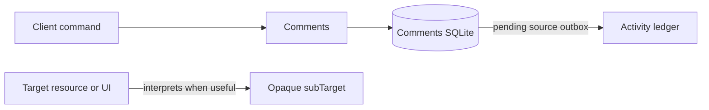
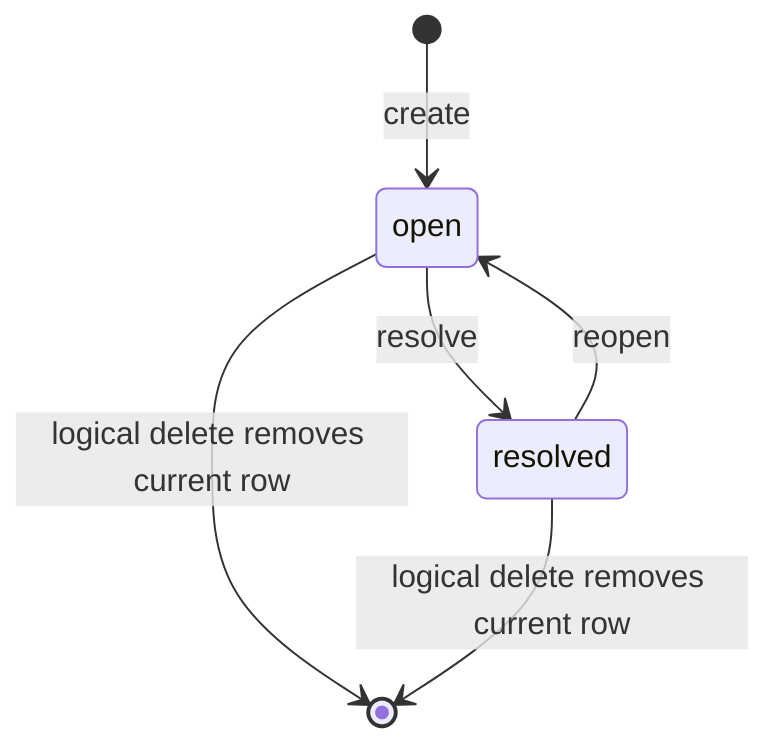

# Comments concepts

## High-level model

A Comment is one current plain-text annotation. Its target names a resource;
its optional `subTarget` is an arbitrary nested JSON object whose meaning
belongs entirely to that resource or its UI.



Comments does not verify that the target exists. This keeps it independent of
Document, Slides, General, Connector, and future kinds, and allows a resource
level fallback when a location hint becomes stale.

## Vocabulary and ownership

| Term | Meaning |
| --- | --- |
| Comment | Current body, mentions, target, state, attribution, and timestamps. |
| Target | Stable `resourceKind` and `resourceId` identifying what is annotated. |
| Sub-target | Optional bounded JSON object passed through without interpretation. |
| Mention | Server-parsed, case-normalized handle; not a verified principal ID. |
| State | `open` or `resolved`. Reopen returns a resolved Comment to open. |
| Command receipt | Durable digest/result used for exact request replay. |
| Source outbox | Self-contained Activity record committed with a state change. |

The target resource owns content, existence, revision history, permissions,
and sub-target semantics. Comments owns only the annotation and its lifecycle.
Activity owns the immutable project ledger after publication.

## Opaque object sub-targets

The root must be a JSON object. Any nested JSON shape is permitted, including
maps, arrays, strings, numbers, booleans, and null values. For example:

```json
{
  "path": ["rows", 2, "blocks", 0],
  "range": { "start": 4, "end": 19 },
  "display": { "quotedText": "optional UI hint" }
}
```

Object keys are sorted recursively before storage and request hashing. A
missing `subTarget` means a resource-level Comment. `null`, an array, or a
scalar is not a second root-level spelling.

## Lifecycle and deletion



Resolve/reopen against an already matching state is an accepted no-op: it gets
its own replay receipt but does not alter timestamps or publish Activity. Soft
deletion hides a Comment from get/list and prevents all new mutations. Exact
replay of the accepted delete still returns its original receipt.

## Mentions

The server extracts standalone ASCII `@handle` tokens, lowercases and
de-duplicates them, and excludes email-address `@` characters. Interior
periods, underscores, and dashes are supported; a terminal prose period is not
part of the handle. V1 performs no directory lookup and sends no notification.
