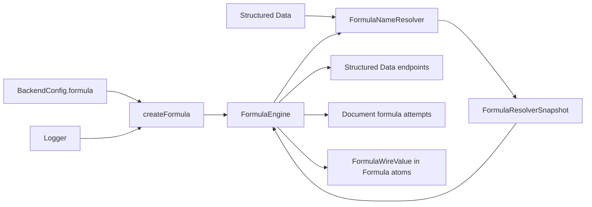

# Formula platform documentation

## Status and authority

Formula is an implemented, in-process Platform service. It tokenizes and parses `formula/v1`, binds names against an immutable resolver snapshot, evaluates a recursive value algebra with exact rational arithmetic, extracts dependencies, formats values, and converts non-executable values to a JSON-safe wire form. Formula owns no HTTP route, Job, database, or authored state.

These pages describe the code currently under [`formula/`](../), not a future language design. When an older reference differs, the TypeScript implementation and executable tests are the authority. In particular, the current parser does not preserve projection fields in the projection-plus-filter pipe form, `toWire` throws for functions instead of returning a diagnostic result, and some configured limits are not enforced. Those boundaries are called out rather than presented as completed behavior.

## Runtime position

Construction is in `create/formula.ts` and `create-runtime.ts`. The Structured Data adapter is `create/formula-name-resolver.ts`. The public export surface is `index.ts`.

## Dependency and source map

| Concern | Code authority | Role |
| --- | --- | --- |
| Public runtime | `engine.ts`, `index.ts` | Five-method `FormulaEngine`, request/result types, exports |
| Language shape | `tokens.ts`, `ast.ts`, `lexer.ts`, `parser.ts` | Tokens, spans, AST, grammar and parse limits |
| Name binding | `resolver.ts`, `binder.ts` | Immutable snapshot contract and stable binding validation |
| Evaluation | `evaluator.ts`, `builtins.ts` | Evaluation environment, operators, functions and built-ins |
| Values | `value.ts`, `rational.ts` | Eight value kinds and canonical rational arithmetic |
| Identity and dependencies | `dependencies.ts`, `value-identity.ts` | Symbolic/bound/observed dependencies and digests |
| Diagnostics and bounds | `diagnostics.ts`, `limits.ts` | Stable diagnostic vocabulary and configured limit shape |
| Persistence seams | `wire.ts`, `display.ts` | JSON-safe values and deterministic presentation-neutral text |
| Structured Data adapter | `formula-name-resolver.ts` | Resolves project Structured Data declarations into a snapshot |
| Concrete endpoint consumer | `registerStructuredDataEndpoints.ts` | Value lookup and ad-hoc evaluation routes |
| Durable consumer | `documentService.ts` | Concurrent Formula compute and serial Rich Text settlement |

Formula depends only on Node cryptography, configuration values, and the `Logger`. It does not import Structured Data; the initialization-layer adapter points from Structured Data toward Formula.

## Navigation

- [Concepts](concepts.md): language vocabulary, ownership, binding, and the complete lifecycle.
- [Types](types.md): AST, runtime values, resolver/dependency contracts, diagnostics, and wire forms.
- [Runtime](runtime.md): factories, every public method, helpers, limits, and side effects.
- [Flows](flows.md): concrete endpoint and Job consumers with call sequences.
- [Invariants](invariants.md): proven guarantees, failure behavior, tests, and current non-guarantees.

## Related references

- `Repository-level Formula reference` — useful design background, but it contains target behavior that is not all implemented.
- `Structured Data/Formula tests`
- `Rich Text/Formula tests`
