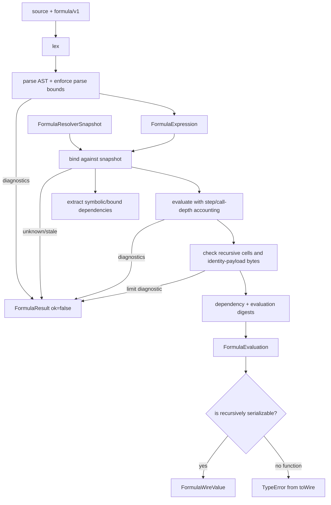
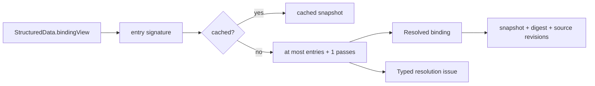

# Formula concepts and lifecycle

## Ownership boundary

Formula owns expression semantics. A caller owns where source came from, when it is evaluated, which resolver snapshot is admissible, whether a value is accepted, and how that accepted value is persisted. The current boundaries are:

- Formula owns lexing, parsing, AST nodes, binding, exact values, evaluation, built-ins, dependency extraction, diagnostics, digests, display formatting, and wire conversion.
- Structured Data owns declarations and rows. `FormulaNameResolver` is an initialization adapter that reads exactly the Structured Data instance injected into it.
- Document owns formula-evaluation attempts, frozen expressions, concurrency, staleness checks, and settlement into embedded Rich Text.
- Rich Text owns `FormulaAtom` source/display/accepted-value fields, but it does not parse or evaluate Formula.
- Endpoint wiring owns HTTP status codes and queue selection.

Formula performs no persistence and no network I/O.

## Vocabulary

### Source, token, span, and expression

Authored `source` is lexed into tokens and parsed into a `FormulaNode` tree. A successful `FormulaExpression` retains the original source, a 32-hex-character SHA-256 prefix (`sourceDigest`), the language discriminator, and the AST root. Nodes carry generated process-local IDs and source spans.

The type calls spans `startByte`/`endByte`, but `lexer.ts` advances JavaScript string indexes. Current offsets are therefore UTF-16 code-unit offsets; `formula/v1` identifiers are ASCII-only, so ASCII positions also equal UTF-8 byte positions. Consumers must not assume true byte offsets for non-ASCII string literal content.

### AST and language operations

The AST covers null, number, text and logic literals; names; list and record literals; unary and binary expressions; calls and lambdas; field/index/slice access; set projection/query; and cardinality promotion. Operator precedence is encoded by the recursive-descent functions in `parser.ts`:

1. lambda/function form;
2. `||`;
3. `&&`;
4. `=` and `!=`;
5. `<`, `<=`, `>`, `>=`;
6. `+` and `-`;
7. `*`, `/`, `%`;
8. prefix `+`, `-`, `!`;
9. right-associative `^`;
10. calls, field access, set operations, index/slice, and postfix cardinality.

Indexes are one-based; zero is invalid and negative indexes count from the end. Slices are clamped, one-based and end-exclusive. `table!` requires exactly one row. `table?` maps zero rows to Formula null, one row to a record, and rejects more than one. Records pass through either cardinality operator.

Set operations accept field projections or condition queries. A pipe after projection fields is parsed, but the current implementation returns only a condition-query body and discards the projected field list. Combined projection-plus-filter semantics are therefore not implemented.

### Value algebra

Formula has eight runtime value kinds: null, number, text, logic, list, record, table, and function. Lists, records, and tables share a recursive rectangular table carrier. Numbers are reduced `bigint` rationals with a positive denominator. Functions are either versioned built-in descriptors or lexical lambdas with captures and an identity digest.

Null is an authored/evaluated value, not an error sentinel at the public engine boundary. Internal evaluator failure helpers carry `NULL_VALUE` alongside diagnostics, but `FormulaEngine.evaluate` returns a failed `FormulaResult` and does not expose that internal value as a successful null.

### Resolver snapshot and binding

A `FormulaResolverSnapshot` is an immutable-by-contract map of normalized names to values and stable references. The binder applies this order:

1. lambda-local names;
2. language built-ins;
3. a binding already embedded in the AST, matched by `bindingId` and checked for exact owner revision/value digest;
4. an unbound name lookup in the supplied snapshot.

An old bound AST is identity-bound. If its owner is renamed, deleted, revised, or replaced, binding reports `stale_binding`; it does not retarget to a new declaration that happens to reuse the display name. Lookups are case-insensitive through `name.toLowerCase()`.

Built-ins cannot be shadowed by snapshot data in normal binding/call position. Lambda parameters are checked first and can use the same spelling as a built-in.

### Dependencies and identity

Dependency extraction distinguishes:

- symbolic names: unbound non-local references, excluding built-in callees;
- bound references: deduplicated by binding ID and carrying revision/digest identity;
- observed dependencies: bindings actually read during evaluation.

The current evaluator records observed dependencies at whole-value granularity even though the type permits field/index/slice/set-operation access descriptors. Short-circuited `&&`, `||`, and `IF` branches are not evaluated and therefore are not observed.

Dependency digests sort bound references by ID. Evaluation digests combine a canonical value identity payload with that dependency digest. Function identity includes implementation version for built-ins and normalized source/capture/bound identities for lambdas.

## Complete lifecycle

`validate` stops after binding and returns a successful outer `FormulaResult` containing `valid: false` when binding diagnostics exist. `dependencies` optionally binds first but currently does not fail merely because binding produced diagnostics. `explain` reports only a bounded top-level description and does not evaluate.

## Built-ins

`builtins.ts` recognizes names case-insensitively:

- control/logic: `IF`, `NOT`, `AND`, `OR`;
- aggregates: `SUM`, `PRODUCT`, `MIN`, `MAX`, `AVG`, `AVERAGE`, `COUNT`;
- numeric: `ABS`, `MOD`, `POWER`, `POW`, `ROUND`, `FLOOR`, `CEIL`, `CEILING`;
- structure: `TABLE`, `ROWS`, `COLUMNS`;
- conversion/text: `TEXT`, `NUMBER`, `CONCAT`;
- function syntax names: `LAMBDA`, `FUNCTION`.

`LAMBDA` and `FUNCTION` are parsed into lambda AST nodes; reaching the built-in call branch for those names returns an arity diagnostic. `IF` is lazy only through the evaluator's named-call special case. `AND` and `OR` functions receive eagerly evaluated arguments, while `&&` and `||` operators short-circuit.

## Structured Data snapshot construction

The adapter reads a project binding view, hashes entry identity/revision/name/kind for a cache key, and iteratively resolves declarations. Literal/formula cells, variables, and functions share the same growing binding map. A pass that makes no progress leaves entries classified as cyclic or unresolved. Invalid declarations stay absent from the value map and are available through `getIssue`; they do not become null bindings.

The snapshot object and map are typed readonly but are not deep-frozen at runtime. Consumers are expected to treat them as immutable.
