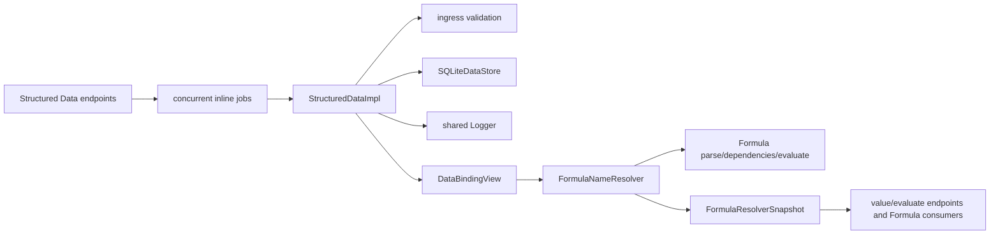
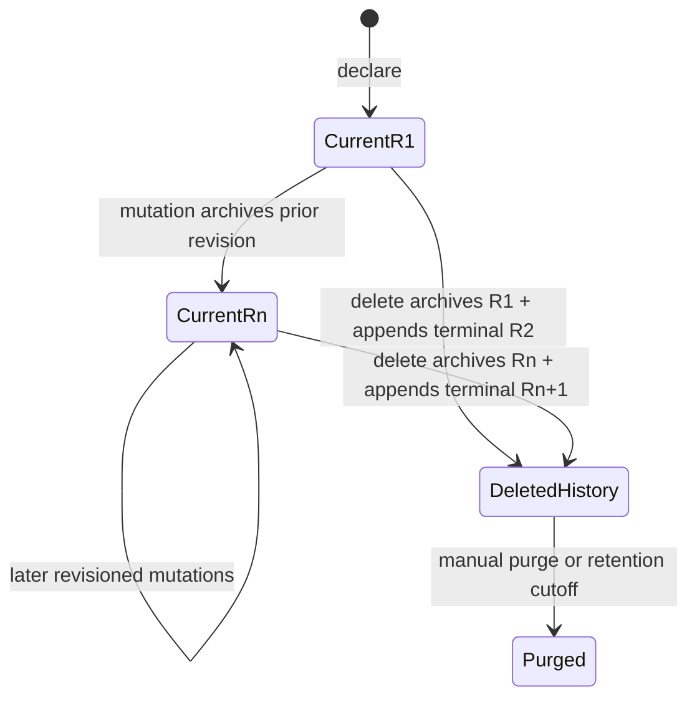
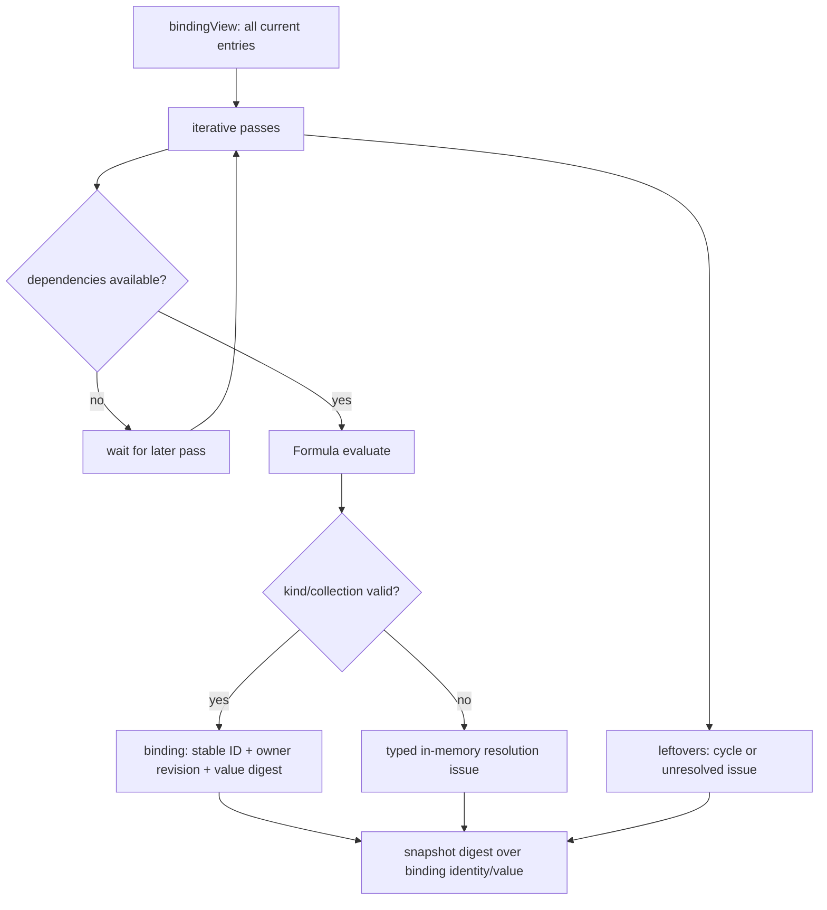

# Structured Data concepts

## Purpose

Structured Data provides one stable named-data catalog for a project. A
declaration has a UUID that never changes, a mutable Formula-compatible display
name, a kind-specific body or collection, descriptive/context metadata, and a
monotone current revision. Formula snapshots evaluate declarations into values
while retaining stable binding identity.

## Vocabulary

| Term | Current meaning |
|---|---|
| Declaration / data entry | One current `DataEntry`, either formula-backed or collection-backed |
| Formula entry | `variable` or `function` with a Formula source `body` |
| Collection entry | `table`, `record`, or `list` with a schema and rows |
| Cell | One row field value: primitive/null literal or `{formula: string}` |
| Stable binding ID | The `DataEntry.id` copied into Formula's bound reference |
| Display-name key | Trimmed, ASCII Formula identifier normalized to lowercase |
| Binding view | One SQL list result mapped by normalized name, with a random view ID |
| Resolver snapshot | Evaluated Formula bindings, identity/value digests, issues, and source revisions |
| Owner revision | The Structured Data entry revision recorded on a Formula binding |
| History record | A complete superseded `DataEntry` snapshot or terminal deletion revision outside the current table |
| Ingress validation | Validation of a declaration, replacement schema, newly appended rows, or deletion indices before persistence |

## Authority boundaries

Structured Data owns declaration IDs, names, bodies, collection schemas/rows, descriptions, context metadata, revisions, and persistence. Formula owns grammar, built-ins, lambda-local scope, binding/evaluation semantics, exact numeric values, diagnostics, digests, and wire conversion. Context owns the meaning and composition of referenced context entries.

There is no second name catalog or fallback database. Built-ins/lambda locals are recognized inside Formula before an external resolver binding is considered; Structured Data rejects built-in names at declaration time.

## Entry families

### Variables and functions

Both store source text. The service verifies only that the body is a non-blank string within the byte limit. Parsing and semantic evaluation occur when the resolver builds a snapshot. A `function` declaration must evaluate to a Formula function or becomes a typed resolver issue rather than a binding.

### Tables, records, and lists

All collections persist as a field schema plus an array of row objects:

- table: any number of admitted fields/rows;
- record: exactly one row;
- list: exactly one schema field and any number of rows; the resolver extracts that field as elements.

Missing row fields are allowed and resolve as Formula null. Extra row fields are rejected. Field lookup is exact/case-sensitive after schema admission, while field-name duplicate detection is case-insensitive.

Literal cells support text, finite/safe number, logic, and null. A formula cell may produce richer collection kinds. Runtime schema validation currently accepts field kinds `text`, `number`, `logic`, `table`, `record`, `list`, and `unknown`; declared `ValueKind` members `date` and `function` are not accepted for schemas.

## Declaration lifecycle

Mutation operations archive the prior aggregate representation and increment
the current revision in one transaction. Delete archives the current entry,
appends terminal revision `N + 1`, and removes the current row. Normal reads and
Formula binding views therefore cannot return deleted entries. Manual purge and
shared retention remove terminally deleted history; neither creates a current
entry.

## Formula resolution lifecycle

`FormulaNameResolver` obtains one `bindingView`, computes an entry signature, and may return a cached snapshot when IDs/revisions/names/kinds match. Otherwise it iteratively resolves entries:

1. parse formula bodies/cells;
2. ask Formula for symbolic dependencies using bindings already resolved;
3. postpone entries whose external dependencies are missing;
4. evaluate ready entries and validate collection field kinds;
5. repeat, bounded by entry count +1;
6. classify leftovers as cycle or unresolved dependency.

An authored null is a valid Formula value. Parse, dependency, cycle, evaluation, and kind failures remain issues and are not replaced with null bindings.

## Query semantics

Query is an in-memory filter over `listAll(kind)`. `text` performs case-insensitive substring matching over display name and description. A non-empty `scope` keeps an entry if at least one stored `contextEntries` key overlaps. Current declaration/update endpoints do not populate or change `contextEntries`, so newly created entries carry an empty array unless written through another compatible store path.
