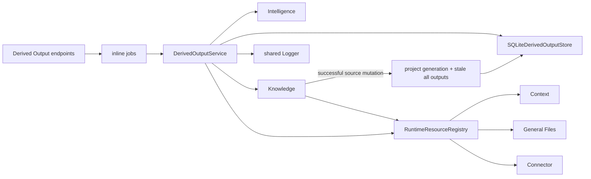
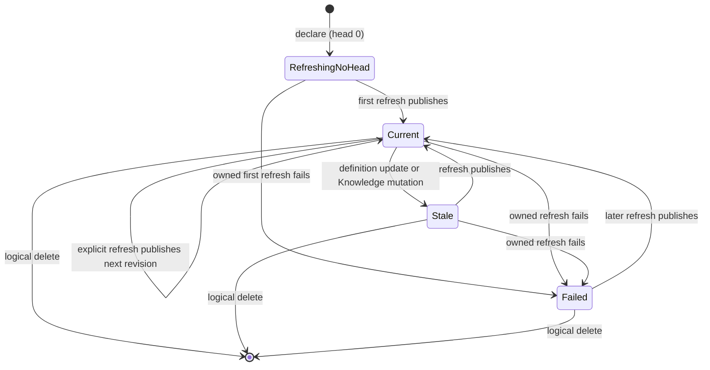
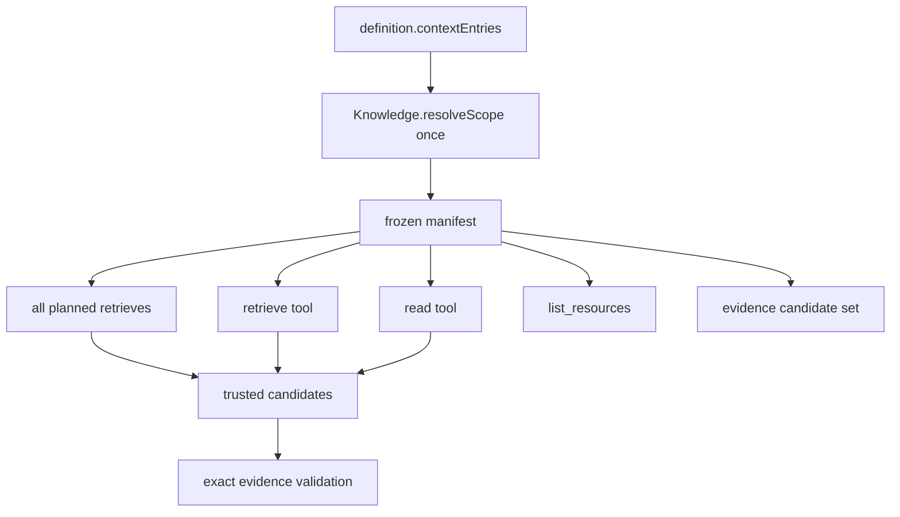

# Derived Outputs concepts

## Purpose and outcomes

A Derived Output is a saved, refreshable question. The mutable output records what to ask and which resources may ground it. Each accepted refresh creates one immutable answer revision with trusted evidence. Other capabilities store an `outputId` plus an applied revision and choose when to adopt a newer head; Derived Outputs does not push text into them.

## Vocabulary

| Term | Current meaning |
|---|---|
| Output | Mutable identity, definition, head pointer, and cached freshness |
| Resource revision | Monotone version of the live Output aggregate; distinct from definition and answer revision |
| Definition | Prompt, Context entries, stabilisation text, optimistic revision |
| Head revision | Latest published immutable answer number; 0 before first publication |
| Revision | Frozen answer text/status/evidence produced from one definition revision |
| Refresh attempt | Operational record of frozen input digest, candidate, usage, and settlement/discard |
| Stabilisation text | Prior/reference prose supplied to both planner and synthesizer to preserve answer shape |
| Frozen scope manifest | One immutable Context/resource/source snapshot reused by every retrieval and tool in a refresh |
| Knowledge generation | Project-wide counter incremented on every successful, non-skipped source add/remove event |
| Evidence candidate | Trusted identity/span observed from Knowledge or a successful scoped read |
| Evidence | Model-selected candidate plus rank and contribution, accepted only by exact validation |
| Settlement fence | Definition revision + head revision + Knowledge generation checked in one SQLite transaction |
| Skipped refresh | Computation lost a fence or its output was deleted; no revision was published |
| Idempotency claim | Optional service-level key/digest/result record for declaration, definition update, or refresh replay |
| Logical deletion | Archive the final live aggregate plus a terminal revision, then remove current and operational state |
| Purge | Irreversibly remove the stable root, retained answer revisions, and resource history |

## Ownership and architecture

Knowledge retrieves but never synthesizes. Intelligence reasons but owns no output history. Resource capabilities expose current source identity/content but do not own answer generation. Derived Outputs orchestrates those ports and owns durable results.

## Output and revision lifecycle

The service does not change an existing output to `refreshing` at refresh start. That state is assigned at declaration and persists until the first owned settlement. Definition update marks stale atomically. Every successful Knowledge mutation conservatively marks every output stale.

The typed Output table is the current projection and contains live aggregates only. Each
accepted definition update, refresh settlement, owned failure, or Knowledge invalidation
archives the previous aggregate snapshot and advances its resource revision. Logical
deletion archives the last live snapshot, appends terminal revision `N + 1`, and removes
the current row. Current-owned declaration claims, refresh claims, definition-update
claims, and refresh attempts cascade away; the stable internal root keeps immutable
answer revisions and lifecycle history available.

Physical purge is a separate irreversible operation allowed only after terminal deletion.
It removes lifecycle history and the stable root, cascading retained answer revisions.
The backend-wide retention policy prunes old snapshots for live Outputs and purges
terminal deletions after the configured cutoff.

## Definition and stabilization

Definition revision begins at 1. A complete definition update replaces prompt, Context entries, and stabilisation text under expected-revision CAS and marks freshness stale.

On successful refresh settlement, SQLite fills `stabilisationText` from the new content only when it is currently empty. Once non-empty, later refreshes preserve it until an explicit definition update. The model prompt instructs minimal factual changes around that text, but model adherence is not a deterministic guarantee.

## Frozen scope model

Every refresh calls `Knowledge.resolveScope` exactly once:

- `contextEntries: []` is explicit and freezes every current Knowledge source;
- non-empty entries are recursively resolved through Context and the runtime resource registry;
- manifest fields include canonical input/leaves, sorted source IDs, public resource descriptors/revisions, two digests, and timestamp;
- the object and contained arrays/records are frozen;
- initial queries and all four synthesis tools close over the same object.

The manifest freezes membership and resource revision identity, not source bytes inside an external system. Resource reads recheck current revision; a changed resource fails closed. The Knowledge generation fence prevents publication after any observed Knowledge source mutation during computation.

## Refresh pipeline

1. Freeze definition/head/Knowledge generation and insert an attempt.
2. Resolve one scope manifest.
3. Ask Intelligence for bounded retrieval queries.
4. Run those Knowledge retrievals sequentially with the manifest.
5. Convert every region into an evidence candidate using a manifest descriptor.
6. If no regions exist, produce a deterministic `insufficient` answer without synthesis.
7. Otherwise run high-strength tool-using structured synthesis.
8. Validate status, text, evidence identity/revision/source/span/rank.
9. Atomically compare-and-publish, or discard when a fence changed.
10. On computation error, atomically mark failed only when the same fences still belong to this attempt; otherwise skip without overwriting newer state.

Expensive work may run concurrently. Correctness comes from atomic final settlement, not a serial→concurrent→serial orchestration object.

## Evidence semantics

Knowledge regions use JavaScript UTF-16 code-unit offsets (`characters`, inclusive/exclusive). Direct reads use one-based inclusive line ranges. Legacy persisted spans labeled `bytes` are normalized to `characters` when read because they always contained JavaScript string offsets.

The model cannot create new provenance. An accepted item must exactly match a candidate produced by initial retrieval, the retrieve tool, or the read tool. `status: "ok"` requires at least one accepted evidence item; insufficient/contradiction may have none.
