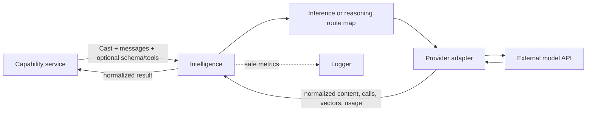
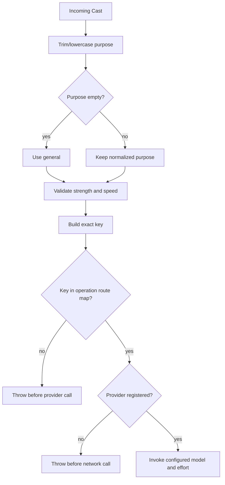
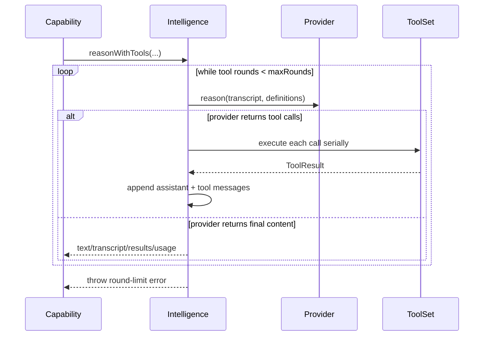

# Intelligence concepts

## Purpose

Capabilities state the semantic work they need with a `Cast`, messages, and optionally a schema or tools. Intelligence maps that request to a configured provider/model/effort and returns a provider-neutral result. Model policy therefore stays in configuration rather than capability code.



## Vocabulary

| Concept | Meaning | Code |
| --- | --- | --- |
| Cast | Requested `purpose`, `strength`, and `speed` | `Cast` |
| Route | Exact cast key mapped to provider, model, and optional effort | `CastRoute` |
| Inference | Text generation through `Provider.infer`; tool calls are not part of its contract | `infer` |
| Reasoning | Generation through `Provider.reason`, with optional provider tool calls | `reason` |
| Structured call | A provider call carrying a JSON Schema; Intelligence JSON-parses returned content | `inferStructured`, `reasonStructured` |
| Tool definition | Provider-visible name, description, and input schema | `ToolDefinition` |
| Tool binding | A definition paired with a local async handler | `ToolBinding` |
| Tool round | One provider response containing one or more tool calls, followed by local execution | `reasonWithToolsInternal` |
| Provider | Adapter that translates provider-neutral calls to one external API | `Provider` |
| Usage | Normalized token counts and optional USD cost | `Usage` |

## Routing model

Inference and reasoning have independent maps. A key is the normalized tuple:

```text
lowercase(trim(purpose)) || "general" | strength | speed
```

Construction normalizes every configured purpose, validates the two tiers, and rejects duplicate keys. Invocation applies the same normalization and requires an exact match. There is no nearest-route selection or tier fallback.



The committed configuration defines all nine strength/speed combinations for the `general` purpose in both maps. The runtime does not itself require that complete matrix; it only requires uniqueness and valid tiers.

## Structured output ownership

The caller owns the JSON Schema and any domain validation. The OpenRouter adapter marks the schema strict, while `Intelligence` only parses the returned content with `JSON.parse`. A parsed value is not evidence that it conforms to the schema or capability invariants; callers such as Derived Outputs validate it again before publication.

## Tool-loop model



Calls in one provider response execute sequentially in response order. Handler exceptions are converted to generic `tool_failed` results and are not rethrown. Unknown names become `tool_not_found`. The provider sees those results in the next transcript round.

## Boundary and ownership

Intelligence owns:

- cast normalization and exact route selection;
- provider lookup and invocation;
- provider-neutral messages, results, tool contracts, and usage;
- bounded tool-loop orchestration;
- safe operation telemetry;
- the OpenRouter adapter currently supplied by the repository.

Calling capabilities own:

- prompts and purpose labels;
- schemas and semantic validation;
- tool authorization and handler behavior;
- job queue/response classification;
- persistence, retries, idempotency, and publication;
- user-facing error translation.

The provider owns model behavior. Intelligence does not claim determinism, factual correctness, schema conformance, or semantic safety merely because a call succeeded.
