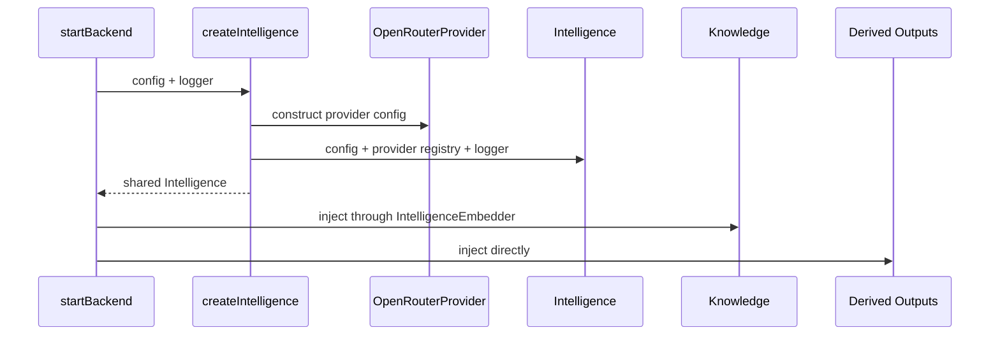
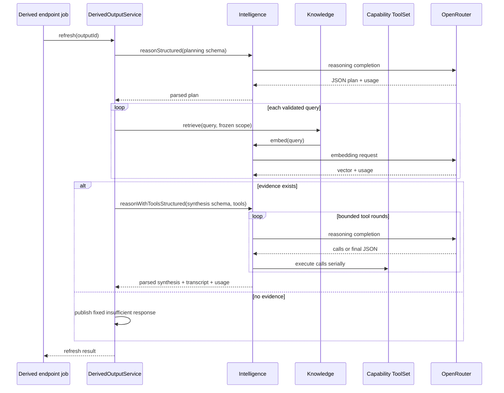
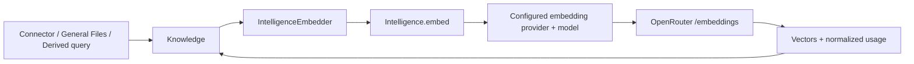

# Intelligence flows

## Endpoint and job ownership

Intelligence registers no endpoint and creates no job. It runs inside the job chosen by a consuming capability. The concrete production paths are below.

| HTTP or internal intent | Owning job | Queue / response | Intelligence call |
| --- | --- | --- | --- |
| `POST /derived-outputs` | `derived-outputs.declare` | concurrent / inline | Initial refresh: `reasonStructured`, then possibly `reasonWithToolsStructured` |
| `POST /derived-output-refresh` | `derived-outputs.refresh` | concurrent / inline | `reasonStructured`, then possibly `reasonWithToolsStructured` |
| General File admission/update | `general-files.*` job | owner-selected; see capability docs | `Knowledge.add` -> `Intelligence.embed` |
| Connector sync/reconciliation | `connector.*` job or recurring scheduler | owner-selected | `Knowledge.add` -> `Intelligence.embed` |
| Derived retrieval | within refresh job | inherits refresh | `Knowledge.retrieve` -> `Intelligence.embed` |

Read/update/delete Derived Output endpoints that do not refresh make no Intelligence call. Platform Intelligence itself has no queue name or response envelope.

## Startup flow

No external request occurs during this construction. Duplicate route errors can fail startup; an absent route provider does not fail until selected.

## Derived Output refresh

The endpoint mapper is [`registerDerivedOutputEndpoints.ts`](../../../api/routes/derived-outputs/registerDerivedOutputEndpoints.ts). The model call chain is in [`derived-outputs.ts`](../../../capabilities/derived-outputs/derived-outputs.ts).

Derived Outputs validates planned queries and synthesized output after Intelligence returns. Its tool set closes over a frozen Knowledge scope; Intelligence itself does not authorize the tools.

## Knowledge embedding

[`IntelligenceEmbedder`](../../knowledge/embedder.ts) deliberately narrows the dependency to `embed(inputs)`. It passes `undefined` for `AbortSignal`, so request cancellation is not currently propagated from Knowledge.

Source ingestion sends windows in batches of 32. Retrieval sends one query. Intelligence does not distinguish those semantic purposes because embedding has one configured provider/model and no `Cast`.

## Provider failure flow

1. The adapter validates that an API key exists.
2. `postJson` starts a timeout controller and links caller cancellation.
3. A non-2xx response body is drained without being exposed.
4. An error containing only status and optional provider request ID propagates.
5. The owning capability job decides status translation and error logging.

[`runtime-wiring.test.ts`](../../../../test/capabilities/runtime-wiring.test.ts) verifies that a provider response body does not appear in the thrown diagnostic.

## Adding a provider or consumer

A provider must implement [`Provider`](../provider.ts), normalize usage, honor cancellation, and avoid leaking payloads. Production construction must register it under the exact names used by routes. A consumer should inject `Intelligence` or a narrower local port, define purpose/schema/tools in its own boundary, select its own job policy, and validate all semantic output before mutation.
