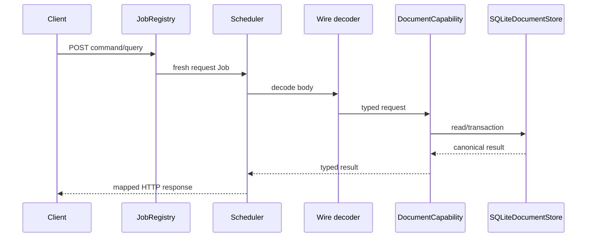
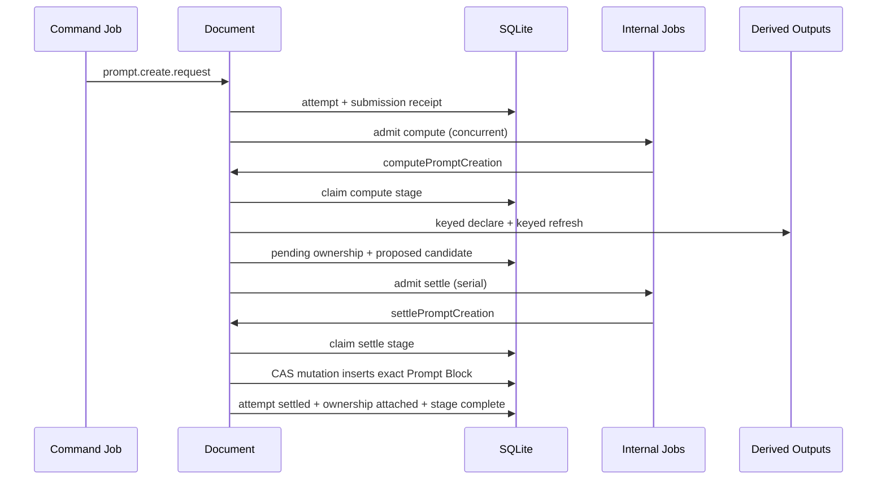
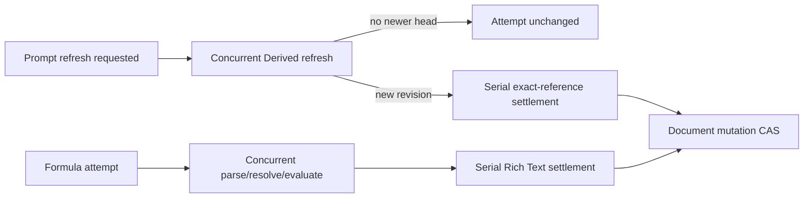

# Document endpoints, jobs, and flows

## Public endpoint map

| Endpoint | Job | Queue/mode | Decoder | Runtime call | Success status |
| --- | --- | --- | --- | --- | --- |
| `POST /documents/command` | `documents.command.v1` | serial / inline | `decodeDocumentCommand` | `document.command` | 201 create; 202 `*-requested`; otherwise 200 |
| `POST /documents/query` | `documents.query.v1` | concurrent / inline | `decodeDocumentQuery` | `document.query` | 200 |

Both handlers catch typed errors and return the mapping described in
[Types](types.md). Only unexpected 500s are explicitly logged by endpoint
wiring; scheduler/transport logging covers request and queue timing.

## Command call chains

| Command | Service chain | Durable outcome |
| --- | --- | --- |
| `document.create` | `command → create → getCreateSubmission (replay) → allocate id → createBlankSnapshot → validateSnapshot → commitCreation` | Resource root + current head + Base + identity ledger + receipts + transaction outbox at revision 1 |
| `document.submit` | `command → submit → mutate → applyOperations → commitMutation` | Archive prior head + CAS current head + ChangeSet + transitions + receipt/outbox; Formula attempts when discovered |
| `document.compensate` | `command → compensate → retained target/tail + canRebase → mutate(inverse)` | New compensating ChangeSet; exact same-kind identity reactivation allowed |
| `document.delete` | `command → deleteDocument → current + revision guards → logically delete owned Derived Outputs → archive head + terminal revision + transaction outbox → remove current head` | No current Document; retained resource root, Bases/ChangeSets, head history, structural identities, and owned-output references |
| `document.purge` | `command → purgeDocument → purge retained Derived Outputs → purgeDocument` | Requires terminal deletion history; removes the resource root and all attached retained Document data |
| `prompt.create.request` | `command → requestPromptCreation → dry-run placement → createAttemptWithSubmission → dispatch compute` | Requested attempt + replay receipt before external work |
| `prompt.update-definition` | `command → updatePromptDefinition → resolve Block's output → Derived.updateDefinition → recordSubmission` | Keyed external update then receipt; no Document revision |
| `prompt.refresh.request` | `command → requestPromptRefresh → createAttemptWithSubmission → dispatch compute` | Frozen output/applied-revision attempt + receipt |
| `formula.evaluate.request` | `command → requestFormulaEvaluation → createAttemptWithSubmission → dispatch compute` | Frozen atom/expression attempt + receipt |

Deletion first logically deletes every currently owned Derived Output, treating
an already-missing output as an exact-retry outcome. The Document store then
archives the current head, appends deletion revision `N + 1`, copies owned
output IDs into retained ownership, writes `document.deleted` to
`transaction_outbox`, and deletes the current row in one SQLite transaction.
Current-scoped receipts, attempts, prompt ownership, and stage receipts cascade
away. An exact retry can replay the deletion result from its retained source
transaction even though there is no current head.

Purge rejects a live current row with `409 not_deleted` and rejects missing or
non-terminal history with `404 not_found`. On success it purges the retained
Derived Output roots and history, deletes `document_history`, then deletes
`document_resources`; the root cascade removes Bases, ChangeSets, structural
identities, and retained ownership. Purge emits no Activity transaction and
does not prune previously committed transaction-outbox rows.

An accepted generic mutation may create Formula attempts automatically for new
or changed Formula atoms, so Formula compute can be dispatched even when the
client sent `document.submit` rather than an explicit Formula request.

## Query call chains

- List delegates to `store.listHeads` with optional live lifecycle and cursor;
  it reads `documents` only.
- Unqualified load requires a current head. Revision-qualified load may use a
  retained head from `document_history`, then replays a contiguous
  Base/ChangeSet tail, validates it, and fetches each exact prompt revision.
- History checks the stable resource root and delegates to paged retained
  ChangeSets, so it remains available after logical deletion and before purge.
- Attempt fetches one attempt by `(documentId, attemptId)`.

## Internal job map

| Intent | Job name | Queue | Runtime method |
| --- | --- | --- | --- |
| `document.compact` | `documents.compact` | serial | `compact(documentId)` |
| `document.prompt.create.compute` | `documents.prompt.create.compute` | concurrent | `computePromptCreation(attemptId)` |
| `document.prompt.create.settle` | `documents.prompt.create.settle` | serial | `settlePromptCreation(attemptId)` |
| `document.prompt.refresh.compute` | `documents.prompt.refresh.compute` | concurrent | `computePromptRefresh(attemptId)` |
| `document.prompt.refresh.settle` | `documents.prompt.refresh.settle` | serial | `settlePromptRefresh(attemptId)` |
| `document.formula.evaluate.compute` | `documents.formula.evaluate.compute` | concurrent | `computeFormulaEvaluation(attemptId)` |
| `document.formula.evaluate.settle` | `documents.formula.evaluate.settle` | serial | `settleFormulaEvaluation(attemptId)` |

Internal dispatch returns after scheduler admission. Durable attempts and stage
receipts—not the in-memory queue—are the recovery authority.

## Prompt creation

If initial refresh produces no revision, ownership is detached and the attempt
fails. If insertion conflicts at settlement, it becomes stale and ownership is
detached.

## Prompt refresh and Formula evaluation

Prompt settlement verifies output identity and applied revision. Formula
settlement verifies expression digest and intervening touched IDs. A changed
target becomes stale rather than overwriting newer authored state.

## Compaction and recovery

Once `head.revision - head.baseSeq` reaches configured retained ChangeSets,
mutation dispatches serial compaction. Compaction writes a cutoff Base and
current Base only if the head is unchanged, then prunes according to retention.

At startup, running stage receipts are marked failed and recoverable attempts
are redispatched. Proposed attempts go to settle; requested/computing attempts
go to compute. A failed queue-capacity admission is also retried in process with
bounded exponential delay. There is no durable queue record; redispatch is safe
because attempts, submission receipts, external idempotency keys, and stage
receipts fence duplicate effects.

## Transaction outbox delivery and recovery

Creation and every accepted mutation write a self-contained source transaction
to `transaction_outbox` in the same SQLite transaction as the canonical
Document change. Logical deletion likewise records `document.deleted` before
the current head disappears. After the transaction commits, the injected
publisher maps `sourceTransactionId` to Activity's `idempotencyKey` and calls
its trusted `publish` method. The outbox row is marked published only after
Activity accepts the derived ledger transaction. A delivery failure is logged
but does not turn an accepted
Document command into a failure.

At startup, `document.publishPendingActivity()` retries every unpublished row.
The same `sourceTransactionId` reaches Activity on every retry, so a crash
after Activity accepts it but before Document marks the row published is safe:
Activity derives the same `act_<sha256(idempotencyKey)>`, returns the original
transaction, and Document can finish marking its outbox row. An exact Document
request replay creates no second source transaction.

Detached Derived Output garbage collection remains an unwired maintenance
seam; it is separate from transaction-outbox delivery to Activity.
