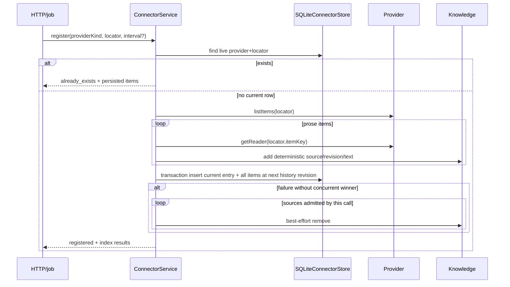
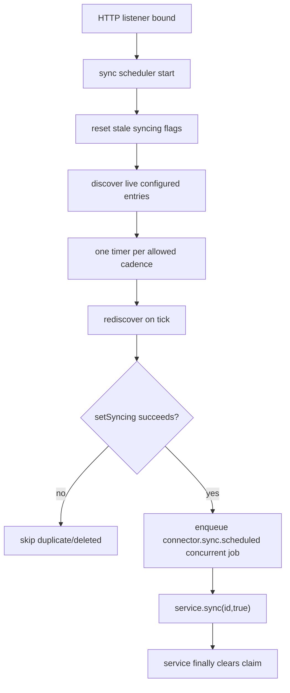

# Connector endpoint, job, and scheduled flows

## Common HTTP behavior

[`registerConnectorEndpoints`](../../../api/routes/connector/registerConnectorEndpointMappings.ts) creates inline jobs. Register, refresh, reads, get, list, and list-items use the concurrent queue. Delete and purge use the serial queue; delete also acquires the persisted sync claim, which is the cross-caller concurrency boundary.

Typed mapping: missing 404; already exists/sync in progress 409; validation/unsupported locator/range 400; other 500. Every caught endpoint error is logged with operation and error metadata.

## Exhaustive endpoint table

| Method/path | Job name | Queue | Input | Runtime calls | Success |
|---|---|---|---|---|---|
| `POST /connector/register` | `connector.register` | concurrent | Body cast; service validates provider/locator/interval | `service.register` | 200 register result |
| `POST /connector/refresh` | `connector.refresh` | concurrent | body `id` | `service.sync(id)` | 200 `{status:"synced"}` after completion |
| `POST /connector/get` | `connector.get` | concurrent | body `id` | `service.get` | 200 public entry |
| `POST /connector/list` | `connector.list` | concurrent | body ignored | `service.list` | 200 public entry array |
| `POST /connector/read-all` | `connector.read-all` | concurrent | `id`, optional `itemKey` | file `getReader`, or directory reader + item; `readAll` | 200 `{text}` |
| `POST /connector/read-range` | `connector.read-range` | concurrent | `id`, optional `itemKey`, byte `start/end` | select reader; `read({start,end})` | 200 `{text}` |
| `POST /connector/read-lines` | `connector.read-lines` | concurrent | `id`, optional `itemKey`, `startLine/endLine` | select reader; `readLines` | 200 `{lines}` |
| `POST /connector/list-items` | `connector.list-items` | concurrent | body `id` | `getDirectoryReader(id).listItems()` | 200 item array |
| `POST /connector/delete` | `connector.delete` | serial | body `id` | `service.delete` | 200 `{status:"deleted",id}` |
| `POST /connector/purge` | `connector.purge` | serial | body `id` | `service.purge` | 204 null |

All are response mode `inline`. Manual refresh no longer acknowledges before work finishes.

## Register sequence



## Sync/reconciliation sequence

```mermaid
sequenceDiagram
  participant Caller as Manual/scheduled caller
  participant C as ConnectorService
  participant S as SQLite store
  participant P as Provider
  participant K as Knowledge
  Caller->>C: sync(id, claimAlreadyHeld?)
  C->>S: acquire/verify syncing claim
  C->>P: list complete current snapshot
  C->>S: load prior item snapshot
  C->>S: mark pending + old/current source union
  loop current prose requiring admission/reconciliation
    C->>P: open reader and readAll
    C->>K: add/upsert source
  end
  loop transitioned, removed, or orphaned source
    C->>K: remove source
  end
  C->>S: transaction replace entry + all items; state=active
  alt any step fails
    C->>S: mark failed with tracked union
    C-->>Caller: rethrow
  end
  C->>S: clear claim in finally
```

The `pending` write occurs before the first Knowledge mutation. The old item rows remain until the final active transaction, while the entry's tracked source JSON changes to the recovery union. Public service views hide that union.

## Scheduled job flow



Scheduled job work returns 200 `{status:"synced"}` internally or catches/logs and returns 500 `{status:"error"}`. It has no external deferred-result endpoint.

## Delete sequence

Delete acquires the same claim before awaiting Knowledge, records the pending source union, and removes every tracked source. The final SQLite transaction writes the complete entry/item snapshot and terminal deletion revision to history, then removes the current entry; item rows cascade with it. A simultaneous sync receives `SyncInProgressError`, and a stale sync snapshot cannot recreate the missing current row because update requires a claimed current revision.

Purge is irreversible and produces no Activity transaction. A live current row returns `409 not_deleted`; a missing terminal history record returns 404. A valid purge removes the Connector history. The backend retention sweep uses the same purge behavior when a terminal deletion is older than the configured cutoff and prunes old history for live Connectors.

## Read and resource-registry paths

HTTP item reads select a directory reader whenever `itemKey` is truthy; otherwise they require a file connector. Range and line validation occurs inside provider readers.

Derived Output reads instead begin from an exact frozen descriptor. The registry finds the active connector/source, checks source/resource/kind/revision equality, chooses the persisted item key, and then opens the provider reader. An out-of-scope or changed-revision request returns null before content is exposed.
