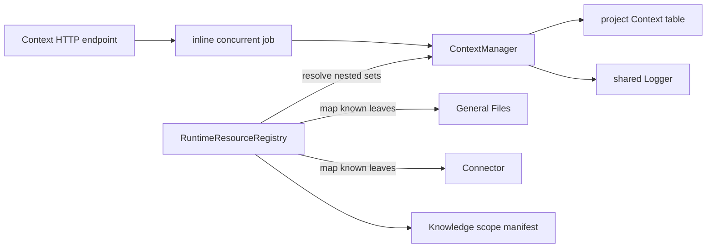
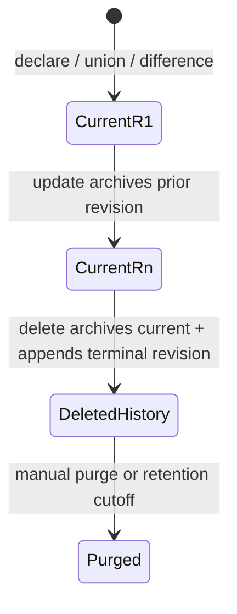
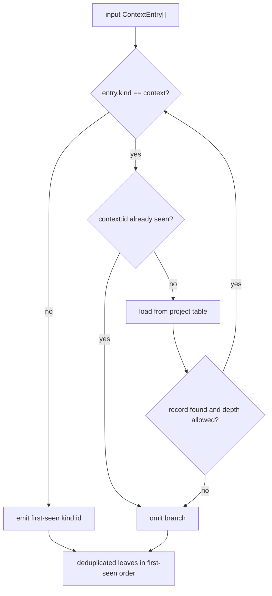

# Context concepts

## Purpose

A Context is a reusable, persisted set of references. A reference is the pair `kind:id`; Context deliberately treats non-`context` kinds as opaque. This lets a caller name a scope without copying the referenced content or depending on another capability's storage shape.

The implemented outcomes are:

- declare and replace named entry sets, each with an optional description;
- look up and list those sets;
- recursively expand nested `kind: "context"` references;
- compute union or difference in memory; and
- persist a union or difference result as a new, caller-named context and return its ID.

## Vocabulary

| Term | Meaning in the implementation |
|---|---|
| Context entry | `{ id, kind }`, with identity `${kind}:${id}` |
| Leaf | Any entry whose kind is not `context`; it is returned without resource validation |
| Nested context | An entry with `kind: "context"`; its `id` is loaded recursively |
| Private context | A record created with `private: true`; hidden from default `list` calls unless `includePrivate` is passed. A visibility flag only — display names carry no special meaning. |
| Project scope | The single table derived from the configured `projectId`; there is no user scope |
| Operand | Composition input: either `{ contextId }` (load an existing context's entries) or `{ entries }` (inline) |
| Resolution depth | Recursion counter bounded by `maxResolveDepth`; over-depth branches are omitted |
| Current record | The one typed current row for a Context identity, beginning at revision 1 |
| History record | A complete superseded snapshot or terminal deletion revision retained outside the current table |

## Ownership and boundaries

Context owns reference-set persistence and recursive composition. Knowledge owns source ingestion and retrieval. General Files, Connector, Document, and future resource capabilities own their resource content and revision rules. The resource registry bridges these boundaries after Context resolution.

The manager implements the narrow `KnowledgeResourceResolver.resolve` shape, but startup injects the richer runtime resource registry into Knowledge. That registry first calls Context and then converts known resource identities to the `kind: "document"` source-ID form Knowledge expects.

## Record lifecycle

Delete removes the current row in the same SQLite transaction that archives the
last current snapshot and appends terminal revision `N + 1`. Every normal read and
nested-resolution path uses the current table only. Manual purge and shared
retention remove terminally deleted history; neither operation creates a
current record.

## Resolution lifecycle

Resolution walks the supplied array in order. It keeps one `seen` set for both leaves and nested-context identities. A first-seen leaf is emitted; a repeated leaf is omitted. A first-seen context is loaded, then expanded depth-first. A repeated context breaks a cycle or duplicate path. Missing records and branches beyond the configured depth are silently omitted.

## Composition semantics

`combine(a, b)` is a first-seen union over `a` followed by `b`. `difference(a, b)` preserves entries from `a` whose `kind:id` key is absent from `b`; duplicate entries already present in `a` are not independently deduplicated by `difference`. Neither function resolves nested contexts.

`composeNamed(op, a, b, displayName, options?)` resolves each operand (loading
`a`/`b` by `contextId` when given, or using inline `entries`), runs `combine` or
`difference`, and inserts the result as a new current-named record at revision
1 — reusing the same conflict check as `declare`. It is the backing call for
`POST /contexts/union` and `POST /contexts/difference`, which return only the
new context's ID. `options.private` (default `false`) is accepted the same way
`declare` accepts it; both endpoints read it from the request body.
