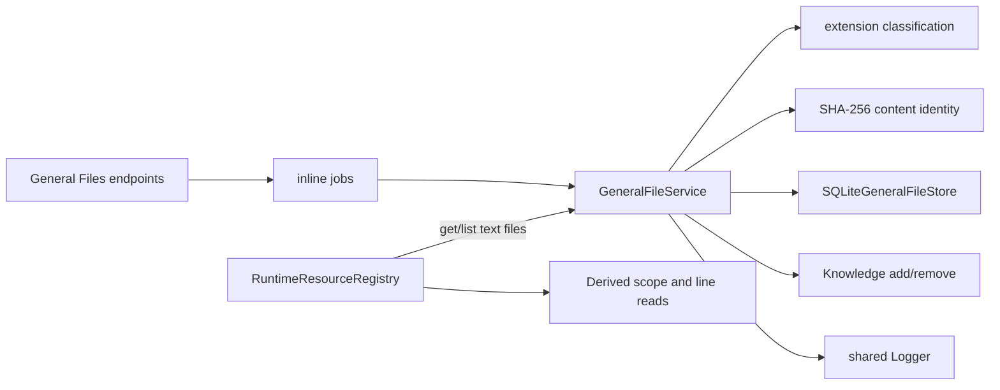
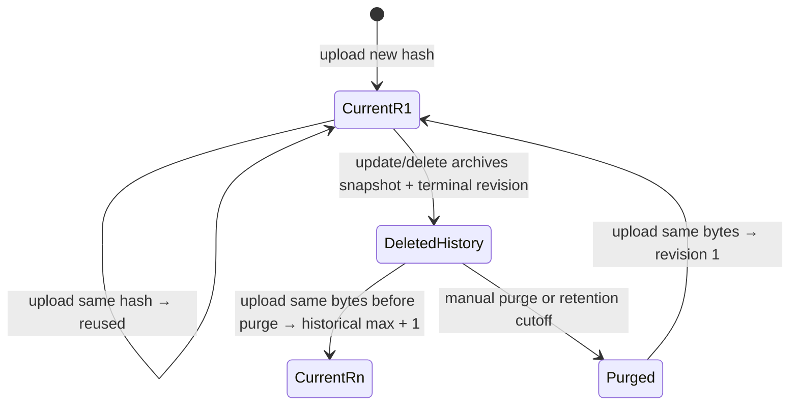

# General Files concepts

## Purpose and outcomes

Given a non-empty filename and a string, General Files can persist the full
string, return it by stable content identity, list current metadata, replace a
current version wholesale, retain prior revisions, and keep eligible prose
synchronized with Knowledge.

It is intentionally a general storage surface, not a document parser. PDF, DOCX, image, archive, code, data, and extensionless payloads are accepted as opaque `general::file::other` values. Nothing attempts to extract prose from those formats.

## Vocabulary

| Term | Current meaning |
|---|---|
| Transport string | The JavaScript `string` received as `content`; stored verbatim as SQLite `TEXT` |
| Content identity | Lowercase hex SHA-256 of the UTF-8 encoding of `content` |
| Text kind | `general::file::text`; extension is in this capability's prose allowlist |
| Other kind | `general::file::other`; persisted but not admitted to Knowledge |
| Current row | The one typed current row for a content identity |
| History record | A complete superseded file snapshot or terminal deletion revision outside current storage |
| Reused upload | Current content with the same hash already exists; first stored metadata wins |
| Replacement | New content identity becomes current while the old current identity moves to history in one SQLite transaction |
| Deterministic re-registration | Uploading identical bytes with no current row reuses the content-hash ID; history determines its next revision until purge |
| Knowledge source | `general-file:${file.id}` for a text-kind row |
| Compensation | Best-effort inverse Knowledge operation after a later cross-store step fails |

## Architecture and authority



The SQLite database and Knowledge database are separate authorities. A General File replacement transaction is atomic only within the General Files database. The service sequences Knowledge work around that transaction and attempts compensation; it does not claim a distributed transaction.

## Classification

The prose allowlist is owned locally by `domain/model.ts`: `txt`, `md`, `markdown`, `rst`, `org`, `tex`, `html`, `htm`, and `log`. The extension is the substring after the final dot in the upload filename, lowercased. No dot yields an empty extension. A trailing dot also yields empty extension.

Classification is fixed by the stored filename on upload and preserved during update because update changes only content. The Connector capability owns a separate copy of its allowlist; the two may intentionally diverge.

## Content-addressed lifecycle



An update does not mutate the old row's identity or content. It either:

1. archives the old row with `replacedById` pointing to an already-current row
   with the requested hash; or
2. inserts a replacement row whose `replacesId` points to the old identity,
   then archives the old row with `replacedById`.

In either case the old identity receives a terminal deletion revision and has
no current row. Its snapshot history retains lineage. The replacement target's
revision comes from its own deterministic identity history, not the source's
revision.

## Knowledge lifecycle

Text rows are added with:

```ts
{
  sourceId: `general-file:${id}`,
  label: "general-file",
  revision: contentHash,
  text: content
}
```

A repeated add with the same Knowledge revision is a cheap no-op. Uploading or
unchanged-updating an already-current file therefore also acts as a self-heal
request without necessarily spending embedding tokens.

Replacement and logical deletion await removal of the old Knowledge source
before removing its current General File row. Retained snapshots are never
Knowledge sources. Purge and retention operate only on already-deleted history,
so they do not issue another Knowledge removal.

Other-kind rows always have `knowledgeSourceId: null`. The resource registry maps and reads only rows that expose a Knowledge source, so opaque files are stored but excluded from Derived Output retrieval scope.

## Resource-read lifecycle

The resource registry describes an indexed file as `{sourceId, resourceId:
file.id, resourceKind: file.kind, resourceRevision: file.revision}`. It reads
only a descriptor present in the frozen scope and only while the current file's
revision still matches. General File line reads split the stored string on
CRLF/LF and return the requested slice joined with LF.
