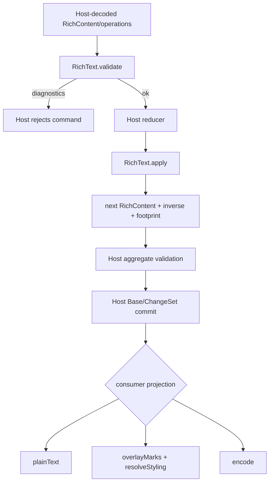
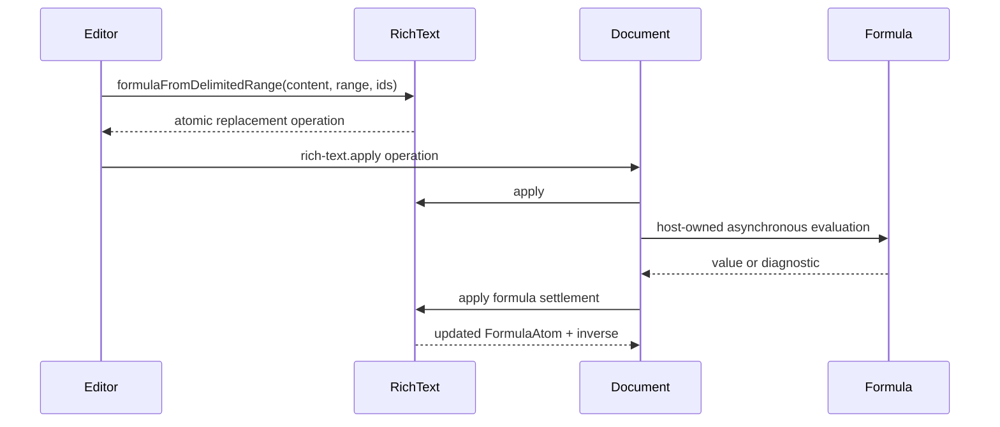
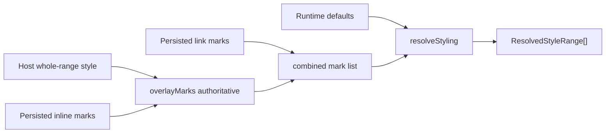

# Rich Text concepts and lifecycle

## Ownership boundary

Rich Text is a reusable value service, not a resource aggregate. A `RichContent` value has ordered atoms and marks. Document owns Rows/Blocks; Slide owns Slides/Shapes/Notes; each host embeds Rich Content in its snapshot and records the resulting operations in host-owned history.

Rich Text owns:

- inline atom, position, range, mark, link and text-style vocabularies;
- transformations and local diagnostics over one `RichContent` value;
- conversion of a completed `{{...}}` range to a Formula atom operation;
- accepted Formula wire-value/diagnostic settlement fields;
- deterministic byte encoding and text/styling projections.

It does not own Formula evaluation, resource identity/revisions, authorization, HTTP decoding/status, Job scheduling, persistence, editor selection, layout, or rendering.

## Content vocabulary

### Atoms

Atoms are the ordered content units:

- `text`: editable JavaScript string;
- `formula`: authored expression, optional accepted `FormulaWireValue`, display text, optional diagnostic;
- `reference`: typed target plus display text;
- `hard-break`: a line break without text payload.

Formula/reference atoms contribute `displayText` to text projections. Hard breaks contribute `\n`. Rich Text does not resolve references or evaluate formulas.

### Positions and ranges

A position is `{ atomId, offset }`. Offsets are UTF-16 code units, matching JavaScript/browser string indexing. Ranges are intended as half-open start/end pairs, but current validation checks endpoint existence/bounds/surrogate splits and does not check global ordering or `start <= end`.

Non-text atom lengths are defined as display-text length for formula/reference and zero for hard breaks. Normalization and styling snap non-text range boundaries to whole-atom boundaries.

### Marks

Simple semantic marks are bold, italic, underline, strike and code. Style marks carry partial `TextStyleProperties`; link marks carry one or more typed targets. Marks address content but do not own it.

Mark order matters during `resolveStyling`: defaults are applied first and covering marks then overlay in array order. Link marks add targets but no visual style. During `overlayMarks`, supplementary properties are applied first and authoritative properties win.

### Operations, inverse and footprint

`RichTextOperation` is the command vocabulary for text, atom, mark and Formula changes. `apply` clones the input once, reduces the operation list in order, returns the resulting content, prepends each produced inverse so inverse order is reversed, and accumulates affected atom IDs plus the last dirty range.

The presence of `inverse` is not a blanket exact-undo guarantee. Atomic Formula replacement/settlement and `replace-content` use exact snapshots and are round-trip tested. Several generic text/delete inverses are simplified; see [invariants.md](invariants.md).

## High-level lifecycle

Rich Text itself does not automatically validate or normalize before/after `apply`; host reducers and aggregate validation decide when those functions run.

## Formula atom lifecycle

Formula authoring is split deliberately:

1. `formulaFromDelimitedRange` verifies that one non-empty single-text-atom range exactly begins `{{` and ends `}}`.
2. It allocates Formula/trailing atom IDs and returns one `replace-range-with-atom` operation.
3. `apply` atomically splits the source atom, replaces the delimited text, and remaps mark endpoints.
4. A host (currently Document) freezes/evaluates the expression with Formula.
5. The host settles an accepted wire value/display text or a diagnostic through `apply-formula-settlement`.

The authored expression and accepted value are separate. A failed settlement omits `acceptedValue` and may preserve a delimited display string with diagnostic; a later success can clear the diagnostic by omission.

## Styling lifecycle

Host projections synthesize a full-range authoritative style mark from their resource style hierarchy. Persisted inline marks are supplementary, while links are retained separately. `overlayMarks` segments at all mark endpoints, overlays properties, carries semantic marks that agree with the resolved properties, and emits deterministic synthetic IDs. `resolveStyling` segments again and returns resolved properties, active mark IDs, links, and whole-content plain text.

`resolveStyling` creates ranges only between collected mark boundaries. With no marks it returns no ranges, so Document/Slide add a full-range mark to obtain coverage. Unmarked leading/trailing spans are likewise absent unless a host full-range mark supplies boundaries.

## Validation versus normalization

Validation reports structural, referential and selected semantic problems without changing content. Normalization snaps non-text endpoints, removes empty/dead/out-of-bounds marks, merges adjacent text atoms, removes adjacent equivalent marks and sorts by start position.

Normalization is intended to be idempotent, but its current adjacent-text merge keeps only the first atom ID without remapping marks from removed atom IDs; those marks are filtered out. It should not be treated as a semantic-preserving editor transform for arbitrary unnormalized content.
