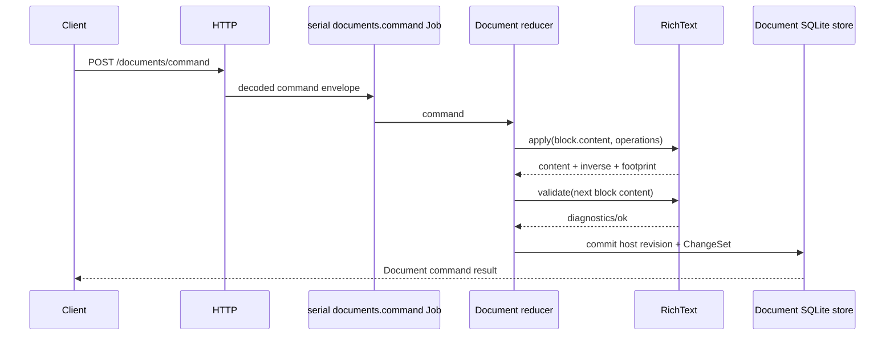
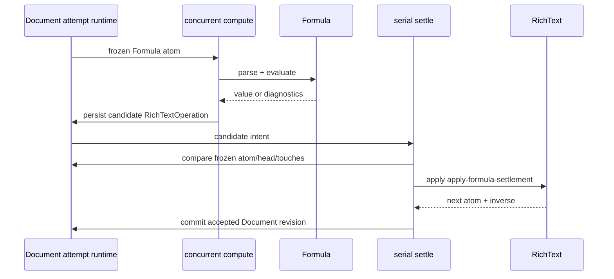

# Rich Text endpoint and Job flows

## No direct Rich Text route or Job

Rich Text registers no HTTP endpoint and creates no Job. Host capabilities decode Rich Text values/operations, invoke the in-process runtime, validate the enclosing aggregate, and persist through their own stores. Document is the current complete host; Slide has consuming domain/store/wiring source but lacks its application service.

## Document command flow

`registerDocumentEndpoints.ts` exposes:

- `POST /documents/command` → serial inline `documents.command.v1` Job;
- `POST /documents/query` → concurrent inline `documents.query.v1` Job.

The strict decoder in `document/wire/commandSchemas.ts` accepts Document operations including `rich-text.apply`, whose payload contains `RichTextOperation[]`. `document/domain/reducer.ts` locates a text-bearing block and calls `richText.apply`; host validation calls `richText.validate` for embedded block content.

Document also uses Rich Text for `style.apply-inline`, where the reducer resolves a saved Document Style and calls `richText.apply` with one add-mark operation. Host inverse construction is in `document/domain/inverses.ts`.

## Document Formula flow

A Formula atom may be authored via `formulaFromDelimitedRange` in editor/application code and inserted through `rich-text.apply`. The reducer compares Formula atom maps before/after Rich Text operations and records expression changes. A `formula.evaluate.request` creates a durable host attempt.

`registerDocumentInternalJobs.ts` registers:

- `document.formula.evaluate.compute` as a concurrent internal Job;
- `document.formula.evaluate.settle` as a serial internal Job.

Compute calls Formula and produces one `apply-formula-settlement` operation. Settlement verifies that document/atom/expression history is still compatible, wraps that candidate in a Document `rich-text.apply`, and commits a host ChangeSet. Rich Text only performs the final atom field transition.

## Declared Slide command flow (currently unreachable)

`registerSlideEndpoints.ts` declares serial `POST /slides/command` and concurrent `POST /slides/query` inline Jobs. Slide wire schemas strictly decode embedded Rich Content and operations. However, `slide/index.ts` references a missing `application/slideService.ts`, so startup cannot currently construct the required `SlideCapability`; these routes are not operable in the live tree.

`slide/domain/reducer.ts` calls Rich Text for:

- `notes.apply` on Slide notes;
- `text.apply` on authored Text Shape content.

Before applying, Slide rejects Rich Text operations that churn atom/mark identity for these public paths (`assertNoRichIdentityChurn`). It uses returned inverses for host compensation. Slide validation calls `richText.validate` for notes and text-bearing content. Prompt Content adoption is a separate Derived Output transition and not a Rich Text mutation path.

## Projection/read flows

Document queries call host projections, and Slide provides the corresponding pure projection functions even though its application service is absent:

| Host projection | Rich Text calls |
| --- | --- |
| Document plain text/outline | `plainText` for every nested text-bearing Block/List/Table cell |
| Document text styling | `fullRangeStyle` → `overlayMarks` → `resolveStyling` |
| Slide plain text | `plainText` for notes and text shapes |
| Slide text styling | `fullRangeStyle` → `overlayMarks` → `resolveStyling` |

Projection source is `document/projections/` and `slide/projections/`. Host whole-range style marks ensure styling segmentation covers all authored text; persisted links are appended outside `overlayMarks` so supplementary links are not lost.

## Persistence and codec flow

Rich Text owns no store/table. Document and Slide encode their complete snapshots and operations with host canonical codecs. Direct `RichText.encode/decode` exists for deterministic standalone bytes but is not the authority for host revision persistence. A host must validate decoded data at its own ingress boundary; `RichText.decode` alone only parses/casts JSON.

## Logging across flows

Transport/Scheduler logs carry request/Job correlation. Host services log command/stage metadata. Rich Text logs local operation types/counts/durations but receives no request context, so its entries are correlated temporally rather than by an explicit request ID field from its API.
