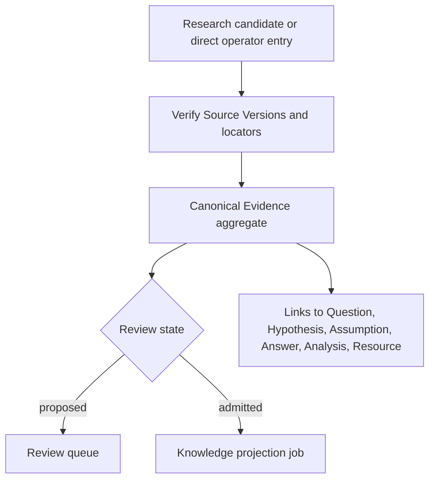

# Capability — Icarus Evidence Runtime Model

> Mirrored from [Notion](https://app.notion.com/p/3aeb6410e5028100a28cd09963ba3f75).

## Summary / Concept
Evidence is build position **Research 2 of 3**. Analysis precedes it and may supply version-pinned calculated results; Research follows it and produces candidates for admission. Knowledge consumes admitted Evidence through a rebuildable projection.
### Prerequisites and build position
#### Required before implementation
- SQLite, Logger, command receipts, and the shared Base/ChangeSet history pattern.
- Sources with immutable Source Versions, exact locators, and bounded snapshot reads.
#### Consumed when available
- Research may submit candidates; Questions and Analysis supply typed targets for evidence links.
#### Provides downstream
- Admitted Evidence snapshots for Questions, Research, Knowledge projection, Agents, Automation, and Collaboration.
#### Construction boundary
The capability is constructed with a store already bound to the configured runtime scope. Domain values, endpoint payloads, jobs, and capability-owned tables use resource identities; scope routing remains in initialization. Accepted change records receive attribution from the initialized runtime.
Evidence is canonical, reviewable, source-grounded project knowledge. It stores bounded assertions with exact provenance and review history. Admitted Evidence is projected into the Knowledge lattice while Evidence remains canonical.
### Purpose and boundary
Evidence lets a project retain a bounded assertion or quotation from research together with the exact basis needed to review it.
An Evidence record contains:
- a concise statement;
- an explicit evidence kind;
- one or more immutable source citations;
- polarity and links to the Questions, Hypotheses, Assumptions, Answers, Analyses, or Resources it bears on;
- confidence and review state;
- revision and review history.
Evidence kinds:
<table fit-page-width="true" header-row="true">
<tr>
<td>Kind</td>
<td>Meaning</td>
</tr>
<tr>
<td>`quotation`</td>
<td>A bounded exact quotation from a Source Version.</td>
</tr>
<tr>
<td>`observation`</td>
<td>A faithful observation directly supported by cited source material.</td>
</tr>
<tr>
<td>`calculation`</td>
<td>A result derived from version-pinned structured inputs and a recorded method.</td>
</tr>
<tr>
<td>`inference`</td>
<td>A labeled conclusion drawn from cited material.</td>
</tr>
</table>
Evidence owns those canonical records, citations, links, and admission history. Research owns candidate material before admission. Sources owns immutable origin content. Questions owns Questions, Hypotheses, Assumptions, and Answers. Knowledge owns the retrieval projection.
Knowledge contribution types are Source Versions, admitted Evidence, and literal Media OCR. Data and Analysis may be consumed to calculate or support Evidence. Native editor material used as grounding is pinned through a Sources `native_resource` Source Version.
### Repository placement
```plain text
apps/backend/src/3-capabilities/evidence/
  domain/
    model.ts
    operations.ts
    validation.ts
    reducer.ts
  application/
    service.ts
  ports/
    repository.ts
    sourceReaders.ts
    targetReaders.ts
  persistence/
    migrations/
      001-evidence.ts
    sqliteEvidenceRepository.ts
  index.ts

apps/backend/src/4-job-wiring/evidence/
  registerEvidenceEndpointMappings.ts
  evidenceJobFactories.ts
  evidenceProjectionHook.ts
```
Evidence is composed into the backend and SQLite transaction boundary. Evidence owns its repository port, migrations, and `SqliteEvidenceRepository`; `1-init` instantiates that adapter with the Platform Database and injects it. `evidenceProjectionHook.ts` schedules a Knowledge projection after commit through a narrow composition-supplied port.
## Types & Interfaces
### Core TypeScript model
```typescript
type EvidenceKind = "quotation" | "observation" | "calculation" | "inference";
type EvidenceReviewState = "proposed" | "admitted" | "rejected" | "deprecated";

type SourceLocator =
  | { kind: "text"; start: number; end: number }
  | { kind: "page"; page: number; start?: number; end?: number }
  | {
      kind: "image_region";
      x: number;
      y: number;
      width: number;
      height: number;
    }
  | { kind: "native_node"; resourceRevision: number; nodeId: string };

interface CalculationMethod {
  expression: string;
  structuredInputs: readonly {
    tableId: string;
    revision: number;
    range: string;
  }[];
}

interface EvidenceCitation {
  citationId: string;
  sourceId: string;
  sourceVersionId: string;
  locator: SourceLocator;
  exactQuote: string | null;
  quoteHash: string | null;
  role: "grounds" | "derives" | "method_input";
  ordinal: number;
}

type EvidenceTargetRef =
  | { kind: "question"; id: string }
  | { kind: "hypothesis"; id: string }
  | { kind: "assumption"; id: string }
  | { kind: "answer"; id: string }
  | { kind: "analysis"; id: string }
  | { kind: "document"; id: string }
  | { kind: "slides"; id: string }
  | { kind: "spreadsheet"; id: string }
  | { kind: "evidence"; id: string };

interface EvidenceLink {
  linkId: string;
  target: EvidenceTargetRef;
  relationship:
    | "supports"
    | "refutes"
    | "qualifies"
    | "contextualizes"
    | "derived_from"
    | "used_by";
}

interface EvidenceAggregate {
  evidenceId: string;
  revision: number;
  statement: string;
  evidenceKind: EvidenceKind;
  confidence: number | null;
  reviewState: EvidenceReviewState;
  method: CalculationMethod | null;
  citations: readonly EvidenceCitation[];
  links: readonly EvidenceLink[];
  authorId: string;
  admittedAt: string | null;
  createdAt: string;
  updatedAt: string;
}

type EvidenceOperation =
  | { kind: "set_statement"; statement: string }
  | { kind: "set_kind"; evidenceKind: EvidenceKind }
  | { kind: "set_confidence"; confidence: number | null }
  | { kind: "set_review_state"; state: EvidenceReviewState; rationale: string }
  | { kind: "add_citation"; citation: EvidenceCitation }
  | { kind: "remove_citation"; citationId: string }
  | { kind: "add_link"; link: EvidenceLink }
  | { kind: "remove_link"; linkId: string };

interface MutateEvidenceRequest {
  evidenceId: string;
  expectedRevision: number;
  submissionId: string;
  operations: readonly EvidenceOperation[];
}
```
### Dependencies and narrow ports
Evidence consumes:
```typescript
interface SourceSnapshotReader {
  getVersion(sourceVersionId: string): Promise<SourceVersionMetadata>;
  readExact(sourceVersionId: string, locator: SourceLocator): Promise<ExactSourceSlice>;
}

interface EvidenceTargetReader {
  exists(target: EvidenceTargetRef): Promise<boolean>;
}

interface ResearchCandidateReader {
  getEvidenceCandidate(runId: string, candidateId: string): Promise<EvidenceCandidate>;
}
```
Structured calculations consume a `StructuredSnapshotReader` to verify version-pinned inputs. Evidence exposes:
```typescript
interface AdmittedEvidenceReader {
  getProjectionSnapshot(evidenceId: string, revision?: number): Promise<EvidenceProjectionSnapshot>;
  listAdmitted(cursor?: string): Promise<EvidenceProjectionSnapshot[]>;
}
```
Web material enters Evidence through a Source Version. Model-generated interpretation is labeled as `inference` and carries cited grounding.
## Runtime Objects
### Aggregate and ChangeSet lifecycle
An Evidence aggregate is the current Evidence row plus its current Citation and Link sets. A mutation supplies `expectedRevision` and `submissionId`, then a pure reducer produces the complete next aggregate and inverse operations.
In one transaction:
1. the service validates every Source Version and locator through `SourceSnapshotReader`;
2. exact quotations are checked byte-for-byte and hashed;
3. target references are validated through narrow readers;
4. the aggregate head, current citation/link rows, immutable change set, and review event commit;
5. after commit, job wiring requests Knowledge reprojection when admission eligibility changed.
Undo restores the prior aggregate state and appends a compensation change set. Review events and historical citation values remain retained.
### Derived projections
The **Evidence Review Projection** is rebuilt from canonical Evidence, review events, citations, and links for review queues and target-centric lists. The **Admitted Evidence Text Projection** is owned by Knowledge and is completely rebuildable from:
- admitted Evidence statement and kind;
- Evidence revision;
- current citations and links;
- exact Source Version locators.
Evidence exposes a snapshot reader; Knowledge stores the projection. SQLite B-tree indexes above are relational query indexes, while the Knowledge text representation is a rebuildable product projection.
### Key flow

## Change Operations
Evidence mutations reduce a closed operation batch against one aggregate head. The reducer emits the complete next aggregate and exact inverse operations.
<table fit-page-width="true" header-row="true">
<tr>
<td>Operation</td>
<td>Effect</td>
</tr>
<tr>
<td>`set_statement`</td>
<td>Replaces the bounded assertion text.</td>
</tr>
<tr>
<td>`set_kind`</td>
<td>Changes the labeled Evidence kind and revalidates kind-specific requirements.</td>
</tr>
<tr>
<td>`set_confidence`</td>
<td>Sets or clears the normalized confidence value.</td>
</tr>
<tr>
<td>`set_review_state`</td>
<td>Moves between proposed, admitted, rejected, or deprecated with required rationale.</td>
</tr>
<tr>
<td>`add_citation` / `remove_citation`</td>
<td>Changes exact Source Version grounding while preserving aggregate-wide citation validity.</td>
</tr>
<tr>
<td>`add_link` / `remove_link`</td>
<td>Changes a typed relationship to an inquiry, analysis, resource, or other Evidence.</td>
</tr>
</table>
## Endpoints
<table fit-page-width="true" header-row="true">
<tr>
<td>Method and path</td>
<td>Request type</td>
<td>Result</td>
</tr>
<tr>
<td>POST /evidence</td>
<td>`evidence.create`</td>
<td>Canonical Evidence head.</td>
</tr>
<tr>
<td>POST /evidence/admit-from-research</td>
<td>`evidence.admit-from-research`</td>
<td>Canonical Evidence linked to its Research candidate.</td>
</tr>
<tr>
<td>GET /evidence</td>
<td>`evidence.list`</td>
<td>Bounded filtered summaries.</td>
</tr>
<tr>
<td>GET /evidence/:evidenceId</td>
<td>`evidence.get`</td>
<td>Current aggregate and revision.</td>
</tr>
<tr>
<td>POST /evidence/:evidenceId/submissions</td>
<td>`evidence.revise`</td>
<td>Accepted ChangeSet or typed conflict.</td>
</tr>
<tr>
<td>POST /evidence/:evidenceId/admit</td>
<td>`evidence.admit`</td>
<td>Admitted Evidence revision.</td>
</tr>
<tr>
<td>POST /evidence/:evidenceId/reject</td>
<td>`evidence.reject`</td>
<td>Rejected review revision.</td>
</tr>
<tr>
<td>POST /evidence/:evidenceId/deprecate</td>
<td>`evidence.deprecate`</td>
<td>Deprecated revision.</td>
</tr>
<tr>
<td>POST /evidence/:evidenceId/links</td>
<td>`evidence.link`</td>
<td>Accepted link ChangeSet.</td>
</tr>
<tr>
<td>DELETE /evidence/:evidenceId/links/:linkId</td>
<td>`evidence.unlink`</td>
<td>Accepted unlink ChangeSet.</td>
</tr>
<tr>
<td>POST /evidence/:evidenceId/undo</td>
<td>`evidence.undo`</td>
<td>Compensating ChangeSet.</td>
</tr>
<tr>
<td>POST /evidence/:evidenceId/redo</td>
<td>`evidence.redo`</td>
<td>Compensating ChangeSet.</td>
</tr>
</table>
### Operation semantics
<table fit-page-width="true" header-row="true">
<tr>
<td>Operation</td>
<td>Effect</td>
</tr>
<tr>
<td>`evidence.create`</td>
<td>Creates source-grounded Evidence directly.</td>
</tr>
<tr>
<td>`evidence.admit-from-research`</td>
<td>Validates a Research candidate and creates canonical Evidence.</td>
</tr>
<tr>
<td>`evidence.get` / `list`</td>
<td>Reads canonical Evidence and filters by target/source/review state.</td>
</tr>
<tr>
<td>`evidence.revise`</td>
<td>Revises statement, kind, confidence, citations, or links under CAS.</td>
</tr>
<tr>
<td>`evidence.admit`</td>
<td>Moves a proposed record to `admitted`.</td>
</tr>
<tr>
<td>`evidence.reject`</td>
<td>Records a rejected review decision.</td>
</tr>
<tr>
<td>`evidence.deprecate`</td>
<td>Keeps historical Evidence but removes it from current admitted retrieval.</td>
</tr>
<tr>
<td>`evidence.link` / `unlink`</td>
<td>Adds or removes a typed relationship to an inquiry or output.</td>
</tr>
<tr>
<td>`evidence.undo` / `redo`</td>
<td>Compensates the current eligible Evidence mutation.</td>
</tr>
</table>
Review state is `proposed | admitted | rejected | deprecated`. Rejection and deprecation require rationale. a direct caller “Add to knowledge base” action may create the record already admitted, while an AI-suggested batch normally enters `proposed`.
Relationships are `supports | refutes | qualifies | contextualizes | derived_from | used_by`. A link target uses a closed kind plus stable ID; native Resources use the explicit kinds `document | slides | spreadsheet`. Repositories validate target kinds and stable identifiers.
## Jobs
### Request-to-job mapping
<table fit-page-width="true" header-row="true">
<tr>
<td>Request</td>
<td>Queue</td>
<td>Response</td>
<td>Reason</td>
</tr>
<tr>
<td>create/admit/revise/review/link/undo/redo</td>
<td>`serial`</td>
<td>`inline`</td>
<td>Canonical, ordered state mutations with exact Source validation.</td>
</tr>
<tr>
<td>get/list</td>
<td>`concurrent`</td>
<td>`inline`</td>
<td>Independent reads.</td>
</tr>
<tr>
<td>bulk admit</td>
<td>`serial`</td>
<td>`inline` for bounded batches</td>
<td>One transaction either admits the validated bounded batch or nothing.</td>
</tr>
</table>
Source quotation verification is performed inside the serial job before commit through bounded exact-read I/O. Knowledge projection is a follow-up concurrent job created by composition after an admitted head commits. Canonical Evidence commits independently from the rebuildable projection.
## SQL Tables
### Canonical schema
The Evidence migration runs on a connection with `PRAGMA foreign_keys = ON`. The store is already configuration-bound. The current Evidence head and its current Citation and Link sets are canonical; review events and ChangeSets are immutable history. Cross-capability references are validated through injected ports.
```sql
CREATE TABLE evidence (
  evidence_id TEXT PRIMARY KEY
    CHECK (length(evidence_id) > 0),
  revision INTEGER NOT NULL
    CHECK (revision >= 1),
  statement TEXT NOT NULL
    CHECK (length(trim(statement)) > 0),
  evidence_kind TEXT NOT NULL
    CHECK (evidence_kind IN ('quotation', 'observation', 'calculation', 'inference')),
  confidence REAL
    CHECK (confidence IS NULL OR (confidence >= 0.0 AND confidence <= 1.0)),
  review_state TEXT NOT NULL
    CHECK (review_state IN ('proposed', 'admitted', 'rejected', 'deprecated')),
  calculation_method_json TEXT
    CHECK (
      calculation_method_json IS NULL
      OR (json_valid(calculation_method_json) AND json_type(calculation_method_json) = 'object')
    ),
  admitted_at TEXT,
  created_at TEXT NOT NULL,
  updated_at TEXT NOT NULL,
  CHECK (
    (evidence_kind = 'calculation' AND calculation_method_json IS NOT NULL)
    OR (evidence_kind <> 'calculation' AND calculation_method_json IS NULL)
  ),
  CHECK (
    (review_state IN ('admitted', 'deprecated') AND admitted_at IS NOT NULL)
    OR (review_state IN ('proposed', 'rejected') AND admitted_at IS NULL)
  )
);

CREATE TABLE evidence_citations (
  evidence_id TEXT NOT NULL,
  citation_id TEXT NOT NULL
    CHECK (length(citation_id) > 0),
  source_id TEXT NOT NULL
    CHECK (length(source_id) > 0),
  source_version_id TEXT NOT NULL
    CHECK (length(source_version_id) > 0),
  locator_kind TEXT NOT NULL
    CHECK (locator_kind IN ('text', 'page', 'image_region', 'native_node')),
  locator_json TEXT NOT NULL
    CHECK (json_valid(locator_json) AND json_type(locator_json) = 'object'),
  locator_hash TEXT NOT NULL
    CHECK (length(locator_hash) = 64 AND locator_hash NOT GLOB '*[^0-9a-f]*'),
  exact_quote TEXT,
  quote_hash TEXT
    CHECK (
      quote_hash IS NULL
      OR (length(quote_hash) = 64 AND quote_hash NOT GLOB '*[^0-9a-f]*')
    ),
  role TEXT NOT NULL
    CHECK (role IN ('grounds', 'derives', 'method_input')),
  ordinal INTEGER NOT NULL
    CHECK (ordinal >= 0),
  PRIMARY KEY (evidence_id, citation_id),
  UNIQUE (evidence_id, ordinal),
  UNIQUE (evidence_id, source_version_id, locator_hash, role),
  CHECK (
    (exact_quote IS NULL AND quote_hash IS NULL)
    OR (exact_quote IS NOT NULL AND quote_hash IS NOT NULL)
  ),
  FOREIGN KEY (evidence_id)
    REFERENCES evidence(evidence_id)
    ON UPDATE CASCADE ON DELETE CASCADE
);

CREATE TABLE evidence_links (
  evidence_id TEXT NOT NULL,
  link_id TEXT NOT NULL
    CHECK (length(link_id) > 0),
  target_kind TEXT NOT NULL
    CHECK (target_kind IN (
      'question', 'hypothesis', 'assumption', 'answer', 'analysis',
      'document', 'slides', 'spreadsheet', 'evidence'
    )),
  target_id TEXT NOT NULL
    CHECK (length(target_id) > 0),
  relationship TEXT NOT NULL
    CHECK (relationship IN (
      'supports', 'refutes', 'qualifies', 'contextualizes',
      'derived_from', 'used_by'
    )),
  created_at TEXT NOT NULL,
  PRIMARY KEY (evidence_id, link_id),
  UNIQUE (evidence_id, target_kind, target_id, relationship),
  FOREIGN KEY (evidence_id)
    REFERENCES evidence(evidence_id)
    ON UPDATE CASCADE ON DELETE CASCADE
);

CREATE TABLE evidence_change_sets (
  change_set_id TEXT PRIMARY KEY
    CHECK (length(change_set_id) > 0),
  evidence_id TEXT NOT NULL,
  from_revision INTEGER NOT NULL
    CHECK (from_revision >= 0),
  to_revision INTEGER NOT NULL
    CHECK (to_revision = from_revision + 1),
  submission_id TEXT NOT NULL
    CHECK (length(submission_id) > 0),
  request_kind TEXT NOT NULL
    CHECK (request_kind IN (
      'create', 'admit_from_research', 'revise', 'admit',
      'reject', 'deprecate', 'link', 'unlink', 'undo', 'redo'
    )),
  request_hash TEXT NOT NULL
    CHECK (length(request_hash) = 64 AND request_hash NOT GLOB '*[^0-9a-f]*'),
  operations_json TEXT NOT NULL
    CHECK (json_valid(operations_json) AND json_type(operations_json) = 'array'),
  inverse_operations_json TEXT NOT NULL
    CHECK (json_valid(inverse_operations_json) AND json_type(inverse_operations_json) = 'array'),
  compensation_of_change_set_id TEXT,
  actor_id TEXT,
  committed_at TEXT NOT NULL,
  UNIQUE (evidence_id, to_revision),
  UNIQUE (evidence_id, submission_id),
  UNIQUE (evidence_id, change_set_id),
  FOREIGN KEY (evidence_id)
    REFERENCES evidence(evidence_id)
    ON UPDATE CASCADE ON DELETE CASCADE,
  FOREIGN KEY (compensation_of_change_set_id)
    REFERENCES evidence_change_sets(change_set_id)
    ON UPDATE CASCADE ON DELETE RESTRICT
);

CREATE TABLE evidence_review_events (
  review_event_id TEXT PRIMARY KEY
    CHECK (length(review_event_id) > 0),
  evidence_id TEXT NOT NULL,
  evidence_revision INTEGER NOT NULL
    CHECK (evidence_revision >= 1),
  from_state TEXT NOT NULL
    CHECK (from_state IN ('proposed', 'admitted', 'rejected', 'deprecated')),
  to_state TEXT NOT NULL
    CHECK (to_state IN ('proposed', 'admitted', 'rejected', 'deprecated')),
  rationale TEXT NOT NULL DEFAULT '',
  research_run_id TEXT,
  research_candidate_id TEXT,
  change_set_id TEXT NOT NULL,
  author_id TEXT,
  occurred_at TEXT NOT NULL,
  UNIQUE (evidence_id, evidence_revision),
  UNIQUE (change_set_id),
  CHECK (from_state <> to_state),
  CHECK (
    to_state NOT IN ('rejected', 'deprecated')
    OR length(trim(rationale)) > 0
  ),
  CHECK (
    (research_run_id IS NULL AND research_candidate_id IS NULL)
    OR (research_run_id IS NOT NULL AND research_candidate_id IS NOT NULL)
  ),
  FOREIGN KEY (evidence_id)
    REFERENCES evidence(evidence_id)
    ON UPDATE CASCADE ON DELETE CASCADE,
  FOREIGN KEY (evidence_id, change_set_id)
    REFERENCES evidence_change_sets(evidence_id, change_set_id)
    ON UPDATE CASCADE ON DELETE RESTRICT
);

CREATE TABLE evidence_command_receipts (
  submission_id TEXT PRIMARY KEY
    CHECK (length(submission_id) > 0),
  evidence_id TEXT,
  request_kind TEXT NOT NULL,
  request_hash TEXT NOT NULL
    CHECK (length(request_hash) = 64 AND request_hash NOT GLOB '*[^0-9a-f]*'),
  outcome TEXT NOT NULL
    CHECK (outcome IN ('accepted', 'rejected')),
  change_set_id TEXT,
  resulting_revision INTEGER,
  response_json TEXT,
  error_json TEXT,
  received_at TEXT NOT NULL,
  completed_at TEXT NOT NULL,
  UNIQUE (evidence_id, change_set_id),
  CHECK (
    (outcome = 'accepted' AND evidence_id IS NOT NULL
      AND change_set_id IS NOT NULL AND resulting_revision IS NOT NULL
      AND response_json IS NOT NULL AND error_json IS NULL)
    OR
    (outcome = 'rejected' AND change_set_id IS NULL
      AND response_json IS NULL AND error_json IS NOT NULL)
  ),
  CHECK (response_json IS NULL OR json_valid(response_json)),
  CHECK (error_json IS NULL OR json_valid(error_json)),
  FOREIGN KEY (evidence_id)
    REFERENCES evidence(evidence_id)
    ON UPDATE CASCADE ON DELETE CASCADE,
  FOREIGN KEY (evidence_id, change_set_id)
    REFERENCES evidence_change_sets(evidence_id, change_set_id)
    ON UPDATE CASCADE ON DELETE RESTRICT
);

CREATE INDEX evidence_review_updated
  ON evidence(review_state, updated_at DESC, evidence_id);

CREATE INDEX evidence_kind_updated
  ON evidence(evidence_kind, updated_at DESC, evidence_id);

CREATE INDEX evidence_citations_order
  ON evidence_citations(evidence_id, ordinal, citation_id);

CREATE INDEX evidence_citations_source_version
  ON evidence_citations(source_version_id, evidence_id);

CREATE INDEX evidence_citations_source
  ON evidence_citations(source_id, source_version_id, evidence_id);

CREATE INDEX evidence_links_target
  ON evidence_links(target_kind, target_id, relationship, evidence_id);

CREATE INDEX evidence_review_events_history
  ON evidence_review_events(evidence_id, evidence_revision DESC);

CREATE INDEX evidence_review_events_research_candidate
  ON evidence_review_events(research_run_id, research_candidate_id)
  WHERE research_candidate_id IS NOT NULL;

CREATE INDEX evidence_change_sets_revision
  ON evidence_change_sets(evidence_id, to_revision DESC);

CREATE INDEX evidence_change_sets_compensation
  ON evidence_change_sets(evidence_id, compensation_of_change_set_id)
  WHERE compensation_of_change_set_id IS NOT NULL;

CREATE INDEX evidence_receipts_outcome
  ON evidence_command_receipts(outcome, completed_at DESC);
```
#### Atomic write protocol
A mutation starts `BEGIN IMMEDIATE`, verifies `expectedRevision`, checks the receipt key and request hash, validates every cited Source Version and target, reduces the full aggregate, then writes the head, current Citation/Link sets, immutable ChangeSet, any review event, and receipt before commit. Exact quotation bytes and hashes are verified before the transaction writes canonical state. Review attribution is stored only as `actor_id` on the accepted ChangeSet and `author_id` on its review event. The Evidence projection obtains `authorId` from those accepted records. Undo and redo append compensation ChangeSets.
#### Relational guarantees
The schema contains **6 tables** and **11 explicit indexes**. Citation ordinals and canonical locator hashes prevent duplicate current grounding. Link uniqueness preserves one typed relationship per target. Review-event revision uniqueness binds a review transition to the Evidence revision that accepted it. Service validation additionally enforces the aggregate-wide rule that canonical Evidence has at least one valid grounding citation.
## Invariants & Acceptance
### Invariants
1. Canonical Evidence has at least one valid grounding citation.
2. Every citation pins an immutable Source Version and locator.
3. A quotation's stored text and hash match the exact cited Source slice.
4. Observation, calculation, and inference are labeled; none masquerades as a quote.
5. Evidence links preserve target ownership and the native Resource subtype `document | slides | spreadsheet`.
6. Evidence authority begins when an Evidence operation commits; Research candidates retain candidate status.
7. Only `admitted` Evidence is eligible for the current Knowledge projection.
8. Rejected/deprecated Evidence remains readable for history but is removed from current retrieval on refresh.
9. Head, citation/link sets, review event, and change set commit atomically.
10. Knowledge projection failures preserve canonical Evidence for retry.
11. Structured or analytic results become Knowledge-eligible only through explicit Source promotion or admitted Evidence.
12. Grounding consists of immutable Source Version citations and verified locators.
### Acceptance criteria
- A valid exact quotation can be admitted and reopened at its Source locator.
- A mismatched quote or nonexistent Source Version fails before any Evidence row commits.
- One Evidence record can support one Hypothesis and refute another through separate links.
- A Research candidate preserves its original payload after canonical Evidence evolves.
- Admission causes the Evidence to become Knowledge-projectable; deprecation removes it from the next generation.
- Duplicate submissions are idempotent and stale revisions conflict.
- Evidence can be read entirely from canonical tables; lattice data is rebuildable.
## References
- [Product — Icarus Complete Product Definition](../product/definition.md)
- [Architecture — Icarus Ideal Backend Runtime, Capabilities & Data Map](../runtime/backend-map.md)
- [Design — Text Lattice Ingestion Pipeline](https://app.notion.com/p/3acb6410e50281d19635f051bb5ee6ad)
- [Design — Multi-Lattice Ingestion Architecture](https://app.notion.com/p/3acb6410e50281bf8f16ec589da555d3)
