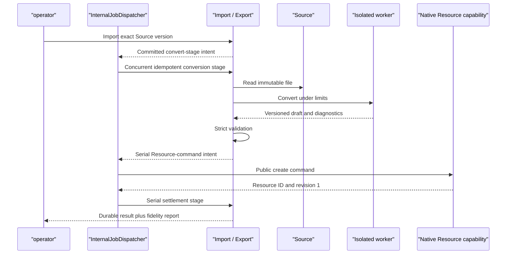

# Capability — Icarus Import & Export Runtime Model

> Mirrored from [Notion](https://app.notion.com/p/3aeb6410e5028146bd57e44ed7061cd4).

## Prerequisites
### Required before implementation
- Sources exact-version and immutable blob readers.
- Media asset read/write contracts for embedded inputs and generated artifacts.
- Document, Slides, and Spreadsheet immutable snapshot readers and public create-command contracts.
- Concurrent translation Jobs, serial destination-capability admission, a bounded file workspace, and an isolated subprocess runner.
- Database, IDs, clock, digest, logger, and injected actor attribution.
### Downstream integrations
- Knowledge may ingest successfully imported Resources through the ordinary owning-capability contracts.
- Agents may propose assisted repair, but deterministic translation and settlement do not depend on Agents.
### Construction boundary
`1-init` injects a store already bound from top-level configuration, actor attribution, Source and Media ports, Resource ports, and the worker runner. Endpoints, Jobs, domain values, and tables use translation, Source, Media, and native Resource identities. `4-job-wiring` owns every transition between concurrent conversion and serial admission.
## Purpose
Import/Export is the translation capability between immutable Source versions, native Resource snapshots, and external file formats. It uses isolated, resource-limited format workers and versioned JSON contracts, then calls Sources, Media, and native Resource capabilities through public ports. Workers are isolated subprocesses controlled by the backend.
## Bottom line
Import and export are deliberately asymmetric:
- **Import:** exact uploaded Source version → isolated parser → validated Icarus draft → native Resource create command.
- **Export:** exact native Resource revision → immutable export snapshot → isolated renderer → downloadable artifact plus fidelity diagnostics.
Import creates new native Resources through validated semantic drafts. Export targets high fidelity from exact native Resource revisions. Unsupported features are dropped or materialized with explicit diagnostics, and canonical Icarus models contain typed semantic state.
General uploaded files are Sources. Document, Slides, and Spreadsheet are native Resources. Import/Export translates between these distinct authorities.
## Runtime placement
The capability runs in the existing backend and bounded concurrent queue. Format libraries execute in isolated subprocesses with CPU, memory, time, file-count, and output-size limits.
```plain text
apps/backend/src/
  3-capabilities/
    import-export/
      domain/
        translation.ts
        diagnostics.ts
        workerContracts.ts
        events.ts
      application/
        importService.ts
        exportService.ts
        workerRunner.ts
        artifactService.ts
      adapters/
        docx/
        pptx/
        xlsx/
        pdf/
      ports/
        sourceReader.ts
        resourceReaders.ts
        resourceCommandContracts.ts
        repository.ts
      persistence/
        migrations.ts
        sqliteTranslationRepository.ts
      projections/
        statusProjection.ts
        fidelitySummary.ts
      index.ts
  4-job-wiring/
    internal/
      InternalJobDispatcher.ts
    import-export/
      registerImportExportEndpointMappings.ts
      createImportJobs.ts
      createExportJobs.ts

apps/backend/workers/import-export/
  office-ts/                         DOCX import/export, PPTX export
  office-python/                     PPTX import, XLSX export, PDF
  office-go/                         XLSX import
  schemas/                           versioned JSON/NDJSON contracts
```
The worker directories are deployment artifacts owned by this capability. The parent process supplies bounded input files and reads bounded output files through versioned DTOs. Multi-stage orchestration belongs to `4-job-wiring/internal/InternalJobDispatcher`; Import/Export returns typed stage intents.
## Format adapter decisions
<table fit-page-width="true" header-row="true">
<tr>
<td>Translation path</td>
<td>Worker</td>
<td>Core contract</td>
</tr>
<tr>
<td>DOCX → Document</td>
<td>TypeScript: Mammoth + parse5</td>
<td>Semantic content first; sanitize an allowlisted AST</td>
</tr>
<tr>
<td>Document → DOCX</td>
<td>TypeScript: `docx`</td>
<td>Editable Word structure and explicit breaks; Word owns repagination</td>
</tr>
<tr>
<td>PPTX → Slides</td>
<td>Python: python-pptx</td>
<td>Static editable objects, notes, sections, and integer EMU geometry</td>
</tr>
<tr>
<td>Slides → PPTX</td>
<td>TypeScript: PptxGenJS</td>
<td>Fixed-canvas geometry, notes, sections, objects, and charts</td>
</tr>
<tr>
<td>XLSX → Spreadsheet</td>
<td>Go: Excelize</td>
<td>Each visible worksheet creates one Spreadsheet from sparse chunks</td>
</tr>
<tr>
<td>Spreadsheet → XLSX</td>
<td>Python: XlsxWriter</td>
<td>One visible worksheet with formulas and accepted cached results</td>
</tr>
<tr>
<td>Native Resource → PDF</td>
<td>Python: WeasyPrint-based family renderers</td>
<td>Exact revision and static presentation from family-owned layout input</td>
</tr>
</table>
## Authority and integration boundaries
Import / Export owns:
- translation request, state, exact input/output references, options, and request digest;
- worker invocation, schema version, diagnostics, fidelity report, and execution events;
- generated artifact metadata and download readiness;
- format adapter registry and versioned worker DTOs.
Integrated authority:
- Sources owns uploaded binary and captured website Source identity, versions, and immutable blob references.
- Document, Slides, and Spreadsheet own native Resource identity, lifecycle, validation, revision, and ChangeSets.
- Connectors own external synchronization. Knowledge owns ingestion and lattice projection.
- Agents and Platform Intelligence own assisted reasoning; Research owns web retrieval.
## Core data model
```typescript
export type TranslationDirection = "import" | "export";
export type TranslationFormat = "docx" | "pptx" | "xlsx" | "pdf";
export type TranslationState =
  | "accepted"
  | "validating"
  | "converting"
  | "committing"
  | "succeeded"
  | "partially_succeeded"
  | "failed"
  | "canceled";

export interface Translation {
  id: string;
  direction: TranslationDirection;
  format: TranslationFormat;
  source: {
    kind: "source" | "document" | "slides" | "spreadsheet";
    id: string;
    revision: string;
    digest: string;
  };
  options: Record<string, unknown>;
  state: TranslationState;
  results: Array<{ kind: string; id: string; revision: string; sourceMember?: string }>;
  createdAt: string;
  updatedAt: string;
}

export interface WorkerRequest<TOptions = Record<string, unknown>> {
  contractVersion: string;
  translationId: string;
  inputPath: string;
  inputDigest: string;
  outputDirectory: string;
  limits: WorkerLimits;
  options: TOptions;
}

export interface WorkerLimits {
  timeoutMs: number;
  maxMemoryBytes: number;
  maxInputBytes: number;
  maxOutputBytes: number;
  maxFiles: number;
}

export interface WorkerArtifact {
  role: "primary" | "preview" | "supporting";
  path: string;
  mimeType: string;
  digest: string;
  byteSize: number;
}

export interface TranslationDiagnostic {
  severity: "info" | "warning" | "error";
  code: string;
  location?: Record<string, unknown>;
  message: string;
}

export interface WorkerResult<TDraft> {
  contractVersion: string;
  translationId: string;
  outputDigest: string;
  draft?: TDraft;
  artifacts: WorkerArtifact[];
  diagnostics: TranslationDiagnostic[];
}
```
## Operations and job classification
<table fit-page-width="true" header-row="true">
<tr>
<td>Request type or stage</td>
<td>Queue</td>
<td>Response</td>
</tr>
<tr>
<td>`translations.import`, `translations.export`</td>
<td>Serial</td>
<td>Deferred `202` with translation ID</td>
</tr>
<tr>
<td>`translation.worker.convert`</td>
<td>Concurrent</td>
<td>Internal stage result</td>
</tr>
<tr>
<td>Destination Resource create command</td>
<td>Owning Resource serial job</td>
<td>Internal result</td>
</tr>
<tr>
<td>`translation.settle`</td>
<td>Serial</td>
<td>Internal settlement</td>
</tr>
<tr>
<td>`translations.get`, `diagnostics.list`, `artifacts.get`</td>
<td>Concurrent</td>
<td>Inline</td>
</tr>
</table>
Each Job has one immutable queue assignment. Request, worker execution, Resource commit, and settlement are explicit stages connected by the durable translation ID.
The serial acceptance stage persists the translation and an idempotent `convert` stage receipt, then returns an `InternalStageIntent`. After commit, `InternalJobDispatcher` enqueues the concurrent conversion. Conversion returns a typed Resource-command or artifact-settlement intent; wiring enqueues that later stage. Every stage is keyed by `(translationId, stageKey)` and request digest. Repetition returns its recorded result; a different digest is `idempotency_mismatch`. Job wiring owns Scheduler invocation and follow-on dispatch.
## Revision and event model
A translation request is immutable after creation. Its lifecycle is an append-only state machine:
```plain text
accepted → validating → converting → committing → succeeded
                                          ↘ partially_succeeded
               ↘ failed
               ↘ canceled
```
Translation requests are immutable operational records rather than editable content, so lifecycle changes append events rather than ChangeSets. Retries create a new attempt under the same request or a new request when options or input change. A repeated `clientRequestId` and digest returns the original translation.
Each imported Resource creation records ordinary Resource revision 1 and provenance back to the exact Source version and translation. Export pins one exact Resource revision. Events include `TranslationAccepted`, `WorkerCompleted`, `ResourceImported`, `ArtifactExported`, and `TranslationSettled`.
## Persistence model
The following is the complete canonical SQLite schema. Source, Media, and native Resource IDs are typed cross-capability addresses; SQLite foreign keys enforce only translation-owned relationships.
```sql
PRAGMA foreign_keys = ON;

CREATE TABLE translations (
  id TEXT PRIMARY KEY,
  client_request_id TEXT NOT NULL UNIQUE,
  request_digest TEXT NOT NULL,
  direction TEXT NOT NULL CHECK (direction IN ('import', 'export')),
  format TEXT NOT NULL CHECK (format IN ('docx', 'pptx', 'xlsx', 'pdf')),
  source_kind TEXT NOT NULL CHECK (source_kind IN ('source', 'document', 'slides', 'spreadsheet')),
  source_id TEXT NOT NULL,
  source_revision TEXT NOT NULL,
  source_digest TEXT NOT NULL,
  options_json TEXT NOT NULL CHECK (json_valid(options_json)),
  state TEXT NOT NULL CHECK (state IN (
    'accepted', 'validating', 'converting', 'committing',
    'succeeded', 'partially_succeeded', 'failed', 'canceled'
  )),
  active_attempt INTEGER NOT NULL DEFAULT 0 CHECK (active_attempt >= 0),
  failure_code TEXT,
  actor_id TEXT NOT NULL,
  created_at TEXT NOT NULL,
  updated_at TEXT NOT NULL,
  settled_at TEXT,
  CHECK (
    (direction = 'import' AND format IN ('docx', 'pptx', 'xlsx') AND source_kind = 'source') OR
    (direction = 'export' AND source_kind = 'document' AND format IN ('docx', 'pdf')) OR
    (direction = 'export' AND source_kind = 'slides' AND format IN ('pptx', 'pdf')) OR
    (direction = 'export' AND source_kind = 'spreadsheet' AND format IN ('xlsx', 'pdf'))
  ),
  CHECK (
    (state IN ('succeeded', 'partially_succeeded', 'failed', 'canceled') AND settled_at IS NOT NULL) OR
    (state NOT IN ('succeeded', 'partially_succeeded', 'failed', 'canceled'))
  )
);

CREATE TABLE translation_attempts (
  translation_id TEXT NOT NULL REFERENCES translations(id) ON DELETE CASCADE,
  attempt INTEGER NOT NULL CHECK (attempt >= 1),
  worker_kind TEXT NOT NULL,
  worker_version TEXT NOT NULL,
  contract_version TEXT NOT NULL,
  state TEXT NOT NULL CHECK (state IN ('queued', 'running', 'succeeded', 'failed', 'canceled')),
  input_digest TEXT NOT NULL,
  output_digest TEXT,
  failure_code TEXT,
  created_at TEXT NOT NULL,
  started_at TEXT,
  settled_at TEXT,
  PRIMARY KEY (translation_id, attempt),
  CHECK (
    (state IN ('succeeded', 'failed', 'canceled') AND settled_at IS NOT NULL) OR
    (state NOT IN ('succeeded', 'failed', 'canceled'))
  )
);

CREATE TABLE translation_diagnostics (
  id TEXT PRIMARY KEY,
  translation_id TEXT NOT NULL,
  attempt INTEGER NOT NULL,
  ordinal INTEGER NOT NULL CHECK (ordinal >= 1),
  severity TEXT NOT NULL CHECK (severity IN ('info', 'warning', 'error')),
  code TEXT NOT NULL,
  disposition TEXT CHECK (
    disposition IS NULL OR disposition IN ('supported', 'materialized', 'dropped')
  ),
  location_json TEXT CHECK (location_json IS NULL OR json_valid(location_json)),
  message TEXT NOT NULL,
  created_at TEXT NOT NULL,
  UNIQUE (translation_id, attempt, ordinal),
  FOREIGN KEY (translation_id, attempt)
    REFERENCES translation_attempts(translation_id, attempt)
    ON DELETE CASCADE
);

CREATE TABLE translation_artifacts (
  id TEXT PRIMARY KEY,
  translation_id TEXT NOT NULL,
  attempt INTEGER NOT NULL,
  role TEXT NOT NULL CHECK (role IN ('primary', 'preview', 'supporting')),
  filename TEXT NOT NULL CHECK (length(trim(filename)) > 0),
  mime_type TEXT NOT NULL,
  media_id TEXT,
  digest TEXT NOT NULL,
  byte_size INTEGER NOT NULL CHECK (byte_size >= 0),
  state TEXT NOT NULL CHECK (state IN ('staged', 'ready', 'deleted')),
  created_at TEXT NOT NULL,
  ready_at TEXT,
  FOREIGN KEY (translation_id, attempt)
    REFERENCES translation_attempts(translation_id, attempt)
    ON DELETE CASCADE,
  CHECK (
    (state = 'ready' AND media_id IS NOT NULL AND ready_at IS NOT NULL) OR
    (state != 'ready')
  )
);

CREATE TABLE translation_results (
  id TEXT PRIMARY KEY,
  translation_id TEXT NOT NULL REFERENCES translations(id) ON DELETE CASCADE,
  ordinal INTEGER NOT NULL CHECK (ordinal >= 1),
  result_kind TEXT NOT NULL CHECK (result_kind IN ('document', 'slides', 'spreadsheet')),
  result_id TEXT NOT NULL,
  result_revision TEXT NOT NULL,
  source_member TEXT,
  state TEXT NOT NULL CHECK (state IN ('committed', 'failed')),
  diagnostic_code TEXT,
  created_at TEXT NOT NULL,
  UNIQUE (translation_id, ordinal),
  UNIQUE (translation_id, result_kind, result_id),
  CHECK (
    (state = 'committed' AND diagnostic_code IS NULL) OR
    (state = 'failed' AND diagnostic_code IS NOT NULL)
  )
);

CREATE TABLE translation_events (
  id TEXT PRIMARY KEY,
  translation_id TEXT NOT NULL REFERENCES translations(id) ON DELETE CASCADE,
  seq INTEGER NOT NULL CHECK (seq >= 1),
  kind TEXT NOT NULL,
  payload_json TEXT NOT NULL CHECK (json_valid(payload_json)),
  created_at TEXT NOT NULL,
  UNIQUE (translation_id, seq)
);

CREATE TABLE translation_stage_receipts (
  translation_id TEXT NOT NULL REFERENCES translations(id) ON DELETE CASCADE,
  stage_key TEXT NOT NULL,
  request_digest TEXT NOT NULL,
  state TEXT NOT NULL CHECK (state IN ('pending', 'running', 'succeeded', 'failed')),
  result_json TEXT CHECK (result_json IS NULL OR json_valid(result_json)),
  created_at TEXT NOT NULL,
  updated_at TEXT NOT NULL,
  PRIMARY KEY (translation_id, stage_key)
);

CREATE INDEX translations_state_updated
  ON translations (state, updated_at DESC);
CREATE INDEX translations_source
  ON translations (source_kind, source_id, source_revision);
CREATE INDEX translation_attempts_state
  ON translation_attempts (state, created_at);
CREATE INDEX diagnostics_translation_severity
  ON translation_diagnostics (translation_id, severity, ordinal);
CREATE INDEX artifacts_translation_role
  ON translation_artifacts (translation_id, role, created_at);
CREATE INDEX artifacts_media
  ON translation_artifacts (media_id);
CREATE INDEX translation_results_target
  ON translation_results (result_kind, result_id);
CREATE INDEX translation_results_translation
  ON translation_results (translation_id, ordinal);
CREATE INDEX translation_events_tail
  ON translation_events (translation_id, seq DESC);
CREATE INDEX translation_stages_pending
  ON translation_stage_receipts (state, updated_at)
  WHERE state IN ('pending', 'running');
```
Acceptance inserts `translations` and its first pending stage receipt in one serial transaction. Lifecycle settlement uses conditional updates from the expected current state, and every worker or destination stage is replayed through its `(translation_id, stage_key)` receipt and request digest. Attempts, diagnostics, artifacts, results, and events are append-only. `translation_results` represents every committed native Resource, so a multi-worksheet XLSX may produce several independently addressed Spreadsheets and an explicit partial outcome. Artifact bytes are committed through Media before `translation_artifacts.state` becomes `ready`.
## Named rebuildable projections
- `translation_status`: current progress, attempt, warning/error counts, result, and timestamps derived from translations, attempts, events, and diagnostics.
- `translation_fidelity_summary`: stable supported/materialized/dropped feature counts grouped by family and location.
- `export_artifact_catalog`: ready output artifacts with safe filename and MIME projection.
These are rebuildable read models, distinct from SQL indexes. Artifact bytes and canonical Resource and Source records remain authoritative.
## Dependencies and ports
Required:
- Source exact-version and blob reader.
- Document, Slides, and Spreadsheet immutable export snapshot readers.
- corresponding public create command/result contracts for imports; wiring owns invocation.
- Media asset reader/writer, bounded file workspace, subprocess runner, IDs, clock, digest, database, logger.
Provided:
- import/export request commands;
- status, diagnostic, and artifact readers;
- translation provenance reader.
Workers receive versioned files and DTOs through the bounded worker runner. The parent process owns database, provider, retrieval, and capability interactions.
## Intelligence and web use
The canonical conversion path is deterministic. Assisted repair is an Agent workflow that produces a reviewed Resource command with explicit diagnostics and provenance.
## Principal import flow

## Invariants
- Every translation pins one exact Source or Resource revision.
- Workers execute with bounded filesystem and subprocess authority.
- Parent process strictly validates every worker output.
- Each imported Resource commits atomically.
- XLSX may partially succeed across independent visible worksheets, but each created Spreadsheet is atomic.
- Export serializes the exact semantic Resource snapshot selected by the family export port.
- Unsupported features produce explicit fidelity diagnostics.
- A retry returns the existing native Resource results or artifact results.
- Every stage is idempotent by translation ID, stage key, and request digest.
- Job wiring owns Scheduler invocation and each stage commits before follow-on dispatch.
## Conformance scenarios
1. Translate Document ↔ DOCX and Document → PDF through the shared translation state machine.
2. Recover requests, attempts, diagnostics, artifacts, stage receipts, and provenance from canonical records.
3. Execute isolated workers through subprocesses and the bounded concurrent pool.
4. Translate PPTX and XLSX through the same versioned worker contracts.
5. Recover accepted and converting translations after process restart.
## Acceptance criteria
- [ ] Import creates native state only through the destination capability.
- [ ] Export reads one immutable revision.
- [ ] More conversions than concurrent slots wait in FIFO backlog.
- [ ] Hostile or oversized input fails while canonical Resource state remains atomic.
- [ ] Duplicate requests return the original result.
- [ ] Replaying conversion, destination-command, or settlement stages returns recorded effects.
- [ ] Fidelity diagnostics identify dropped/materialized features.
- [ ] Status and fidelity projections rebuild from canonical translation records.
- [ ] Worker sandboxing confines workers to declared files, limits, and versioned DTOs.
## References
- [Operation Codex — File Translation, Import, and Export](https://app.notion.com/p/394b6410e50281b3bb8bc8dd2d22ae5e)
- [Import — DOCX to Document](https://app.notion.com/p/3acb6410e50281038192e08fc89b605a)
- [Export — Document to DOCX](https://app.notion.com/p/3acb6410e5028134aedfe63676d5418c)
- [Export — Document to PDF](https://app.notion.com/p/3acb6410e502817fbde1f33e76f61b82)
- [Import — PPTX to Slides](https://app.notion.com/p/3acb6410e5028108b8bdc90ce4eeec9c)
- [Export — Slides to PPTX](https://app.notion.com/p/3acb6410e5028156bee8c6cca9f2ab87)
- [Export — Slides to PDF](https://app.notion.com/p/3acb6410e50281419ce6ed5fd51edf09)
- [Import — XLSX to Spreadsheet](https://app.notion.com/p/3acb6410e5028182b958fcd202736a6c)
- [Export — Spreadsheet to XLSX](https://app.notion.com/p/3acb6410e50281bf9ebed3037d6cb114)
- [Export — Spreadsheet to PDF](https://app.notion.com/p/3acb6410e50281ffb153c8565943f650)
