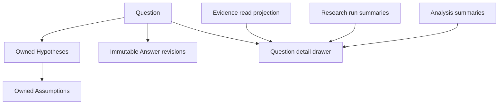

# Capability — Icarus Questions, Hypotheses & Answers Runtime Model

> Mirrored from [Notion](https://app.notion.com/p/3aeb6410e50281e8abb7ec91d9c30763).

## Summary / Concept
Questions is build position **Collaboration 4 of 4**. It follows Activity, Presence, and Comments, composes the already-defined Research, Evidence, and Analysis readers, and plugs into the existing Project Overview through `ProjectQuestionReader`. It supplies stable inquiry snapshots to the Agentic group.
### Prerequisites and build position
#### Required before implementation
- SQLite, Logger, command receipts, and the shared Base/ChangeSet history pattern.
#### Consumed when available
- Research runs, Evidence summaries, Analysis results, Context, and Knowledge enrich the Question drawer and grounded Answer refresh through narrow read ports.
#### Provides downstream
- Stable Question, Hypothesis, Assumption, and Answer snapshots for Research, Analysis, Project Overview, Agents, and Automation.
#### Construction boundary
The capability is constructed with a store already bound to the configured runtime scope. Domain values, endpoint payloads, jobs, and capability-owned tables use resource identities; scope routing remains in initialization. Accepted change records receive attribution from the initialized runtime.
Questions is the canonical inquiry capability. A Question aggregate owns its Hypotheses, the Assumptions under each Hypothesis, and immutable Answer revisions. Research owns investigation runs and candidates; Evidence owns source-grounded assertions and citations.
### Purpose and boundary
Questions preserves what the project is trying to learn and how the current answer developed over time.
It owns:
- Question identity, wording, description, status, priority, tags, and revision;
- Hypotheses contained by exactly one Question;
- Assumptions contained by exactly one Hypothesis;
- immutable Answer revisions and the Question's current-answer pointer;
- Question change sets, inverses, and idempotent submissions.
Research plans and runs, Sources, Evidence bodies and citations, Knowledge projections, Analyses, charts, and authored Resources retain their capability owners. Questions assembles a read projection from narrow Evidence, Research, and Analysis ports for the Overview drawer while keeping the canonical Question aggregate focused.
A Question Answer or conclusion becomes Knowledge-eligible through admission as canonical Evidence. Knowledge otherwise receives Source Versions, admitted Evidence, and literal Media OCR.
### Repository placement
```plain text
apps/backend/src/3-capabilities/questions/
  domain/
    model.ts
    operations.ts
    reducer.ts
  application/
    service.ts
    detailProjection.ts
  ports/
    repository.ts
    detailReaders.ts
  persistence/
    migrations/
      001-questions.ts
    sqliteQuestionsRepository.ts
  index.ts

apps/backend/src/4-job-wiring/questions/
  registerQuestionEndpointMappings.ts
  questionJobFactories.ts
```
Questions is composed into the backend. The repository interface is a Questions port; Questions owns its migrations and `SqliteQuestionsRepository`. `1-init` instantiates that adapter with the Platform Database and injects it. SQLite transactions cover a single Question aggregate per mutation.
## Types & Interfaces
### Aggregate, DTO, and operation types
Question, Hypothesis, and Assumption current rows form one aggregate. Every child mutation advances the parent Question revision and appends one Question change set.
```typescript
type QuestionStatus = "open" | "investigating" | "answered" | "archived";
type HypothesisStatus =
  | "proposed"
  | "testing"
  | "supported"
  | "weakened"
  | "rejected";

interface Hypothesis {
  hypothesisId: string;
  statement: string;
  status: HypothesisStatus;
  confidence: number | null;
  ordinal: number;
  assumptions: Assumption[];
}

interface QuestionAggregate {
  questionId: string;
  revision: number;
  text: string;
  description: string;
  status: QuestionStatus;
  priority: number;
  tags: string[];
  currentAnswerId: string | null;
  hypotheses: Hypothesis[];
}

interface Assumption {
  assumptionId: string;
  statement: string;
  status: "untested" | "testing" | "held" | "failed";
  testMethod: string;
  ordinal: number;
}

type HypothesisPatch = Partial<
  Pick<Hypothesis, "statement" | "status" | "confidence" | "ordinal">
>;

type AssumptionPatch = Partial<
  Pick<Assumption, "statement" | "status" | "testMethod" | "ordinal">
>;

interface AnswerBasisSnapshot {
  evidence: readonly { evidenceId: string; revision: number }[];
  researchRuns: readonly { runId: string; revision: number }[];
  analyses: readonly { analysisId: string; revision: number }[];
}

interface QuestionAnswer {
  answerId: string;
  questionId: string;
  answerRevision: number;
  body: string;
  confidence: number | null;
  caveats: readonly string[];
  basisSnapshot: AnswerBasisSnapshot;
  authorId: string;
  createdAt: string;
}

interface EvidenceSummary {
  evidenceId: string;
  revision: number;
  statement: string;
  reviewState: "proposed" | "admitted" | "rejected" | "deprecated";
  relationships: readonly string[];
}

interface ResearchRunSummary {
  runId: string;
  mode: "question" | "hypothesis" | "discovery";
  status: string;
  updatedAt: string;
}

interface AnalysisSummary {
  analysisId: string;
  revision: number;
  title: string;
  updatedAt: string;
}

type QuestionOperation =
  | { kind: "set_text"; text: string }
  | { kind: "set_description"; description: string }
  | { kind: "set_status"; status: QuestionStatus }
  | { kind: "set_priority"; priority: number }
  | { kind: "set_tags"; tags: readonly string[] }
  | { kind: "add_hypothesis"; hypothesis: Hypothesis }
  | { kind: "revise_hypothesis"; hypothesisId: string; patch: HypothesisPatch }
  | { kind: "remove_hypothesis"; hypothesisId: string }
  | { kind: "add_assumption"; hypothesisId: string; assumption: Assumption }
  | {
      kind: "revise_assumption";
      hypothesisId: string;
      assumptionId: string;
      patch: AssumptionPatch;
    }
  | { kind: "remove_assumption"; hypothesisId: string; assumptionId: string }
  | { kind: "set_current_answer"; answerId: string | null };

interface PublishAnswerRequest {
  questionId: string;
  expectedRevision: number;
  submissionId: string;
  answer: {
    body: string;
    confidence: number | null;
    caveats: readonly string[];
    basisSnapshot: AnswerBasisSnapshot;
  };
}

interface QuestionDetailProjection {
  question: QuestionAggregate;
  currentAnswer: QuestionAnswer | null;
  answerHistory: readonly QuestionAnswer[];
  evidence: readonly EvidenceSummary[];
  researchRuns: readonly ResearchRunSummary[];
  analyses: readonly AnalysisSummary[];
}
```
`questions.revise` carries `expectedRevision` and `submissionId`. The pure reducer validates the complete aggregate and emits an exact inverse. Publishing an answer inserts a new immutable `question_answers` row and advances the current-answer pointer in the aggregate. Undoing publication restores the prior pointer while retaining every Answer revision.
### Dependencies and narrow ports
```typescript
interface QuestionEvidenceReader {
  listForTargets(targets: InquiryTargetRef[]): Promise<EvidenceSummary[]>;
}

interface QuestionResearchReader {
  listRuns(questionId: string): Promise<ResearchRunSummary[]>;
}

interface QuestionAnalysisReader {
  listAnalyses(questionId: string): Promise<AnalysisSummary[]>;
}
```
Questions uses the Platform Database, clock, and ID generator. Research reads version-pinned inquiry state through `QuestionReader`; canonical mutations enter through Questions commands.
## Runtime Objects
### Question aggregate and revision lifecycle
A Question is the revision boundary. Hypotheses and Assumptions are contained runtime objects; every child change advances the owning Question revision. Answer rows are immutable runtime snapshots, and the aggregate stores only the current Answer pointer.
`questions.get-detail` builds the named **Question Detail Projection**. It combines:
- canonical Question/Hypothesis/Assumption/Answer state;
- Evidence summaries linked to the Question, its Hypotheses or Assumptions, or the current Answer;
- Research run summaries;
- related Analysis summaries.
The projection is rebuildable from canonical Questions state and its narrow read ports.
### Key flow

## Change Operations
Question mutations reduce a closed operation batch against the complete Question → Hypothesis → Assumption aggregate. Publishing an Answer is a specialized mutation because it appends immutable Answer history and advances the current pointer atomically.
<table fit-page-width="true" header-row="true">
<tr>
<td>Operation</td>
<td>Effect</td>
</tr>
<tr>
<td>`set_text` / `set_description` / `set_status` / `set_priority` / `set_tags`</td>
<td>Update Question metadata.</td>
</tr>
<tr>
<td>`add_hypothesis` / `revise_hypothesis` / `remove_hypothesis`</td>
<td>Change a Question-owned Hypothesis.</td>
</tr>
<tr>
<td>`add_assumption` / `revise_assumption` / `remove_assumption`</td>
<td>Change an Assumption through its owning Hypothesis and Question.</td>
</tr>
<tr>
<td>`set_current_answer`</td>
<td>Moves the Question pointer to an existing immutable Answer or clears it.</td>
</tr>
<tr>
<td>`publish_answer`</td>
<td>Creates an immutable Answer revision and advances the pointer in the same transaction.</td>
</tr>
<tr>
<td>`archive` / `restore`</td>
<td>Change lifecycle without deleting history.</td>
</tr>
<tr>
<td>`undo` / `redo`</td>
<td>Append a compensating Question ChangeSet.</td>
</tr>
</table>
## Endpoints
<table fit-page-width="true" header-row="true">
<tr>
<td>Method and path</td>
<td>Request type</td>
<td>Result</td>
</tr>
<tr>
<td>POST /questions</td>
<td>`questions.create`</td>
<td>Question at revision 1.</td>
</tr>
<tr>
<td>GET /questions</td>
<td>`questions.list`</td>
<td>Bounded Overview summaries.</td>
</tr>
<tr>
<td>GET /questions/:questionId</td>
<td>`questions.get`</td>
<td>Canonical aggregate and Answer pointer.</td>
</tr>
<tr>
<td>GET /questions/:questionId/detail</td>
<td>`questions.get-detail`</td>
<td>Question Detail Projection.</td>
</tr>
<tr>
<td>POST /questions/:questionId/submissions</td>
<td>`questions.revise` plus child operations</td>
<td>Accepted ChangeSet or typed conflict.</td>
</tr>
<tr>
<td>POST /questions/:questionId/answers</td>
<td>`questions.publish-answer`</td>
<td>Immutable Answer and accepted ChangeSet.</td>
</tr>
<tr>
<td>POST /questions/:questionId/archive</td>
<td>`questions.archive`</td>
<td>Archived Question revision.</td>
</tr>
<tr>
<td>POST /questions/:questionId/restore</td>
<td>`questions.restore`</td>
<td>Restored Question revision.</td>
</tr>
<tr>
<td>POST /questions/:questionId/undo</td>
<td>`questions.undo`</td>
<td>Compensating ChangeSet.</td>
</tr>
<tr>
<td>POST /questions/:questionId/redo</td>
<td>`questions.redo`</td>
<td>Compensating ChangeSet.</td>
</tr>
</table>
### Operation semantics
<table fit-page-width="true" header-row="true">
<tr>
<td>Operation</td>
<td>Effect</td>
</tr>
<tr>
<td>`questions.create`</td>
<td>Creates a Question at revision 1.</td>
</tr>
<tr>
<td>`questions.get`</td>
<td>Reads canonical Question state.</td>
</tr>
<tr>
<td>`questions.get-detail`</td>
<td>Assembles the drawer projection from current Question state and narrow read ports.</td>
</tr>
<tr>
<td>`questions.list`</td>
<td>Lists/filter Questions for Overview.</td>
</tr>
<tr>
<td>`questions.revise`</td>
<td>Applies metadata operations.</td>
</tr>
<tr>
<td>`questions.add-hypothesis`</td>
<td>Adds a Hypothesis owned by the Question.</td>
</tr>
<tr>
<td>`questions.revise-hypothesis`</td>
<td>Changes statement, status, confidence, or order.</td>
</tr>
<tr>
<td>`questions.remove-hypothesis`</td>
<td>Removes it from the current head; history retains the inverse.</td>
</tr>
<tr>
<td>`questions.add-assumption` / `revise-assumption` / `remove-assumption`</td>
<td>Mutates assumptions inside a Hypothesis.</td>
</tr>
<tr>
<td>`questions.publish-answer`</td>
<td>Appends an immutable Answer revision and advances `currentAnswerId`.</td>
</tr>
<tr>
<td>`questions.set-current-answer`</td>
<td>Moves the pointer to an existing Answer revision, including undo.</td>
</tr>
<tr>
<td>`questions.archive` / `restore`</td>
<td>Changes lifecycle while retaining history.</td>
</tr>
<tr>
<td>`questions.undo` / `redo`</td>
<td>Applies a compensating Question change set.</td>
</tr>
</table>
Question status begins with `open | investigating | answered | archived`. Hypothesis status begins with `proposed | testing | supported | weakened | rejected`. Assumption status begins with `untested | testing | held | failed`.
## Jobs
### Request-to-job mapping
<table fit-page-width="true" header-row="true">
<tr>
<td>Request</td>
<td>Queue</td>
<td>Response</td>
</tr>
<tr>
<td>create, revise, hypothesis/assumption mutations, publish answer, archive/restore, undo/redo</td>
<td>`serial`</td>
<td>`inline`</td>
</tr>
<tr>
<td>get, list</td>
<td>`concurrent`</td>
<td>`inline`</td>
</tr>
<tr>
<td>get-detail</td>
<td>`concurrent`</td>
<td>`inline`</td>
</tr>
</table>
Research produces an Answer candidate. Canonical acceptance occurs through a serial `questions.publish-answer` request with its own expected revision.
## SQL Tables
### Canonical schema
The Questions migration runs on a connection with `PRAGMA foreign_keys = ON`. The store is already configuration-bound, so resource identity begins at `question_id`. Current aggregate state is normalized; JSON is limited to ordered scalar collections and immutable version-pinned basis snapshots.
```sql
CREATE TABLE questions (
  question_id TEXT PRIMARY KEY
    CHECK (length(question_id) > 0),
  revision INTEGER NOT NULL
    CHECK (revision >= 1),
  text TEXT NOT NULL
    CHECK (length(trim(text)) > 0),
  description TEXT NOT NULL DEFAULT '',
  status TEXT NOT NULL
    CHECK (status IN ('open', 'investigating', 'answered', 'archived')),
  priority INTEGER NOT NULL
    CHECK (priority >= 0),
  tags_json TEXT NOT NULL DEFAULT '[]'
    CHECK (json_valid(tags_json) AND json_type(tags_json) = 'array'),
  current_answer_id TEXT,
  created_at TEXT NOT NULL,
  updated_at TEXT NOT NULL,
  UNIQUE (question_id, current_answer_id),
  FOREIGN KEY (question_id, current_answer_id)
    REFERENCES question_answers(question_id, answer_id)
    ON UPDATE CASCADE ON DELETE RESTRICT
    DEFERRABLE INITIALLY DEFERRED
);

CREATE TABLE question_hypotheses (
  question_id TEXT NOT NULL,
  hypothesis_id TEXT NOT NULL
    CHECK (length(hypothesis_id) > 0),
  statement TEXT NOT NULL
    CHECK (length(trim(statement)) > 0),
  status TEXT NOT NULL
    CHECK (status IN ('proposed', 'testing', 'supported', 'weakened', 'rejected')),
  confidence REAL
    CHECK (confidence IS NULL OR (confidence >= 0.0 AND confidence <= 1.0)),
  ordinal INTEGER NOT NULL
    CHECK (ordinal >= 0),
  created_at TEXT NOT NULL,
  updated_at TEXT NOT NULL,
  PRIMARY KEY (question_id, hypothesis_id),
  UNIQUE (question_id, ordinal),
  FOREIGN KEY (question_id)
    REFERENCES questions(question_id)
    ON UPDATE CASCADE ON DELETE CASCADE
);

CREATE TABLE hypothesis_assumptions (
  question_id TEXT NOT NULL,
  hypothesis_id TEXT NOT NULL,
  assumption_id TEXT NOT NULL
    CHECK (length(assumption_id) > 0),
  statement TEXT NOT NULL
    CHECK (length(trim(statement)) > 0),
  status TEXT NOT NULL
    CHECK (status IN ('untested', 'testing', 'held', 'failed')),
  test_method TEXT NOT NULL DEFAULT '',
  ordinal INTEGER NOT NULL
    CHECK (ordinal >= 0),
  created_at TEXT NOT NULL,
  updated_at TEXT NOT NULL,
  PRIMARY KEY (question_id, hypothesis_id, assumption_id),
  UNIQUE (question_id, hypothesis_id, ordinal),
  FOREIGN KEY (question_id, hypothesis_id)
    REFERENCES question_hypotheses(question_id, hypothesis_id)
    ON UPDATE CASCADE ON DELETE CASCADE
);

CREATE TABLE question_answers (
  answer_id TEXT PRIMARY KEY
    CHECK (length(answer_id) > 0),
  question_id TEXT NOT NULL,
  answer_revision INTEGER NOT NULL
    CHECK (answer_revision >= 1),
  body TEXT NOT NULL
    CHECK (length(trim(body)) > 0),
  confidence REAL
    CHECK (confidence IS NULL OR (confidence >= 0.0 AND confidence <= 1.0)),
  caveats_json TEXT NOT NULL DEFAULT '[]'
    CHECK (json_valid(caveats_json) AND json_type(caveats_json) = 'array'),
  basis_snapshot_json TEXT NOT NULL
    CHECK (json_valid(basis_snapshot_json) AND json_type(basis_snapshot_json) = 'object'),
  published_change_set_id TEXT NOT NULL,
  created_at TEXT NOT NULL,
  UNIQUE (question_id, answer_id),
  UNIQUE (question_id, answer_revision),
  UNIQUE (published_change_set_id),
  FOREIGN KEY (question_id)
    REFERENCES questions(question_id)
    ON UPDATE CASCADE ON DELETE CASCADE,
  FOREIGN KEY (published_change_set_id)
    REFERENCES question_change_sets(change_set_id)
    ON UPDATE CASCADE ON DELETE RESTRICT
    DEFERRABLE INITIALLY DEFERRED
);

CREATE TABLE question_change_sets (
  change_set_id TEXT PRIMARY KEY
    CHECK (length(change_set_id) > 0),
  question_id TEXT NOT NULL,
  from_revision INTEGER NOT NULL
    CHECK (from_revision >= 0),
  to_revision INTEGER NOT NULL
    CHECK (to_revision = from_revision + 1),
  submission_id TEXT NOT NULL
    CHECK (length(submission_id) > 0),
  request_kind TEXT NOT NULL
    CHECK (request_kind IN (
      'create', 'revise', 'add_hypothesis', 'revise_hypothesis',
      'remove_hypothesis', 'add_assumption', 'revise_assumption',
      'remove_assumption', 'publish_answer', 'set_current_answer',
      'archive', 'restore', 'undo', 'redo'
    )),
  request_hash TEXT NOT NULL
    CHECK (length(request_hash) = 64 AND request_hash NOT GLOB '*[^0-9a-f]*'),
  operations_json TEXT NOT NULL
    CHECK (json_valid(operations_json) AND json_type(operations_json) = 'array'),
  inverse_operations_json TEXT NOT NULL
    CHECK (json_valid(inverse_operations_json) AND json_type(inverse_operations_json) = 'array'),
  compensation_of_change_set_id TEXT,
  actor_id TEXT,
  committed_at TEXT NOT NULL,
  UNIQUE (question_id, to_revision),
  UNIQUE (question_id, submission_id),
  UNIQUE (question_id, change_set_id),
  FOREIGN KEY (question_id)
    REFERENCES questions(question_id)
    ON UPDATE CASCADE ON DELETE CASCADE,
  FOREIGN KEY (compensation_of_change_set_id)
    REFERENCES question_change_sets(change_set_id)
    ON UPDATE CASCADE ON DELETE RESTRICT
);

CREATE TABLE question_command_receipts (
  submission_id TEXT PRIMARY KEY
    CHECK (length(submission_id) > 0),
  question_id TEXT,
  request_kind TEXT NOT NULL,
  request_hash TEXT NOT NULL
    CHECK (length(request_hash) = 64 AND request_hash NOT GLOB '*[^0-9a-f]*'),
  outcome TEXT NOT NULL
    CHECK (outcome IN ('accepted', 'rejected')),
  change_set_id TEXT,
  resulting_revision INTEGER,
  response_json TEXT,
  error_json TEXT,
  received_at TEXT NOT NULL,
  completed_at TEXT NOT NULL,
  UNIQUE (question_id, change_set_id),
  CHECK (
    (outcome = 'accepted' AND question_id IS NOT NULL
      AND change_set_id IS NOT NULL AND resulting_revision IS NOT NULL
      AND response_json IS NOT NULL AND error_json IS NULL)
    OR
    (outcome = 'rejected' AND change_set_id IS NULL
      AND response_json IS NULL AND error_json IS NOT NULL)
  ),
  CHECK (response_json IS NULL OR json_valid(response_json)),
  CHECK (error_json IS NULL OR json_valid(error_json)),
  FOREIGN KEY (question_id)
    REFERENCES questions(question_id)
    ON UPDATE CASCADE ON DELETE CASCADE,
  FOREIGN KEY (question_id, change_set_id)
    REFERENCES question_change_sets(question_id, change_set_id)
    ON UPDATE CASCADE ON DELETE RESTRICT
);

CREATE INDEX questions_overview
  ON questions(status, priority DESC, updated_at DESC, question_id);

CREATE INDEX question_hypotheses_order
  ON question_hypotheses(question_id, ordinal, hypothesis_id);

CREATE INDEX question_hypotheses_status
  ON question_hypotheses(status, confidence DESC, updated_at DESC);

CREATE INDEX hypothesis_assumptions_order
  ON hypothesis_assumptions(question_id, hypothesis_id, ordinal, assumption_id);

CREATE INDEX hypothesis_assumptions_status
  ON hypothesis_assumptions(status, updated_at DESC);

CREATE INDEX question_answers_revision
  ON question_answers(question_id, answer_revision DESC);

CREATE INDEX question_change_sets_revision
  ON question_change_sets(question_id, to_revision DESC);

CREATE INDEX question_change_sets_compensation
  ON question_change_sets(question_id, compensation_of_change_set_id)
  WHERE compensation_of_change_set_id IS NOT NULL;

CREATE INDEX question_receipts_outcome
  ON question_command_receipts(outcome, completed_at DESC);
```
#### Atomic write protocol
A mutation starts `BEGIN IMMEDIATE`, loads the Question aggregate, verifies `expectedRevision`, checks the receipt key and request hash, applies the closed operation batch, and writes the complete affected head rows, immutable ChangeSet, and receipt in one commit. Creation is represented by a `0 → 1` ChangeSet. Answer publication inserts the immutable Answer, advances the composite current-answer pointer, and commits the publishing ChangeSet atomically. The Answer projection obtains `authorId` from the publishing ChangeSet's `actor_id`; attribution is not duplicated on canonical head rows. Undo and redo append compensation ChangeSets.
#### Relational guarantees
The schema contains **6 tables** and **9 explicit indexes**. Composite primary and foreign keys preserve the Question → Hypothesis → Assumption containment path. Answer revision and ordinal uniqueness are database-enforced. The deferred current-answer foreign key permits an Answer insert and pointer advance within one transaction while preventing a pointer to another Question.
## Invariants & Acceptance
### Invariants
1. Every Hypothesis belongs to exactly one Question.
2. Every Assumption belongs to one Hypothesis and repeats its Question scope.
3. Child mutations advance the owning Question revision.
4. Answer revisions are immutable and unique within a Question.
5. The current answer pointer either resolves to that Question or is null.
6. Research run history remains Research-owned and appears through the detail projection.
7. Evidence authority is represented by Evidence-owned links and versioned basis snapshots.
8. `expectedRevision` and `submissionId` govern every mutation.
9. Removing a child from the current head preserves the immutable change history needed for compensation.
### Acceptance criteria
- Creating a Hypothesis through a Question mutation advances only that Question.
- Every Hypothesis resolves through a valid owning Question.
- Publishing an Answer preserves the previous Answer and updates the head atomically.
- Undoing answer publication restores the pointer and retains every Answer revision.
- The detail projection shows linked Evidence and Research through typed read ports.
- Question and Hypothesis Research modes resolve the correct Question-owned objects; Discovery mode can propose a new Question candidate.
## References
- [Product — Icarus Complete Product Definition](../product/definition.md)
- [Architecture — Icarus Ideal Backend Runtime, Capabilities & Data Map](../runtime/backend-map.md)
- [Overview — Taurus Product Doctrine & Interview Ledger](https://app.notion.com/p/3abb6410e50281198209dbff65b8d42b)
