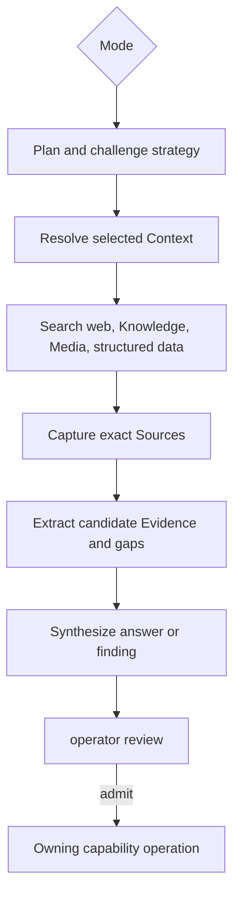

# Capability — Icarus Research Runtime Model

> Mirrored from [Notion](https://app.notion.com/p/3aeb6410e502813d8602f3cddd8dc1b8).

## Summary / Concept
Research is build position **Research 3 of 3**. It builds after Analysis and Evidence. Question, Hypothesis, and Answer integration attaches later through the inquiry port; free-form Question, Hypothesis, and Discovery modes remain complete without a canonical Question record.
### Prerequisites and build position
#### Required before implementation
- Platform Intelligence and web retrieval.
- Analysis, Evidence, Knowledge, Context-scoped retrieval, and the Source-capture seam.
#### Consumed when available
- The inquiry integration consumes Questions after that capability is composed. Free-form Question, Hypothesis, and Discovery runs remain complete without it.
#### Construction boundary
The capability is constructed with a store already bound to the configured runtime scope. Domain values, endpoint payloads, jobs, and capability-owned tables use resource identities; scope routing remains in initialization. Accepted change records receive attribution from the initialized runtime.
Research is the durable investigation runtime behind the permanent Research screen. It supports exactly three modes—Question, Hypothesis, and Discovery—and owns research attempts, plans, execution records, candidates, and synthesis.
### Purpose and boundary
Research turns an inquiry into a traceable investigation:
```plain text
frame → decompose → plan → retrieve → inspect → extract → challenge → synthesize → review
```
It owns:
- Research Runs and their version-pinned input scope;
- plans, steps, queries, retrieved result references, and run events;
- candidate Hypotheses, Assumptions, Evidence, gaps, and Answers;
- run synthesis, diagnostics, usage, and completion state.
Authority is distributed through explicit integration boundaries:
- Questions owns Questions, Hypotheses, Assumptions, and Answer revisions;
- Sources owns captured websites, uploaded files, and immutable native-Resource snapshots;
- Evidence owns admitted source-grounded assertions and citations;
- Knowledge and Media own their retrieval projections;
- Platform Intelligence and Web Retrieval provide injected model and retrieval interfaces.
Candidate admission calls the owning capability. Research records the accepted canonical object reference on the candidate.
**Knowledge admission law:** Research can consume Data and Analysis results while testing an inquiry. Knowledge accepts Source Versions, admitted Evidence, and literal Media OCR. Native editor content enters retrieval through a Sources `native_resource` Source Version; a structured or analytic result enters through a captured Source Version or admitted Evidence.
### Three modes
<table fit-page-width="true" header-row="true">
<tr>
<td>Mode</td>
<td>Input</td>
<td>Required behavior</td>
</tr>
<tr>
<td>`question`</td>
<td>Existing `questionId` or free-form question text</td>
<td>Clarify the question, propose competing Hypotheses and Assumptions, gather supporting and disconfirming material, identify gaps, and produce an Answer candidate.</td>
</tr>
<tr>
<td>`hypothesis`</td>
<td>Existing Question-owned `hypothesisId` or free-form hypothesis</td>
<td>Prefer attempts to invalidate or qualify the Hypothesis; test its Assumptions; recommend a Question to own a free-form Hypothesis.</td>
</tr>
<tr>
<td>`discovery`</td>
<td>Topic, entity, market, event, or bounded objective</td>
<td>Find and organize useful material from an open frame; propose Questions and Evidence candidates.</td>
</tr>
</table>
An existing `hypothesisId` always resolves through its owning Question. A free-form hypothesis remains a Research candidate until accepted into a Question.
### Repository placement
```plain text
apps/backend/src/3-capabilities/research/
  domain/
    model.ts
    modes.ts
  application/
    planner.ts
    orchestrator.ts
    service.ts
  ports/
    repository.ts
    inquiryReaders.ts
    retrievalPorts.ts
  persistence/
    migrations/
      001-research.ts
    sqliteResearchRepository.ts
  index.ts

apps/backend/src/4-job-wiring/research/
  registerResearchEndpointMappings.ts
  researchJobFactories.ts
  researchPorts.ts
```
Research is composed into the backend and uses the bounded concurrent pool. Research owns its repository port, migrations, and `SqliteResearchRepository`; `1-init` instantiates the adapter with the Platform Database and injects it. Run state, step attempts, candidates, and events are durable in SQLite. Polling reads the durable Run projection. Startup recovery marks an interrupted active attempt and makes explicit retry available.
## Types & Interfaces
### Core TypeScript model
```typescript
interface ResolvedContextSnapshot {
  contextIds: readonly string[];
  definitionHashes: readonly string[];
  sources: readonly { sourceVersionId: string }[];
  evidence: readonly { evidenceId: string; revision: number }[];
  resources: readonly {
    kind: "document" | "slides" | "spreadsheet";
    id: string;
    revision: number;
  }[];
  structuredInputs: readonly { kind: "table" | "variable"; id: string; revision: number }[];
}

interface ResolvedIntelligenceRoute {
  purpose: string;
  strength: "low" | "medium" | "high";
  speed: "low" | "medium" | "high";
  provider: string;
  model: string;
  effort?: string;
}

interface ResearchPlan {
  objective: string;
  questions: readonly string[];
  searchChannels: readonly ("web" | "knowledge" | "media" | "structured_data")[];
  steps: readonly {
    sequence: number;
    kind: ResearchStep["kind"];
    purpose: string;
  }[];
}

interface ResearchSynthesis {
  answer: string | null;
  findings: readonly string[];
  disconfirmingFindings: readonly string[];
  unresolvedGaps: readonly string[];
  candidateIds: readonly string[];
}

interface ResearchDiagnostic {
  code: string;
  message: string;
  retryable: boolean;
}

type ResearchMode = "question" | "hypothesis" | "discovery";
type ResearchStatus =
  | "queued"
  | "planning"
  | "retrieving"
  | "extracting"
  | "challenging"
  | "synthesizing"
  | "awaiting_review"
  | "completed"
  | "cancelled"
  | "failed"
  | "interrupted";

type ResearchSubject =
  | {
      mode: "question";
      questionId?: string;
      questionRevision?: number;
      questionText: string;
    }
  | {
      mode: "hypothesis";
      questionId?: string;
      questionRevision?: number;
      hypothesisId?: string;
      hypothesisStatement: string;
    }
  | {
      mode: "discovery";
      topic: string;
      objective: string;
    };

interface ResearchRun {
  runId: string;
  revision: number;
  mode: ResearchMode;
  subject: ResearchSubject;
  objective: string;
  contextSnapshot: ResolvedContextSnapshot;
  policyVersion: string;
  intelligenceRoutes: readonly ResolvedIntelligenceRoute[];
  status: ResearchStatus;
  plan: ResearchPlan | null;
  synthesis: ResearchSynthesis | null;
  retryOfRunId: string | null;
  cancelRequested: boolean;
  createdAt: string;
  updatedAt: string;
}

interface ResearchStep {
  stepId: string;
  runId: string;
  sequence: number;
  attempt: number;
  kind:
    | "frame"
    | "decompose"
    | "plan"
    | "retrieve"
    | "inspect"
    | "extract"
    | "challenge"
    | "synthesize";
  status: "queued" | "running" | "completed" | "failed" | "cancelled";
  input: unknown;
  output?: unknown;
  diagnostic?: ResearchDiagnostic;
}

interface QuestionCandidatePayload {
  text: string;
  description: string;
}

interface HypothesisCandidatePayload {
  statement: string;
  recommendedQuestionId?: string;
  assumptions: readonly string[];
}

interface AssumptionCandidatePayload {
  statement: string;
  hypothesisId?: string;
  proposedTest: string;
}

interface EvidenceCandidatePayload {
  statement: string;
  evidenceKind: "quotation" | "observation" | "calculation" | "inference";
  citations: readonly {
    sourceVersionId: string;
    locator: unknown;
    exactQuote?: string;
  }[];
}

interface AnswerCandidatePayload {
  questionId?: string;
  body: string;
  caveats: readonly string[];
  basisCandidateIds: readonly string[];
}

interface GapCandidatePayload {
  description: string;
  missingInputs: readonly string[];
}

type ResearchCandidate =
  | Candidate<"question", QuestionCandidatePayload>
  | Candidate<"hypothesis", HypothesisCandidatePayload>
  | Candidate<"assumption", AssumptionCandidatePayload>
  | Candidate<"evidence", EvidenceCandidatePayload>
  | Candidate<"answer", AnswerCandidatePayload>
  | Candidate<"gap", GapCandidatePayload>;

interface Candidate<K extends string, P> {
  candidateId: string;
  runId: string;
  kind: K;
  payload: P;
  confidence: number | null;
  reviewState: "unreviewed" | "accepted" | "rejected" | "deferred";
  admittedObject?: {
    kind: "question" | "hypothesis" | "assumption" | "evidence" | "answer";
    id: string;
  };
}

interface StartResearchRequest {
  subject: ResearchSubject;
  contextIds: readonly string[];
  policyVersion: string;
  submissionId: string;
}

interface ReviewResearchCandidateRequest {
  runId: string;
  candidateId: string;
  expectedRunRevision: number;
  submissionId: string;
  decision: "accepted" | "rejected" | "deferred";
  admittedObject?: Candidate<string, unknown>["admittedObject"];
}
```
At Run creation, Research resolves each required Intelligence cast and stores the resulting purpose, strength, speed, provider, model, and effort in `intelligenceRoutes`. A retry stores its own declared policy and route snapshot while retaining the prior Run for comparison.
### Dependencies and narrow ports
The core Research constructor requires Context, Knowledge, Media, Data, Source capture, web retrieval, and Intelligence ports. It accepts a complete inline inquiry brief. The Questions bridge is a downstream integration and is optional at construction:
```typescript
interface ResearchInquiryReader {
  getQuestionSnapshot(
    questionId: string,
  ): Promise<QuestionSnapshot>;

  getHypothesisSnapshot(
    hypothesisId: string,
  ): Promise<HypothesisSnapshot>;
}

interface ResearchInquiryIntegration {
  questions?: ResearchInquiryReader;
}

interface ContextResolver {
  resolve(contextIds: string[]): Promise<ResolvedContext>;
}

interface KnowledgeSearcher {
  search(request: KnowledgeSearch): Promise<KnowledgeMatches>;
}

interface MediaSearcher {
  search(request: MediaSearch): Promise<MediaMatches>;
}

interface StructuredDataReader {
  query(request: StructuredQuery): Promise<StructuredResult>;
}

interface SourceCapturePort {
  captureWebResult(
    request: WebCaptureRequest,
  ): Promise<SourceVersionRef>;
}
```
A start request with inline Question, Hypothesis, or Discovery text never requires the Questions capability. When `questionId` or `hypothesisId` is supplied, the composed Questions bridge resolves and pins the owning snapshot.
Two infrastructure interfaces live under `apps/backend/src/0-platform`:
- `web-retrieval`: web search and page retrieval;
- `intelligence`: inference/reasoning calls and provider/model routing.
They are Platform seams injected at composition time.
## Runtime Objects
### Run state and revision model
Research is a process record and uses:
- a monotonic `revision` on `research_runs`;
- an append-only `research_run_events` stream;
- compare-and-swap state transitions;
- immutable step attempts and candidate records.
Each accepted transition increments the Run revision and appends one event in the same transaction. Retrying creates a new Run linked by `retry_of_run_id`. Cancellation retains completed steps and moves the Run through a terminal transition.
### Derived projections
The **Run Timeline Projection** is rebuilt at read time from `research_run_events`, steps, queries, results, and candidates. The **Research Review Projection** groups unreviewed candidates by Run, mode, kind, and confidence. Provider result caches belong behind Platform adapters.
### Key flow

## Change Operations
Research is a durable process aggregate rather than a Base-plus-tail authored resource. Every accepted command performs a compare-and-swap transition and appends one Run event.
<table fit-page-width="true" header-row="true">
<tr>
<td>Operation</td>
<td>Effect</td>
</tr>
<tr>
<td>`start_question` / `start_hypothesis` / `start_discovery`</td>
<td>Create a Run at revision 1 with frozen inputs, route snapshot, initial event, and first attempt.</td>
</tr>
<tr>
<td>`advance_stage`</td>
<td>Moves the Run through planning, retrieval, extraction, challenge, synthesis, and review states.</td>
</tr>
<tr>
<td>`record_step_attempt`</td>
<td>Appends one immutable execution attempt for a stable planned step.</td>
</tr>
<tr>
<td>`record_query_result`</td>
<td>Persists the bounded retrieval request and version-pinned result references.</td>
</tr>
<tr>
<td>`record_candidate`</td>
<td>Appends a Question, Hypothesis, Assumption, Evidence, Answer, or gap candidate.</td>
</tr>
<tr>
<td>`review_candidate`</td>
<td>Records accepted, rejected, or deferred and the canonical object reference when accepted.</td>
</tr>
<tr>
<td>`cancel_run`</td>
<td>Requests cooperative cancellation and preserves completed work.</td>
</tr>
<tr>
<td>`mark_interrupted`</td>
<td>Closes an active attempt during recovery without rewriting its history.</td>
</tr>
<tr>
<td>`retry_run`</td>
<td>Creates a new Run linked to the prior Run with a fresh policy and Intelligence route snapshot.</td>
</tr>
</table>
## Endpoints
<table fit-page-width="true" header-row="true">
<tr>
<td>Method and path</td>
<td>Request type</td>
<td>Result</td>
</tr>
<tr>
<td>POST /research/runs/question</td>
<td>`research.start-question`</td>
<td>202 with durable Run identity.</td>
</tr>
<tr>
<td>POST /research/runs/hypothesis</td>
<td>`research.start-hypothesis`</td>
<td>202 with durable Run identity.</td>
</tr>
<tr>
<td>POST /research/runs/discovery</td>
<td>`research.start-discovery`</td>
<td>202 with durable Run identity.</td>
</tr>
<tr>
<td>GET /research/runs</td>
<td>`research.list-runs`</td>
<td>Bounded filtered Run summaries.</td>
</tr>
<tr>
<td>GET /research/runs/:runId</td>
<td>`research.get-run`</td>
<td>Run state, steps, candidates, and synthesis.</td>
</tr>
<tr>
<td>POST /research/runs/:runId/cancel</td>
<td>`research.cancel-run`</td>
<td>Cancellation request state.</td>
</tr>
<tr>
<td>POST /research/runs/:runId/retry</td>
<td>`research.retry-run`</td>
<td>202 with the new Run identity.</td>
</tr>
<tr>
<td>POST /research/runs/:runId/candidates/:candidateId/review</td>
<td>`research.review-candidate`</td>
<td>Reviewed candidate and resulting Run revision.</td>
</tr>
</table>
### Operation semantics
<table fit-page-width="true" header-row="true">
<tr>
<td>Operation</td>
<td>Effect</td>
</tr>
<tr>
<td>`research.start-question`</td>
<td>Starts Question mode from a Question snapshot or free-form question.</td>
</tr>
<tr>
<td>`research.start-hypothesis`</td>
<td>Starts Hypothesis mode from an owned Hypothesis snapshot or free-form hypothesis.</td>
</tr>
<tr>
<td>`research.start-discovery`</td>
<td>Starts Discovery mode.</td>
</tr>
<tr>
<td>`research.get-run`</td>
<td>Returns run state, steps, candidates, and synthesis.</td>
</tr>
<tr>
<td>`research.list-runs`</td>
<td>Lists runs by mode, Question, Hypothesis, or status in the configured store.</td>
</tr>
<tr>
<td>`research.cancel-run`</td>
<td>Requests cooperative cancellation.</td>
</tr>
<tr>
<td>`research.retry-run`</td>
<td>Starts a new attempt pinned to the prior input, with explicit policy/model versions.</td>
</tr>
<tr>
<td>`research.review-candidate`</td>
<td>Records `accepted`, `rejected`, or `deferred` and the canonical object created elsewhere.</td>
</tr>
</table>
Candidate admission uses separate operations such as `questions.add-hypothesis`, `questions.publish-answer`, and `evidence.admit-from-research`.
## Jobs
### Request-to-job mapping
<table fit-page-width="true" header-row="true">
<tr>
<td>Request</td>
<td>Queue</td>
<td>Response</td>
<td>Reason</td>
</tr>
<tr>
<td>start Question/Hypothesis/Discovery</td>
<td>`concurrent`</td>
<td>`deferred`</td>
<td>Retrieval and model calls occupy a bounded pool slot; overflow waits in the concurrent FIFO queue.</td>
</tr>
<tr>
<td>get/list</td>
<td>`concurrent`</td>
<td>`inline`</td>
<td>Read-only, independently executable.</td>
</tr>
<tr>
<td>cancel</td>
<td>`serial`</td>
<td>`inline`</td>
<td>Canonical run-state mutation and cancellation request.</td>
</tr>
<tr>
<td>review candidate</td>
<td>`serial`</td>
<td>`inline`</td>
<td>Small canonical state transition.</td>
</tr>
<tr>
<td>retry</td>
<td>`concurrent`</td>
<td>`deferred`</td>
<td>Creates a new run attempt linked to the prior run.</td>
</tr>
</table>
When a concurrent slot begins a start job, it creates the Run, returns `202 + runId`, and continues the orchestration through the current deferred-work contract. Queue selection remains capability-owned.
## SQL Tables
### Canonical schema
The Research migration runs on a connection with `PRAGMA foreign_keys = ON`. The store is already configuration-bound. Runs pin their complete subject, Context snapshot, policy, and resolved Intelligence routes. Stable plan steps are separated from immutable execution attempts, so interruption and retry never overwrite prior work.
```sql
CREATE TABLE research_runs (
  run_id TEXT PRIMARY KEY
    CHECK (length(run_id) > 0),
  revision INTEGER NOT NULL
    CHECK (revision >= 1),
  mode TEXT NOT NULL
    CHECK (mode IN ('question', 'hypothesis', 'discovery')),
  question_id TEXT,
  question_revision INTEGER
    CHECK (question_revision IS NULL OR question_revision >= 1),
  hypothesis_id TEXT,
  subject_text TEXT NOT NULL
    CHECK (length(trim(subject_text)) > 0),
  subject_json TEXT NOT NULL
    CHECK (json_valid(subject_json) AND json_type(subject_json) = 'object'),
  objective TEXT NOT NULL
    CHECK (length(trim(objective)) > 0),
  context_snapshot_json TEXT NOT NULL
    CHECK (json_valid(context_snapshot_json) AND json_type(context_snapshot_json) = 'object'),
  policy_version TEXT NOT NULL
    CHECK (length(policy_version) > 0),
  intelligence_routes_json TEXT NOT NULL
    CHECK (json_valid(intelligence_routes_json) AND json_type(intelligence_routes_json) = 'array'),
  status TEXT NOT NULL
    CHECK (status IN (
      'queued', 'planning', 'retrieving', 'extracting', 'challenging',
      'synthesizing', 'awaiting_review', 'completed', 'cancelled',
      'failed', 'interrupted'
    )),
  plan_json TEXT
    CHECK (plan_json IS NULL OR (json_valid(plan_json) AND json_type(plan_json) = 'object')),
  synthesis_json TEXT
    CHECK (synthesis_json IS NULL OR (json_valid(synthesis_json) AND json_type(synthesis_json) = 'object')),
  retry_of_run_id TEXT,
  origin_submission_id TEXT NOT NULL
    CHECK (length(origin_submission_id) > 0),
  cancel_requested INTEGER NOT NULL DEFAULT 0
    CHECK (cancel_requested IN (0, 1)),
  created_at TEXT NOT NULL,
  updated_at TEXT NOT NULL,
  UNIQUE (origin_submission_id),
  CHECK (
    (mode = 'question' AND hypothesis_id IS NULL)
    OR mode = 'hypothesis'
    OR (mode = 'discovery' AND question_id IS NULL
      AND question_revision IS NULL AND hypothesis_id IS NULL)
  ),
  CHECK (
    (question_id IS NULL AND question_revision IS NULL)
    OR (question_id IS NOT NULL AND question_revision IS NOT NULL)
  ),
  FOREIGN KEY (retry_of_run_id)
    REFERENCES research_runs(run_id)
    ON UPDATE CASCADE ON DELETE RESTRICT
);

CREATE TABLE research_run_attempts (
  run_id TEXT NOT NULL,
  attempt INTEGER NOT NULL
    CHECK (attempt >= 1),
  status TEXT NOT NULL
    CHECK (status IN ('queued', 'running', 'completed', 'failed', 'cancelled', 'interrupted')),
  diagnostic_json TEXT
    CHECK (diagnostic_json IS NULL OR (json_valid(diagnostic_json) AND json_type(diagnostic_json) = 'object')),
  queued_at TEXT NOT NULL,
  started_at TEXT,
  finished_at TEXT,
  PRIMARY KEY (run_id, attempt),
  CHECK (
    (status = 'queued' AND started_at IS NULL AND finished_at IS NULL)
    OR (status = 'running' AND started_at IS NOT NULL AND finished_at IS NULL)
    OR (status IN ('completed', 'failed', 'cancelled', 'interrupted')
      AND started_at IS NOT NULL AND finished_at IS NOT NULL)
  ),
  FOREIGN KEY (run_id)
    REFERENCES research_runs(run_id)
    ON UPDATE CASCADE ON DELETE CASCADE
);

CREATE TABLE research_steps (
  run_id TEXT NOT NULL,
  step_id TEXT NOT NULL
    CHECK (length(step_id) > 0),
  sequence INTEGER NOT NULL
    CHECK (sequence >= 0),
  kind TEXT NOT NULL
    CHECK (kind IN ('frame', 'decompose', 'plan', 'retrieve', 'inspect', 'extract', 'challenge', 'synthesize')),
  purpose TEXT NOT NULL DEFAULT '',
  PRIMARY KEY (run_id, step_id),
  UNIQUE (run_id, sequence),
  FOREIGN KEY (run_id)
    REFERENCES research_runs(run_id)
    ON UPDATE CASCADE ON DELETE CASCADE
);

CREATE TABLE research_step_attempts (
  run_id TEXT NOT NULL,
  step_id TEXT NOT NULL,
  attempt INTEGER NOT NULL
    CHECK (attempt >= 1),
  run_attempt INTEGER NOT NULL
    CHECK (run_attempt >= 1),
  status TEXT NOT NULL
    CHECK (status IN ('queued', 'running', 'completed', 'failed', 'cancelled')),
  input_json TEXT NOT NULL
    CHECK (json_valid(input_json)),
  output_json TEXT
    CHECK (output_json IS NULL OR json_valid(output_json)),
  diagnostic_json TEXT
    CHECK (diagnostic_json IS NULL OR (json_valid(diagnostic_json) AND json_type(diagnostic_json) = 'object')),
  queued_at TEXT NOT NULL,
  started_at TEXT,
  finished_at TEXT,
  PRIMARY KEY (run_id, step_id, attempt),
  CHECK (
    (status = 'queued' AND started_at IS NULL AND finished_at IS NULL)
    OR (status = 'running' AND started_at IS NOT NULL AND finished_at IS NULL)
    OR (status IN ('completed', 'failed', 'cancelled')
      AND started_at IS NOT NULL AND finished_at IS NOT NULL)
  ),
  FOREIGN KEY (run_id, step_id)
    REFERENCES research_steps(run_id, step_id)
    ON UPDATE CASCADE ON DELETE CASCADE,
  FOREIGN KEY (run_id, run_attempt)
    REFERENCES research_run_attempts(run_id, attempt)
    ON UPDATE CASCADE ON DELETE CASCADE
);

CREATE TABLE research_queries (
  query_id TEXT PRIMARY KEY
    CHECK (length(query_id) > 0),
  run_id TEXT NOT NULL,
  step_id TEXT NOT NULL,
  step_attempt INTEGER NOT NULL
    CHECK (step_attempt >= 1),
  channel TEXT NOT NULL
    CHECK (channel IN ('web', 'knowledge', 'media', 'structured_data')),
  query_text TEXT NOT NULL
    CHECK (length(trim(query_text)) > 0),
  request_json TEXT NOT NULL
    CHECK (json_valid(request_json) AND json_type(request_json) = 'object'),
  status TEXT NOT NULL
    CHECK (status IN ('queued', 'running', 'completed', 'failed', 'cancelled')),
  created_at TEXT NOT NULL,
  completed_at TEXT,
  UNIQUE (run_id, query_id),
  CHECK (
    (status IN ('queued', 'running') AND completed_at IS NULL)
    OR (status IN ('completed', 'failed', 'cancelled') AND completed_at IS NOT NULL)
  ),
  FOREIGN KEY (run_id, step_id, step_attempt)
    REFERENCES research_step_attempts(run_id, step_id, attempt)
    ON UPDATE CASCADE ON DELETE CASCADE
);

CREATE TABLE research_results (
  result_id TEXT PRIMARY KEY
    CHECK (length(result_id) > 0),
  run_id TEXT NOT NULL,
  query_id TEXT NOT NULL,
  rank INTEGER NOT NULL
    CHECK (rank >= 0),
  result_kind TEXT NOT NULL
    CHECK (result_kind IN ('web', 'knowledge', 'media', 'structured_data')),
  source_version_id TEXT,
  title TEXT,
  url TEXT,
  snippet TEXT,
  locator_json TEXT
    CHECK (locator_json IS NULL OR json_valid(locator_json)),
  payload_json TEXT NOT NULL
    CHECK (json_valid(payload_json)),
  score REAL,
  captured_at TEXT NOT NULL,
  UNIQUE (query_id, rank),
  UNIQUE (run_id, result_id),
  FOREIGN KEY (run_id, query_id)
    REFERENCES research_queries(run_id, query_id)
    ON UPDATE CASCADE ON DELETE CASCADE
);

CREATE TABLE research_candidates (
  candidate_id TEXT PRIMARY KEY
    CHECK (length(candidate_id) > 0),
  run_id TEXT NOT NULL,
  kind TEXT NOT NULL
    CHECK (kind IN ('question', 'hypothesis', 'assumption', 'evidence', 'answer', 'gap')),
  payload_json TEXT NOT NULL
    CHECK (json_valid(payload_json) AND json_type(payload_json) = 'object'),
  confidence REAL
    CHECK (confidence IS NULL OR (confidence >= 0.0 AND confidence <= 1.0)),
  review_state TEXT NOT NULL DEFAULT 'unreviewed'
    CHECK (review_state IN ('unreviewed', 'accepted', 'rejected', 'deferred')),
  admitted_kind TEXT
    CHECK (admitted_kind IS NULL OR admitted_kind IN ('question', 'hypothesis', 'assumption', 'evidence', 'answer')),
  admitted_id TEXT,
  created_at TEXT NOT NULL,
  reviewed_at TEXT,
  UNIQUE (run_id, candidate_id),
  CHECK (
    (admitted_kind IS NULL AND admitted_id IS NULL)
    OR (admitted_kind IS NOT NULL AND admitted_id IS NOT NULL)
  ),
  CHECK (
    review_state <> 'accepted'
    OR (admitted_kind IS NOT NULL AND admitted_id IS NOT NULL)
  ),
  CHECK (
    (review_state = 'unreviewed' AND reviewed_at IS NULL)
    OR (review_state <> 'unreviewed' AND reviewed_at IS NOT NULL)
  ),
  FOREIGN KEY (run_id)
    REFERENCES research_runs(run_id)
    ON UPDATE CASCADE ON DELETE CASCADE
);

CREATE TABLE research_run_events (
  event_id TEXT PRIMARY KEY
    CHECK (length(event_id) > 0),
  run_id TEXT NOT NULL,
  revision INTEGER NOT NULL
    CHECK (revision >= 1),
  event_kind TEXT NOT NULL
    CHECK (length(event_kind) > 0),
  payload_json TEXT NOT NULL
    CHECK (json_valid(payload_json) AND json_type(payload_json) = 'object'),
  submission_id TEXT,
  actor_id TEXT,
  occurred_at TEXT NOT NULL,
  UNIQUE (run_id, revision),
  UNIQUE (run_id, event_id),
  FOREIGN KEY (run_id)
    REFERENCES research_runs(run_id)
    ON UPDATE CASCADE ON DELETE CASCADE
);

CREATE TABLE research_command_receipts (
  submission_id TEXT PRIMARY KEY
    CHECK (length(submission_id) > 0),
  request_kind TEXT NOT NULL
    CHECK (request_kind IN (
      'start_question', 'start_hypothesis', 'start_discovery',
      'cancel_run', 'retry_run', 'review_candidate'
    )),
  request_hash TEXT NOT NULL
    CHECK (length(request_hash) = 64 AND request_hash NOT GLOB '*[^0-9a-f]*'),
  outcome TEXT NOT NULL
    CHECK (outcome IN ('accepted', 'rejected')),
  run_id TEXT,
  candidate_id TEXT,
  resulting_revision INTEGER,
  response_json TEXT,
  error_json TEXT,
  received_at TEXT NOT NULL,
  completed_at TEXT NOT NULL,
  CHECK (
    (outcome = 'accepted' AND run_id IS NOT NULL
      AND resulting_revision IS NOT NULL AND response_json IS NOT NULL
      AND error_json IS NULL)
    OR
    (outcome = 'rejected' AND response_json IS NULL AND error_json IS NOT NULL)
  ),
  CHECK (response_json IS NULL OR json_valid(response_json)),
  CHECK (error_json IS NULL OR json_valid(error_json)),
  FOREIGN KEY (run_id)
    REFERENCES research_runs(run_id)
    ON UPDATE CASCADE ON DELETE CASCADE,
  FOREIGN KEY (run_id, candidate_id)
    REFERENCES research_candidates(run_id, candidate_id)
    ON UPDATE CASCADE ON DELETE RESTRICT
);

CREATE INDEX research_runs_recent
  ON research_runs(created_at DESC, run_id);

CREATE INDEX research_runs_question_recent
  ON research_runs(question_id, updated_at DESC)
  WHERE question_id IS NOT NULL;

CREATE INDEX research_runs_hypothesis_recent
  ON research_runs(hypothesis_id, updated_at DESC)
  WHERE hypothesis_id IS NOT NULL;

CREATE INDEX research_runs_status
  ON research_runs(status, updated_at DESC, run_id);

CREATE INDEX research_runs_retry
  ON research_runs(retry_of_run_id, created_at DESC)
  WHERE retry_of_run_id IS NOT NULL;

CREATE INDEX research_run_attempts_status
  ON research_run_attempts(status, queued_at, run_id);

CREATE INDEX research_steps_sequence
  ON research_steps(run_id, sequence, step_id);

CREATE INDEX research_step_attempts_status
  ON research_step_attempts(status, queued_at, run_id, step_id);

CREATE INDEX research_queries_run_channel
  ON research_queries(run_id, channel, created_at, query_id);

CREATE INDEX research_queries_status
  ON research_queries(status, created_at, query_id);

CREATE INDEX research_results_query_rank
  ON research_results(query_id, rank, result_id);

CREATE INDEX research_results_source_version
  ON research_results(source_version_id, captured_at DESC)
  WHERE source_version_id IS NOT NULL;

CREATE INDEX research_candidates_run_review
  ON research_candidates(run_id, review_state, kind, confidence DESC);

CREATE INDEX research_run_events_revision
  ON research_run_events(run_id, revision DESC);

CREATE UNIQUE INDEX research_run_events_submission
  ON research_run_events(submission_id)
  WHERE submission_id IS NOT NULL;

CREATE INDEX research_receipts_outcome
  ON research_command_receipts(outcome, completed_at DESC);
```
#### Atomic write protocol
Run creation starts `BEGIN IMMEDIATE`, checks `origin_submission_id`, inserts the Run at revision 1, its first event, its first run attempt, and the command receipt, then commits before deferred orchestration begins. Every later state transition compare-and-swaps `research_runs.revision` and appends exactly one `research_run_events` row in the same transaction. Step attempts, Queries, Results, and Candidates are append-only for their execution identity. Candidate review updates the candidate head, increments the Run revision, appends an attributed event, and records the receipt atomically. Recovery changes active attempts to `interrupted`; explicit retry creates a new Run linked by `retry_of_run_id`.
#### Relational guarantees
The schema contains **9 tables** and **16 explicit indexes**. Composite foreign keys ensure Queries belong to a specific Step attempt and Results belong to a Query in the same Run. Unique Run-event revisions make the event stream gap-detectable. Start submissions and event-backed command submissions are idempotent. Cross-capability identities remain typed values validated through injected ports rather than local foreign keys.
## Invariants & Acceptance
### Invariants
1. Every Run has exactly one mode.
2. An existing Hypothesis always resolves to its owning Question.
3. Run inputs pin Question/Hypothesis revisions, Context resolution, policy version, and every resolved Intelligence route.
4. Web findings are captured as Source versions before they can ground Evidence candidates.
5. Hypothesis mode records explicit disconfirmation attempts.
6. Candidates acquire canonical authority through the owning capability's admission operation.
7. Retrying creates a new Run; history is append-only.
8. Run state transitions are monotonic, CAS-protected, and event-backed.
9. Model credentials and provider-specific transport payloads remain Platform-owned.
10. Durable investigation state is represented by Runs, Steps, Results, Events, Candidates, and Synthesis.
### Acceptance criteria
- Starting more runs than the pool limit leaves the overflow in the concurrent queue.
- Question mode proposes Hypotheses/Assumptions and an Answer candidate.
- Hypothesis mode shows at least one explicit attempt to refute or qualify the Hypothesis.
- Discovery mode can start from an open topic and propose a Question.
- Every web-grounded Evidence candidate names an immutable Source version and locator.
- Cancel leaves completed steps readable and reaches a terminal state.
- A candidate becomes canonical only through the owning capability's operation.
## References
- [Product — Icarus Complete Product Definition](../product/definition.md)
- [Architecture — Icarus Ideal Backend Runtime, Capabilities & Data Map](../runtime/backend-map.md)
- [Model — Icarus Request, Job & Dual-Queue Runtime](../runtime/dual-queue.md)
- [Overview — Taurus Product Doctrine & Interview Ledger](https://app.notion.com/p/3abb6410e50281198209dbff65b8d42b)
