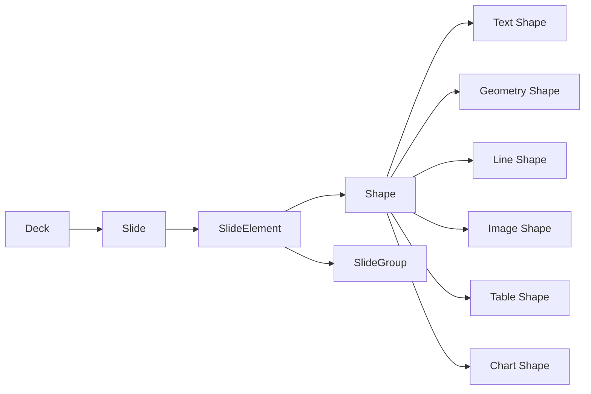

# Slides

## Summary

Slides owns editable presentation structure: decks, ordered slides, structural groups, visual shapes, slide notes, themes, revisions, and deterministic rendering. It does not own the process that generates prompt-driven content.

A slide contains ordered `SlideElement` values. A `SlideElement` is either a `Shape`, which paints or presents content, or a `SlideGroup`, which structurally transforms a set of elements.



## Concept and authority

Slides is authoritative for:

- deck and slide identity, ordering, metadata, and lifecycle;
- element identity, stacking order, position, dimensions, rotation, visibility, and lock state;
- group membership and structural transforms;
- authored slide text and notes;
- presentation-specific styling and theme tokens;
- references attached to slide elements;
- accepted references to Knowledge-derived content;
- revision history, ChangeSets, projections, and render artifacts.

Rich Text defines the shared rich-content tree, link marks, reference attachments, and rich-text operations used by text shapes and notes.

Knowledge Derived Output defines prompts, scoped retrieval, generated content, grounding, immutable output revisions, freshness, and refresh. A text shape that displays generated content stores only a `DerivedOutputRef` and resolves the selected output revision through Knowledge.

Data and Formula are authoritative for structured values and evaluated expressions. Slides may reference those results for tables and charts, but presentation layout remains Slides-owned.

### Group and Shape are different abstractions

A `Shape` has a frame, visual style, and content payload. A `SlideGroup` is structural: it supplies identity, membership, ordering, lock/visibility behavior, and group transforms. It has no fill, stroke, background, or content payload.

Group bounds are derived from descendants. Moving, resizing, or rotating a group applies a deterministic transform to its descendant Shapes and nested Groups. If a visible background is required, it is represented by a geometry Shape inside the group.

Groups are explicit. An ungrouped Shape is a top-level slide element; it is not wrapped in an implicit group of one. This differs from a Document Row, which is a universal layout node even when it contains one Block.

## Prerequisites

1. Platform runtime, configuration, logging, jobs, queues, and SQLite.
2. Rich Text.
3. Formula and Data for formula- and data-backed visual values.
4. Knowledge and Derived Output for generated content.
5. Media storage for image and render artifacts.

## Repository placement

```
apps/backend/src/3-capabilities/slides/
  api/
    routes.ts
    schemas.ts
  changes/
    apply-change.ts
    operations.ts
    validate-change.ts
  domain/
    deck.ts
    element.ts
    group.ts
    shape.ts
    theme.ts
  jobs/
    create-job.ts
    handlers.ts
  projections/
    deck-outline.ts
    slide-render.ts
  runtime/
    create-slides-runtime.ts
    ports.ts
  store/
    migrations/
    slides-store.ts
  index.ts
```

The capability exports its contracts and runtime from `index.ts`. Platform owns the HTTP server, job registry, queues, persistence connection, configuration, logging, and Intelligence interface.

# Types and Interfaces

## Shared identifiers and revisions

```tsx
type DeckId = string;
type SlideId = string;
type SlideElementId = string;
type SlideGroupId = SlideElementId;
type ShapeId = SlideElementId;
type ThemeId = string;
type ChangeSetId = string;
type RevisionNumber = number;
type Rank = string;

interface RevisionRef {
  deckId: DeckId;
  revision: RevisionNumber;
}

interface Attribution {
  actorId: string;
  occurredAt: string;
}
```

`actorId` is supplied by top-level configuration when a request does not carry a more specific attribution value.

## Deck aggregate

```tsx
interface Deck {
  id: DeckId;
  title: string;
  themeId: ThemeId | null;
  slideOrder: SlideId[];
  slides: Record<SlideId, Slide>;
  metadata: DeckMetadata;
}

interface DeckMetadata {
  description?: string;
  tags: string[];
  custom: Record<string, unknown>;
}

interface Slide {
  id: SlideId;
  title?: string;
  rank: Rank;
  size: SlideSize;
  background: SlideBackground;
  elements: Record<SlideElementId, SlideElement>;
  notes: SlideNotes;
}

interface SlideSize {
  width: number;
  height: number;
  unit: "pt";
}

interface SlideBackground {
  color?: ColorValue;
  imageMediaId?: string;
}

interface SlideNotes {
  content: RichContent;
}
```

The slide background is slide-level presentation state. A group does not receive a background property; a grouped background is a geometry Shape.

## Shared slide-element base

```tsx
interface SlideElementBase {
  id: SlideElementId;
  rank: Rank;
  parentGroupId?: SlideGroupId;
  locked: boolean;
  hidden: boolean;
}

type SlideElement = SlideGroup | Shape;

interface SlideGroup extends SlideElementBase {
  elementKind: "group";
}
```

`parentGroupId` is the canonical membership edge. Top-level elements omit it. The ordered children of a group are the elements whose `parentGroupId` equals that group ID, sorted by `(rank, id)`.

A Group may contain Shapes or nested Groups. The membership graph must be acyclic, every referenced parent must exist on the same slide, and a configured nesting limit is enforced during validation.

## Shape base and geometry

```tsx
interface ShapeBase extends SlideElementBase {
  elementKind: "shape";
  frame: ShapeFrame;
  transform: ShapeTransform;
  style: ShapeStyle;
  references: ReferenceAttachment[];
}

interface ShapeFrame {
  x: number;
  y: number;
  width: number;
  height: number;
  unit: "pt";
}

interface ShapeTransform {
  rotationDegrees: number;
  flipHorizontal: boolean;
  flipVertical: boolean;
}

interface ShapeStyle {
  opacity: number;
  fill?: FillStyle;
  stroke?: StrokeStyle;
  shadow?: ShadowStyle;
}

type Shape =
  | TextShape
  | GeometryShape
  | LineShape
  | ImageShape
  | TableShape
  | ChartShape;
```

Only a Shape has a frame and visual style. A Group's effective bounds and transform handles are calculated from its visible descendants.

## Text shapes and derived content

```tsx
type RichContent = import("#platform/rich-text").RichContent;
type ReferenceAttachment =
  import("#platform/rich-text").ReferenceAttachment;
type DerivedOutputRef =
  import("#capabilities/knowledge").DerivedOutputRef;

type SlideTextSource =
  | {
      kind: "authored";
      content: RichContent;
    }
  | {
      kind: "derived-output";
      output: DerivedOutputRef;
    };

interface TextShape extends ShapeBase {
  shapeKind: "text";
  data: TextShapeData;
}

interface TextShapeData {
  source: SlideTextSource;
  verticalAlign: "top" | "middle" | "bottom";
  overflow: "clip" | "shrink" | "expand";
  columns: number;
  padding: Insets;
}
```

For `kind: "derived-output"`, Slides resolves the accepted Knowledge output revision and projects its `rich-text` payload into the text shape. The resource stores only `outputId` and `appliedRevision`; generation metadata stays in Knowledge.

Links embedded in text are Rich Text link marks. Citations and other non-inline references use `ReferenceAttachment` on the Shape or on a Rich Text range.

## Other shape payloads

```tsx
interface GeometryShape extends ShapeBase {
  shapeKind: "geometry";
  data: {
    geometry:
      | "rectangle"
      | "rounded-rectangle"
      | "ellipse"
      | "triangle"
      | "diamond"
      | "arrow"
      | "custom-path";
    path?: string;
  };
}

interface LineShape extends ShapeBase {
  shapeKind: "line";
  data: {
    start: Point;
    end: Point;
    startDecoration?: LineDecoration;
    endDecoration?: LineDecoration;
    routing: "straight" | "elbow" | "curve";
  };
}

interface ImageShape extends ShapeBase {
  shapeKind: "image";
  data: {
    mediaId: string;
    crop?: CropRect;
    fit: "contain" | "cover" | "stretch";
    altText?: string;
  };
}

interface TableShape extends ShapeBase {
  shapeKind: "table";
  data: {
    source: SlideValueSource;
    presentation: TablePresentation;
  };
}

interface ChartShape extends ShapeBase {
  shapeKind: "chart";
  data: {
    source: SlideValueSource;
    specification: ChartSpecification;
  };
}

type SlideValueSource =
  | { kind: "literal"; value: FormulaWireValue }
  | { kind: "formula"; source: string }
  | { kind: "data"; entryId: string; revision?: number }
  | { kind: "analysis-result"; resultId: string; revision?: number };
```

Table and chart sources are explicit typed references. They are resolved through their owning capabilities and remain explicit in the Shape payload.

## Themes

```tsx
interface SlidesTheme {
  id: ThemeId;
  name: string;
  tokens: ThemeTokens;
  layouts: Record<string, SlideLayout>;
}

interface ThemeTokens {
  colors: Record<string, ColorValue>;
  fonts: Record<string, FontToken>;
  spacing: Record<string, number>;
}

interface SlideLayout {
  id: string;
  name: string;
  placeholders: LayoutPlaceholder[];
}
```

A layout creates ordinary Shapes with stable IDs. Once inserted, those Shapes participate in the same ChangeSet and revision model as manually created content.

## Base, revisions, and ChangeSets

```tsx
interface DeckBaseRow {
  deckId: DeckId;
  baseRevision: RevisionNumber;
  base: Deck;
  updatedAt: string;
}

interface SlidesChangeSet {
  id: ChangeSetId;
  deckId: DeckId;
  baseRevision: RevisionNumber;
  actorId: string;
  changes: SlidesChange[];
  createdAt: string;
}

interface SlidesSubmission {
  id: string;
  deckId: DeckId;
  baseRevision: RevisionNumber;
  status: "pending" | "applied" | "rejected";
  changeSet: SlidesChangeSet;
  resultRevision?: RevisionNumber;
  diagnostics: SlidesDiagnostic[];
}

type SlidesChange =
  | DeckChange
  | SlideChange
  | ElementChange
  | TextChange
  | ThemeChange;
```

Accepted ChangeSets advance the deck revision atomically. A stale base revision is rebased when all operations can be addressed by stable IDs; otherwise the submission is rejected with structured diagnostics.

# Runtime Objects

## Construction

```tsx
interface SlidesRuntimeDependencies {
  repository: SlidesRepository;
  richText: RichTextEngine;
  formula: FormulaEvaluator;
  data: StructuredDataReader;
  derivedOutputs: DerivedOutputReader;
  media: MediaReader;
  logger: Logger;
  attribution: AttributionProvider;
}

interface SlidesRuntime {
  commands: SlidesCommands;
  queries: SlidesQueries;
  snapshots: SlidesSnapshots;
  changes: SlidesChangeEngine;
  renderer: SlidesRenderer;
}

function createSlidesRuntime(
  dependencies: SlidesRuntimeDependencies,
): SlidesRuntime;
```

## Repository

```tsx
interface SlidesRepository {
  createDeck(deck: Deck, attribution: Attribution): Promise<RevisionRef>;
  getDeck(deckId: DeckId, revision?: number): Promise<DeckSnapshot | null>;
  appendSubmission(submission: SlidesSubmission): Promise<void>;
  acceptSubmission(
    submissionId: string,
    result: AcceptedSlidesSubmission,
  ): Promise<RevisionRef>;
  rejectSubmission(
    submissionId: string,
    diagnostics: SlidesDiagnostic[],
  ): Promise<void>;
  saveRender(artifact: SlideRenderArtifact): Promise<void>;
}

interface DeckSnapshot {
  deck: Deck;
  revision: RevisionNumber;
  acceptedAt: string;
}
```

## Commands and queries

```tsx
interface SlidesCommands {
  createDeck(input: CreateDeckInput): Promise<RevisionRef>;
  submit(input: SubmitSlidesChangeSetInput): Promise<SubmissionReceipt>;
  refreshDerivedOutput(
    input: RefreshSlideDerivedOutputInput,
  ): Promise<JobReceipt>;
  render(input: RenderSlidesInput): Promise<JobReceipt>;
}

interface SlidesQueries {
  getDeck(input: GetDeckInput): Promise<DeckSnapshot>;
  getSlide(input: GetSlideInput): Promise<SlideProjection>;
  getOutline(input: GetDeckInput): Promise<DeckOutline>;
  getRender(input: GetSlideRenderInput): Promise<SlideRenderArtifact | null>;
}

interface SlidesSnapshots {
  capture(deckId: DeckId, revision?: number): Promise<SlidesSnapshot>;
}

interface SlidesSnapshot {
  deckId: DeckId;
  revision: RevisionNumber;
  deck: Deck;
  resolvedData: Record<string, FormulaWireValue>;
  resolvedDerivedOutputs: Record<string, ResolvedDerivedOutput>;
}
```

A snapshot pins all external revisions used for calculation and rendering so one operation sees a coherent deck.

## Change engine

```tsx
interface SlidesChangeEngine {
  validate(
    deck: Deck,
    changeSet: SlidesChangeSet,
  ): SlidesDiagnostic[];

  rebase(
    current: DeckSnapshot,
    changeSet: SlidesChangeSet,
  ): RebaseSlidesResult;

  apply(
    deck: Deck,
    changeSet: SlidesChangeSet,
  ): AppliedSlidesChangeSet;
}
```

The engine owns group-graph validation, stable-ID addressing, rank ordering, shape geometry constraints, Rich Text delegation, and deterministic application.

## Renderer

```tsx
interface SlidesRenderer {
  renderSlide(
    snapshot: SlidesSnapshot,
    slideId: SlideId,
    options: SlideRenderOptions,
  ): Promise<SlideRenderArtifact>;

  renderDeck(
    snapshot: SlidesSnapshot,
    options: DeckRenderOptions,
  ): Promise<DeckRenderArtifact>;
}
```

Rendering resolves authored or derived text, Data and Formula inputs, media assets, theme tokens, group transforms, and z-order from the same pinned snapshot.

# Change Operations

## Deck and slide operations

```tsx
type DeckChange =
  | { op: "deck.set-title"; title: string }
  | { op: "deck.set-theme"; themeId: ThemeId | null }
  | { op: "deck.set-metadata"; metadata: DeckMetadata };

type SlideChange =
  | { op: "slide.create"; slide: Slide }
  | { op: "slide.delete"; slideId: SlideId }
  | { op: "slide.move"; slideId: SlideId; rank: Rank }
  | { op: "slide.set-title"; slideId: SlideId; title?: string }
  | {
      op: "slide.set-background";
      slideId: SlideId;
      background: SlideBackground;
    }
  | {
      op: "slide.apply-notes";
      slideId: SlideId;
      richTextChanges: RichTextChange[];
    };
```

## Shape operations

```tsx
type ShapeChange =
  | {
      op: "shape.create";
      slideId: SlideId;
      shape: Shape;
    }
  | {
      op: "shape.delete";
      slideId: SlideId;
      shapeId: ShapeId;
    }
  | {
      op: "shape.set-frame";
      slideId: SlideId;
      shapeId: ShapeId;
      frame: ShapeFrame;
    }
  | {
      op: "shape.set-transform";
      slideId: SlideId;
      shapeId: ShapeId;
      transform: ShapeTransform;
    }
  | {
      op: "shape.set-style";
      slideId: SlideId;
      shapeId: ShapeId;
      style: ShapeStyle;
    }
  | {
      op: "shape.set-references";
      slideId: SlideId;
      shapeId: ShapeId;
      references: ReferenceAttachment[];
    }
  | {
      op: "shape.set-payload";
      slideId: SlideId;
      shapeId: ShapeId;
      data: Shape["data"];
    };
```

## Group operations

```tsx
type GroupChange =
  | {
      op: "group.create";
      slideId: SlideId;
      group: SlideGroup;
    }
  | {
      op: "group.delete";
      slideId: SlideId;
      groupId: SlideGroupId;
    }
  | {
      op: "group.group-elements";
      slideId: SlideId;
      groupId: SlideGroupId;
      elementIds: SlideElementId[];
    }
  | {
      op: "group.ungroup";
      slideId: SlideId;
      groupId: SlideGroupId;
    }
  | {
      op: "group.transform";
      slideId: SlideId;
      groupId: SlideGroupId;
      transform: GroupTransform;
    }
  | {
      op: "element.move";
      slideId: SlideId;
      elementId: SlideElementId;
      parentGroupId?: SlideGroupId;
      rank: Rank;
    }
  | {
      op: "element.set-state";
      slideId: SlideId;
      elementId: SlideElementId;
      locked?: boolean;
      hidden?: boolean;
    };
```

`group.delete` requires the caller to choose either ungrouping descendants or deleting the whole subtree. `group.ungroup` reparents direct children to the deleted Group's parent and assigns ranks that preserve their visual order.

`group.transform` expands into stable, deterministic descendant frame and transform changes before the ChangeSet is accepted. Concurrent edits can therefore conflict at the affected Shape IDs rather than at an opaque group transform.

## Rich Text and Derived Output operations

```tsx
type TextChange =
  | {
      op: "text.apply";
      slideId: SlideId;
      shapeId: ShapeId;
      richTextChanges: RichTextChange[];
    }
  | {
      op: "text.set-source";
      slideId: SlideId;
      shapeId: ShapeId;
      source: SlideTextSource;
    }
  | {
      op: "text.apply-derived-output";
      slideId: SlideId;
      shapeId: ShapeId;
      output: DerivedOutputRef;
    };
```

`text.apply` applies only to authored text. Editing content resolved from a Derived Output first materializes that content as authored Rich Text or creates a new Derived Output revision through Knowledge.

`text.apply-derived-output` advances the accepted `appliedRevision` after Knowledge refresh has completed and the caller has selected or accepted the new revision.

# Endpoints

| Method | Path | Purpose |
| --- | --- | --- |
| POST | `/slides/decks` | Create a deck. |
| GET | `/slides/decks/:deckId` | Read a deck at the current or requested revision. |
| POST | `/slides/decks/:deckId/changes` | Submit a Slides ChangeSet. |
| GET | `/slides/decks/:deckId/submissions/:submissionId` | Read submission status and diagnostics. |
| GET | `/slides/decks/:deckId/outline` | Read the deck outline projection. |
| GET | `/slides/decks/:deckId/slides/:slideId` | Read a slide projection. |
| POST | `/slides/decks/:deckId/slides/:slideId/elements/:elementId/refresh` | Refresh and optionally adopt a referenced Derived Output. |
| POST | `/slides/decks/:deckId/render` | Render the deck. |
| POST | `/slides/decks/:deckId/slides/:slideId/render` | Render one slide. |
| GET | `/slides/renders/:renderId` | Read render state or artifact metadata. |

Route handlers validate transport input and create jobs. They do not apply Changes or render inside the request handler.

# Jobs

| Job type | Queue | Handler |
| --- | --- | --- |
| `slides.create-deck` | serial | Creates the base aggregate and initial revision. |
| `slides.submit-changes` | serial | Validates, rebases, applies, and commits a ChangeSet. |
| `slides.refresh-derived-output` | concurrent → serial | Asks Knowledge to refresh an output, then submits a small Slides ChangeSet to advance the accepted revision. |
| `slides.render-slide` | concurrent | Captures a pinned snapshot and renders one slide. |
| `slides.render-deck` | concurrent | Captures a pinned snapshot and renders the deck. |

The concurrent refresh phase may retrieve context and invoke Intelligence through Knowledge. The serial settlement phase only advances the slide resource reference after a valid output revision exists.

```tsx
interface SlidesJobFactory {
  matches(request: RequestEnvelope): boolean;
  create(request: RequestEnvelope): SlidesJob;
}

type SlidesJob =
  | CreateDeckJob
  | SubmitSlidesChangesJob
  | RefreshSlideDerivedOutputJob
  | RenderSlideJob
  | RenderDeckJob;
```

# SQL Tables

## Deck base and revisions

```sql
CREATE TABLE slides_decks (
  deck_id TEXT PRIMARY KEY,
  current_revision INTEGER NOT NULL,
  title TEXT NOT NULL,
  theme_id TEXT,
  metadata BLOB NOT NULL,
  created_at TEXT NOT NULL,
  updated_at TEXT NOT NULL
);

CREATE TABLE slides_revisions (
  deck_id TEXT NOT NULL,
  revision INTEGER NOT NULL,
  base_blob BLOB NOT NULL,
  accepted_change_set_id TEXT,
  actor_id TEXT NOT NULL,
  accepted_at TEXT NOT NULL,
  PRIMARY KEY (deck_id, revision)
);
```

## Normalized current-base projections

```sql
CREATE TABLE slides_base_slides (
  deck_id TEXT NOT NULL,
  slide_id TEXT NOT NULL,
  rank TEXT NOT NULL,
  title TEXT,
  size BLOB NOT NULL,
  background BLOB NOT NULL,
  notes BLOB NOT NULL,
  PRIMARY KEY (deck_id, slide_id)
);

CREATE TABLE slides_base_groups (
  deck_id TEXT NOT NULL,
  slide_id TEXT NOT NULL,
  group_id TEXT NOT NULL,
  rank TEXT NOT NULL,
  parent_group_id TEXT,
  locked INTEGER NOT NULL,
  hidden INTEGER NOT NULL,
  PRIMARY KEY (deck_id, slide_id, group_id)
);

CREATE TABLE slides_base_shapes (
  deck_id TEXT NOT NULL,
  slide_id TEXT NOT NULL,
  shape_id TEXT NOT NULL,
  shape_kind TEXT NOT NULL,
  rank TEXT NOT NULL,
  parent_group_id TEXT,
  locked INTEGER NOT NULL,
  hidden INTEGER NOT NULL,
  frame BLOB NOT NULL,
  transform BLOB NOT NULL,
  style BLOB NOT NULL,
  payload BLOB NOT NULL,
  references_blob BLOB NOT NULL,
  PRIMARY KEY (deck_id, slide_id, shape_id)
);

CREATE INDEX slides_groups_by_parent
  ON slides_base_groups (deck_id, slide_id, parent_group_id, rank);

CREATE INDEX slides_shapes_by_parent
  ON slides_base_shapes (deck_id, slide_id, parent_group_id, rank);
```

The normalized tables are current-base read projections. The immutable revision blob remains the authority for historical reconstruction.

## Change submissions

```sql
CREATE TABLE slides_change_sets (
  change_set_id TEXT PRIMARY KEY,
  deck_id TEXT NOT NULL,
  base_revision INTEGER NOT NULL,
  actor_id TEXT NOT NULL,
  changes_blob BLOB NOT NULL,
  created_at TEXT NOT NULL
);

CREATE TABLE slides_submissions (
  submission_id TEXT PRIMARY KEY,
  change_set_id TEXT NOT NULL,
  deck_id TEXT NOT NULL,
  status TEXT NOT NULL,
  result_revision INTEGER,
  diagnostics_blob BLOB NOT NULL,
  created_at TEXT NOT NULL,
  settled_at TEXT
);

CREATE INDEX slides_submissions_by_deck
  ON slides_submissions (deck_id, created_at);
```

## Render artifacts

```sql
CREATE TABLE slides_render_artifacts (
  render_id TEXT PRIMARY KEY,
  deck_id TEXT NOT NULL,
  deck_revision INTEGER NOT NULL,
  slide_id TEXT,
  status TEXT NOT NULL,
  media_id TEXT,
  diagnostics_blob BLOB NOT NULL,
  created_at TEXT NOT NULL,
  completed_at TEXT
);
```

# Invariants

1. Every Slide Element ID is unique within its slide.
2. Rank plus ID produces deterministic order within each parent.
3. A `parentGroupId` references a Group on the same slide.
4. Group membership is acyclic and respects the configured nesting limit.
5. A Group is structural and carries no Shape style or content.
6. Group bounds are derived from visible descendants.
7. Group transforms resolve to deterministic descendant changes before commit.
8. A Text Shape is either authored Rich Text or a reference to one accepted Derived Output revision.
9. Rich Text changes are validated and applied by the shared Rich Text engine.
10. Knowledge owns generation, grounding, freshness, and Derived Output revision history.
11. Chart and table inputs resolve against a pinned Formula/Data/Analysis snapshot.
12. Rendering the same snapshot and options produces the same artifact bytes or the same normalized render tree.
13. Accepted ChangeSets are immutable, attributed, and revision-scoped.

# Acceptance Criteria

- A deck can be created, revised, queried, and rendered through jobs.
- Slides and elements maintain deterministic order with stable IDs.
- Shapes can exist at the slide root without an implicit Group.
- Groups can contain Shapes and nested Groups without becoming visual Shapes.
- Moving, resizing, rotating, locking, hiding, ungrouping, and deleting Groups have explicit deterministic semantics.
- Text Shapes and notes use the shared Rich Text contract.
- Link marks and reference attachments remain available without a Slides-specific reference model.
- A Text Shape can adopt and refresh a Knowledge Derived Output by revision.
- Table and Chart Shapes can resolve Formula, Data, and Analysis values from a pinned snapshot.
- ChangeSets support validation, rebase, atomic acceptance, immutable history, and structured rejection diagnostics.
- Resource routes remain thin job-producing adapters.

# Related Pages

- Capability Index
- Rich Text
- Knowledge
- Knowledge Derived Output
- Document
- Spreadsheet
- Data