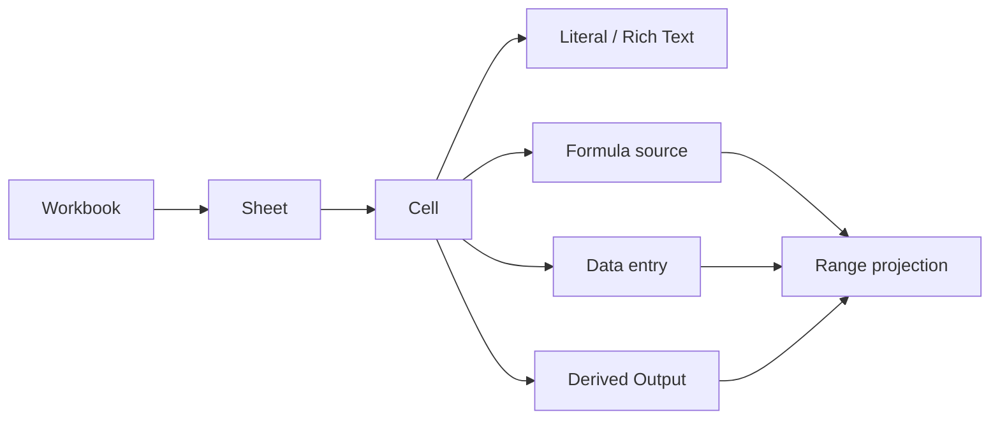

# Spreadsheet

## Summary

Spreadsheet owns editable workbook structure: sheets, stable rows and columns, sparse Cells, formatting, formulas as source text, accepted cell values, merged-cell spans, range projections, revisions, and calculation state.

Data owns all named values. Its authoritative entry kinds are `variable`, `function`, `table`, `record`, and `list`. Spreadsheet does not create a second naming namespace. What the interface may present as a named range is a projection of a Data `table`, `record`, or `list`, and the name belongs to that Data entry.

A Cell and a merged Cell are the same domain object. An ordinary Cell has a one-row by one-column span; a merged Cell has a larger rectangular span. Arbitrary ranges remain stable addresses used by selections, formulas, operations, comments, references, rules, charts, and projections—not separate content-bearing entities.

Structured Formula, Data, and Knowledge results extend from an anchor Cell as a range projection. “Range projection” is the canonical term.



# Concept

## Authority boundaries

Spreadsheet is authoritative for:

- workbook and sheet identity, order, dimensions, and metadata;
- stable row and column identities;
- sparse Cell identity and anchor coordinates;
- Cell spans, including merged Cells;
- Cell source selection and accepted presentation value;
- formulas stored as source text in Cells;
- styling, validation, conditional formatting, overlays, frozen panes, and view state;
- reference attachments anchored to a Cell or stable range;
- accepted references to Knowledge-derived output revisions;
- ChangeSets, revisions, calculation requests, and workbook projections.

Formula parses and evaluates formula source. It resolves names through a pinned Data binding view.

Data owns names, value kinds, collection schemas, collection rows, and Data revisions. A Spreadsheet Data projection points to a Data entry by stable ID and pins or resolves its revision.

Rich Text owns the shared rich-content tree, link marks, reference attachments, and rich-text operations used by text-valued Cells.

Knowledge Derived Output owns prompt instructions, scoped retrieval, generation, grounding, immutable output revisions, freshness, and refresh. Spreadsheet stores only a `DerivedOutputRef` and accepted content.

## Cells, merged Cells, and ranges

A `SpreadsheetCell` is a content-bearing object with a stable ID, an anchor coordinate, and a rectangular `CellSpan`.

- A normal Cell has one row ID and one column ID in its span.
- A merged Cell has multiple contiguous row IDs, column IDs, or both.
- Every coordinate covered by a merged Cell resolves to the same Cell ID.
- The Cell's anchor is the first row and first column in sheet order.
- Unmerging preserves the anchor Cell and its content, reduces its span to one-by-one, and releases the remaining coordinates as empty.

A stable range is an address over row and column IDs. It is useful without becoming a durable content object.

## Range projections

A Cell source can resolve to a scalar, Rich Text value, record, list, table, or cell matrix. Structured results are presented through a deterministic range projection beginning at the Cell's anchor.

A projection is a read model derived from the accepted Cell content and current axis order. Projected coordinates resolve to a tuple of `(anchorCellId, valuePath)`; they are not stored as independent Cells.

A projection may grow or shrink when a new Formula result, Data revision, or Derived Output revision is accepted. If the required coordinates overlap another canonical Cell or merged-cell span, the projection is blocked and the anchor Cell reports a structured diagnostic.

## Prerequisites

1. Platform runtime, configuration, logging, jobs, queues, and SQLite.
2. Formula.
3. Data.
4. Rich Text.
5. Knowledge and Derived Output for generated content.
6. Context where Knowledge refresh uses scoped retrieval.

## Repository placement

```
apps/backend/src/3-capabilities/spreadsheet/
  api/
    routes.ts
    schemas.ts
  calculation/
    calculate-workbook.ts
    dependency-graph.ts
    projection.ts
  changes/
    apply-change.ts
    operations.ts
    validate-change.ts
  domain/
    cell.ts
    range.ts
    sheet.ts
    workbook.ts
  jobs/
    create-job.ts
    handlers.ts
  projections/
    grid.ts
    outline.ts
  runtime/
    create-spreadsheet-runtime.ts
    ports.ts
  store/
    migrations/
    spreadsheet-store.ts
  index.ts
```

# Types and Interfaces

## Identifiers, ranks, and attribution

```tsx
type WorkbookId = string;
type SheetId = string;
type RowId = string;
type ColumnId = string;
type CellId = string;
type ChangeSetId = string;
type RevisionNumber = number;
type Rank = string;

interface Attribution {
  actorId: string;
  occurredAt: string;
}
```

`actorId` is supplied by top-level configuration when a request does not provide a more specific attribution value.

## Workbook and sheet aggregate

```tsx
interface Workbook {
  id: WorkbookId;
  title: string;
  sheetOrder: SheetId[];
  sheets: Record<SheetId, SpreadsheetSheet>;
  metadata: WorkbookMetadata;
  calculation: CalculationSettings;
}

interface SpreadsheetSheet {
  id: SheetId;
  title: string;
  rank: Rank;
  rows: Record<RowId, SheetRow>;
  columns: Record<ColumnId, SheetColumn>;
  cells: Record<CellId, SpreadsheetCell>;
  rules: SheetRule[];
  overlays: SheetOverlay[];
  freeze: FreezeState;
  defaults: SheetDefaults;
}

interface SheetRow {
  id: RowId;
  rank: Rank;
  height?: number;
  hidden: boolean;
}

interface SheetColumn {
  id: ColumnId;
  rank: Rank;
  width?: number;
  hidden: boolean;
}

interface CalculationSettings {
  mode: "automatic" | "manual";
  iterative: boolean;
  maximumIterations?: number;
  convergenceThreshold?: number;
}
```

Rows and columns use stable IDs and sortable ranks. A1 notation is a projection of the current axis order, not the identity of a Cell.

## Stable Cell and range references

```tsx
interface StableCellRef {
  sheetId: SheetId;
  rowId: RowId;
  columnId: ColumnId;
}

interface StableRangeRef {
  sheetId: SheetId;
  rowIds: RowId[];
  columnIds: ColumnId[];
}

interface CellSpan {
  rowIds: RowId[];
  columnIds: ColumnId[];
}

interface SpreadsheetCell {
  id: CellId;
  anchor: StableCellRef;
  span: CellSpan;
  source: CellSource;
  accepted: AcceptedCellContent;
  style: CellStyle;
  validation?: CellValidation;
  references: CellReferenceAttachment[];
}
```

A `CellSpan` must be rectangular and contiguous under current row and column order. Its first row ID and column ID must match the Cell anchor.

An empty grid coordinate has no `SpreadsheetCell` record. This preserves sparse storage.

## Cell sources

```tsx
type RichContent = import("#platform/rich-text").RichContent;
type ReferenceAttachment =
  import("#platform/rich-text").ReferenceAttachment;
type DerivedOutputRef =
  import("#capabilities/knowledge").DerivedOutputRef;
type DataKind =
  | "variable"
  | "function"
  | "table"
  | "record"
  | "list";

type CellSource =
  | { kind: "empty" }
  | { kind: "literal"; value: CellLiteral }
  | { kind: "rich-text"; content: RichContent }
  | { kind: "formula"; source: string }
  | {
      kind: "data";
      entryId: string;
      entryKind: "table" | "record" | "list";
      revision?: number;
      orientation: ProjectionOrientation;
    }
  | {
      kind: "derived-output";
      output: DerivedOutputRef;
      orientation: ProjectionOrientation;
    };

type CellLiteral =
  | string
  | number
  | boolean
  | null
  | DateValue;

type ProjectionOrientation =
  | "rows"
  | "columns"
  | "record-vertical"
  | "record-horizontal";
```

Variables and functions are resolved by Formula. A direct Data Cell source references only collection entries—`table`, `record`, or `list`—because those are the values displayed as structured grid content.

## Accepted Cell content

```tsx
type AcceptedCellContent =
  | { kind: "empty" }
  | {
      kind: "scalar";
      value: FormulaScalar;
      acceptedAt: string;
      dependencies: CellDependency[];
    }
  | {
      kind: "rich-text";
      content: RichContent;
      acceptedAt: string;
      dependencies: CellDependency[];
    }
  | {
      kind: "structured";
      value: FormulaWireValue;
      projection: RangeProjection;
      acceptedAt: string;
      dependencies: CellDependency[];
    }
  | {
      kind: "error";
      error: CellError;
      acceptedAt: string;
      dependencies: CellDependency[];
    };

type CellDependency =
  | { kind: "cell"; cell: StableCellRef; revision: number }
  | { kind: "range"; range: StableRangeRef; revision: number }
  | { kind: "data"; entryId: string; revision: number }
  | { kind: "derived-output"; outputId: string; revision: number };
```

Accepted content is the last settled result displayed by the workbook revision. The calculation stage may hold newer candidate values, but they become canonical only through a serial settlement ChangeSet.

## Range projection

```tsx
interface RangeProjection {
  anchorCellId: CellId;
  extent: ProjectionExtent;
  orientation: ProjectionOrientation;
  status: "ready" | "blocked";
  diagnostics: ProjectionDiagnostic[];
}

interface ProjectionExtent {
  rowIds: RowId[];
  columnIds: ColumnId[];
}

interface ProjectedCell {
  coordinate: StableCellRef;
  anchorCellId: CellId;
  valuePath: Array<string | number>;
  value: FormulaScalar | RichContent;
}

interface ProjectionDiagnostic {
  code:
    | "occupied-coordinate"
    | "merged-cell-overlap"
    | "axis-missing"
    | "shape-invalid";
  coordinate?: StableCellRef;
  message: string;
}
```

`RangeProjection` is rebuildable from the accepted structured value, anchor, orientation, and axis order. The immutable workbook revision stores the accepted value and enough source metadata to reproduce it; current-grid projection tables are optional read indexes.

## Rich Text and references

```tsx
type CellReferenceAttachment =
  | {
      anchor: { kind: "cell"; cell: StableCellRef };
      reference: ReferenceAttachment;
    }
  | {
      anchor: { kind: "range"; range: StableRangeRef };
      reference: ReferenceAttachment;
    };
```

A text-valued Cell may hold authored Rich Text. Inline links are Rich Text marks. Reference attachments may address the Cell itself or a stable range. Comments use the same stable Cell and range anchor concepts through the Comments capability.

## Data projections

```tsx
interface StructuredDataProjection {
  entryId: string;
  entryKind: "table" | "record" | "list";
  revision: number;
  anchor: StableCellRef;
  orientation: ProjectionOrientation;
}
```

`StructuredDataProjection` is a descriptive view of a Data-backed Cell source, not a separately named Spreadsheet entity. Its display name comes from the referenced Data entry.

Promoting a selected range creates or updates a Data collection entry and replaces the selected grid content with a Data-backed anchor Cell. Editing projected values routes changes to Data. Materializing a projection creates ordinary literal or Rich Text Cells and detaches the Data source.

## Formula references

Formula syntax may use A1 notation, stable IDs, names resolved through Data, set-based queries, positional indexing, slicing, and structured values. Spreadsheet supplies Formula with a pinned workbook view plus the Data binding view. Formula returns dependency information and a `FormulaWireValue`; Spreadsheet owns acceptance and presentation of that result.

# Runtime Objects

## Construction

```tsx
interface SpreadsheetRuntimeDependencies {
  repository: SpreadsheetRepository;
  formula: FormulaEvaluator;
  data: StructuredDataRuntime;
  richText: RichTextEngine;
  derivedOutputs: DerivedOutputReader;
  logger: Logger;
  attribution: AttributionProvider;
}

interface SpreadsheetRuntime {
  commands: SpreadsheetCommands;
  queries: SpreadsheetQueries;
  snapshots: SpreadsheetSnapshots;
  changes: SpreadsheetChangeEngine;
  calculation: SpreadsheetCalculationEngine;
  projections: SpreadsheetProjectionEngine;
}

function createSpreadsheetRuntime(
  dependencies: SpreadsheetRuntimeDependencies,
): SpreadsheetRuntime;
```

## Repository

```tsx
interface SpreadsheetRepository {
  createWorkbook(
    workbook: Workbook,
    attribution: Attribution,
  ): Promise<WorkbookRevisionRef>;

  getWorkbook(
    workbookId: WorkbookId,
    revision?: RevisionNumber,
  ): Promise<WorkbookSnapshot | null>;

  appendSubmission(submission: SpreadsheetSubmission): Promise<void>;

  acceptSubmission(
    submissionId: string,
    result: AcceptedSpreadsheetSubmission,
  ): Promise<WorkbookRevisionRef>;

  rejectSubmission(
    submissionId: string,
    diagnostics: SpreadsheetDiagnostic[],
  ): Promise<void>;
}
```

## Commands and queries

```tsx
interface SpreadsheetCommands {
  createWorkbook(input: CreateWorkbookInput): Promise<WorkbookRevisionRef>;
  submit(input: SubmitSpreadsheetChangeSetInput): Promise<SubmissionReceipt>;
  calculate(input: CalculateWorkbookInput): Promise<JobReceipt>;
  refreshDerivedOutput(
    input: RefreshCellDerivedOutputInput,
  ): Promise<JobReceipt>;
  attachDataEntry(input: AttachDataEntryInput): Promise<JobReceipt>;
  promoteRangeToData(input: PromoteRangeToDataInput): Promise<JobReceipt>;
  materializeProjection(
    input: MaterializeProjectionInput,
  ): Promise<JobReceipt>;
}

interface SpreadsheetQueries {
  getWorkbook(input: GetWorkbookInput): Promise<WorkbookSnapshot>;
  getGrid(input: GetGridInput): Promise<GridProjection>;
  resolveCoordinate(
    input: ResolveCoordinateInput,
  ): Promise<ResolvedCoordinate>;
  getDependencies(
    input: GetCellDependenciesInput,
  ): Promise<CellDependencyGraph>;
}

interface SpreadsheetSnapshots {
  capture(
    workbookId: WorkbookId,
    revision?: number,
  ): Promise<SpreadsheetSnapshot>;
}
```

## Coordinate resolver

```tsx
type ResolvedCoordinate =
  | { kind: "empty"; coordinate: StableCellRef }
  | {
      kind: "cell";
      coordinate: StableCellRef;
      cellId: CellId;
      anchor: StableCellRef;
    }
  | {
      kind: "projected";
      coordinate: StableCellRef;
      anchorCellId: CellId;
      valuePath: Array<string | number>;
    };

interface SpreadsheetProjectionEngine {
  resolveCoordinate(
    snapshot: SpreadsheetSnapshot,
    coordinate: StableCellRef,
  ): ResolvedCoordinate;

  buildRangeProjection(
    snapshot: SpreadsheetSnapshot,
    cell: SpreadsheetCell,
  ): RangeProjection;

  projectGrid(
    snapshot: SpreadsheetSnapshot,
    range: StableRangeRef,
  ): GridProjection;
}
```

Coordinate resolution checks canonical Cell spans first, then ready range projections. A projected coordinate cannot shadow a canonical Cell.

## Calculation engine

```tsx
interface SpreadsheetCalculationEngine {
  plan(snapshot: SpreadsheetSnapshot): CalculationPlan;

  evaluate(
    snapshot: SpreadsheetSnapshot,
    plan: CalculationPlan,
  ): Promise<CalculationCandidate>;

  settle(
    current: WorkbookSnapshot,
    candidate: CalculationCandidate,
  ): SpreadsheetChangeSet;
}
```

Planning detects dependencies and strongly connected components. Evaluation may run concurrently over independent components. Settlement is a serial ChangeSet against the current workbook revision.

# Change Operations

## Workbook and sheet operations

```tsx
type WorkbookChange =
  | { op: "workbook.set-title"; title: string }
  | {
      op: "workbook.set-calculation";
      calculation: CalculationSettings;
    }
  | { op: "workbook.set-metadata"; metadata: WorkbookMetadata };

type SheetChange =
  | { op: "sheet.create"; sheet: SpreadsheetSheet }
  | { op: "sheet.delete"; sheetId: SheetId }
  | { op: "sheet.move"; sheetId: SheetId; rank: Rank }
  | { op: "sheet.rename"; sheetId: SheetId; title: string }
  | { op: "sheet.set-freeze"; sheetId: SheetId; freeze: FreezeState };
```

## Axis operations

```tsx
type AxisChange =
  | { op: "row.insert"; sheetId: SheetId; row: SheetRow }
  | { op: "row.delete"; sheetId: SheetId; rowId: RowId }
  | { op: "row.move"; sheetId: SheetId; rowId: RowId; rank: Rank }
  | { op: "row.resize"; sheetId: SheetId; rowId: RowId; height: number }
  | { op: "column.insert"; sheetId: SheetId; column: SheetColumn }
  | { op: "column.delete"; sheetId: SheetId; columnId: ColumnId }
  | {
      op: "column.move";
      sheetId: SheetId;
      columnId: ColumnId;
      rank: Rank;
    }
  | {
      op: "column.resize";
      sheetId: SheetId;
      columnId: ColumnId;
      width: number;
    };
```

Axis operations use stable IDs. Deletion validates or rewrites affected spans, stable ranges, formulas, references, and projections according to the operation's explicit policy.

## Cell and merged-cell operations

```tsx
type CellChange =
  | {
      op: "cell.create";
      sheetId: SheetId;
      cell: SpreadsheetCell;
    }
  | {
      op: "cell.delete";
      sheetId: SheetId;
      cellId: CellId;
    }
  | {
      op: "cell.set-source";
      sheetId: SheetId;
      cellId: CellId;
      source: CellSource;
    }
  | {
      op: "cell.apply-rich-text";
      sheetId: SheetId;
      cellId: CellId;
      richTextChanges: RichTextChange[];
    }
  | {
      op: "cell.set-style";
      sheetId: SheetId;
      cellId: CellId;
      style: CellStyle;
    }
  | {
      op: "cell.set-references";
      sheetId: SheetId;
      cellId: CellId;
      references: CellReferenceAttachment[];
    }
  | {
      op: "cell.merge";
      sheetId: SheetId;
      cellId: CellId;
      span: CellSpan;
      coveredCellPolicy: "require-empty" | "discard" | "preserve-as-reference";
    }
  | {
      op: "cell.unmerge";
      sheetId: SheetId;
      cellId: CellId;
    };
```

Merge targets one existing or newly created anchor Cell. The requested span must be rectangular and may not intersect another merged Cell. The chosen covered-cell policy is explicit in the ChangeSet.

## Calculation and accepted-value operations

```tsx
type CalculationChange =
  | {
      op: "cell.accept-content";
      sheetId: SheetId;
      cellId: CellId;
      accepted: AcceptedCellContent;
      expectedSource: CellSourceFingerprint;
    }
  | {
      op: "cell.apply-derived-output";
      sheetId: SheetId;
      cellId: CellId;
      output: DerivedOutputRef;
      accepted: AcceptedCellContent;
    }
  | {
      op: "projection.materialize";
      sheetId: SheetId;
      anchorCellId: CellId;
      cells: SpreadsheetCell[];
    };
```

Calculation settlement includes an expected source fingerprint so a result computed from stale formula text or a stale external reference cannot overwrite a newer edit.

Materialization replaces the structured source with ordinary Cells in one ChangeSet. The anchor Cell keeps its stable ID where possible.

## Data coordination operations

```tsx
interface PromoteRangeToDataInput {
  workbookId: WorkbookId;
  baseRevision: RevisionNumber;
  range: StableRangeRef;
  kind: "table" | "record" | "list";
  displayName: string;
  description: string;
  orientation: ProjectionOrientation;
}

interface AttachDataEntryInput {
  workbookId: WorkbookId;
  baseRevision: RevisionNumber;
  anchor: StableCellRef;
  entryId: string;
  orientation: ProjectionOrientation;
}
```

Promotion validates the range shape against the chosen Data kind, creates the Data entry with an idempotency key, and then submits a Spreadsheet ChangeSet that replaces the source range with one Data-backed anchor Cell. The Data entry remains authoritative for the name and values.

# Endpoints

| Method | Path | Purpose |
| --- | --- | --- |
| POST | `/spreadsheets/workbooks` | Create a workbook. |
| GET | `/spreadsheets/workbooks/:workbookId` | Read a workbook at the current or requested revision. |
| POST | `/spreadsheets/workbooks/:workbookId/changes` | Submit a Spreadsheet ChangeSet. |
| GET | `/spreadsheets/workbooks/:workbookId/submissions/:submissionId` | Read submission state and diagnostics. |
| GET | `/spreadsheets/workbooks/:workbookId/sheets/:sheetId/grid` | Read a projected grid window. |
| GET | `/spreadsheets/workbooks/:workbookId/dependencies` | Read dependency and calculation state. |
| POST | `/spreadsheets/workbooks/:workbookId/calculate` | Calculate and settle changed values. |
| POST | `/spreadsheets/workbooks/:workbookId/cells/:cellId/refresh` | Refresh and optionally adopt a Derived Output. |
| POST | `/spreadsheets/workbooks/:workbookId/data/attach` | Attach an existing Data collection entry at an anchor Cell. |
| POST | `/spreadsheets/workbooks/:workbookId/data/promote` | Promote a range into a Data collection entry. |
| POST | `/spreadsheets/workbooks/:workbookId/cells/:cellId/materialize` | Convert one range projection into ordinary Cells. |

Route handlers validate transport input and map requests into jobs.

# Jobs

| Job type | Queue | Handler |
| --- | --- | --- |
| `spreadsheet.create-workbook` | serial | Creates the base aggregate and initial revision. |
| `spreadsheet.submit-changes` | serial | Validates, rebases, applies, and commits a ChangeSet. |
| `spreadsheet.calculate` | concurrent → serial | Evaluates a pinned snapshot concurrently, then settles accepted values through one serial ChangeSet. |
| `spreadsheet.refresh-derived-output` | concurrent → serial | Asks Knowledge to refresh an output, resolves its content, then advances the Cell reference and accepted content. |
| `spreadsheet.attach-data-entry` | serial | Resolves the Data entry and creates or updates a Data-backed anchor Cell. |
| `spreadsheet.promote-range-to-data` | serial | Creates the Data collection entry idempotently, then replaces the selected range with its projection source. |
| `spreadsheet.materialize-projection` | serial | Converts projected values into canonical literal or Rich Text Cells. |

```tsx
interface SpreadsheetJobFactory {
  matches(request: RequestEnvelope): boolean;
  create(request: RequestEnvelope): SpreadsheetJob;
}

type SpreadsheetJob =
  | CreateWorkbookJob
  | SubmitSpreadsheetChangesJob
  | CalculateWorkbookJob
  | RefreshCellDerivedOutputJob
  | AttachDataEntryJob
  | PromoteRangeToDataJob
  | MaterializeProjectionJob;
```

# SQL Tables

## Workbook base and immutable revisions

```sql
CREATE TABLE spreadsheet_workbooks (
  workbook_id TEXT PRIMARY KEY,
  current_revision INTEGER NOT NULL,
  title TEXT NOT NULL,
  metadata BLOB NOT NULL,
  calculation_settings BLOB NOT NULL,
  created_at TEXT NOT NULL,
  updated_at TEXT NOT NULL
);

CREATE TABLE spreadsheet_revisions (
  workbook_id TEXT NOT NULL,
  revision INTEGER NOT NULL,
  base_blob BLOB NOT NULL,
  accepted_change_set_id TEXT,
  actor_id TEXT NOT NULL,
  accepted_at TEXT NOT NULL,
  PRIMARY KEY (workbook_id, revision)
);
```

## Normalized current-base projections

```sql
CREATE TABLE spreadsheet_base_sheets (
  workbook_id TEXT NOT NULL,
  sheet_id TEXT NOT NULL,
  rank TEXT NOT NULL,
  title TEXT NOT NULL,
  settings_blob BLOB NOT NULL,
  PRIMARY KEY (workbook_id, sheet_id)
);

CREATE TABLE spreadsheet_base_rows (
  workbook_id TEXT NOT NULL,
  sheet_id TEXT NOT NULL,
  row_id TEXT NOT NULL,
  rank TEXT NOT NULL,
  height REAL,
  hidden INTEGER NOT NULL,
  PRIMARY KEY (workbook_id, sheet_id, row_id)
);

CREATE TABLE spreadsheet_base_columns (
  workbook_id TEXT NOT NULL,
  sheet_id TEXT NOT NULL,
  column_id TEXT NOT NULL,
  rank TEXT NOT NULL,
  width REAL,
  hidden INTEGER NOT NULL,
  PRIMARY KEY (workbook_id, sheet_id, column_id)
);

CREATE TABLE spreadsheet_base_cells (
  workbook_id TEXT NOT NULL,
  sheet_id TEXT NOT NULL,
  cell_id TEXT NOT NULL,
  anchor_row_id TEXT NOT NULL,
  anchor_column_id TEXT NOT NULL,
  span_blob BLOB NOT NULL,
  source_blob BLOB NOT NULL,
  accepted_content_blob BLOB NOT NULL,
  style_blob BLOB NOT NULL,
  validation_blob BLOB,
  references_blob BLOB NOT NULL,
  PRIMARY KEY (workbook_id, sheet_id, cell_id)
);

CREATE UNIQUE INDEX spreadsheet_cell_anchor
  ON spreadsheet_base_cells (
    workbook_id,
    sheet_id,
    anchor_row_id,
    anchor_column_id
  );
```

There is one Cell table for ordinary and merged Cells. The `span_blob` contains stable row and column IDs. Arbitrary ranges and range projections do not require canonical entity tables.

## Changes and submissions

```sql
CREATE TABLE spreadsheet_change_sets (
  change_set_id TEXT PRIMARY KEY,
  workbook_id TEXT NOT NULL,
  base_revision INTEGER NOT NULL,
  actor_id TEXT NOT NULL,
  changes_blob BLOB NOT NULL,
  created_at TEXT NOT NULL
);

CREATE TABLE spreadsheet_submissions (
  submission_id TEXT PRIMARY KEY,
  change_set_id TEXT NOT NULL,
  workbook_id TEXT NOT NULL,
  status TEXT NOT NULL,
  result_revision INTEGER,
  diagnostics_blob BLOB NOT NULL,
  created_at TEXT NOT NULL,
  settled_at TEXT
);

CREATE INDEX spreadsheet_submissions_by_workbook
  ON spreadsheet_submissions (workbook_id, created_at);
```

## Rebuildable calculation indexes

```sql
CREATE TABLE spreadsheet_dependency_index (
  workbook_id TEXT NOT NULL,
  workbook_revision INTEGER NOT NULL,
  source_cell_id TEXT NOT NULL,
  dependency_kind TEXT NOT NULL,
  dependency_key TEXT NOT NULL,
  PRIMARY KEY (
    workbook_id,
    workbook_revision,
    source_cell_id,
    dependency_kind,
    dependency_key
  )
);

CREATE TABLE spreadsheet_projection_index (
  workbook_id TEXT NOT NULL,
  workbook_revision INTEGER NOT NULL,
  sheet_id TEXT NOT NULL,
  anchor_cell_id TEXT NOT NULL,
  status TEXT NOT NULL,
  extent_blob BLOB NOT NULL,
  diagnostics_blob BLOB NOT NULL,
  PRIMARY KEY (
    workbook_id,
    workbook_revision,
    sheet_id,
    anchor_cell_id
  )
);
```

These tables accelerate dependency and grid queries. They are derived from an immutable workbook revision and can be rebuilt.

# Invariants

1. Row, column, Cell, sheet, and workbook identities are stable.
2. Rank plus ID provides deterministic sheet, row, and column order.
3. Sparse coordinates without a Cell record are empty.
4. Every Cell span is rectangular, contiguous, contains its anchor, and does not overlap another Cell span.
5. Every coordinate in a merged Cell resolves to the same Cell ID.
6. Unmerge preserves the anchor Cell ID and content.
7. Stable ranges are addresses, not content-bearing entities.
8. Data owns all names. Spreadsheet stores Data entry IDs and revisions.
9. Direct Data-backed Cells reference only `table`, `record`, or `list`; Formula resolves `variable` and `function` names through Data.
10. Structured Cell values produce range projections from one anchor Cell.
11. Projected coordinates never shadow canonical Cells or merged spans.
12. Rich Text content and reference attachments use the shared Rich Text contract.
13. Knowledge owns Derived Output generation, grounding, freshness, and revision history.
14. A calculation candidate settles only if its source fingerprints still match.
15. Accepted ChangeSets are immutable, attributed, and revision-scoped.
16. Derived dependency and projection indexes can be rebuilt from accepted revisions.

# Acceptance Criteria

- Workbooks, sheets, axes, and sparse Cells can be created, changed, queried, and revisioned.
- Ordinary and merged Cells use the same `SpreadsheetCell` model.
- Merge and unmerge semantics preserve stable identity and have explicit covered-content policies.
- Formula source is stored by Spreadsheet and evaluated by Formula against a pinned Data binding view.
- Formula results may be scalar or structured.
- Data `table`, `record`, and `list` entries can be projected from an anchor Cell with selectable orientation.
- Promoting a range creates a Data entry whose name and values remain Data-owned.
- Structured results use deterministic range projections, collision diagnostics, and stable value paths.
- A projection can be materialized into ordinary Cells.
- Text-valued Cells support Rich Text, inline links, and Cell- or range-anchored reference attachments.
- A Cell can reference and refresh an immutable Knowledge Derived Output revision.
- Calculation uses concurrent evaluation and serial settlement.
- ChangeSets support validation, rebase, atomic acceptance, immutable history, and structured diagnostics.

# Related Pages

- Capability Index
- Data
- Rich Text
- Knowledge
- Knowledge Derived Output
- Document
- Slides