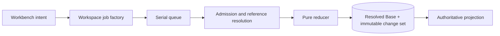

# Capability — Icarus Workspace Runtime Model

> Mirrored from [Notion](https://app.notion.com/p/3aeb6410e50281bb8a66db02a25ad5bf).

## Summary / Concept
Workspace is build position **Project 2** and follows the Project capability. Project supplies the project-level Overview seam; Workspace owns only durable workbench-shell state and stable references to resource editors.
### Prerequisites and build position
#### Required before implementation
- Runtime scope configuration, Logger, SQLite, and the serial/concurrent job runtime.
- Shared `ResourceRef`, permanent-destination identity, stable target, and versioned view-envelope contracts.
#### Construction boundary
The capability is constructed with a store already bound to the configured runtime scope. Domain values, endpoint payloads, jobs, and capability-owned tables use resource identities; scope routing remains in initialization. Accepted change records receive attribution from the initialized runtime.
Workspace is the durable workbench-shell state for the configured runtime scope. It owns the permanent `overview`, `research`, and `analyze` destinations, open editable-Resource tabs, active focus, tab order, panel geometry, and bounded per-tab view state.
### Purpose and boundary
Workspace restores the workbench exactly enough that the caller can resume work after a refresh or restart.
It owns:
- one default Workspace per the configured runtime scope;
- the permanent Overview, Research, and Analyze tabs;
- open Document, Slides, and Spreadsheet tabs;
- active-tab identity and tab order;
- workspace-wide panel geometry;
- per-tab Context lens, Inspector target/mode, and bounded viewport envelopes;
- Workspace revisions, submissions, change sets, and shell undo/redo.
Project metadata and the authored project summary remain Project-owned. Questions, Context definitions, Research state, editor content, source material, and comments retain their capability owners. Workspace stores stable typed references and reads titles through editor summary ports. Pointer, caret, hover, drag, and other transient interaction state stays in the frontend session.
Opening a view affects shell state. Knowledge admission remains governed by Source Versions, admitted Evidence, and literal Media OCR.
### Repository placement
```plain text
apps/backend/src/3-capabilities/workspace/
  domain/
    model.ts
    operations.ts
    reducer.ts
    validation.ts
  application/
    service.ts
  ports/
    repository.ts
    resourceReaders.ts
  persistence/
    migrations/
      001-workspace.ts
    sqliteWorkspaceRepository.ts
  index.ts

apps/backend/src/4-job-wiring/workspace/
  registerWorkspaceEndpointMappings.ts
  workspaceJobFactories.ts
```
Workspace is composed into the backend. The repository port, migrations, and `SqliteWorkspaceRepository` stay inside Workspace. `1-init` receives the Platform Database handle, constructs the adapter, and injects it. Frontend-facing DTOs with cross-runtime value belong in `packages/shared`.
## Types & Interfaces
### Aggregate, view, and operation types
The Workspace head stores a resolved `baseJson` plus a logical revision. The reducer is pure and receives already-resolved Resource references:
```typescript
interface VersionedView {
  kind: string;
  schemaVersion: number;
  data: Record<string, unknown>;
}

type TabView = VersionedView;

type ResourceRef = {
  kind: "document" | "slides" | "spreadsheet";
  id: string;
};

type StableTargetRef =
  | { kind: "resource"; resource: ResourceRef }
  | { kind: "resource_node"; resource: ResourceRef; nodeId: string }
  | { kind: "question"; questionId: string }
  | { kind: "analysis"; analysisId: string };

interface WorkspaceBase {
  schemaVersion: 1;
  tabs: WorkspaceTab[];
  activeTabId: string;
  chrome: { contextWidthPx: number; inspectorWidthPx: number };
}

type WorkspaceTab =
  | { id: string; kind: "system"; destination: "overview" | "research" | "analyze"; view: TabView }
  | { id: string; kind: "resource"; resource: { kind: "document" | "slides" | "spreadsheet"; id: string }; view: TabView };

type WorkspaceOperation =
  | { kind: "open_resource"; tabId: string; resource: ResourceRef; view: TabView }
  | { kind: "activate_tab"; tabId: string }
  | { kind: "close_tab"; tabId: string }
  | { kind: "close_others"; exceptTabId: string }
  | { kind: "move_tab"; tabId: string; beforeTabId: string | null }
  | { kind: "set_chrome"; contextWidthPx?: number; inspectorWidthPx?: number }
  | { kind: "set_panel_view"; tabId: string; panel: "context" | "inspector"; view: VersionedView }
  | { kind: "set_resource_view"; tabId: string; view: VersionedView }
  | { kind: "reveal_target"; target: StableTargetRef };

interface MutateWorkspaceRequest {
  workspaceId: string;
  expectedRevision: number;
  submissionId: string;
  historyClass: "undoable" | "sync_only";
  operations: readonly WorkspaceOperation[];
}

interface WorkspaceSnapshot {
  workspaceId: string;
  revision: number;
  base: WorkspaceBase;
  createdAt: string;
  updatedAt: string;
}
```
Each submission carries `expectedRevision`, `submissionId`, and a closed operation batch. The transaction writes the complete next Base and one immutable change set. Change sets store exact inverse operations, `historyClass` (`undoable` or `sync_only`), and compensation lineage. Reads load the resolved Base directly.
High-frequency viewport, width, disclosure, and lens-memory updates are `sync_only`. Open, close, activate, reorder, and reveal are undoable. Undo/redo creates a new compensation change set while prior history remains immutable.
### View-envelope contract
Workspace treats editor view state as a versioned, bounded envelope. Each owning editor publishes the envelope kind and validator used by Workspace admission:
```typescript
interface WorkspaceViewCodec<T> {
  kind: string;
  schemaVersion: number;
  maxEncodedBytes: number;
  decode(value: VersionedView): T;
  encode(value: T): VersionedView;
  migrate(value: VersionedView): VersionedView;
}

interface ResourceViewRegistration<T> {
  resourceKind: ResourceRef["kind"];
  codec: WorkspaceViewCodec<T>;
}
```
Workspace stores a validated envelope while the editor capability defines its meaning. Schema migration occurs through the registered codec before a revised envelope is committed.
### Dependencies and narrow ports
Workspace uses:
```typescript
interface ResourceSummaryReader {
  getSummary(ref: ResourceRef): Promise<{ exists: boolean; title?: string }>;
}

interface StableTargetReader {
  validateTarget(target: StableTargetRef): Promise<"valid" | "stale" | "missing">;
}
```
Composition supplies adapters from Document, Slides, and Spreadsheet behind these ports. Workspace uses the Platform Database, clock, and ID generator.
## Runtime Objects
### Workspace aggregate and ChangeSet lifecycle
The Workspace head stores one resolved `WorkspaceBase` and monotonic revision. Immutable ChangeSets record forward and inverse operation batches, history class, and compensation lineage. The Workspace Boot Projection adds resource summaries and target validity without becoming canonical shell state.
The named rebuildable projection is the **Workspace Boot Projection**. It joins the resolved Base with editor-owned Resource summaries and stable-target validity. Frontend caches key it by workspaceId + revision\`; server revision comparison preserves head authority.<br>### Principal shell flows<br>#### Restore<br>The frontend requests `workspace.get`, receives one resolved Base and its revision, then resolves Resource summaries in the Workspace Boot Projection. Missing or stale targets are represented explicitly so the shell can retain tab identity and offer a stable recovery action.<br>#### Open or reveal<br>`workspace.open-resource` validates a typed Resource reference. An existing tab becomes active; a new reference creates one stable tab ID at the requested position. `workspace.reveal-target` composes target validation with the same open-or-activate reducer and stores a stable editor target for the destination view.<br>#### Close and repair focus<br>Closing the active tab selects the nearest closeable neighbor to the right, then the left, then Overview. `close-others` applies the same deterministic rule to one closed batch. The inverse records the complete removed tab positions and prior active tab.<br>#### Concurrent client edits<br>The serial queue orders shell mutations admitted by one backend process. `expectedRevision` protects the Workspace head across clients and processes. A losing client reloads the current Base, re-evaluates its stable-ID operation, and retries when the operation remains applicable. Stable tab and target IDs make this rebase deterministic.
### Key flow

## Change Operations
Workspace mutations reduce a closed operation batch against the complete shell Base. Every accepted mutation advances the Workspace revision; high-frequency view synchronization uses the same protocol with `historyClass: "sync_only"`.
<table fit-page-width="true" header-row="true">
<tr>
<td>Operation</td>
<td>Effect</td>
</tr>
<tr>
<td>`open_resource`</td>
<td>Opens or activates a stable resource tab.</td>
</tr>
<tr>
<td>`activate_tab`</td>
<td>Changes active focus.</td>
</tr>
<tr>
<td>`close_tab` / `close_others`</td>
<td>Removes closeable tabs and deterministically repairs focus.</td>
</tr>
<tr>
<td>`move_tab`</td>
<td>Changes presentation order by stable tab identity.</td>
</tr>
<tr>
<td>`set_chrome`</td>
<td>Persists bounded workbench panel geometry.</td>
</tr>
<tr>
<td>`set_panel_view`</td>
<td>Persists a versioned Context or Inspector envelope.</td>
</tr>
<tr>
<td>`set_resource_view`</td>
<td>Persists an editor-owned bounded viewport envelope.</td>
</tr>
<tr>
<td>`reveal_target`</td>
<td>Validates a stable target and composes open-or-activate navigation.</td>
</tr>
<tr>
<td>`undo` / `redo`</td>
<td>Append compensation while skipping sync-only history for navigation undo selection.</td>
</tr>
</table>
## Endpoints
<table fit-page-width="true" header-row="true">
<tr>
<td>Method and path</td>
<td>Request type</td>
<td>Result</td>
</tr>
<tr>
<td>GET /workspace</td>
<td>`workspace.get`</td>
<td>Resolved Workspace and Boot Projection.</td>
</tr>
<tr>
<td>POST /workspace/resources</td>
<td>`workspace.open-resource`</td>
<td>Accepted Workspace revision.</td>
</tr>
<tr>
<td>POST /workspace/tabs/:tabId/activate</td>
<td>`workspace.activate-tab`</td>
<td>Accepted focus change.</td>
</tr>
<tr>
<td>DELETE /workspace/tabs/:tabId</td>
<td>`workspace.close-tab`</td>
<td>Accepted close and repaired focus.</td>
</tr>
<tr>
<td>POST /workspace/tabs/:tabId/close-others</td>
<td>`workspace.close-others`</td>
<td>Accepted bounded batch.</td>
</tr>
<tr>
<td>POST /workspace/tabs/reorder</td>
<td>`workspace.reorder-tabs`</td>
<td>Accepted order revision.</td>
</tr>
<tr>
<td>PATCH /workspace/chrome</td>
<td>`workspace.set-chrome`</td>
<td>Accepted sync-only revision.</td>
</tr>
<tr>
<td>PATCH /workspace/tabs/:tabId/panels/:panel</td>
<td>`workspace.set-panel-view`</td>
<td>Accepted versioned envelope.</td>
</tr>
<tr>
<td>PATCH /workspace/tabs/:tabId/view</td>
<td>`workspace.set-resource-view`</td>
<td>Accepted editor view envelope.</td>
</tr>
<tr>
<td>POST /workspace/reveal</td>
<td>`workspace.reveal-target`</td>
<td>Accepted navigation revision.</td>
</tr>
<tr>
<td>POST /workspace/undo</td>
<td>`workspace.undo`</td>
<td>Compensating ChangeSet.</td>
</tr>
<tr>
<td>POST /workspace/redo</td>
<td>`workspace.redo`</td>
<td>Compensating ChangeSet.</td>
</tr>
</table>
### Operation semantics
<table fit-page-width="true" header-row="true">
<tr>
<td>Operation</td>
<td>Effect</td>
</tr>
<tr>
<td>`workspace.get`</td>
<td>Reads or lazily creates the default Workspace.</td>
</tr>
<tr>
<td>`workspace.open-resource`</td>
<td>Opens or activates a stable Document, Slides, or Spreadsheet reference.</td>
</tr>
<tr>
<td>`workspace.activate-tab`</td>
<td>Changes focus.</td>
</tr>
<tr>
<td>`workspace.close-tab`</td>
<td>Removes a closeable tab and deterministically repairs focus.</td>
</tr>
<tr>
<td>`workspace.close-others`</td>
<td>Closes all other closeable tabs.</td>
</tr>
<tr>
<td>`workspace.reorder-tabs`</td>
<td>Moves stable tab IDs while ordinals represent presentation order.</td>
</tr>
<tr>
<td>`workspace.set-chrome`</td>
<td>Persists bounded Context/Inspector widths.</td>
</tr>
<tr>
<td>`workspace.set-panel-view`</td>
<td>Persists collapse state, Context lens, or stable Inspector target envelope.</td>
</tr>
<tr>
<td>`workspace.set-resource-view`</td>
<td>Persists an editor-owned bounded viewport envelope.</td>
</tr>
<tr>
<td>`workspace.reveal-target`</td>
<td>Opens/activates the target Resource and exposes a stable target for navigation or undo.</td>
</tr>
<tr>
<td>`workspace.undo` / `workspace.redo`</td>
<td>Compensates the current eligible Workspace change set.</td>
</tr>
</table>
Overview, Research, and Analyze are non-closeable, deterministically identified, and pinned in that order.
## Jobs
### Request-to-job mapping
<table fit-page-width="true" header-row="true">
<tr>
<td>Request</td>
<td>Queue</td>
<td>Response</td>
</tr>
<tr>
<td>get</td>
<td>`concurrent`</td>
<td>`inline`</td>
</tr>
<tr>
<td>every shell mutation</td>
<td>`serial`</td>
<td>`inline`</td>
</tr>
<tr>
<td>undo / redo / reveal</td>
<td>`serial`</td>
<td>`inline`</td>
</tr>
</table>
Viewport and panel sync may be coalesced in the frontend before submission. Every accepted mutation remains part of the same revision protocol.
## SQL Tables
### Canonical schema
The Workspace migration runs on a connection with `PRAGMA foreign_keys = ON`. The store is already configuration-bound, so the schema contains no routing columns. `base_json` is the complete resolved `WorkspaceBase`; the reducer, not SQL, validates its closed operation semantics and registered view-envelope codecs.
```sql
CREATE TABLE workspaces (
  workspace_id TEXT PRIMARY KEY
    CHECK (length(workspace_id) > 0),
  singleton_key INTEGER NOT NULL DEFAULT 1
    CHECK (singleton_key = 1),
  revision INTEGER NOT NULL
    CHECK (revision >= 1),
  base_schema_version INTEGER NOT NULL
    CHECK (base_schema_version >= 1),
  base_json TEXT NOT NULL
    CHECK (json_valid(base_json) AND json_type(base_json) = 'object'),
  created_at TEXT NOT NULL,
  updated_at TEXT NOT NULL,
  UNIQUE (singleton_key)
);

CREATE TABLE workspace_change_sets (
  change_set_id TEXT PRIMARY KEY
    CHECK (length(change_set_id) > 0),
  workspace_id TEXT NOT NULL,
  from_revision INTEGER NOT NULL
    CHECK (from_revision >= 0),
  to_revision INTEGER NOT NULL
    CHECK (to_revision = from_revision + 1),
  submission_id TEXT NOT NULL
    CHECK (length(submission_id) > 0),
  request_kind TEXT NOT NULL
    CHECK (request_kind IN (
      'create', 'open_resource', 'activate_tab', 'close_tab',
      'close_others', 'reorder_tabs', 'set_chrome',
      'set_panel_view', 'set_resource_view', 'reveal_target',
      'undo', 'redo'
    )),
  request_hash TEXT NOT NULL
    CHECK (length(request_hash) = 64 AND request_hash NOT GLOB '*[^0-9a-f]*'),
  operations_json TEXT NOT NULL
    CHECK (json_valid(operations_json) AND json_type(operations_json) = 'array'),
  inverse_operations_json TEXT NOT NULL
    CHECK (json_valid(inverse_operations_json) AND json_type(inverse_operations_json) = 'array'),
  history_class TEXT NOT NULL
    CHECK (history_class IN ('undoable', 'sync_only')),
  compensation_of_change_set_id TEXT,
  actor_id TEXT,
  committed_at TEXT NOT NULL,
  UNIQUE (workspace_id, to_revision),
  UNIQUE (workspace_id, submission_id),
  UNIQUE (workspace_id, change_set_id),
  FOREIGN KEY (workspace_id)
    REFERENCES workspaces(workspace_id)
    ON UPDATE CASCADE ON DELETE CASCADE,
  FOREIGN KEY (compensation_of_change_set_id)
    REFERENCES workspace_change_sets(change_set_id)
    ON UPDATE CASCADE ON DELETE RESTRICT
);

CREATE TABLE workspace_command_receipts (
  workspace_id TEXT NOT NULL,
  submission_id TEXT NOT NULL,
  request_kind TEXT NOT NULL,
  request_hash TEXT NOT NULL
    CHECK (length(request_hash) = 64 AND request_hash NOT GLOB '*[^0-9a-f]*'),
  outcome TEXT NOT NULL
    CHECK (outcome IN ('accepted', 'rejected')),
  change_set_id TEXT,
  resulting_revision INTEGER,
  response_json TEXT,
  error_json TEXT,
  received_at TEXT NOT NULL,
  completed_at TEXT NOT NULL,
  PRIMARY KEY (workspace_id, submission_id),
  UNIQUE (change_set_id),
  CHECK (
    (outcome = 'accepted' AND change_set_id IS NOT NULL
      AND resulting_revision IS NOT NULL AND response_json IS NOT NULL
      AND error_json IS NULL)
    OR
    (outcome = 'rejected' AND change_set_id IS NULL
      AND response_json IS NULL AND error_json IS NOT NULL)
  ),
  CHECK (response_json IS NULL OR json_valid(response_json)),
  CHECK (error_json IS NULL OR json_valid(error_json)),
  FOREIGN KEY (workspace_id)
    REFERENCES workspaces(workspace_id)
    ON UPDATE CASCADE ON DELETE CASCADE,
  FOREIGN KEY (workspace_id, change_set_id)
    REFERENCES workspace_change_sets(workspace_id, change_set_id)
    ON UPDATE CASCADE ON DELETE RESTRICT
);

CREATE INDEX workspace_updated
  ON workspaces(updated_at DESC, workspace_id);

CREATE INDEX workspace_change_sets_revision
  ON workspace_change_sets(workspace_id, to_revision DESC);

CREATE INDEX workspace_change_sets_history
  ON workspace_change_sets(workspace_id, history_class, to_revision DESC)
  WHERE history_class = 'undoable';

CREATE INDEX workspace_change_sets_compensation
  ON workspace_change_sets(workspace_id, compensation_of_change_set_id)
  WHERE compensation_of_change_set_id IS NOT NULL;

CREATE INDEX workspace_receipts_outcome
  ON workspace_command_receipts(outcome, completed_at DESC);
```
#### Atomic write protocol
A mutation starts `BEGIN IMMEDIATE`, verifies `expectedRevision`, checks the receipt key and request hash, reduces the current Base, then writes the new Base, immutable ChangeSet, and receipt before commit. The `singleton_key` constraint permits one default Workspace in the configured store. Duplicate submissions with the same hash return the stored receipt; reuse with a different hash is rejected. Only accepted ChangeSets carry `actor_id`. Undo and redo append a compensation ChangeSet and never rewrite prior history.
#### Relational guarantees
The schema contains **3 tables** and **5 explicit indexes**. Foreign keys bind every ChangeSet and receipt to the Workspace. Revision and submission uniqueness provide compare-and-swap and idempotency. The partial history and compensation indexes support undo-candidate selection without decoding `base_json`.
## Invariants & Acceptance
### Invariants
1. Exactly one Overview, one Research, and one Analyze system tab exist.
2. System tabs remain open and occupy their fixed order.
3. At most one tab exists for each editable Resource identity.
4. Active tab always resolves.
5. Stored targets use stable IDs; display ordinals remain presentation values.
6. Every opaque view envelope has a kind, schema version, and byte bound.
7. Editor capabilities remain authoritative for Resource bodies and titles.
8. Revision compare-and-swap and submission idempotency are mandatory.
9. Undo creates compensation and preserves immutable history.
10. Durable shell state and transient interaction state have distinct storage lifetimes.
### Acceptance criteria
- A new Workspace always contains Overview, Research, and Analyze in order.
- Opening the same Resource twice activates one stable tab.
- Closing the active Resource selects a deterministic neighbor or Overview.
- Restarting the backend restores the acknowledged Workspace state.
- Stale revisions return a typed conflict; duplicate submissions are idempotent.
- Undo candidate selection skips sync-only view changes and reaches the earlier undoable navigation action.
- Resource summaries and target validation arrive exclusively through typed editor ports.
## References
- [Model — Workspace Capability & Runtime Contract](https://app.notion.com/p/3acb6410e50281ddaa6dca8f6e1802fb)
- [Architecture — Workbench Shell, Workspace & Stage Lifecycle](https://app.notion.com/p/3adb6410e50281b88424fd8694de4740)
- [Architecture — Taurus Alpha Frontend System Index](https://app.notion.com/p/3adb6410e502818fb987d5f5004117e3)
- [Product — Icarus Complete Product Definition](../product/definition.md)
