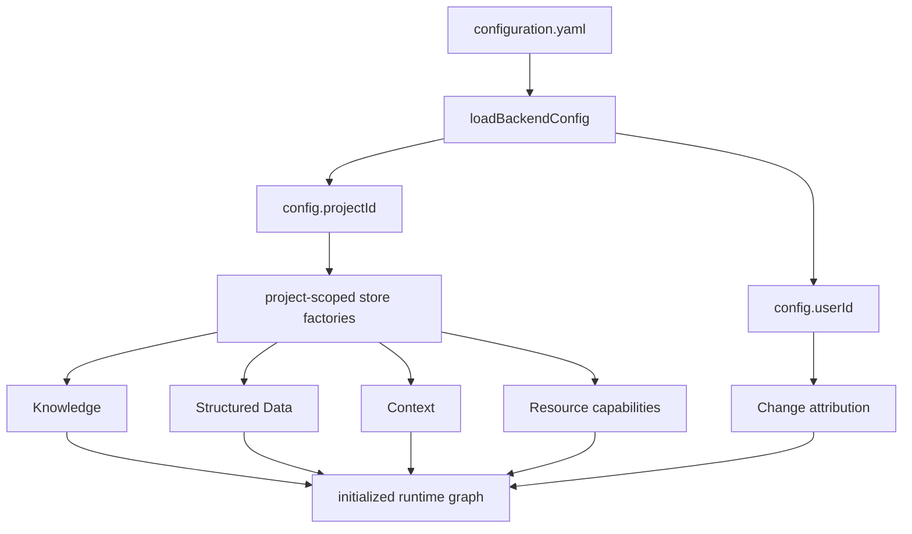

# Platform — Icarus Runtime Scope Configuration

> Mirrored from [Notion](https://app.notion.com/p/3aeb6410e502810d935fe3cf54fcf5e5).

Runtime scope is bound once during backend initialization. The configured project selects the physical stores used by platform services and capabilities; the configured actor supplies authorship metadata for accepted changes. Neither value is a product capability or an HTTP routing concern.
## Prerequisites
- Backend configuration loading and validation.
- Initialization factories under `1-init/create/`.
- SQLite store constructors that accept a scope value and derive safe table prefixes.
- The Logger used to record initialization and rejected configuration.
## Top-level configuration
```yaml
projectId: default
userId: default
```
```typescript
interface BackendConfig {
  projectId: string;
  userId: string;
  server: ServerConfig;
  workerPool: WorkerPoolConfig;
  queue: QueueConfig;
  logging: LoggingConfig;
  intelligence: IntelligenceConfig;
  formula: FormulaConfig;
  structuredData: StructuredDataConfig;
  context: ContextManagerConfig;
}
```
`projectId` already exists in the pushed Icarus configuration. `userId` belongs beside it and is injected as attribution when a capability admits a ChangeSet or Activity contribution. Configuration validation rejects blank values before any database is opened.
## Initialization model

Factories consume configuration at composition time:
```typescript
export interface RuntimeAttribution {
  actorId: string;
}

export function createBackend(config: BackendConfig, logger: Logger) {
  const attribution: RuntimeAttribution = { actorId: config.userId };

  const intelligence = createIntelligence(config.intelligence, logger);
  const formula = createFormula(config, logger);
  const structuredData = createStructuredDataInstance(config, logger);
  const formulaResolver = createFormulaNameResolver(
    formula,
    structuredData,
    logger,
    { userId: config.userId, projectId: config.projectId },
  );
  const context = createContextInstance(config, logger);
  const knowledge = createKnowledge(config.projectId, intelligence, logger, {
    resolver: context,
  });

  return createRuntime({
    intelligence,
    formula,
    structuredData,
    formulaResolver,
    context,
    knowledge,
    attribution,
  });
}
```
The exact construction order follows declared prerequisites. A factory receives only the dependencies it needs.
## Scoped-store contract
A store factory receives the loaded runtime configuration and returns a store already bound to the configured storage namespace.
```typescript
interface ScopedStoreFactory<TStore> {
  create(config: BackendConfig, database: Database): TStore;
}

const store = createDocumentStoreFromRuntimeConfig(config, database);
const documents = createDocumentCapability(store, dependencies, attribution, options);
```
Domain values, capability methods, endpoint payloads, job payloads, and ChangeSets contain resource identities and revisions, not scope-routing fields. The configured actor is copied only into accepted authorship or activity records.
## Logical and physical table names
Capability pages specify stable **logical** table names so their DDL can be read and tested directly. A SQLite adapter may map those logical names to trusted physical names derived from top-level configuration. The current Knowledge and Structured Data stores use a short hexadecimal digest:
```typescript
const prefix = sha256(config.projectId).slice(0, 16);
const dataEntriesTable = `sd_${prefix}_entries`;
```
A store backed by an isolated database may keep the logical names unchanged. A store sharing a database applies its mapping consistently to migrations, queries, constraints, and indexes. Only construction code selects this strategy; callers cannot supply a table name or prefix.
## Request and job boundary
```typescript
interface RequestEnvelope<TBody = unknown> {
  method: HttpMethod;
  path: string;
  query: Record<string, string | undefined>;
  body: TBody;
  requestId: string;
}
```
Endpoint mapping selects a job factory. The job invokes an already-constructed service instance, so scope does not travel through HTTP or queue payloads. Change attribution is read from the initialized runtime and attached during admission.
## Configuration invariants
- Runtime scope is selected before stores, migrations, capabilities, endpoint mappings, or workers start.
- A capability cannot switch stores after construction.
- Scope values never become table names without deterministic hashing and fixed prefixes.
- Public requests cannot select a project, actor, database, or table.
- The same configuration produces the same set of scoped table names.
- Accepted mutations use the configured actor attribution and preserve it in history.
- Initialization fails atomically when required configuration or a prerequisite is invalid.
## Repository placement
```plain text
apps/backend/
  etc/
    configuration.yaml
  src/
    0-utils/config/
      loadBackendConfig.ts
    1-init/
      startBackend.ts
      create/
        knowledge.ts
        structured-data.ts
        formula-name-resolver.ts
        context.ts
        document.ts
        slides.ts
        spreadsheet.ts
    0-platform/database/
      knowledge-store.ts
    3-capabilities/
      */persistence/
```
