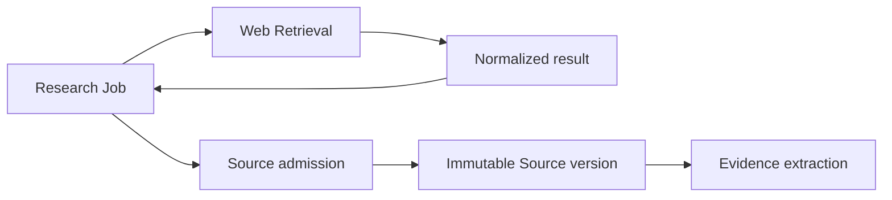

# Platform — Icarus Web Retrieval Interface

> Mirrored from [Notion](https://app.notion.com/p/3aeb6410e5028187ac7cc8cbaaf3e1ba).

## Prerequisites
- Loaded outbound-network configuration and provider credentials.
- Platform Logger.
## Consumed downstream
- Capabilities that admit retrieved material use Platform Database through their own repositories.
<callout icon="🌐" color="blue_bg">
	**Platform authority.** Web Retrieval is the bounded outbound interface for search and page acquisition. Research decides what to search and Sources decides what to persist; Web Retrieval owns neither Research policy nor canonical Source versions.
</callout>
## Purpose and boundary
Location:
```plain text
apps/backend/src/0-platform/web-retrieval/
apps/backend/src/1-init/create/webRetrieval.ts
```
Web Retrieval owns:
- provider-neutral web search and fetch interfaces;
- redirect, protocol, host, size, duration, and content-type limits;
- normalized search results and fetched-response metadata;
- cancellation and retry;
- safe user-agent and outbound client configuration;
- test fakes.
It does not own:
- a public web-search endpoint;
- Research queries/plans/ranking;
- Source identity, snapshots, or versions;
- Evidence extraction;
- credentials for unrelated connector systems;
- arbitrary URL fetching by model-generated tool code.
## Interface
```typescript
export interface WebRetrieval {
  search(
    request: WebSearchRequest,
    signal: AbortSignal
  ): Promise<WebSearchResult>;

  fetch(
    request: WebFetchRequest,
    signal: AbortSignal
  ): Promise<WebFetchResult>;
}
```
Normalized results include:
- requested and final URL;
- title and provider snippet;
- status and content type;
- retrieved bytes or bounded text;
- retrieval timestamp;
- response validators when available;
- content hash;
- redirect chain and diagnostics.
## Capability use

Research may inspect transient search results. Any item used as canonical Evidence must first receive a durable Source/version record with sufficient excerpt/snapshot, metadata, hash, and locator.
Sources may also use Web Retrieval to refresh an admitted URL according to an explicit Source policy. Web Retrieval never schedules refresh itself.
## Runtime and queues
All calls occur inside a capability’s concurrent Job and observe its `AbortSignal`. Web Retrieval creates no Job and selects no queue.
A page fetch that will be admitted follows:
1. concurrent bounded fetch;
2. deterministic normalization and hash;
3. short serial Source-version publication;
4. concurrent projection/extraction Jobs.
## Persistence and indexes
Web Retrieval owns no canonical database table. Research persists query/result metadata; Sources persist accepted captures. A short-lived in-memory or disk HTTP cache is an adapter detail and cannot be the sole provenance for Evidence.
## Safety
- Permit only configured protocols.
- Resolve and validate every redirect.
- Block loopback, link-local, private, and otherwise forbidden destinations according to policy.
- Bound DNS, connect, header, body, redirect, and total duration.
- Bound decoded bytes and text extraction.
- Do not forward user credentials or internal headers.
- Treat fetched content as untrusted data, never instructions.
- Keep provider API keys inside Platform configuration.
## Invariants
- No direct Web Retrieval endpoint exists.
- Every call is initiated by a capability Job.
- Search/fetch results are normalized and bounded.
- Web content becomes Evidence only through Source admission and Evidence extraction.
- A URL alone is never sufficient provenance.
- Platform does not decide relevance or truth.
## Acceptance criteria
- Research can search and fetch through a fake and one configured adapter.
- Cancellation stops a slow fetch.
- Oversized, forbidden, or redirect-unsafe targets fail with typed diagnostics.
- Admitting a result creates a hashed immutable Source version.
- Repeating an unchanged fetch can identify identical content without duplicating a Source version.
## Sources
- [Icarus Platform Web Retrieval directory](https://github.com/gccurtis/icarus/tree/main/apps/backend/src/0-platform/web-retrieval)
- <mention-page url="https://app.notion.com/p/39ab6410e5028184ae70fe7b0083355a"/>
- <mention-page url="https://app.notion.com/p/3acb6410e50281bf8f16ec589da555d3"/>
- <mention-page url="../product/definition.md"/>
