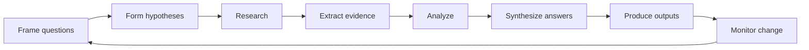
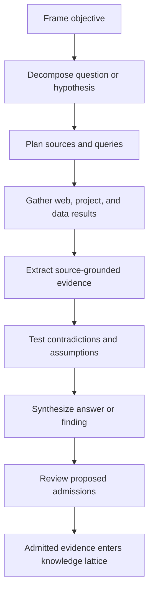

# Product — Icarus Complete Product Definition

> Mirrored from [Notion](https://app.notion.com/p/3aeb6410e502810ba9c0c26442d5255a).

<callout icon="🧭" color="blue_bg">
	**Current Icarus product authority — 2026-07-30.** Icarus is an AI-native knowledge-production workbench organized around questions, research, evidence, structured analysis, and authored outputs. This page incorporates the relevant Taurus Yesod, Malkuth, Alpha, and Omega doctrine and supersedes the earlier product model wherever it treated Chat as a Resource.
</callout>
## Executive definition
Icarus helps a person move through the intelligence cycle without losing the connection between what they are trying to learn, what they found, what they inferred, what they modeled, and what they ultimately published.
The governing loop is:

The product is still a project-first workbench with full Documents, Slides, and Spreadsheets; live content; provenance; reusable libraries; agents; and automation. The change is the organizing center:
- Questions, not files or conversations, define the work to be done.
- Research is a permanent project workspace, not a Chat Resource.
- Evidence is a canonical, source-grounded object that can enter the knowledge lattice without importing an entire website as a native Resource.
- Analyze makes structured tables, variables, assumptions, formulas, scenarios, and visualizations usable as part of the same knowledge-production loop.
- Authored Resources remain the place where conclusions become durable deliverables.
## Product doctrine
1. **Project first.** A project is the bounded body of questions, sources, evidence, data, analysis, Resources, agents, and automations that make up one body of work.
2. **Questions are first-class.** A question can be created, prioritized, researched, answered, reopened, monitored, and linked to every object that bears on it.
3. **Sources and evidence are different.** A source is where information came from. Evidence is the precise source-grounded statement, excerpt, observation, or derived finding that bears on a question or hypothesis.
4. **AI work is inspectable.** The system may propose hypotheses, assumptions, evidence, answers, charts, and content, but it must preserve provenance and make consequential admissions or mutations visible.
5. **Analysis is part of knowledge work.** Quantitative data, formulas, scenarios, and charts are not a separate product; they are another means of answering project questions.
6. **Outputs stay editable.** Documents, Slides, and Spreadsheets are full work surfaces, not generated attachments or previews.
7. **Live content retains lineage.** Content may reference evidence, data, analysis, or another Resource and refresh without becoming untraceable.
8. **The interface is quiet and legible.** The system should reveal great depth through drawers, inspectors, and contextual lenses without making the default workspace feel crowded.
## Project information architecture
Every project has exactly three permanent, non-closable destinations:
<table header-row="true">
<tr>
<td>Destination</td>
<td>Purpose</td>
<td>Primary objects</td>
</tr>
<tr>
<td>**Overview**</td>
<td>Frame and supervise the project.</td>
<td>Questions, current answers, project scope, activity, Resource catalog, automation summary</td>
</tr>
<tr>
<td>**Research**</td>
<td>Discover and test what is true.</td>
<td>Research runs, hypotheses, assumptions, sources, proposed evidence, synthesized answers</td>
</tr>
<tr>
<td>**Analyze**</td>
<td>Interrogate structured information and assumptions.</td>
<td>Tables, variables, formulas, dependencies, scenarios, charts, analysis views</td>
</tr>
</table>
Documents, Slides, and Spreadsheets open as closable Resource tabs after those permanent destinations. There is no Chat Resource and no generic project Chat tab. Conversational interaction appears only where it serves a bounded object or activity, such as a Research run, an Agent task exchange, or the AI Quarterback attached to a Resource or analysis.
## Overview
Overview is the default project landing page. Its job is to make the state of the inquiry legible, not merely list files.
### Default composition
1. Project identity, description, scope, status, and key dates.
2. Questions grouped by status, priority, or theme.
3. Current-answer and confidence summary for important questions.
4. Research needing review: proposed evidence, unresolved contradictions, and unanswered assumptions.
5. Recent Resources and project activity.
6. Automation lens: active automations, next scheduled work, recent runs, and failures requiring attention.
### Questions
A Question is a durable project object. A useful initial model is:
```typescript
interface Question {
  id: string;
  text: string;
  description?: string;
  status: 'open' | 'researching' | 'answered' | 'monitoring' | 'closed';
  priority: 'low' | 'normal' | 'high' | 'critical';
  ownerId?: string;
  tags: string[];
  currentAnswerId?: string;
  createdAt: string;
  updatedAt: string;
}
```
A question can relate to:
- one or more hypotheses and their assumptions;
- research runs;
- evidence for, against, or adjacent to the question;
- structured tables and variables;
- analyses, scenarios, and charts;
- source and Context items;
- Documents, Slides, and Spreadsheets;
- automations that refresh or monitor the question.
### Question detail pattern
Clicking a question opens a **long right-side drawer**. A drawer supports inspection, editing, linked navigation, evidence comparison, and persistent question context while project material remains visible. Small focused actions, such as changing status or confirming evidence admission, may still use modals.
The drawer contains:
- the exact question and project framing;
- current answer, answer date, confidence, and status;
- evidence supporting, refuting, qualifying, or contextualizing the answer;
- hypotheses and assumptions;
- unresolved gaps and contradictions;
- related structured data, variables, analyses, and charts;
- Research history and in-progress runs;
- downstream Resources that use the answer or its evidence;
- actions to start Research, test a hypothesis, update the answer, or create an automation.
An Answer is versioned. The current answer points to one immutable answer revision so changes, rationale, and supporting Evidence remain inspectable.
## Research
Research is the principal environment for answering questions and testing beliefs. AI is intrinsic to the surface, so it does not require a separate AI Quarterback bar.
### Modes
<table header-row="true">
<tr>
<td>Mode</td>
<td>Intent</td>
<td>System behavior</td>
</tr>
<tr>
<td>**Question**</td>
<td>“What is the best current answer?”</td>
<td>Decompose the question, propose hypotheses and assumptions, plan and execute research, extract evidence, identify gaps, and synthesize an answer.</td>
</tr>
<tr>
<td>**Hypothesis**</td>
<td>“Can this proposition survive an attempt to disprove it?”</td>
<td>Resolve or create assumptions, actively seek disconfirming as well as supporting evidence, test against project data, and report what would invalidate the proposition.</td>
</tr>
<tr>
<td>**Discover**</td>
<td>“What important things should I know about this subject?”</td>
<td>Explore a bounded subject, cluster findings, surface unexpected evidence and possible questions, and propose what belongs in the project fact base.</td>
</tr>
</table>
Discover is a bounded third mode for surfacing important findings and candidate Questions.
### Research run
Each submission creates a durable Research run:

A run can use:
- public web research;
- project Context and source snapshots;
- relevant excerpts from Documents, Slides, and Spreadsheets;
- previously admitted evidence;
- structured tables, variables, formulas, and analysis results;
- prior Research runs and answer revisions.
The system should expose the plan and progress without exposing hidden chain-of-thought. Product-facing reasoning consists of queries, selected sources, explicit hypotheses, assumptions, evidence, contradictions, confidence, and concise rationale.
### Source, evidence, claim, and answer
These terms must remain distinct:
<table header-row="true">
<tr>
<td>Object</td>
<td>Meaning</td>
</tr>
<tr>
<td>**Source**</td>
<td>An origin and immutable version: website snapshot, file revision, connector item version, Resource revision, or Data revision.</td>
</tr>
<tr>
<td>**Evidence**</td>
<td>A bounded, source-grounded excerpt, observation, calculation, or explicitly labeled inference relevant to a question or hypothesis.</td>
</tr>
<tr>
<td>**Claim**</td>
<td>A proposition that evidence may support, refute, qualify, or leave unresolved.</td>
</tr>
<tr>
<td>**Answer**</td>
<td>A versioned synthesis for a Question, with confidence, caveats, and links to the evidence and analysis used.</td>
</tr>
</table>
“Evidence” is the preferred product term. “Fact” may be shown only for reviewed evidence promoted to a high-confidence factual status. This avoids implying that every AI extraction is automatically true.
### Evidence record
An Evidence object should preserve:
- source and exact source version;
- source locator, URL, and access time;
- direct quotation or exact data locator when available;
- normalized evidence statement;
- whether the statement is quoted, observed, calculated, or inferred;
- the actor/model and Research run that extracted it;
- polarity relative to a linked hypothesis: supports, refutes, mixed, contextual, or unknown;
- confidence and review state;
- admission state and admission history;
- links to Questions, hypotheses, assumptions, data, analyses, and outputs.
A website does not need to become a native Resource for one useful finding to enter the project. Icarus must nevertheless retain enough of the source to defend the evidence later: source metadata, captured excerpt or bounded snapshot, content hash, retrieval time, and locator. A bare URL is not sufficient provenance.
Proposed evidence remains attached to its Research run. Admitted evidence becomes canonical project evidence and receives a projection in the knowledge lattice. The lattice improves discovery; it does not replace the canonical Evidence record or its source.
### Research outcomes
A completed run may produce:
- a proposed answer or answer revision;
- hypotheses and explicit assumptions;
- evidence recommended for admission;
- evidence requiring human review;
- contradictions and alternative explanations;
- missing data or unanswered subquestions;
- suggested follow-up Research;
- suggested analysis, charts, or downstream content.
Nothing needs to be admitted merely because the model found it. High-confidence, directly quoted Evidence may be preselected for review, while admission remains an explicit visible action.
## Analyze
Analyze is a permanent project destination for working with structured information. It should feel closer to a lightweight Tableau or modeling workbench than to a spreadsheet grid.
### Core model
Analyze consumes canonical project structured data:
- editable tables with typed columns and rows;
- scalar variables and assumptions;
- named bindings for tables, columns, variables, Resource values, and selected outputs;
- formulas and formula dependencies;
- saved analysis views;
- chart specifications;
- scenarios and scenario overrides.
Data owns stable declarations and display names together with typed tables and variables. Formula is the pure parser, binder, evaluator, and dependency service that consumes immutable Data resolver snapshots. Analyze owns views, scenarios, chart specifications, and accepted results.
### Experience
The surface provides:
- data and variable browser;
- drag-and-drop chart construction;
- field roles, filters, groups, aggregations, and calculated fields;
- visible dependency graph;
- controls for changing assumptions and comparing scenarios;
- sensitivity and “what would have to be true?” exploration;
- links from a chart or model result back to the Question or hypothesis being tested;
- saveable analysis views that can be inserted into Documents, Slides, or Spreadsheets as live content.
Analyze includes the AI Quarterback. It can explain a dataset, propose a test, build a chart, identify missing variables, describe a dependency chain, compare scenarios, and help interpret results. Any created or changed analysis remains an ordinary, reviewable operation with provenance.
## Resources and the workbench
Icarus has three native Resource kinds:
1. **Document** — structured long-form writing, templates, context slots, live values, citations, and export.
2. **Slides** — full deck editing, stable slide identities, layout-aware generation, live charts/content, and presentation export.
3. **Spreadsheet** — one sparse grid with stable axes and cells, formulas, structured spills, charts, overlays, named ranges, and spreadsheet-file import/export.
General uploaded files, links, website captures, and connector items are Sources or Context. They can be indexed and cited without pretending to be editable native Resources.
The workbench retains:
- permanent project destinations followed by closable Resource tabs;
- a central editor or workspace;
- a contextual inspector for the selected object;
- a project Context lens that shows what the current surface can use;
- AI Quarterback on Resources and Analyze;
- version history, provenance, citations, comments, and activity;
- live content whose source and refresh state remain inspectable.
## Libraries
Libraries provide reusable Context packages, Templates, and Personas. A project use pins or materializes an exact version so later library edits cannot silently change active work.
<table header-row="true">
<tr>
<td>Library</td>
<td>Purpose</td>
<td>Project behavior</td>
</tr>
<tr>
<td>**Context**</td>
<td>Reusable source and resource sets.</td>
<td>Reference or materialize an exact Context definition.</td>
</tr>
<tr>
<td>**Templates**</td>
<td>Reusable Document, Slides, and Spreadsheet structures.</td>
<td>Materialize an independent native Resource from an exact published version.</td>
</tr>
<tr>
<td>**Personas**</td>
<td>Reusable Agent behavior definitions.</td>
<td>Pin an immutable Persona snapshot into a task or workflow.</td>
</tr>
</table>
The Agents screen is a separate activity route rather than a fourth permanent project destination.
## Agents and automation
An Agent is durable work within the configured project, with an objective, Persona snapshot, run history, progress, questions, steering, result, and observable actions. A task exchange is the bounded communication surface for active Agent work.
Automation operates across project objects, but it does not need a fourth permanent tab. The recommended UI is:
1. Configure an automation contextually from the object it watches or acts upon: Question, hypothesis, Research plan, Source, Evidence set, structured table, analysis, or Resource.
2. Show relevant automations in that object’s drawer or inspector.
3. Provide a project-wide **Automation lens** on Overview with active status, next run, last result, failures, and a create/manage entry point.
An Automation specifies:
- trigger: schedule, source change, Resource change, data change, answer staleness, evidence condition, or manual event;
- watched object and trigger boundary;
- agent/Persona and objective;
- allowed actions and target objects;
- review policy;
- run history and next run;
- pause, resume, edit, and delete controls.
This placement keeps automation close to meaning while giving the project one place to supervise everything.
## Live content, provenance, and change
Any output fragment may be bound to a source object:
- an Evidence excerpt or Answer;
- a structured variable, table region, formula result, or chart;
- another Resource fragment;
- a Research or Agent result that has been explicitly canonicalized.
A live binding records source identity, exact revision or update policy, target location, transformation, last refresh, and provenance. Source change marks dependents stale or queues a refresh according to policy. The dependency can be inspected, refreshed, detached to a static copy, or reverted.
## Sources and inherited authority
- <mention-page url="https://app.notion.com/p/38bb6410e502813e928cdd165dfe773d"/>
- <mention-page url="https://app.notion.com/p/3abb6410e50281198209dbff65b8d42b"/>
- <mention-page url="https://app.notion.com/p/3adb6410e502818fb987d5f5004117e3"/>
- <mention-page url="https://app.notion.com/p/393b6410e5028199982dd6ec664c408d"/>
- <mention-page url="https://app.notion.com/p/3acb6410e50281ddaa6dca8f6e1802fb"/>
- <mention-page url="https://app.notion.com/p/3acb6410e50281bf8f16ec589da555d3"/>
- <mention-page url="https://app.notion.com/p/3acb6410e5028157b9e4e8228237cfb8"/>
- <mention-page url="https://app.notion.com/p/3a6b6410e50281299d19d09f40660dae"/>
- <mention-page url="https://app.notion.com/p/3acb6410e50281229fe9eec53047607c"/>
- <mention-page url="https://app.notion.com/p/3acb6410e502814e928ae1f10eac6f75"/>
- <mention-page url="https://app.notion.com/p/3acb6410e50281d4a4d8ee542f91d595"/>
- <mention-page url="https://app.notion.com/p/394b6410e502814994ceece646403c79"/>
