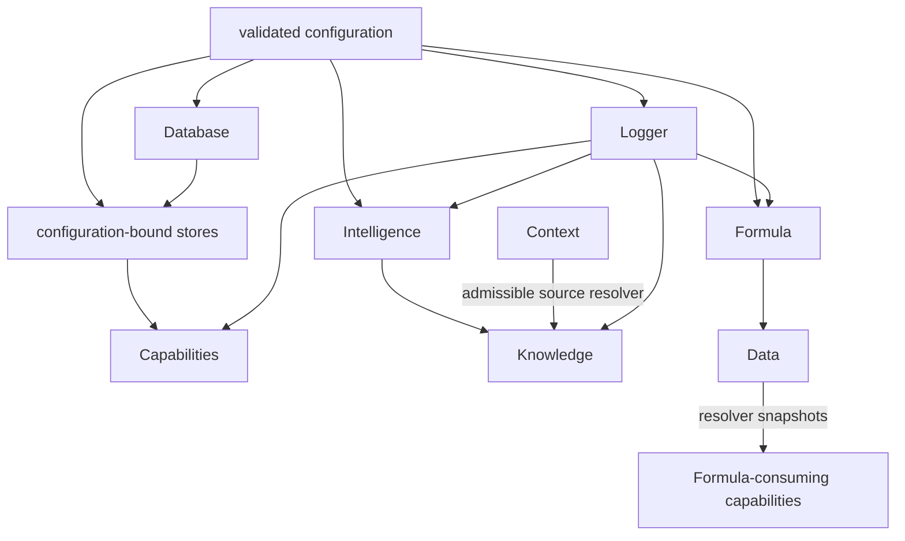
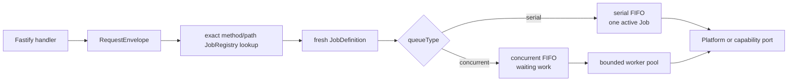
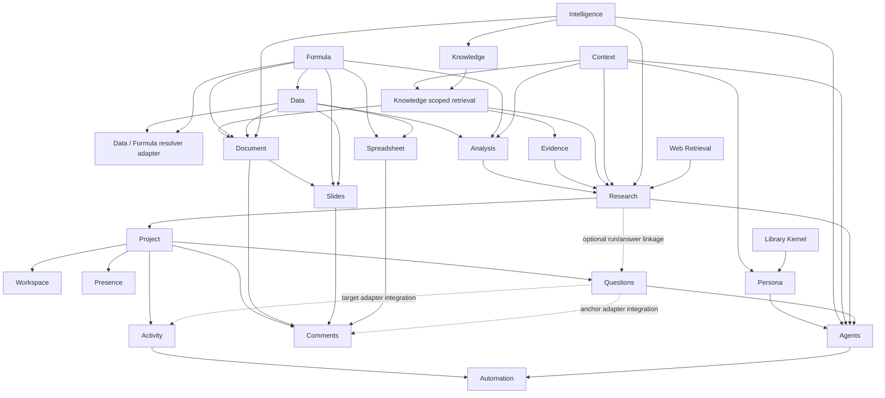

# Architecture — Icarus Backend Runtime & Capability Build Map

> Mirrored from [Notion](https://app.notion.com/p/3aeb6410e50281e1b73dd94e49d2d5d4).

> **Implementation authority.** The pushed Icarus repository defines the numbered runtime layers and implemented contracts. The capability references define the target domain, Jobs, persistence, and integration contracts.
## Two Coordinate Systems
Icarus uses two complementary forms of organization:
- **Runtime layers** determine physical placement and dependency direction: `0-platform`, `0-utils`, `1-init`, `2-transport`, `3-capabilities`, and `4-job-wiring`.
- **Build groups** determine the logical implementation sequence: Foundations, Resources, Research, Project, Collaboration, and Agentic.
A build group is not a runtime super-capability. Intelligence, Formula, and Knowledge remain Platform services even though the build sequence places them inside logical groups. Collaboration is only a heading over Activity, Presence, Comments, and Questions.
## Runtime Composition
Configuration binds project store selection and change attribution before initialization constructs Platform services and capabilities.

Endpoint payloads and domain operations carry resource identities and revisions. Initialization supplies the bound stores and attribution source.
## Repository Shape
```plain text
apps/backend/src/
  0-platform/
    database/
    formula/
    intelligence/
    knowledge/
    observability/
    web-retrieval/
  0-utils/
    config/
    jobs/
    types/
  1-init/
    create/
    startBackend.ts
  2-transport/
    registerHttpTransport.ts
  3-capabilities/
    context/
    data/
      names/
      tables/
      variables/
    document/
    slides/
    spreadsheet/
    analysis/
    evidence/
    research/
    project/
    workspace/
    activity/
    presence/
    comments/
    questions/
    persona/
    agents/
    automation/

    # supporting references whose build-group placement remains to be assigned
    sources/
    media/
    library-kernel/
    templates/
    import-export/
  4-job-wiring/
    internal/
      InternalJobDispatcher.ts
    <endpoint-owning-capability>/
```
Placement laws:
- `0-platform` contains injected runtime services that capabilities call in process.
- `0-utils` contains shared configuration, request, Job, and transport-neutral type primitives.
- `1-init` is the composition root and constructs concrete dependencies.
- `2-transport` converts HTTP and realtime traffic into typed request messages.
- `3-capabilities` contains capability-owned domains, application services, public ports, persistence, and projections.
- `4-job-wiring` maps exact endpoint paths and internal stage intents to fresh Jobs, queues, and response modes.
- Logical group names do not require wrapper directories or group-level services.
## Execution Architecture

The concurrent queue holds runnable work that cannot enter the bounded pool yet. Queue capacity applies to waiting entries. A Job keeps one queue classification for its lifetime.
Long-running canonical work uses explicit stages:
```plain text
serial request / freeze
  → concurrent compute
    → durable result
      → serial settlement
        → accepted ChangeSet or stale result
```
Each arrow creates a new typed intent and a fresh Job. The current stage commits before job wiring dispatches the next stage.
## Canonical Build Groups
<table fit-page-width="true" header-row="true">
<tr>
<td>Group</td>
<td>Ordered units</td>
<td>Primary result</td>
</tr>
<tr>
<td>1 · Foundations</td>
<td>Intelligence → Context → Formula → Data</td>
<td>Inference, scoped reference sets, deterministic expression semantics, and named structured values.</td>
</tr>
<tr>
<td>2 · Resources</td>
<td>Knowledge → Document → Slides → Spreadsheet</td>
<td>Grounded retrieval and the three native authored resource models.</td>
</tr>
<tr>
<td>3 · Research</td>
<td>Analysis → Evidence → Research</td>
<td>Structured analysis, source-grounded evidence, and Question/Hypothesis/Discovery investigation runs.</td>
</tr>
<tr>
<td>4 · Project</td>
<td>Project → Workspace</td>
<td>Project catalog, summary, and durable workbench state.</td>
</tr>
<tr>
<td>5 · Collaboration</td>
<td>Activity → Presence → Comments → Questions</td>
<td>Shared fact presentation, live presence, anchored discussion, and inquiry objects.</td>
</tr>
<tr>
<td>6 · Agentic</td>
<td>Persona → Agents → Automation</td>
<td>Reusable behavior, durable intelligent work, and triggered orchestration.</td>
</tr>
</table>
Earlier capabilities within a group establish contracts for later ones. A page's explicit prerequisites remain the final implementation gate.
## Dependency Topology
Solid arrows point from a required upstream contract to the unit that consumes it. Dashed arrows are later optional integrations and do not gate the consumer's core build.

Research accepts an inline Question, Hypothesis, or Discovery brief. Question integration is added later through an optional typed reference, so moving Questions into Collaboration does not introduce a prerequisite cycle.
## Capability and Platform Contracts
Every endpoint-owning capability defines:
1. Summary / Concept.
2. Types & Interfaces.
3. Runtime Objects.
4. Change Operations.
5. Endpoints.
6. Jobs.
7. SQL Tables.
Platform services use the same anatomy where applicable. A pure in-process service may have no product endpoint or capability-owned table; the relevant section states its in-process contract.
## Revision Models
<table fit-page-width="true" header-row="true">
<tr>
<td>Model</td>
<td>Used by</td>
<td>Law</td>
</tr>
<tr>
<td>Pure deterministic service</td>
<td>Formula</td>
<td>The same expression, resolver snapshot, and limits produce the same typed result.</td>
</tr>
<tr>
<td>Atomic revisioned record</td>
<td>Context and focused identity records inside Data</td>
<td>Stable identity, monotone revision, and one-row compare-and-swap.</td>
</tr>
<tr>
<td>Generation plus derived indexes</td>
<td>Knowledge</td>
<td>Canonical source windows and generations produce rebuildable retrieval structures.</td>
</tr>
<tr>
<td>Base plus ChangeSets</td>
<td>Data, native Resources, Analysis, Evidence, Project, Workspace, Questions, Comments, Persona definitions, Agent and Automation controls</td>
<td>Materialized Base plus accepted append-only changes reconstructs the exact logical revision.</td>
</tr>
<tr>
<td>Durable attempt and settlement</td>
<td>Research, recalculation, rendering, Agents, and Automation</td>
<td>Freeze serially, compute concurrently, then compare-and-swap during serial settlement.</td>
</tr>
<tr>
<td>Append-only fact stream</td>
<td>Activity</td>
<td>Canonical facts are immutable; presentation rows rebuild.</td>
</tr>
<tr>
<td>TTL lease registry</td>
<td>Presence</td>
<td>Leases expire automatically and never become authored history.</td>
</tr>
</table>
## Canonical, Operational, and Derived State
- **Canonical state** is the minimum durable state required to reproduce an accepted revision.
- **Operational state** contains durable attempts, stage receipts, checkpoints, and failures required for recovery.
- **Derived index** means rebuildable acceleration or presentation state, such as Knowledge retrieval structures, Formula dependency maps, editor outlines, chart renders, or Activity items.
- **SQL index** is a database access path or integrity constraint.
A derived index never becomes canonical authority.
## Database Law
- Every Platform store or capability owns its tables, migrations, repository port, and SQLite adapter.
- Canonical writes, receipts, head revisions, and outbox contributions commit together.
- Foreign keys, uniqueness constraints, digest-backed idempotency, and compare-and-swap statements enforce persistence invariants.
- Cross-capability references use public typed identities and are validated through ports.
- Blobs and JSON values use canonical encodings and content digests.
- Derived tables record their source revision or generation so they can be invalidated and rebuilt.
- Presence uses its injected TTL registry rather than SQLite.
## Implementation Rule
A unit begins after every required prerequisite contract exists. Its implementation is complete when domain transitions, stores, migrations, Jobs, endpoints, queue behavior, async settlement, rebuildable projections, and acceptance tests agree with the reference page.
