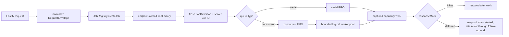

# Model — Icarus Request, Job & Dual-Queue Runtime

> Mirrored from [Notion](https://app.notion.com/p/3adb6410e50281c498f4d7f6a621eba2).

## Prerequisites
- Loaded backend configuration with `serialQueueMaxSize`, `concurrentQueueMaxSize`, and `concurrentWorkers`.
- Platform Logger available to runtime composition.
- Fastify transport normalization and application initialization under the numbered Icarus repository layers.
## Purpose
Icarus has two explicit execution paths. Serial work runs one Job at a time in FIFO order. Concurrent work runs through a bounded pool; accepted work that cannot begin immediately waits in the concurrent FIFO queue. Queue choice is owned by job wiring and cannot be selected by the caller.
TypeScript executes I/O-bound Promises concurrently on the Node event loop. A concurrent worker is therefore a logical scheduler slot. The queue and pool boundary also leaves room for a CPU executor behind a serializable handler contract when a capability needs one.
## End-to-end flow

## Request boundary
Transport converts framework-specific input into one framework-neutral envelope:
```typescript
interface RequestEndpoint {
  method: string;
  path: string;
}

interface RequestEnvelope extends RequestEndpoint {
  requestId?: string;
  params: Record<string, unknown>;
  query: Record<string, unknown>;
  headers: Record<string, unknown>;
  body: unknown;
}
```
Routes match method and path, validate and normalize operation input, and hand the envelope to the registry. The envelope carries transport data only; runtime configuration is already bound into the capability objects and factories constructed during initialization.
## Job contracts
```typescript
type QueueType = "serial" | "concurrent";
type ResponseMode = "inline" | "deferred";

interface JobResponse {
  statusCode: number;
  body?: unknown;
  headers?: Record<string, string>;
}

interface BaseJobDefinition {
  name: string;
  queueType: QueueType;
}

interface InlineJobDefinition extends BaseJobDefinition {
  responseMode: "inline";
  work: () => Promise<JobResponse>;
}

interface DeferredJobDefinition extends BaseJobDefinition {
  responseMode: "deferred";
  deferredWork: () => Promise<JobResponse>;
  work: () => Promise<unknown>;
}

type JobDefinition = InlineJobDefinition | DeferredJobDefinition;
type Job = JobDefinition & { id: string };
type JobFactory = (request: RequestEnvelope) => JobDefinition;
```
A JobFactory validates the endpoint-specific shape, captures the injected capability method and normalized arguments in a fresh closure, chooses `queueType` and `responseMode`, and returns a definition. The registry adds the server-owned Job ID.
## Registry
`JobRegistry` maps an uppercase `METHOD /path` key to exactly one `JobFactory`. Registration occurs during application initialization. Duplicate registrations fail initialization. Every request creates a fresh Job; factories and Job instances are never shared between requests.
```typescript
interface JobRegistryPort {
  register(endpoint: RequestEndpoint, factory: JobFactory): void;
  has(endpoint: RequestEndpoint): boolean;
  createJob(request: RequestEnvelope): Job;
  listEndpoints(): string[];
}
```
Job mappings live under `4-job-wiring/`. Capability modules expose typed ports; they do not import transport or the generic registry.
## Scheduler configuration and state
```typescript
interface JobSchedulerConfig {
  concurrentWorkers: number;
  serialQueueMaxSize: number;
  concurrentQueueMaxSize: number;
}

interface JobSchedulerState {
  serialDepth: number;
  serialActive: boolean;
  concurrentDepth: number;
  concurrentActive: number;
  concurrentWorkers: number;
}
```
Both waiting queues are bounded. Admission checks the selected waiting queue before enqueue. Capacity refusal is a typed `QueueCapacityError` carrying the selected `queueType`; transport maps it to a retryable response.
## Serial path
The serial scheduler owns one FIFO and one `serialActive` flag:
```plain text
queue [A, B, C]

start A → finish A
start B → finish B
start C → finish C
```
- At most one serial Job occupies the execution path.
- The active slot remains occupied for the Job's entire lifecycle.
- Completion or failure releases the slot and immediately advances the queue.
- A failed Job does not stop later Jobs.
State-changing commands normally use this path so accepted revision checks, ChangeSets, and canonical writes are ordered through one visible boundary.
## Concurrent path
The concurrent scheduler owns one FIFO plus `concurrentWorkers` logical slots:
```plain text
active [A, B, C, D]
queue  [E, F, G]

B completes → E starts in the released slot
```
- Jobs start from the queue head while `concurrentActive < concurrentWorkers`.
- Each started Job increments the active count exactly once.
- Completion or failure decrements the count exactly once and drains more queued work.
- Database reads, model calls, web retrieval, parsing, rendering, and other independent waiting-heavy work normally use this path.
## Response modes
`inline` waits for `work()` and returns its `JobResponse`.
`deferred` begins only after the Job reaches the front of its selected queue. It calls `deferredWork()` to construct the response, releases that response to transport, yields once to the event loop, and then runs follow-up `work()`. The Job retains its serial or concurrent slot until the follow-up work settles, so a deferred response never bypasses queue ordering or pool capacity.
## Result and failure boundary
```typescript
interface JobExecutionResult {
  jobId: string;
  jobName: string;
  queueType: QueueType;
  respondedAt: string;
  response: JobResponse;
}
```
Inline work either produces a result or rejects the enqueue promise. Deferred response construction follows the same rule. A failure after a deferred response is already available is recorded through Platform logging and still releases the scheduler slot. Queue infrastructure failures remain distinct from capability diagnostics.
## Repository placement
```plain text
apps/backend/src/
  0-utils/
    jobs/
      types.ts
      registry.ts
      scheduler.ts
    types/
      request.ts
  1-init/create/
    registry.ts
    scheduler.ts
  2-transport/
    registerHttpTransport.ts
  3-capabilities/
    <capability>/
  4-job-wiring/
    registerEndpointMappings.ts
    <capability>/
      registerEndpointMappings.ts
```
## Governing invariants
1. Every accepted request maps to one fresh Job.
2. Every Job belongs to exactly one queue.
3. Queue and response modes are selected by application wiring.
4. The serial path executes at most one Job at a time.
5. Concurrent active work never exceeds `concurrentWorkers`.
6. Both waiting queues enforce configured capacity.
7. A failure always releases the occupied execution slot.
8. Deferred work retains its slot after its response becomes available.
9. Generic runtime code knows nothing about capability domain types.
10. Capability code knows nothing about Fastify, queue arrays, or registry lookup.
