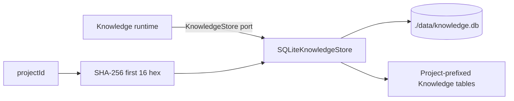
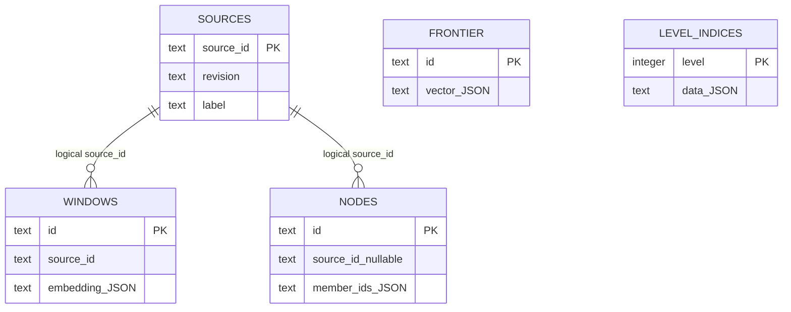

# Database concepts

## Current boundary

The directory name suggests a general platform, but source currently implements a narrower persistence adapter:

Knowledge owns the persistence contract and data meaning. Database owns the concrete SQLite encoding and query behavior for that contract. It does not expose generic transactions to other capabilities.

## Project scoping

The constructor hashes `projectId` with SHA-256 and uses the first 16 hexadecimal characters as a table-name prefix. For prefix `abc...`, tables are named:

- `kn_<prefix>_sources`
- `kn_<prefix>_windows`
- `kn_<prefix>_nodes`
- `kn_<prefix>_frontier`
- `kn_<prefix>_level_indices`

Multiple projects can therefore share the same database file without passing project IDs through each operation. The original project ID is not persisted, so the database cannot independently explain which project owns a prefix. A 64-bit truncated-hash collision is possible in principle and is not detected.

## Canonical and derived data

| Data | Role |
| --- | --- |
| Source records | Ingest registry: label, caller revision, counts, size, timestamps |
| Windows | Retained verbatim text, positions, and embeddings used by retrieval |
| Source nodes | Rebuildable source lattice |
| Corpus nodes | Rebuildable cross-source lattice (`source_id IS NULL`) |
| Frontier | Rebuildable descent entry surface |
| Level indices | Serialized IVF/PCA index values; currently persisted but not used by `Knowledge.retrieve` |

The adapter itself does not enforce the canonical/derived distinction. Its methods expose exactly the operations requested by `KnowledgeStore`.

## Connection policy

Construction creates the parent directory, opens `better-sqlite3`, and applies:

- `journal_mode = WAL`
- `synchronous = NORMAL`
- `foreign_keys = ON`

Schema is created immediately with `CREATE TABLE/INDEX IF NOT EXISTS`. There is no versioned migration or checksum. Existing incompatible schemas are not upgraded.

## Synchronous driver behind async port

The `KnowledgeStore` contract returns promises, while `better-sqlite3` executes synchronously. Each adapter method is `async` but performs all SQLite work before its already-resolved promise is observed. This simplifies the port but means large statements/bulk transactions block the event loop.

## Ownership outside this directory

Connector, Context, Derived Outputs, General Files, Structured Data, Document, and Slide have their own SQLite adapters and database files. They do not use `SQLiteKnowledgeStore` or a shared Database runtime. Cross-capability atomic transactions are therefore not available through this platform directory.

## High-level persistence topology

The relationships shown are logical only: the current DDL declares no foreign keys between these tables.
