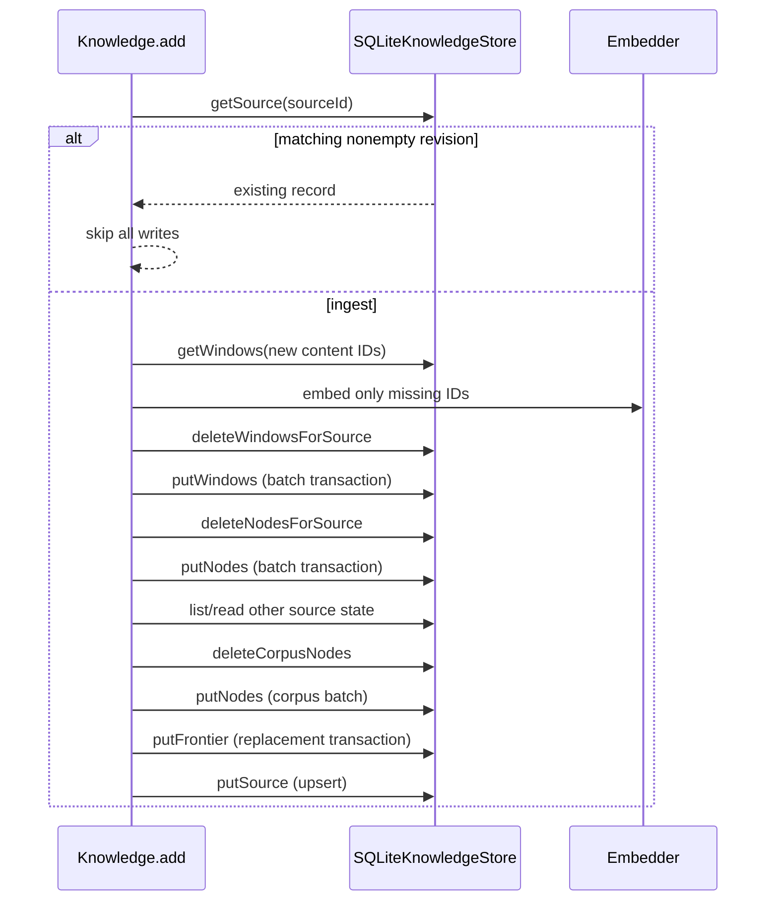
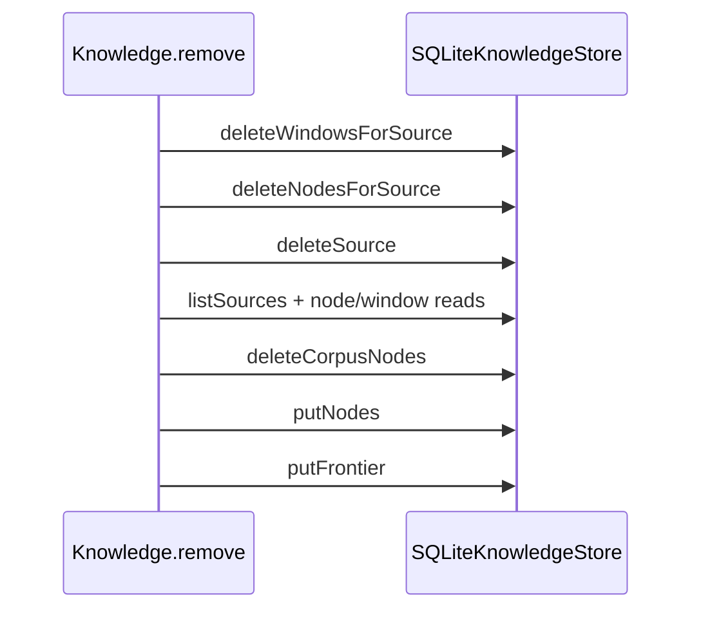
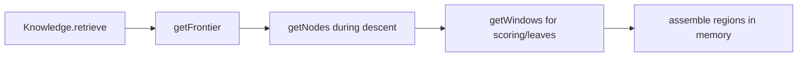
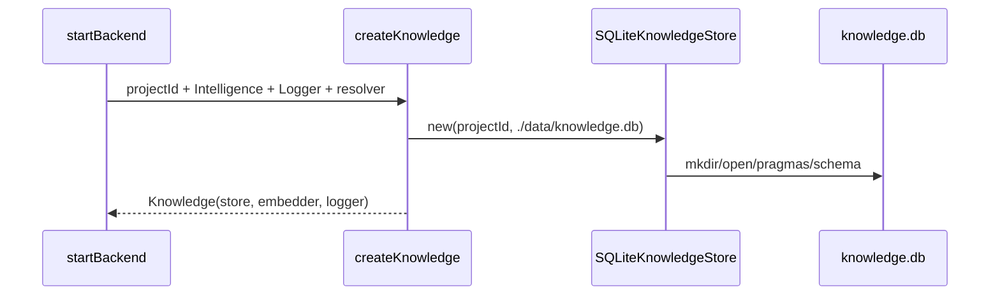

# Database flows

## Endpoint and job ownership

Database registers no endpoints and creates no jobs. Every call originates inside `Knowledge`, itself called by Connector, General Files, or Derived Outputs jobs. The SQLite adapter neither selects queues nor constructs HTTP responses.

## Source add/replace

The sequence is not enclosed in one transaction. Notably, the new source record is written after the corpus rebuild.

## Source removal

Removal of an absent source still rebuilds the corpus tier. Because no foreign keys exist, Knowledge explicitly deletes dependent windows and nodes before the registry row.

## Retrieval

`getLevelIndex` is not called by the current retrieval path. `topK` in Knowledge retrieval options is also not consumed. Descent makes repeated small node/window reads rather than one joined query.

## Scope resolution

For `Knowledge.resolveScope([])`, the adapter supplies all project source records through `listSources()`. For explicit entries, the resource resolver determines source IDs; the adapter is not consulted to prove that each resolved ID exists. The resulting manifest can therefore name a source not currently stored, which simply yields no windows after descent/filtering.

## Initialization

Schema setup is eager and can fail startup. It does not inspect or migrate existing table definitions.

## Test construction

There is no repository-provided temporary-database factory for this platform. A direct adapter test must create a unique temporary directory/database path, instantiate with an isolated project ID, call `close()`, and remove the temporary directory after the test. Current Knowledge-related tests generally replace the port with an in-memory object.
