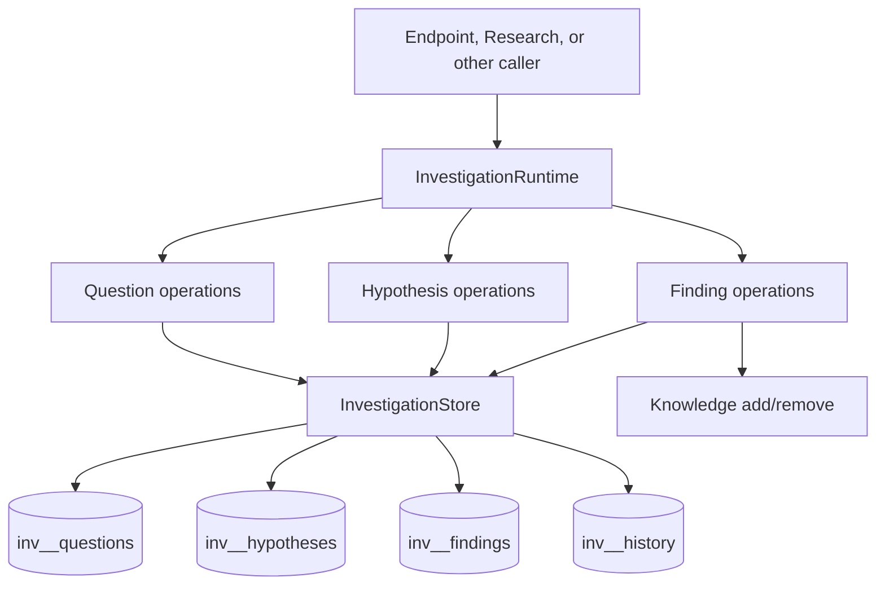
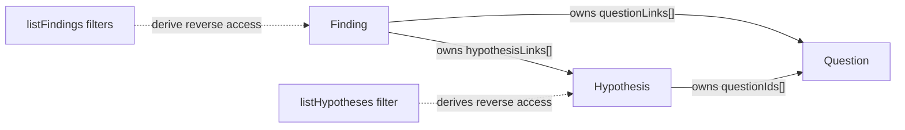
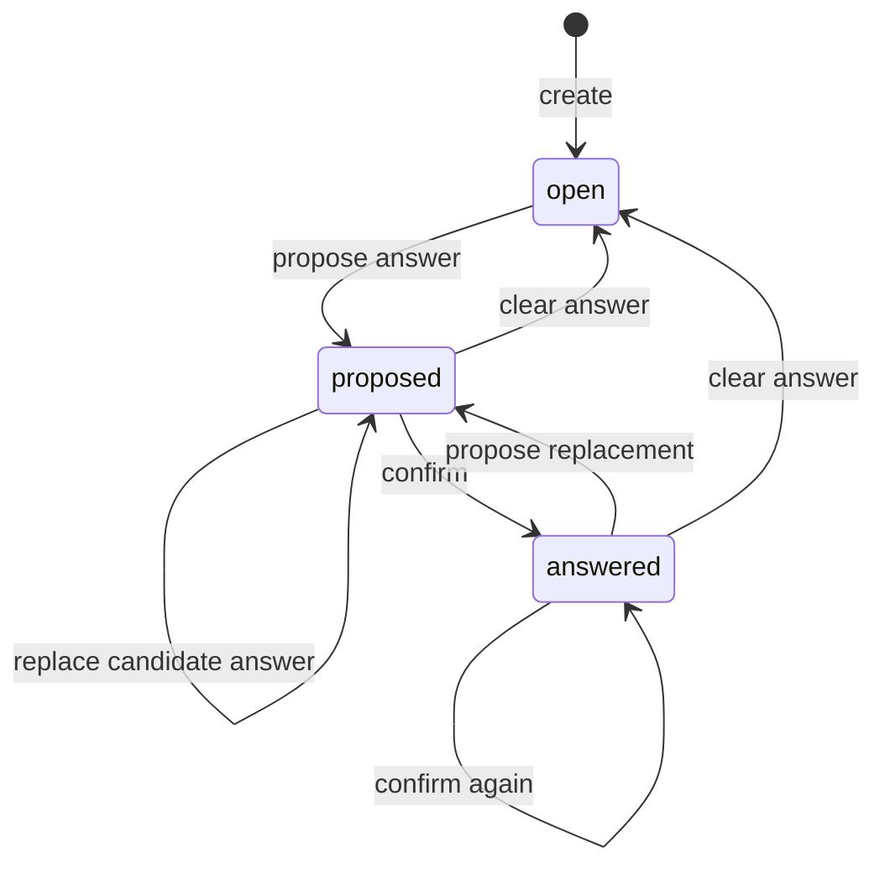
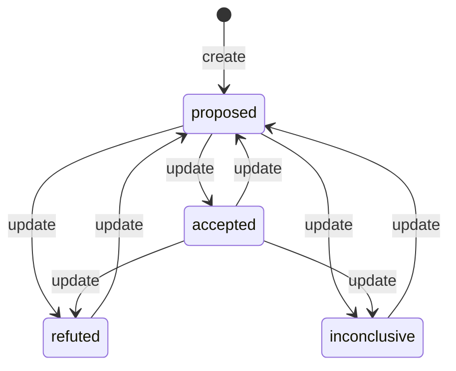
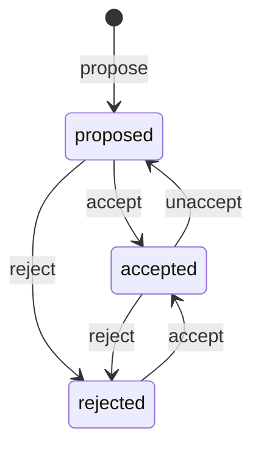

# Investigation concepts

## Purpose and outcomes

Investigation keeps the smallest durable model needed to move from a research
problem to evaluated claims and grounded conclusions:

- a **Question** records what needs to be learned, its framing, assumptions,
  and one mutable current answer;
- a **Hypothesis** records a proposed explanation or claim that may address
  zero, one, or many Questions; and
- a **Finding** records a claim grounded in one or more lightweight references
  and may bear on Questions or Hypotheses.

All three are managed through the same runtime and store. Consolidation lets
their canonical types refer to each other without creating cross-capability
ports or separate “persisted” and “runtime” variants.

## Vocabulary

| Term | Current meaning |
|---|---|
| Investigation | The capability boundary; not a persisted record or lifecycle |
| Question | Durable research framing plus an optional current answer |
| Hypothesis | A proposed explanation or claim, related to zero or more Questions |
| Finding | A durable, reference-grounded claim that may relate to Questions/Hypotheses |
| Current answer | The presently proposed or human-confirmed answer on a Question; not a separate immutable answer entity, but included in aggregate history snapshots |
| Assumption | Plain text on a Question or Hypothesis; not an independently managed entity |
| Finding link | A Finding-owned Question or Hypothesis ID plus an optional relationship meaning |
| Reverse relationship | A filtered query over the owning record, not a second persisted list |
| Reference | A lightweight locator for an existing resource or webpage; not a generic Source object |
| Needs review | Optional per-reference flag indicating that the Finding may need revalidation |
| Knowledge source | The internal `finding:{id}` source used only while a Finding is accepted |
| Logical deletion | Archive the final snapshot and a terminal revision, then remove the current row |

## One capability, one runtime, one store



`InvestigationRuntime` is flat and entity-prefixed. A caller does not receive
`QuestionService`, `HypothesisService`, `FindingService`, `RuntimeQuestion`, or
`RuntimeHypothesis`. Returned `Question`, `Hypothesis`, and `Finding` objects
are the canonical public representations. Related records are traversed by
calling the same runtime, so object graphs remain finite.

The architecture lives in:

- the public model and runtime contract in [`domain/model.ts`](../domain/model.ts);
- the implementation in
  [`application/investigationRuntime.ts`](../application/investigationRuntime.ts);
- the single port in
  [`ports/investigationStore.ts`](../ports/investigationStore.ts); and
- the single connection/store in
  [`persistence/sqliteInvestigationStore.ts`](../persistence/sqliteInvestigationStore.ts).

## Relationship ownership

There are three relationship directions and exactly three authorities:



- `Finding.questionLinks` is authoritative for Finding-to-Question links and
  their optional meaning.
- `Finding.hypothesisLinks` is authoritative for Finding-to-Hypothesis links
  and their optional meaning.
- `Hypothesis.questionIds` is authoritative for Hypothesis-to-Question
  association.
- `Question` stores no reverse arrays, and `Hypothesis` stores no Finding IDs.

The reverse views are:

```ts
await investigation.listFindings({ questionId });
await investigation.listFindings({ hypothesisId });
await investigation.listHypotheses({ questionId });
```

SQLite evaluates these filters against JSON arrays on the owning rows. It also
requires the named target row to be current. A missing or logically deleted target
therefore produces an empty reverse list, even if an owner still contains its
ID. Deletion does not cascade or rewrite those owner arrays.

Finding link classification is optional and uses only:

- `supports` — favors the target;
- `refutes` — weighs against the target;
- `qualifies` — narrows, conditions, or limits the target; and
- `contextualizes` — supplies background or explains relevance without
  directly supporting or refuting.

Direction never changes during reverse traversal: a returned `supports` link
still means “the Finding supports the target.” Duplicate target IDs supplied
in one Finding request are normalized to one link by ID; the last supplied
classification wins.

## Question lifecycle



`open` means no candidate conclusion is ready. `proposed` means
`currentAnswer` exists but is not human-confirmed. `answered` means the current
answer is human-confirmed. Status is the approval signal; no separate approval
or answer entity exists, although superseded Question snapshots are retained in
Investigation history. Confirmation requires a nonblank
current answer and is harmless when the Question is already answered.

Deletion is not a status transition. It moves the final current Question into
history, appends a terminal deletion revision, and removes the current row.

## Hypothesis lifecycle and confidence



The runtime intentionally has no evidence gate or transition engine.
`updateHypothesis` may set any supported status directly:
`proposed`, `accepted`, `refuted`, or `inconclusive`. A Hypothesis may exist
without a Question or Finding.

Optional `confidenceLevel` is categorical rather than a purported calibrated
probability: `strongly_refuted`, `weakly_refuted`, `uncertain`,
`weakly_supported`, or `strongly_supported`. There is no numeric confidence
score in the current model.

## Finding references, review, and staleness

A Finding must have a nonblank claim and at least one reference. A reference is
one of:

- a resource identity (`resourceKind`, `resourceId`, optional locator,
  owner-native revision, span, note, and review flag); or
- an HTTP(S) URL with `observedAt`, optional span/note, and review flag.

This remains intentionally lightweight. The referenced capability or webpage
owns the material. Investigation does not create a generic Source entity,
copy the material, or promise that it can detect future webpage changes.

Known resource owners that expose revisions require `resourceRevision` at
runtime validation. URLs do not have a revision; their timestamp says when the
page was observed, not that it stayed unchanged.

Review state is similarly small. Marking one reference stores
`needsReview: true`; clearing it removes that property. Overall staleness is
derived by [`findingNeedsReview`](../domain/model.ts), which returns true when
any reference is marked. There is no Finding-level stale field, review state
machine, or review-history entity.

## Finding lifecycle and Knowledge visibility



Only `accepted` carries `knowledgeSourceId` and is visible as an Investigation
resource. Acceptance uses stable source ID `finding:{id}` and a SHA-256 digest
of the claim as the Knowledge revision. Repeated acceptance converges on the
same source and state; a claim edit that wins during ingestion causes
acceptance to retry against the winning claim.

Accepted claim edits refresh that stable source. Accepted metadata-only edits,
including reference-review changes, leave the source and claim digest unchanged
and deliberately do not call Knowledge. Unaccept, reject, and delete remove the
source. Proposed, rejected, missing, and deleted Findings are not resolved,
described, or read by the resource registry.

The startup process registers the single runtime with
[`RuntimeResourceRegistry`](../../../initialization/runtimes/resource-reader.ts). That is
runtime registration, not unconditional resource publication: each resolution
and read checks that the Finding is still accepted and that its
`knowledgeSourceId` is the requested stable source.

## Persistence model

The concrete store opens `./data/investigation.db`, enables WAL, a five-second
busy timeout, and `synchronous=NORMAL`, then initializes all three tables in
one schema transaction. A 16-hex SHA-256 prefix of `projectId` namespaces the
table names, so projects can share the database file without sharing rows.

Arrays (`assumptions`, tags, Question IDs, references, and link arrays) are
stored as JSON on their owning current row. There are no link tables, foreign
keys, or mirrored relationship columns. One shared history table is keyed by
`(resource_kind, resource_id, revision)` and stores superseded snapshots plus
terminal deletion records. Ordinary reads query only the three current tables.

## Boundaries

Investigation owns record validation, authored lifecycle operations,
relationship ownership, source-review flags, persistence, and accepted Finding
reconciliation. Knowledge owns indexing/retrieval. The resource registry owns
mapping Context entries and scoped reads. The job layer owns HTTP ingress,
queue choice, response codes, and request telemetry.

The capability does not yet define a Research execution graph, automatically
promote Derived Output evidence, detect owner revisions, expose history through
a public query API, or run a durable cross-store reconciliation worker.
