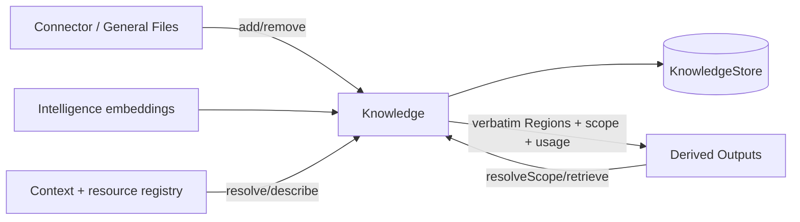
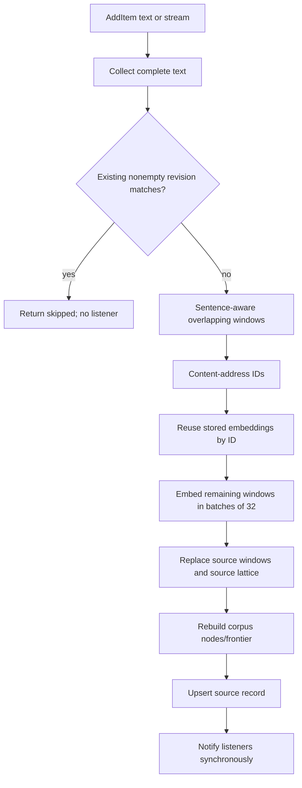
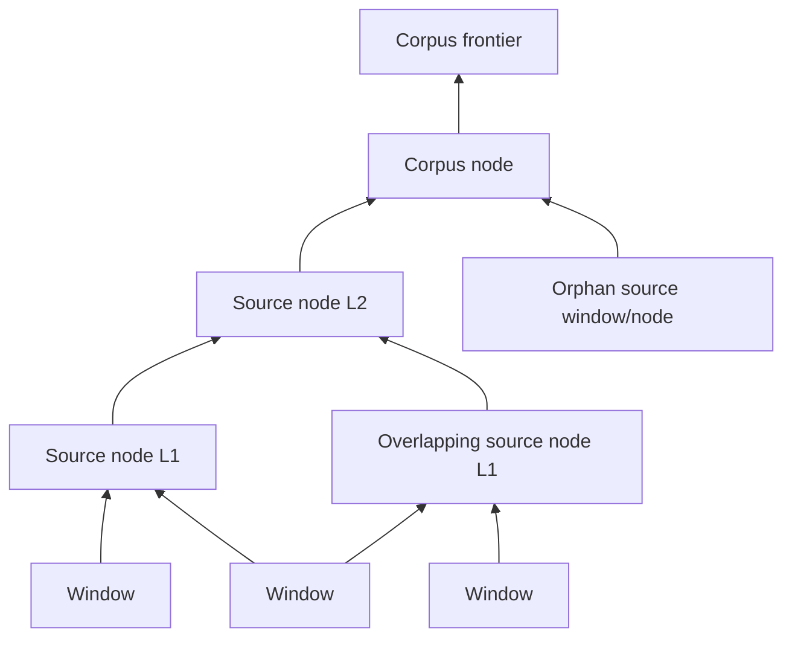
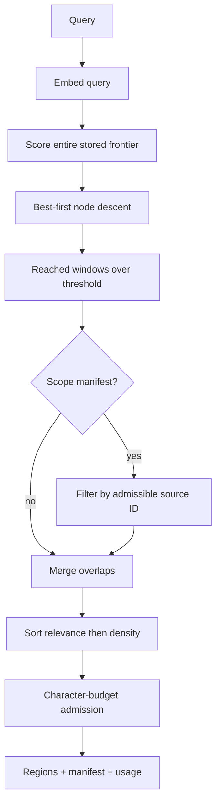

# Knowledge concepts

## Purpose and boundary

Knowledge turns admitted text into a persistent retrieval index. It supplies passages; it does not synthesize answers or decide whether a source is true. Intelligence supplies embeddings, calling capabilities own source lifecycles, and a resource resolver maps Context/resource identities to indexed source IDs.

## Vocabulary

| Concept | Meaning |
| --- | --- |
| Source | Caller-owned stable ID plus label/revision and ingest metadata |
| Window | Positioned source text and embedding; terminal retrievable artifact |
| Source-tier node | Similar window/lower-node cluster belonging to one source |
| Corpus-tier node | Cluster spanning source frontiers; `sourceId` absent |
| Frontier | Stored entries from which retrieval descent begins |
| Region | One or more overlapping retrieved windows merged into a verbatim span |
| Context entry | Input reference `{ id, kind }` supplied by a caller |
| Scope manifest | Frozen resolved source/resource identity snapshot reused across a run |
| Resource descriptor | Trusted mapping from Knowledge `sourceId` to public resource identity/revision |
| Mutation listener | Synchronous post-success notification after source add/remove |

## Ingestion model

`revision` is supplied by the caller. Only a nonempty matching revision skips. Omitting it or passing an empty string forces re-ingest. Window IDs are SHA-256-derived from `sourceId + NUL + window text` and truncated to 32 hex characters; positions are not part of identity, permitting embedding reuse when text survives at a different offset.

Although `AddItem` accepts `ReadableStream<string>`, `Knowledge.add` currently concatenates the entire stream before calling `windowText`; the standalone `StreamWindower` is not used in production ingestion.

## Windowing

`windowText` splits on newlines and punctuation followed by whitespace, hard-splits long sentence runs, groups sentences until a target size, and carries a bounded sentence tail into the next window. Defaults are target 4,000 and overlap 400 JavaScript string characters. Names/comments say “runes,” but offsets and counts are JavaScript UTF-16 code units.

Blank-only input produces no windows. Window text is retained so retrieval never needs to reopen the original capability resource.

## Lattice model

Clustering greedily finds overlapping cliques at or above a similarity threshold. Pools at or below `maxClusterPool` use a full similarity matrix. Larger pools build an approximate k-nearest-neighbor candidate graph through deterministic projection and IVF cells, then retain exact full-dimensional dot products for candidate edges.

Node IDs hash sorted member IDs, making identity independent of member order. The algorithm is deterministic for a fixed ordered artifact pool, vectors, and configuration, including fixed projection/k-means seeds.

## Retrieval model

Descent is global even for a scoped query; scope filtering happens after candidate discovery. This preserves one lattice but can miss a scoped source when globally stronger out-of-scope branches consume the bounded descent.

## Scope semantics

- `resolveScope(undefined)` returns `null`: unscoped.
- `resolveScope([])` snapshots every currently listed Knowledge source into a non-null manifest.
- Nonempty entries go through the injected resolver when present.
- Without a resolver, only input entries whose kind is exactly `document` remain.
- Resolved source IDs are deduplicated and sorted.
- Input and resolved entries are sorted but not deduplicated.
- Descriptors record public resource identity and optional revision when the resolver can describe a source.

The manifest arrays, descriptor objects, and outer object are frozen. Digests are SHA-256 hashes of canonical input entries and resource descriptors. `resolvedAt` records snapshot time and is not part of either digest.

## Ownership

Knowledge owns index mechanics, source/window persistence calls, scope manifests, region construction, usage aggregation, and mutation events. It does not own public resource bytes, source IDs/revisions, job serialization, answer synthesis, or capability publication/reconciliation.
