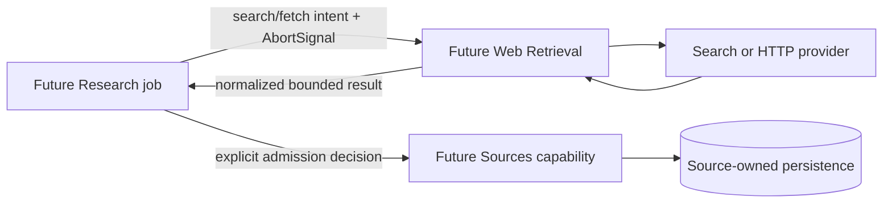

# Web Retrieval concepts

## Current state

There is no executable Web Retrieval concept in the backend today. The only current architectural fact is a reserved platform directory. Everything below under “intended” summarizes existing design material and must remain labeled as unimplemented.

```mermaid
flowchart LR
  A[Current backend runtime] -. no factory, import, or call .-> W[Web Retrieval scaffold]
  W -. contains .gitkeep only .-> N[No behavior]
```

## Intended purpose

The [platform design](../../../../../../docs/platform/web-retrieval.md) assigns this boundary provider-neutral web search and bounded page acquisition. A capability would decide what to request and what to persist; Web Retrieval would own outbound transport mechanics, safety limits, normalization, cancellation, and provider credentials.

## Intended vocabulary

These names are conceptual only; no source declarations exist.

| Concept | Intended meaning |
| --- | --- |
| Search request/result | Provider-neutral query and normalized result set |
| Fetch request/result | Bounded URL acquisition plus final URL/status/content metadata |
| Redirect chain | Every followed location for safety/provenance |
| Capture | Material a Sources-like capability chooses to persist after retrieval |
| Content hash | Deterministic identifier for normalized retrieved bytes/text |
| Outbound policy | Protocol/host/network/redirect/size/time/content-type restrictions |

## Intended boundary



If implemented as designed, Web Retrieval would not own research policy, relevance/truth judgments, source identity/versioning, evidence extraction, public HTTP endpoints, or refresh scheduling.

## Relationship to Connectors

Connector currently provides a development filesystem provider and capability-owned sync. Web Retrieval is intended for bounded public web search/fetch, not Google Drive, SharePoint, or connector synchronization. No code unifies these abstractions today.

## Security significance

Unlike the development filesystem connector, a future URL fetcher would cross an untrusted network boundary. Redirect validation, address filtering, byte/time bounds, and content-as-data handling are core semantics, not optional adapter polish. Since none are implemented, the scaffold provides no SSRF or content-safety protection.
