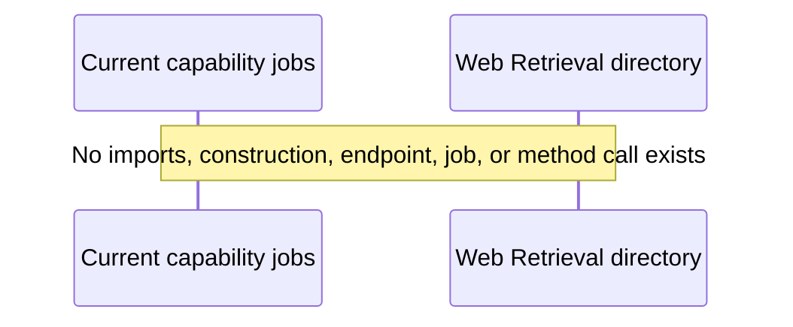
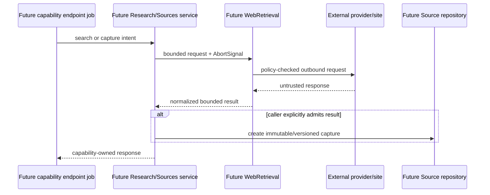

# Web Retrieval flows

## Current flow

There is no runtime flow.

No HTTP route maps to Web Retrieval. No job registry entry names it. No startup factory constructs it. No configuration supplies credentials/policy. No logs or metrics can be produced.

## Design-only future flow

The repository design pages expect future Research and Sources capabilities, neither of which is implemented in the current capability tree. Their intended division is:

This graph is not a claim about current code.

## Queue and response ownership

If implemented according to repository conventions:

- search/fetch would run inside a consuming capability's concurrent job;
- Web Retrieval would create no scheduler job and choose no response mode;
- any canonical Source publication would use that capability's serial mutation path;
- cancellation would originate with the owning job and pass to every outbound call.

## Evidence admission

Transient retrieved text should not become canonical evidence merely because a fetch succeeded. A future consuming capability should persist provenance, locator, normalized/final URL, retrieval time, hash, and sufficient captured material before evidence references it. There is no current Source/Evidence implementation performing this flow.

## Verification path once implemented

Smoke testing will require a deterministic fake/local HTTP server for redirects, forbidden-address checks, content types, oversized/chunked bodies, cancellation, timeouts, and safe logs. Real public-network smoke tests should be optional and must not replace deterministic policy tests.
