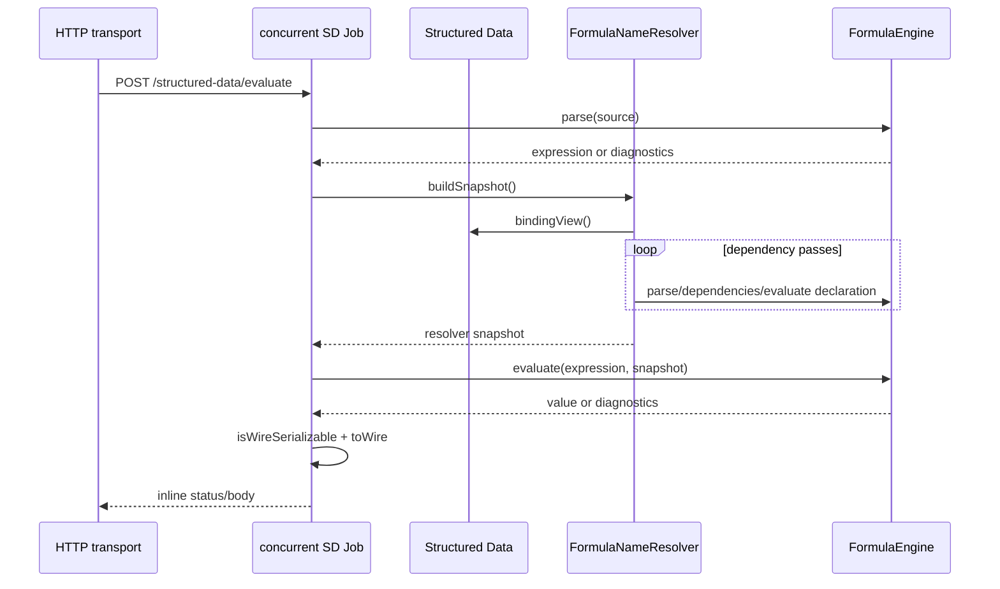
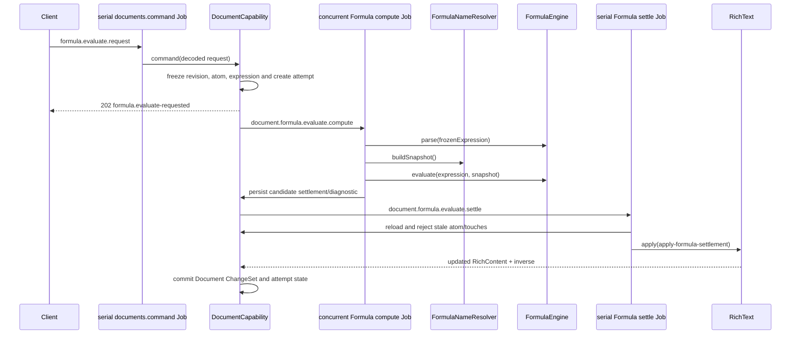

# Formula endpoint and Job flows

## No direct Formula endpoint

Formula does not register routes or Jobs. Every call is made inside a consumer-owned Job. The current concrete consumers composed by [`startBackend.ts`](../../../1-init/startBackend.ts) are Structured Data endpoint wiring and the Document capability's formula-evaluation workflow. Rich Text imports the Formula wire type but never invokes the engine.

## Structured Data endpoints

All Structured Data routes in [`registerStructuredDataEndpoints.ts`](../../../4-job-wiring/structured-data/registerStructuredDataEndpoints.ts) are concurrent, inline Jobs. Most CRUD routes do not call Formula immediately. Three value-oriented paths use the resolver/engine:

| Endpoint | Job | Formula-related call chain |
| --- | --- | --- |
| `GET /structured-data/value/entry?id=...` | `structured-data.valueByEntryId` | load entry → `buildSnapshot` → binding by normalized display name → `toWire` if serializable |
| `GET /structured-data/value/by-name?displayName=...` | `structured-data.valueByDisplayName` | load by name → `buildSnapshot` → binding → `toWire` |
| `POST /structured-data/evaluate` | `structured-data.evaluate` | coerce body source to string → `formula.parse` → `buildSnapshot` → `formula.evaluate` → serializability check/`toWire` |

Variable/function/collection declarations are stored by Structured Data. Their formulas are parsed and evaluated later when `buildSnapshot` runs; a successful declaration therefore does not itself guarantee that its body resolves.

Endpoint wiring chooses status mapping: parse/evaluation diagnostics return a client error body, absent entries/resolution issues return not-found/unresolved responses, and unexpected failures are logged and mapped by the wiring. Formula itself has no HTTP status vocabulary.

## Document formula evaluation

Document embeds Formula atoms inside text/code/quote blocks. A `formula.evaluate.request` command enters `POST /documents/command`, whose endpoint Job is serial and inline. The command freezes document revision, block/atom identity, expression text/digest and creates a durable attempt. It dispatches two internal Jobs through [`registerDocumentInternalJobs.ts`](../../../4-job-wiring/document/registerDocumentInternalJobs.ts):

| Intent | Queue | Calls |
| --- | --- | --- |
| `document.formula.evaluate.compute` | concurrent | parse frozen source → build Structured Data resolver snapshot → evaluate → create Rich Text settlement operation → persist proposed attempt |
| `document.formula.evaluate.settle` | serial | reload head → verify atom/expression/touched history → apply candidate Rich Text operation in a Document mutation |

Queue assignments are created in [`createDocumentJobs.ts`](../../../4-job-wiring/document/createDocumentJobs.ts); orchestration and Formula calls are in [`documentService.ts`](../../../3-capabilities/document/application/documentService.ts).

Successful compute calls `toWire` and `formatFormulaValue`. Parse/evaluation failure instead proposes a `RichTextOperation` containing a `RichTextFormulaDiagnostic` and the delimited source as display text. Settlement guards against publishing a result to a changed atom.

## Rich Text boundary

[`FormulaAtom`](../../rich-text/types.ts) persists expression source, an optional accepted `FormulaWireValue`, display text, and an optional diagnostic. [`formulaFromDelimitedRange`](../../rich-text/formula-authoring.ts) only extracts source and creates an atomic replacement operation. Evaluation always belongs to a host such as Document.

## Logging through the flow

Transport logs request ID and Job ID. Scheduler logs queue wait/lifecycle. Formula logs operation duration/counts. The resolver logs snapshot/cache and typed resolution issues. Document logs its command and attempt stages. These records share the injected Logger, but Formula does not itself add request/Job IDs because its method signatures do not carry them.

## Other imports that are type-only

Slide validation and wire schemas import `FormulaWireValue` for embedded bindings, but the current Slide runtime does not call `FormulaEngine`. No Spreadsheet implementation is composed in [`startBackend.ts`](../../../1-init/startBackend.ts).
