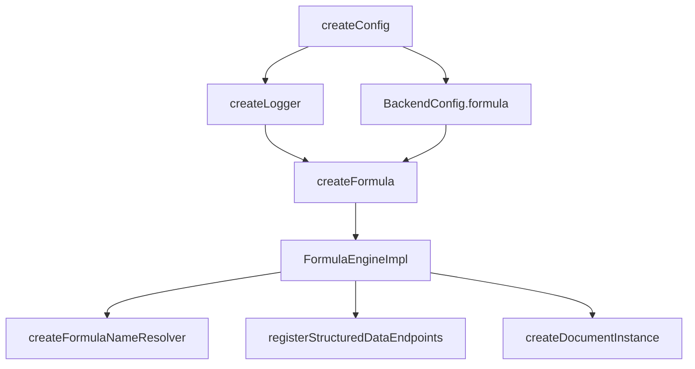

# Formula runtime and functions

## Construction and composition

[`createFormulaEngine`](../engine.ts) constructs one `FormulaEngineImpl` from a complete `FormulaLimits` object and a [`Logger`](../../observability/logger.ts). [`createFormula`](../../../1-init/create/formula.ts) passes `BackendConfig.formula`; [`startBackend`](../../../1-init/startBackend.ts) creates this singleton before Structured Data's resolver and the Document capability.

The engine stores only its base limits and logger. It has no mutable expression cache or persistence. Parser node IDs use a module-level counter, so IDs are process-local rather than stable across parses.

## Public method catalog

### `parse(request)`

Input: source, exact language discriminator, optional limit overrides. Output: `FormulaResult<FormulaExpression>`.

Call chain: [`lex`](../lexer.ts) → [`parse`](../parser.ts) → source digest/node count. Unsupported versions return `unsupported_version`. Parser diagnostics produce `ok: false`; unexpected exceptions become `parse_error`. Debug logs contain duration, node count or diagnostic count—not source text. The lexer itself does not enforce limits; the parser checks source, token, node, and depth bounds.

### `validate(request)`

Input: a previously parsed expression, optional resolver (empty snapshot by default), optional limits. Output: a successful `FormulaResult<FormulaValidation>` unless an unexpected exception occurs.

It calls [`bind`](../binder.ts). Unknown/stale names are stored inside `FormulaValidation.diagnostics`, and `valid` is false; this is not an outer `FormulaResult` failure. The returned expression contains any newly embedded stable bindings. The merged limits variable is currently computed but unused.

### `dependencies(request)`

Input: parsed expression and optional resolver. Output: `FormulaResult<FormulaDependencyResult>`.

With a resolver it binds a temporary root, then calls [`extractDependencies`](../dependencies.ts). Binding diagnostics are not checked here, so an unknown name remains a symbolic dependency rather than failing the request. Request limit overrides are currently unused. The static result has symbolic/bound dependencies and a digest; observed dependencies come only from evaluation.

### `evaluate(request)`

Input: parsed expression, required resolver snapshot, optional limit overrides. Output: `FormulaResult<FormulaEvaluation>`.

It binds first and fails on any bind diagnostic. [`evaluate`](../evaluator.ts) then walks the bound AST with step, call-depth, local-environment, and observed-dependency state. Any evaluator diagnostic fails the outer result. The engine subsequently enforces recursive cell and identity-payload byte limits, extracts the bound dependency digest, and computes the evaluation digest. Success logs duration, steps, output kind/cell/byte counts; failures log counts and limit metadata.

### `explain(request)`

Input: expression, resolver and optional limits. Output: `FormulaExplanation` with one or more shallow strings describing the top-level construct. It does not bind, evaluate, use the resolver/limits, or log. It is a structural labeler, not an execution trace.

## Language pipeline helpers

### Lexer — [`lexer.ts`](../lexer.ts)

Scans whitespace, `//` comments, quoted strings with basic escapes, decimal literals, ASCII identifiers/keywords, operators and punctuation. Invalid characters and unterminated strings become `error` tokens; the parser turns the resulting syntax into diagnostics. There is no exponent notation or non-ASCII identifier grammar.

### Parser — [`parser.ts`](../parser.ts)

Recursive-descent functions implement precedence and create immutable-looking object nodes with generated IDs. Major helper groups parse binary precedence, postfix access/calls, set bodies/conditions, index versus integer-bound slice, list/record literals, and primaries. It accumulates diagnostics rather than throwing for normal syntax errors.

### Binder — [`binder.ts`](../binder.ts)

Recursively copies nodes, extends a lowercase lambda environment, reserves built-ins, validates old bindings by stable identity, binds new names from the snapshot, and returns bound IDs plus diagnostics. It searches old bindings by `bindingId` across map values because the snapshot map is display-name keyed.

### Dependency extractor — [`dependencies.ts`](../dependencies.ts)

Walks AST and condition nodes twice: one lexical-environment-aware symbolic pass and one bound-reference pass. Bound references are deduplicated by ID, sorted for digesting, and hashed. Symbolic references are not deduplicated.

## Evaluation helper groups

[`evaluator.ts`](../evaluator.ts) centralizes runtime semantics:

| Group | Current behavior |
| --- | --- |
| Scalars/structures | Builds typed values; list row count and record field count are checked |
| Unary/binary | Strict kind checks, exact rational arithmetic, text concatenation, logical short-circuit |
| Calls | Named `IF` is lazy; named built-ins dispatch directly; function values/lambdas are first class |
| Lambda | Captures current local environment, hashes capture/bound identity, enforces call depth |
| Field/index/slice | Record/table fields, one-based/negative index, clamped slices |
| Set operations | Projection or per-row condition query; row fields overlay the local environment |
| Cardinality | Record pass-through; table exact-one/zero-or-one conversion |
| Finalization | Returns value, diagnostics, observed whole-value dependencies and steps |

Row fields are installed in a copied local environment during a query and restored afterward. Lambda arguments overwrite captures. Name evaluation checks locals, then a bound ID, then a snapshot display-name key.

## Built-in helper group

[`callBuiltin`](../builtins.ts) uses strict arity/type checks and returns an internal `{ value, diagnostics }`. Numeric aggregates flatten numbers through list/table cells but do not accept record aggregates. `TABLE` accepts records directly or in a list, aligns differing field order, and rejects missing fields. Conversion functions are explicit; ordinary operators do not coerce kinds.

`BUILTIN_IMPLEMENTATION_VERSION` is carried in a built-in function value's identity payload, so bumping it re-digests function values; it does not otherwise version behaviour. Lambda identity is a separate digest. `isBuiltinName` is also used by binding/dependency extraction and by Structured Data ingress, which calls it directly rather than duplicating the list.

### The relational group

`ASTABLE`, `JOIN`, `WHERE`, `GROUP`, `AGGREGATE`, `SORT`, `LIMIT`, and `DISPLAY` take their options as a **record with per-key defaults**, so an omitted key takes the built-in's default and an unknown key is a `type_error` rather than being ignored. Field names are passed as strings inside those records, which is why none of them has to be a Formula identifier.

`ASTABLE` is the coercion every other one relies on: a table passes through, a record is already one row, a list's single column is renamed from `value` to the supplied name, and a scalar becomes a one-by-one table. A function value is refused.

Four different null rules coexist deliberately, and conflating them is the main hazard:

| Context | Rule |
| --- | --- |
| `JOIN` keys | null never matches, not even another null |
| `WHERE` `equals`/`notEquals`/`in` | null equals null |
| `WHERE` ordering and `contains` | null never passes |
| `GROUP` keys | nulls group together |
| `SORT` | null sorts last in **both** directions |
| aggregates | nulls ignored; an empty group is null, except `count` which is 0 |

`JOIN` bounds its own intermediate row count as the product accumulates rather than relying on the evaluator's output-side limits, because a join multiplies rows faster than anything else in the language. Composite keys are length-prefixed so text containing a separator cannot collide.

`DISPLAY` returns the table itself carrying a `display` annotation rather than a new value kind, so every table operation still applies and a non-rendering consumer ignores it. The annotation participates in the identity digest — the same rows shown as a bar and as a line are different values — but not in `=`, which compares data through `tableEqual`.

## Numeric, identity, display, and wire helpers

- [`rational.ts`](../rational.ts): normalized construction; exact arithmetic/comparison; integer power; floor/ceil/round; string wire conversion. Division/modulo by zero throw at this low level and are converted to diagnostics by evaluator/built-ins.
- [`value.ts`](../value.ts): value constants and shape-checking constructors.
- [`value-identity.ts`](../value-identity.ts): canonical recursive identity payload and SHA-256-prefix digest, including functions.
- [`wire.ts`](../wire.ts): recursive JSON-safe conversion for non-function values; function conversion throws.
- [`display.ts`](../display.ts): deterministic plain display strings without locale formatting.
- [`diagnostics.ts`](../diagnostics.ts): constructors for stable error codes.

## Structured Data resolver runtime

[`FormulaNameResolver`](../../../1-init/create/formula-name-resolver.ts) is a separate runtime object constructed from Formula, one project-scoped `StructuredData`, Logger, user ID and project ID.

### `buildSnapshot()`

Reads `bindingView`, computes an entry signature, returns an exact cached snapshot on signature hit, or resolves declarations iteratively. A binding uses the Structured Data entry ID as `bindingId`, entry revision as owner revision, and `formulaValueDigest` of the evaluated value. Collection formula cells are parsed/dependency-checked/evaluated using the bindings settled so far. The maximum pass count is `entries.length + 1`.

Side effects are limited to in-memory cache/issue maps and debug/warn logs. Snapshot IDs are random UUIDs; snapshot digests are deterministic over normalized name, binding identity, revision, and value digest.

### `getIssue(entryId)`

Returns the current cached typed issue for an entry. Issues are cleared and rebuilt on a non-cached snapshot build. An entry with an issue is absent from bindings.

### Adapter helper groups

Literal conversion maps JavaScript string/number/boolean/null to Formula values; numbers pass through decimal strings. Collection validation enforces list-one-field and record-one-row shapes while evaluating formula cells and checking declared field kinds. Snapshot hashing and diagnostic contextualization are local helpers.

## Logging and side effects

The engine logs through the injected interface only. It records operation names, durations, counts, limit names, value kinds, and unexpected error messages. It does not log expression source or evaluated values. The resolver logs entry display names and diagnostics for failed declarations, so its events may contain authored names/error context. Logger failures are not caught inside Formula.
