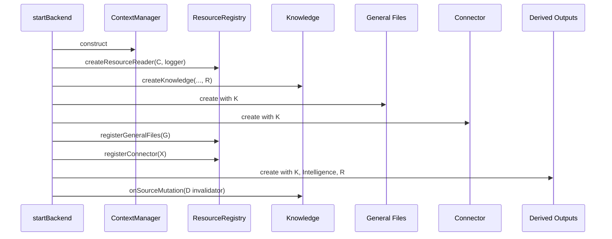
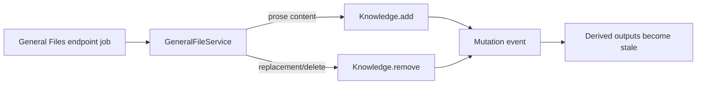
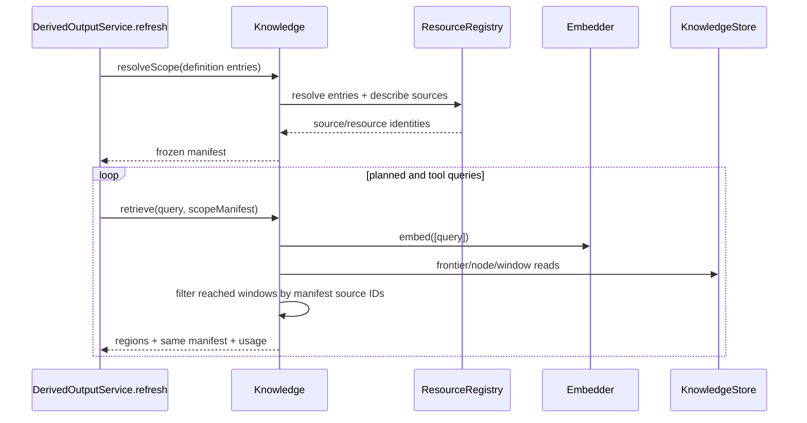

# Knowledge flows

## Endpoint and job ownership

Knowledge has no HTTP mapper and creates no jobs. Product capabilities call it inside their jobs.

| Owning intent | Concrete call | Effect |
| --- | --- | --- |
| General File create/update/delete | `knowledge.add` / `knowledge.remove` | Admit prose file content or remove replaced/deleted source |
| Connector sync/retry/delete | `knowledge.add` / `knowledge.remove` | Reconcile readable connector items with indexed sources |
| Derived Output refresh | `resolveScope`, repeated `retrieve` | Freeze resource membership and retrieve evidence |
| Derived invalidation wiring | `onSourceMutation` | Advance generation/mark outputs stale after completed Knowledge mutation |

Queue type, response mode, retries, and reconciliation belong to those capabilities. See their adjacent docs packages for endpoint tables.

## Production composition and scope registry

The registry expands nested Context entries, maps General File and Connector resource kinds to Knowledge source IDs, and describes those sources for scoped tools. Exact `document` entries pass through as source IDs. Document/Slide services are not registered in the resource registry in current startup wiring.

## General File lifecycle

[`generalFileService.ts`](../../../3-capabilities/general-files/application/generalFileService.ts) chooses whether a kind is indexable. Admission calls `Knowledge.add` with a stable `general-file:<id>`-style source identity and a revision/content. Replacement/removal explicitly calls `Knowledge.remove`; the capability's pending/active behavior is responsible for reconciling failures around these non-transactional cross-store calls.

## Connector lifecycle

[`connectorService.ts`](../../../3-capabilities/connector/application/connectorService.ts) can add multiple directory item sources and remove orphaned/changed sources. Connector persists `pending`/`failed` reconciliation state around these calls because a provider/store/Knowledge sequence is not one transaction. Only an `active` connector exposes its source IDs to resource scope.

## Derived Output retrieval

Derived Outputs reuses one exact manifest for all initial and tool retrieval. Its resource-list/read tools also close over that manifest. It does not use `Knowledge.searchTool`, because that built-in binding performs unscoped retrieval.

## Mutation invalidation

After a non-skipped `add` or any `remove`, Knowledge emits synchronously. [`startBackend.ts`](../../../1-init/startBackend.ts) forwards the event to `DerivedOutputService.recordKnowledgeSourceMutation`. The Derived store advances a persistent Knowledge generation; in-flight refresh settlement checks the generation so stale work cannot publish. If the listener throws, the Knowledge operation rejects even though its store writes already completed.

## Retrieval with no hits

If the frontier is empty or no window clears the threshold, `retrieve` returns an empty region array with embedding usage and resolved scope. Derived Outputs then publishes a fixed `insufficient` response without a synthesis model call. This early return currently emits no Knowledge retrieval debug record.

## Standalone search tool

`searchTool()` defines `knowledge_search({query})`. Blank input returns fixed “No query provided” content with zero usage. Nonblank input calls unscoped `retrieve`; results are formatted with labels, relevance, and verbatim text. No current production caller constructs this binding.
