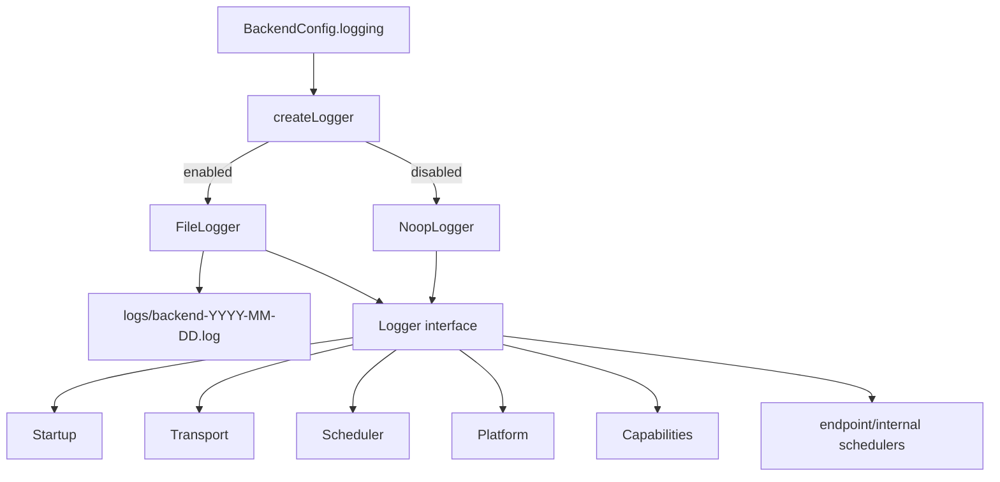

# Observability platform documentation

## Status and authority

Observability currently means one injected structured `Logger` interface with two implementations: a no-op adapter and a synchronous daily JSON-lines file adapter. The same logger instance is composed into startup, transport, scheduler, Platform services, endpoint wiring and capabilities. Fastify's separate logger is disabled.

These pages document the implementation in [`logger.ts`](../logger.ts) and [`create/logger.ts`](../../../1-init/create/logger.ts). The older [repository Observability reference](../../../../../../docs/platform/observability.md) includes target behavior—sink-failure isolation, canonicalized fields, explicit flush/close and broad redaction enforcement—that the current implementation does not provide. This package states those as non-guarantees.

## Runtime position

## Dependency and source map

| Concern | Code authority | Role |
| --- | --- | --- |
| Contract/adapters | [`logger.ts`](../logger.ts) | Levels, entries, interface, no-op and filtered file adapter |
| Concrete sink | [`create/logger.ts`](../../../1-init/create/logger.ts) | Directory creation, daily filename, JSON serialization, synchronous append |
| Composition | [`startBackend.ts`](../../../1-init/startBackend.ts) | Creates one logger and injects it process-wide |
| HTTP events | [`registerHttpTransport.ts`](../../../2-transport/registerHttpTransport.ts) | Route misses, completed/rejected/failed requests and correlation |
| Queue events | [`scheduler.ts`](../../../0-utils/jobs/scheduler.ts) | Admission, wait, response, completion, overload and failures |
| Fastify configuration | [`create/app.ts`](../../../1-init/create/app.ts) | Disables Fastify stdout logging |
| Test adapter | [`testDoubles.ts`](../../../../test/helpers/testDoubles.ts) | In-memory `CapturingLogger` |
| Correlation tests | [`runtime-wiring.test.ts`](../../../../test/capabilities/runtime-wiring.test.ts) | Request/Job linkage, deferred failures and no-console guard |
| End-to-end log exercise | [`http-smoke.mjs`](../../../../test/smoke/http-smoke.mjs) | Production HTTP smoke traffic used to inspect JSONL logs |

## Navigation

- [Concepts](concepts.md): logging vocabulary, ownership, lifecycle and sink model.
- [Types](types.md): exact public types, structural consumers and record form.
- [Runtime](runtime.md): every adapter/factory function and the consumer catalog.
- [Flows](flows.md): startup, request/Job/deferred and capability event sequences.
- [Invariants](invariants.md): guarantees, filtering, failure/security behavior, tests and non-goals.

## Scope

There is no metrics registry, trace/span API, audit store, remote exporter, log context object, redaction middleware, rotation cleanup, flush lifecycle, or Observability endpoint. Individual callers choose message names and data fields.
