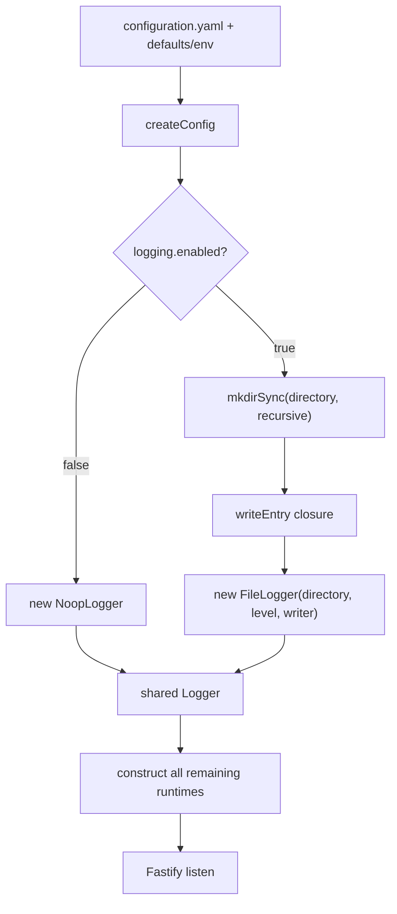
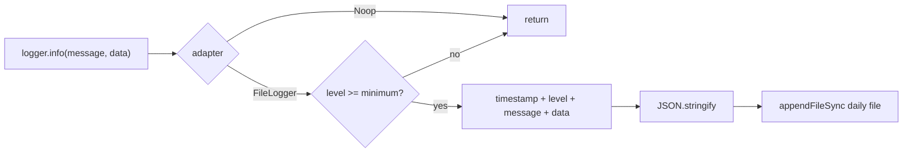
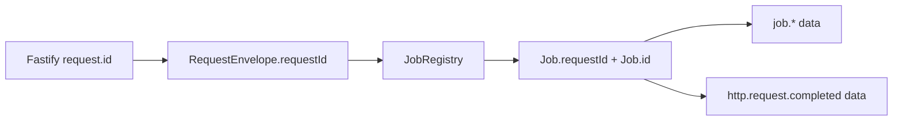

# Observability concepts and lifecycle

## Ownership boundary

Observability owns the stable four-method logging seam, level filtering and the concrete local JSONL adapter. Callers own event names, field selection, correlation identifiers, redaction, and the decision about when an event represents success/failure. Capability databases and attempt histories—not logs—remain canonical state.

The component does not inspect, enrich or validate `data`. It has no ambient request context. A caller that wants `requestId`, `jobId`, resource ID, duration, error name, or status must include it explicitly.

## Vocabulary

### Level

The declared levels are `debug`, `info`, `warn`, and `error`, ranked in that order. `FileLogger` writes an event when its rank is greater than or equal to the configured minimum. `NoopLogger` discards every level.

Configuration currently parses the level as any nonempty string and casts it to `LogLevel` in the factory. Valid configuration should use the four declared names; an unknown string is not rejected and defeats the intended rank comparison.

### Entry

Each written entry is:

```json
{"timestamp":"2026-08-01T12:00:00.000Z","level":"info","message":"...","data":{}}
```

`timestamp` is generated at the actual adapter call in UTC ISO form. `data` is omitted when the method argument is `undefined`; any other JSON-serializable value is included. There is no requirement that data be an object.

### Message and event fields

Messages are untyped strings, generally namespaced (`job.started`, `http.request.completed`, `derived-outputs.refresh.completed`). Data fields are caller conventions, not schema-enforced contracts. The transport and scheduler establish the strongest current correlation convention by carrying a request ID from the request envelope into the created Job and both event families.

### Sink

The enabled sink creates the configured directory and synchronously appends one `JSON.stringify(entry) + "\n"` string per accepted event. The destination filename is computed for every write from the process-local calendar date: `backend-YYYY-MM-DD.log`. The timestamp is UTC, so filename date and timestamp date can differ near midnight in non-UTC deployments.

“Daily” means filename selection only. The runtime does not delete, compress, rename or retain old files.

## Construction lifecycle



Configuration loading occurs before logger creation, so configuration-read/parse failures cannot use this logger. Directory creation failure aborts logger construction/startup. Once constructed, [`startBackend.ts`](../../../1-init/startBackend.ts) wraps the remaining composition/listen path and logs `backend.start.failed` before rethrowing.

## Event lifecycle



There is no buffer, batch, retry or fallback. Serialization and filesystem failures propagate synchronously to the caller.

## Operational versus canonical data

Logs are operational diagnostics. They cannot reconstruct a canonical capability revision, pending attempt or accepted ChangeSet. For example:

- scheduler logs show queue lifecycle but queues remain in memory;
- Document/Slide attempt rows are the recovery authority;
- Derived Output stores own accepted revision/attempt state;
- Structured Data/General File/Connector stores own durable records.

Deleting logs does not delete product state. Conversely, a log event does not prove a corresponding database commit unless the caller emits it after that commit and its code documents that ordering.

## Correlation model

HTTP transport builds a `RequestEnvelope` using Fastify's request ID. The registry copies it to `Job.requestId`; Scheduler includes request/job/name/queue/mode fields in lifecycle logs; transport includes the execution's job fields in completion logs.



Capability method signatures generally do not receive the Job ID. Their internal logs may carry resource/request IDs when available, but there is no logger child/context API that injects correlation automatically.

## Information handling

The Logger accepts `unknown`, and the sink serializes it verbatim. Redaction is entirely a caller responsibility. Several callers intentionally log counts, digests, IDs and error types rather than content, but Observability cannot enforce that convention. Circular objects and `bigint` values are not supported by the JSON sink and cause `JSON.stringify` to throw.
