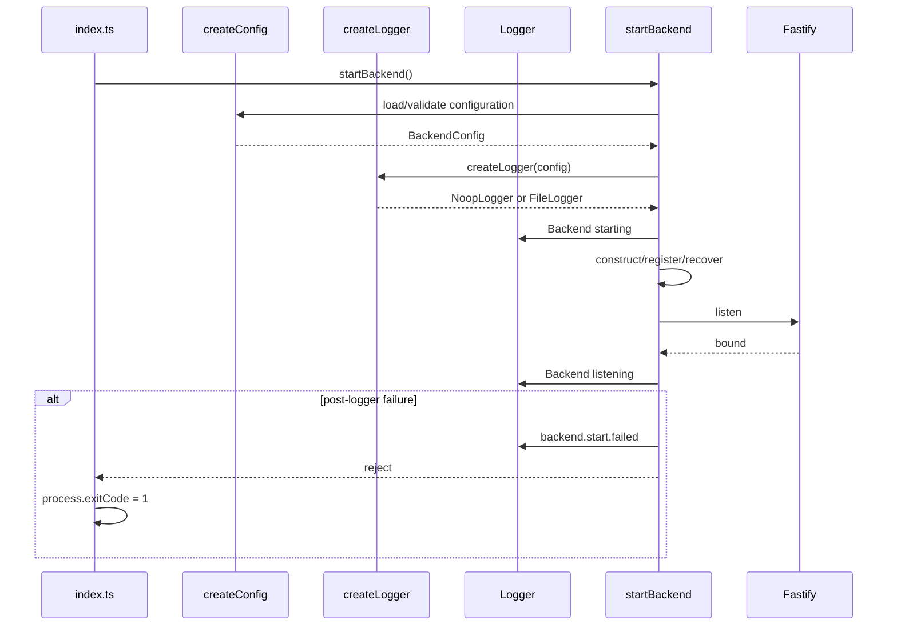
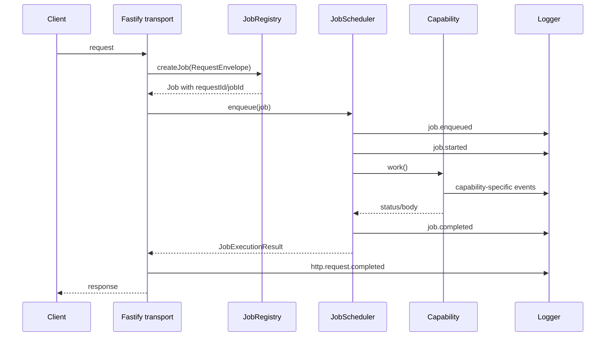
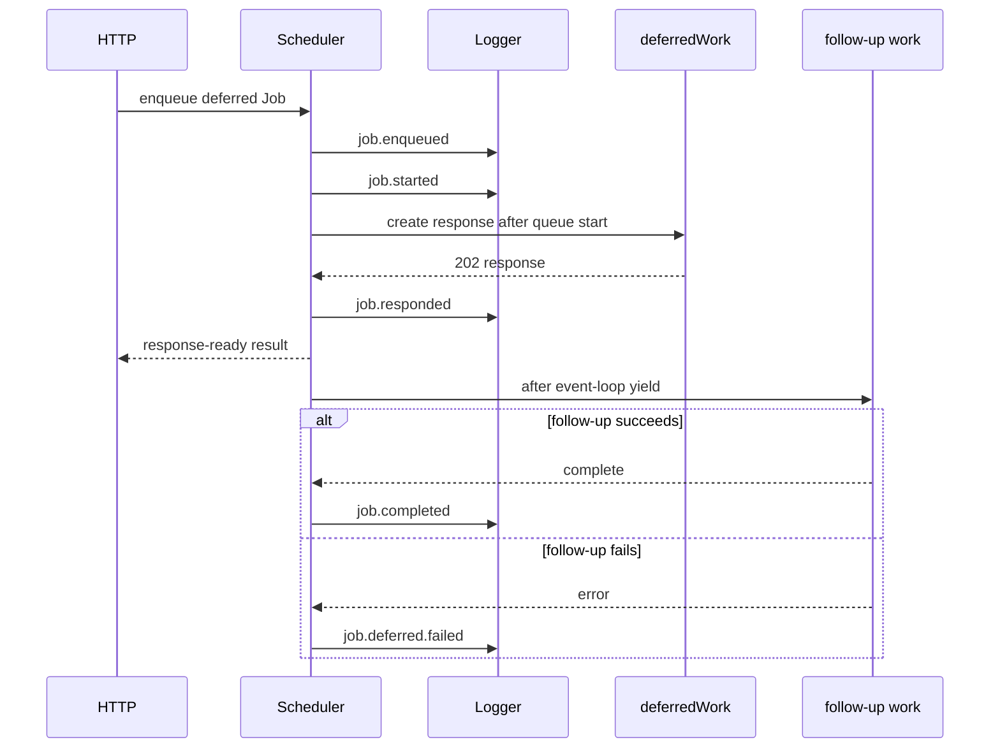
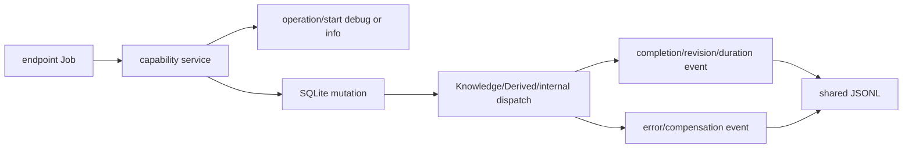
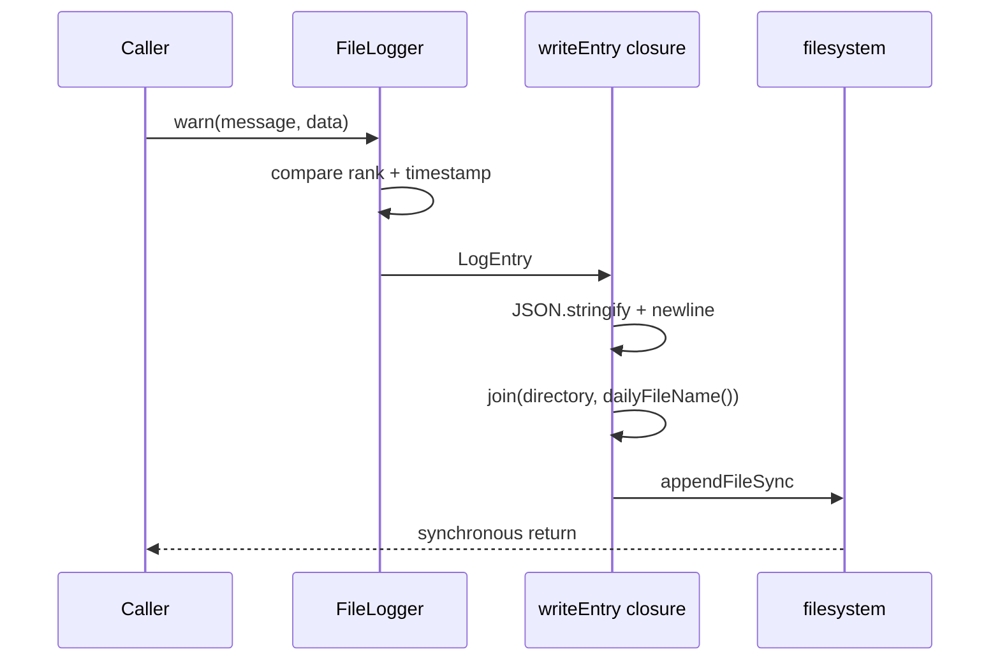

# Observability endpoint and Job flows

## No Observability endpoint or Job

Observability is injected infrastructure. It registers no route, creates no Job and owns no scheduler queue. Its methods are called synchronously inside other runtime paths.

## Startup flow

Configuration or logger-construction failures occur before the `try` block has a usable logger and therefore are not written through this component.

## Inline HTTP Job flow

Every registered HTTP endpoint passes through [`registerHttpTransport.ts`](../../../2-transport/registerHttpTransport.ts). Endpoint-specific logging may occur inside the Job/capability between scheduler events.

For an unregistered method/path, transport logs `http.route.not-found` and returns 404 without a Job. For queue capacity, scheduler logs `job.queue.capacity`, transport logs `http.request.rejected`, and returns 429. An inline work exception produces `job.failed` then `http.request.failed`; Fastify handles the rethrown error response.

## Deferred Job flow

The built-in `POST /audit` route demonstrates deferred mode. The selected queue slot remains occupied through follow-up work.

Because the completion promise already resolved at response-ready, deferred failure is observable only through logs and capability durable state. It cannot change the HTTP status.

## Capability mutation flow

There is no common capability middleware. Each service decides when to log around persistence/compensation. A representative resource path is:

Event-to-commit ordering must be checked in the owning service; Logger supplies no transaction integration. Logs written before a later rollback remain in the file.

## Formula and Rich Text nested calls

Formula and Rich Text receive the same Logger but no request/job context. During a Structured Data evaluation or Document mutation they emit local duration/count events, while outer scheduler/transport/host events carry correlation. There is no automatic parent-child span relationship.

## JSONL write flow

Any serialization/path/filesystem error unwinds this call chain. There is no secondary sink, retry, or console fallback.

## Testing flow

Most unit tests inject [`CapturingLogger`](../../../../test/helpers/testDoubles.ts), inspect calls in memory, and avoid filesystem output. [`runtime-wiring.test.ts`](../../../../test/capabilities/runtime-wiring.test.ts) proves scheduler event shape and HTTP/Job request correlation. The production [`http-smoke.mjs`](../../../../test/smoke/http-smoke.mjs) generates requests that exercise the actual configured JSONL path when the built service is started in an isolated working directory.
