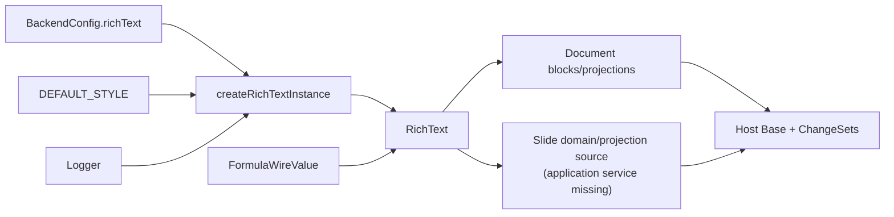

# Rich Text platform documentation

## Status and authority

Rich Text is an implemented, in-process Platform component for inline content. It owns atom/mark/range types, pure-ish content transformations, formula-atom authoring and settlement primitives, styling projection, validation/normalization, cloning, plain-text extraction, and a deterministic JSON/UTF-8 codec. It does not own document blocks, slide shapes, persistence, routes, Jobs, revisions, or conflict handling.

Document is a concrete runtime consumer. Slide contains domain reducers, projections, validation and endpoint/internal-Job declarations that consume Rich Text, but its barrel references a missing `application/slideService.ts`; the Slide paths documented here are therefore source-level integrations, not currently operable endpoints.

These pages describe the current files under [`rich-text/`](../). The older [repository Rich Text reference](../../../../../../docs/capabilities/rich-text.md) describes a larger block-owning design that is not the implemented model: current `RichContent` is just `atoms + marks`, and host capabilities own all containers.

## Runtime position

Construction lives in [`create/rich-text.ts`](../../../1-init/create/rich-text.ts), and process composition is attempted in [`startBackend.ts`](../../../1-init/startBackend.ts). The public package surface is [`index.ts`](../index.ts).

## Dependency and source map

| Concern | Code authority | Role |
| --- | --- | --- |
| Public model | [`types.ts`](../types.ts), [`index.ts`](../index.ts) | Atoms, marks, operations, outputs, `RichText` interface |
| Runtime facade | [`engine.ts`](../engine.ts) | Factories, styling and method delegation/logging |
| Operation reduction | [`operations.ts`](../operations.ts) | Batch apply, inverse primitives and footprints |
| Validation/canonicalization | [`validate.ts`](../validate.ts), [`normalize.ts`](../normalize.ts) | Structural diagnostics and normalization passes |
| Styling | [`styles.ts`](../styles.ts), [`engine.ts`](../engine.ts) | Mark-to-style mapping, overlays, resolved ranges |
| Formula authoring | [`formula-authoring.ts`](../formula-authoring.ts) | Delimited text to atomic `FormulaAtom` replacement |
| Utility forms | [`codec.ts`](../codec.ts), [`clone.ts`](../clone.ts), [`plain-text.ts`](../plain-text.ts), [`id-factory.ts`](../id-factory.ts) | Encoding, ID remap, text projection, UUID factory |
| Document integration | [`document/reducer.ts`](../../../3-capabilities/document/domain/reducer.ts), [`documentService.ts`](../../../3-capabilities/document/application/documentService.ts) | Rich Text commands, Formula settlement, inverses |
| Document projections | [`document/projections/`](../../../3-capabilities/document/projections/) | Plain text, outline and styling |
| Slide integration | [`slide/reducer.ts`](../../../3-capabilities/slide/domain/reducer.ts), [`slide/projections/`](../../../3-capabilities/slide/projections/) | Notes/text mutation and projections |
| Wire ingress | [`document/valueSchemas.ts`](../../../3-capabilities/document/wire/valueSchemas.ts), [`slide/valueSchemas.ts`](../../../3-capabilities/slide/wire/valueSchemas.ts) | Strict host-owned DTO validation |

Rich Text depends on Formula only for the `FormulaWireValue` type and on Observability for `Logger`. It never calls the Formula engine.

## Navigation

- [Concepts](concepts.md): atoms, marks, positions, host ownership, lifecycle, and styling.
- [Types](types.md): complete type families, operations, diagnostics, and persistence form.
- [Runtime](runtime.md): factory and every public runtime method plus helper ownership.
- [Flows](flows.md): Document/Slide endpoint and Job call chains.
- [Invariants](invariants.md): guaranteed outcomes, limitations, concurrency, failures, and tests.

## Executable references

- [Rich Text/Formula tests](../../../../test/capabilities/rich-text-formula.test.ts)
- [Document domain tests](../../../../test/capabilities/document-domain.test.ts)
- [Document application tests](../../../../test/capabilities/document-application.test.ts)
- [Slide wire tests](../../../../test/capabilities/slide-wire.test.ts)
