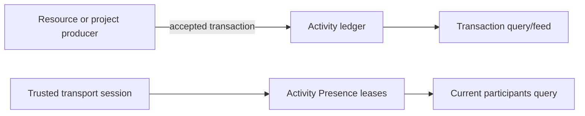

# Activity concepts

## High-level model

Activity is a small project-level ledger, not a second copy of every resource.
A producing kind publishes one transaction after it accepts meaningful work.
Activity stores that transaction with a project-local sequence so clients can
read an ordered feed or history view. Activity also owns current, expiring
Presence for the project.



Activity can use a different SQLite database from a source resource. It is not
part of the source's canonical write transaction; the source-local outbox is
the durable boundary between those databases.

## Vocabulary

| Term | Meaning |
| --- | --- |
| Kind | Producer/resource type, such as `document`, `slides`, `connector`, or `project`. This is the shared word for a transaction producer. |
| Activity transaction | One accepted action supplied by a trusted producer. It is not an arbitrary browser event or a failed request. |
| Transaction ID | Stable ID created by the source with accepted work. Activity retains it across delivery retries rather than creating a second identifier. |
| Ledger sequence | Monotonic project-local number assigned when Activity first accepts a transaction. |
| Resource reference | Optional `resourceId` alongside a kind. Project/runtime work may have no individual resource. |
| Source outbox | Producer-owned durable row written with a source mutation and later published to Activity. |
| Presence lease | Current state for one trusted session, held until expiry or explicit leave. It is not a ledger transaction. |
| Occurred/published time | The source accepted-action time versus the time Activity accepted it. |

## Ownership boundary

| Concern | Owner |
| --- | --- |
| Resource snapshot, revision, ChangeSet, inverse operation, and compaction | Producing kind |
| Source-local atomic outbox write | Producing kind's store/command workflow |
| Transaction identity/content after publish | Activity ledger |
| Project feed ordering and lookup/filtering | Activity ledger |
| Current session Presence and expiry | Activity |
| Authentication, authorization, connection/session derivation | Transport/composition layer |
| Public HTTP admission and status mapping | Endpoint/job-wiring layer |
| Undo/redo coordination | Later Activity management layer plus producing-kind adapters |

`revision` and `changeSetId` are optional source references. Activity preserves
them but does not load, validate, or interpret source history. A project-level
transaction can omit `resourceId`, `revision`, and `changeSetId` altogether.

## Ledger semantics

Transaction ID is Activity's idempotency key. First publish stores the
transaction and allocates a sequence. A subsequent publish with canonically
equal contents returns the stored transaction. A subsequent publish with
different contents under the same ID is a conflict: a retry identity cannot be
used to rewrite history.

Sequence is Activity receipt order, not distributed source-commit order. Two
resource databases can commit independently; the first publisher to reach
Activity receives the earlier sequence. `occurredAt` remains the source's time
for display/audit purposes.

The runtime has no update or delete method for stored transactions, so the
ledger is append-only through its supported API. Direct database access is not a
supported client interface and has no such guarantee.

## Presence semantics

Presence is separate from history:

```text
heartbeat -> upsert one session lease with a new expiry
leave     -> remove that session lease
read      -> return only leases whose expiry is still in the future
cleanup   -> delete a bounded batch of already expired leases
```

A lease holds bounded state plus optional actor, kind, and resource context.
The transport must derive stable session and actor identity; browser input must
not impersonate either. Heartbeat, leave, and expiry never create Activity
transactions.

The current HTTP transport cannot supply that trusted session context. It
therefore exposes Activity reads but explicitly rejects `/activity/command`
with `501` until a session-aware transport is available.

## Source publication boundary

```text
source database transaction
  ├─ canonical resource change / receipt / source history
  └─ self-contained Activity transaction in source outbox

after source commit
  └─ publisher reads unpublished row
       └─ Activity.publish(transaction)
            └─ marks source row published
```

The source must persist every field needed to construct the transaction. A
publisher should never rebuild it from a mutable or prunable ChangeSet after
the source commit. If a crash follows Activity ingestion but precedes marking
the source row published, retry is safe because its ID and contents are stable.

Activity is constructed before resource integration so composition can provide
a narrow publisher/notifier. Document is the currently wired producer: it maps
its committed source record to an Activity transaction after commit and retries
unpublished records during startup recovery. This does not make cross-database
writes atomic; the Document outbox remains the recovery authority. Slide and
other producer adapters remain deferred.

## Deferred management

Undo and redo are not implemented by the core. The intended model is that
Activity provides public user commands, selects a retained earlier transaction,
and invokes a trusted source compensation adapter. The source accepts a new
inverse/redo change and publishes another ordinary Activity transaction. The
immutable chain is `T0 -> U1 -> R2`, where redo compensates direct undo rather
than rewriting `T0`.
