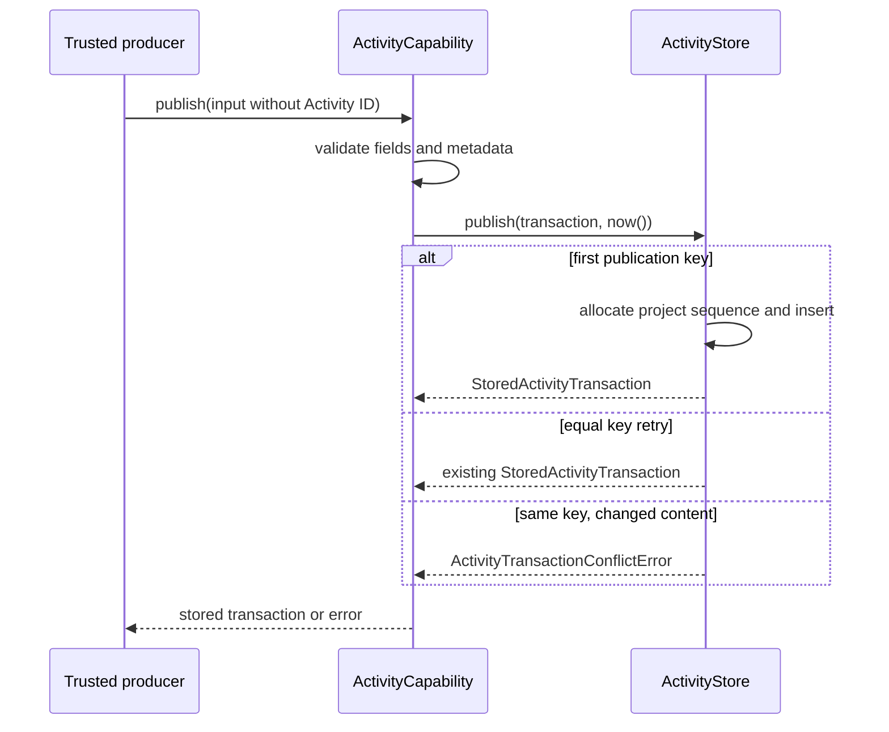
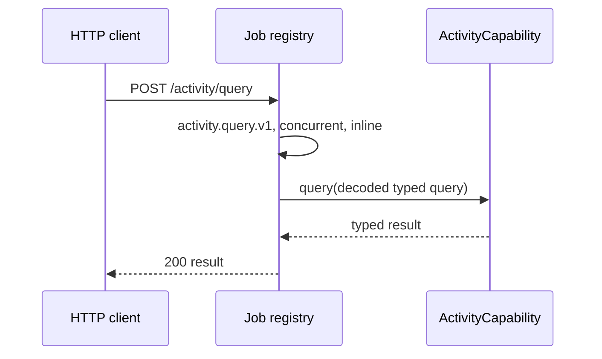
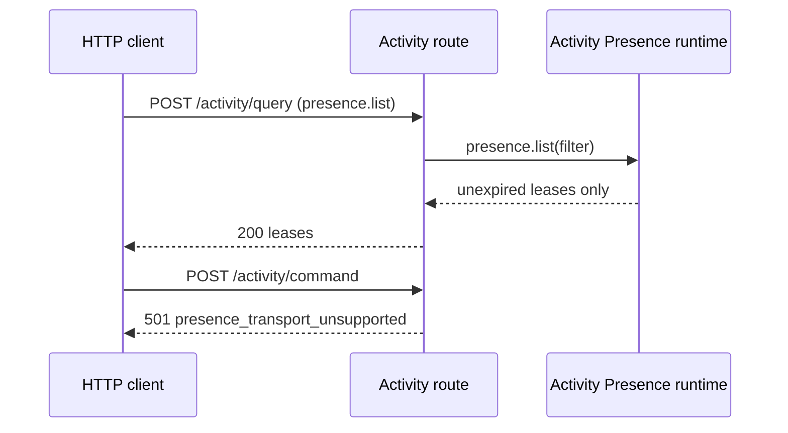
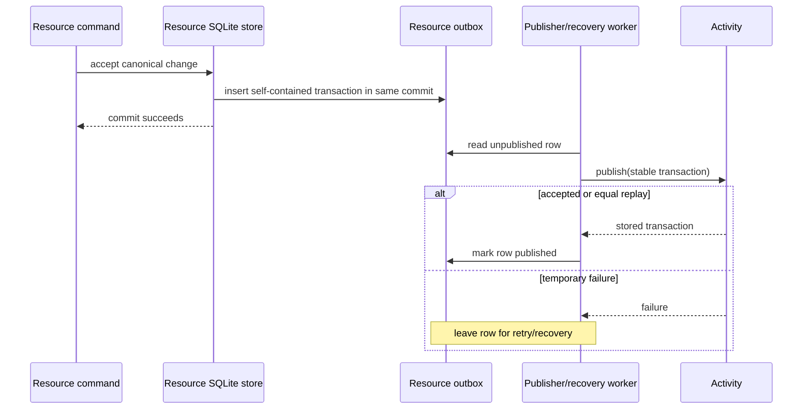

# Activity flows

## Trusted publication

The core's complete publish path starts after a producer has accepted work and
constructed an `ActivityTransactionInput` with a source idempotency key:



SQLite allocates a sequence and inserts the transaction in one database
transaction. Equal replay reads the existing row and does not consume a new
sequence. The source's `occurredAt` is retained; `publishedAt` comes from the
Activity clock.

No public route invokes this flow. It is exclusively for trusted source/project
producers.

## Public query route



The route decodes `activity.transactions`, `activity.transaction`, and
`presence.list`. It validates `limit` as a positive integer and validates
known string fields before passing the typed query to Activity. It currently
picks supported fields from object inputs rather than enforcing exact object
keys; stricter wire admission can be added without changing the core contract.

Validation and invalid-cursor errors return 400 with `validation_error`.
Unexpected failures log `activity.query.failed` with request/error names and
return a non-sensitive 500 response.

## Transaction query

```text
caller -> Activity.query({ type: "activity.transactions", filter })
       -> store decodes optional opaque cursor
       -> exact-filter kind/resource when supplied
       -> order by sequence descending
       -> return page and older-page cursor when needed
```

The cursor represents Activity receipt sequence, not timestamp order. A lookup
by one transaction ID can legitimately return no transaction. A project-level
transaction with no resource does not match a resource-specific query.

## Presence read and deferred write



At runtime, a trusted adapter may call `presence.heartbeat`, `leave`,
`list`, and `removeExpired`. A heartbeat upserts its lease with a later
expiry. Reads exclude expired leases even before cleanup; cleanup deletes a
bounded batch. None of these actions creates Activity transactions.

The HTTP command route deliberately does not accept caller-supplied session or
actor IDs. The current transport cannot provide a stable authenticated session,
so it logs `activity.presence.command.unsupported` and returns 501. A
realtime/auth transport can later replace this handler with one that derives
trusted session/actor context.

## Document source-outbox delivery

Document implements this integration contract; it is not an implicit Activity
side effect for every producer:



The Document outbox row retains the stable Activity publication key and copied
source data needed to publish after source-history compaction. Its adapter maps
the source record to `kind: "document"`, operation `created`, `changed`, or
`compensated`, and source revision/ChangeSet/attribution where present. A crash
between Activity acceptance and outbox marking is safe: retry reaches equal
replay. Document retries immediately after accepted work and during startup
recovery.

Slide and other kinds should follow the same shape, but do not yet have a
publisher/recovery adapter.

## Deferred undo/redo

Undo/redo is not a current Activity flow. The intended later sequence is:

```text
user undo command
  -> Activity identifies an eligible earlier transaction
  -> trusted adapter asks its owning kind to compensate source history
  -> kind accepts a new source mutation/outbox transaction
  -> normal publisher delivers the new transaction to Activity
```

Redo must compensate the direct undo transaction, yielding an immutable chain
`T0 -> U1 -> R2`. Target eligibility, source retention, serialization, and
compensation error handling need a separate coordinator design.
