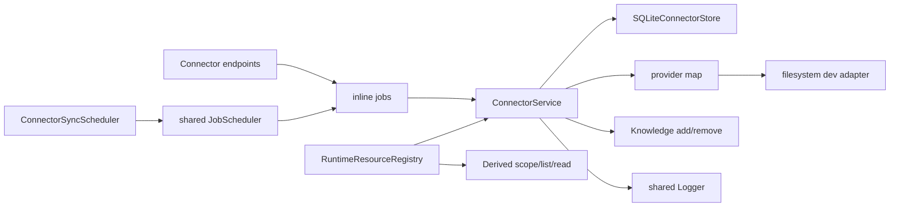
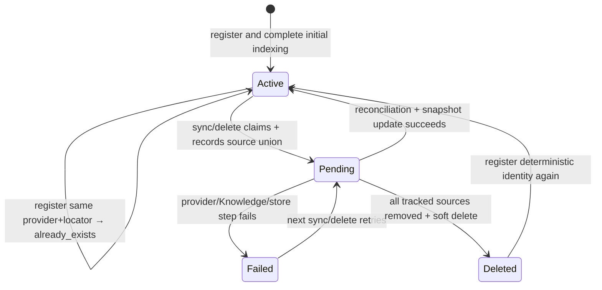

# Connector concepts

## Purpose and outcomes

A Connector turns an external locator into a stable project resource and a complete persisted item snapshot. Prose items become Knowledge sources; other items remain discoverable/readable metadata without lattice admission. Synchronization replaces the item snapshot wholesale after reconciling all current and orphaned Knowledge sources.

## Vocabulary

| Term | Current meaning |
|---|---|
| Provider | Stateless adapter that lists a locator and creates per-item readers |
| Locator | Provider-specific string; for filesystem, a file or directory path |
| Connector ID | SHA-256 of exact `${providerKind}::${locator}` |
| Item key | Provider-scoped stable item identity; filesystem uses resolved full path |
| Revision token | Provider change token; filesystem uses `${mtimeMs}-${size}` |
| Connector kind | File/directory × text/other classification derived from complete current item set |
| Prose item | Item admitted to Knowledge under a deterministic source ID |
| Other item | Persisted but not admitted to Knowledge |
| Sync claim | Atomic persisted `syncing = true` lease used by manual sync, scheduler, and delete |
| Ingestion state | `active`, `pending`, or `failed` consistency marker |
| Tracked source union | Old plus newly observed prose IDs retained while pending/failed for retry cleanup |
| Active snapshot | Item metadata and Knowledge source list known to agree after a completed reconciliation |
| Public entry | Service result; pending/failed entries expose state but withhold uncertain source IDs |

## Architecture and boundaries

Connector SQLite cannot atomically commit with Knowledge storage or an external provider. The implemented recovery boundary is intentionally small: persist `pending` before Knowledge changes, keep every possibly touched source ID, persist `active` only after reconciliation, and leave `failed` on an error. Public scope excludes uncertain source IDs until a retry completes.

## Resource classification

The capability-owned prose allowlist is `txt`, `md`, `markdown`, `rst`, `org`, `tex`, `html`, `htm`, and `log`. It is independent from General Files.

`determineKind` uses current item count and whether any item is prose:

| Items | Prose present | Connector kind |
|---:|---|---|
| exactly 1 | yes | `connector::file::text` |
| exactly 1 | no | `connector::file::other` |
| 0 or >1 | yes | `connector::directory::text` |
| 0 or >1 | no | `connector::directory::other` |

The name `text` means “contains at least one Knowledge-admitted prose item,” not that every item is prose.

## Connector lifecycle

Register indexes before inserting/restoring a row and compensates admitted sources if persistence fails. A deleted deterministic ID can be restored at prior revision +1. Re-registering an active connector returns it unchanged; it does not alter its sync interval or relist the provider.

## Synchronization model

Sync always relists the complete current provider snapshot. It diffs by item key and metadata, but final persistence replaces all item rows atomically. New/changed prose is added/upserted. Prose→other transitions, missing items, and tracked orphans are removed. Failed/pending retries force every current prose item through Knowledge add so the active boundary is re-established.

Every successful sync increments connector revision, including a snapshot with no detected metadata changes. `lastSyncedAt` is updated only when a scheduled config exists.

## Reader model

A provider creates a fresh reader per operation; no file handles persist between calls. A file connector uses `getReader`. Directory resources use `getDirectoryReader`, whose item listing comes from the persisted snapshot and whose item reader delegates to the provider.

The filesystem provider is shallow for directories: it includes direct regular-file entries only and does not recurse. Its stream path preserves split UTF-8 sequences with `StringDecoder`; a raw byte-range read decodes that selected byte slice independently.

## Context and Derived integration

An active Connector context entry resolves to all exposed `knowledgeSourceIds`. File connectors describe one public resource using connector ID; each directory item describes a separate resource using its Knowledge source ID. All item descriptors use the connector's current numeric revision. Pending/failed entries expose no source IDs and therefore do not enter a newly resolved scope.
