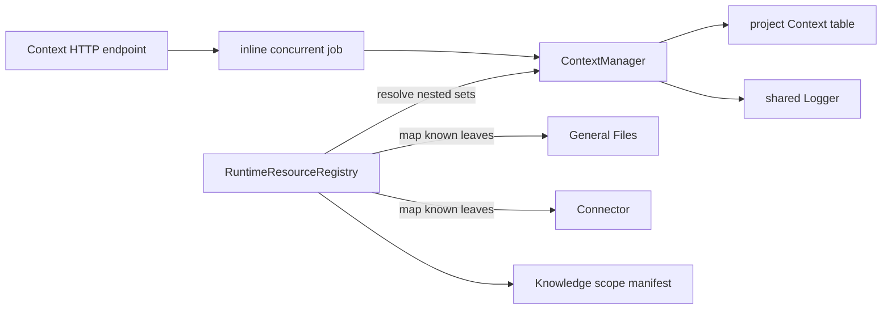
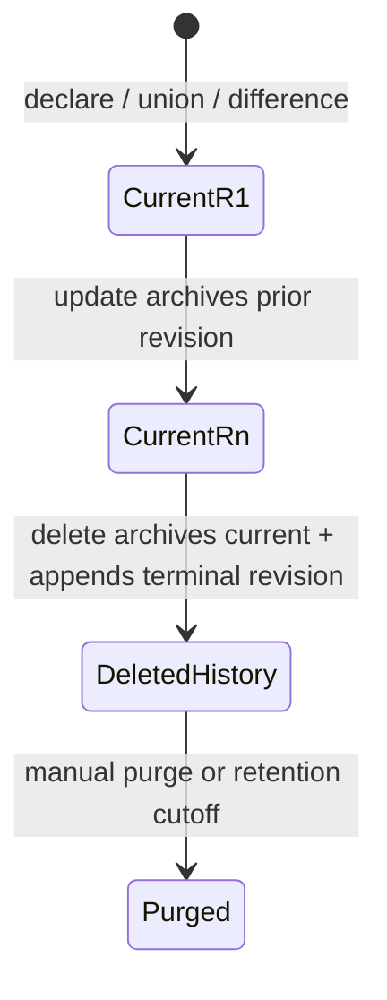
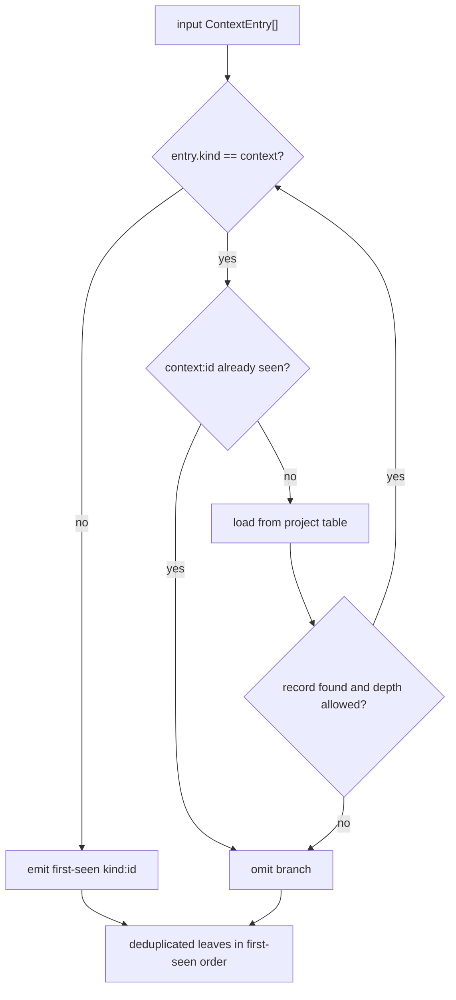

# Context concepts

## Purpose

A Context is a reusable, persisted **rule** for producing a set of references. A reference is the pair `kind:id`; Context deliberately treats non-`context` kinds as opaque, with one exception (`project`, below). This lets a caller name a scope without copying the referenced content or depending on another capability's storage shape.

A rule rather than a set, because the useful scopes are the ones that keep up. "Everything in this project except these five" is stale the moment anything is added, if what you stored was the answer instead of the question. Nothing is materialised at write time: entries expand, exclusions expand, and both happen on every resolve.

The implemented outcomes are:

- declare and replace named entry sets, each with an optional description;
- look up and list those sets;
- recursively expand nested `kind: "context"` references;
- expand `kind: "project"` into the project's current membership;
- subtract a record's `excludes` from its own expansion;
- compute union or difference in memory; and
- persist a union or difference as a new, caller-named context that continues to track its operands, and return its ID.

## Vocabulary

| Term | Meaning in the implementation |
|---|---|
| Context entry | `{ id, kind }`, with identity `${kind}:${id}` |
| Leaf | Any entry whose kind is neither `context` nor `project`; it is returned without resource validation |
| Nested context | An entry with `kind: "context"`; its `id` is loaded recursively |
| Project entry | An entry with `kind: "project"`; expands to the project's current membership, supplied by the injected `ProjectMembershipPort`. The only kind Context does not treat as opaque besides `context` |
| Exclusion | A record's `excludes`, subtracted from that record's own expansion at resolve time |
| Private context | A record created with `private: true`; hidden from default `list` calls unless `includePrivate` is passed. A visibility flag only — display names carry no special meaning. |
| Project scope | The single table derived from the configured `projectId`; there is no user scope |
| Operand | Composition input: either `{ contextId }` (load an existing context's entries) or `{ entries }` (inline) |
| Resolution depth | Recursion counter bounded by `maxResolveDepth`; over-depth branches are omitted |
| Current record | The one typed current row for a Context identity, beginning at revision 1 |
| History record | A complete superseded snapshot or terminal deletion revision retained outside the current table |

## Ownership and boundaries

Context owns reference-set persistence and recursive composition. Knowledge owns source ingestion and retrieval. General Files, Connector, Document, and future resource capabilities own their resource content and revision rules. The resource registry bridges these boundaries after Context resolution.

The manager implements the narrow `KnowledgeResourceResolver.resolve` shape, but startup injects the richer runtime resource registry into Knowledge. That registry first calls Context and then converts known resource identities to the `kind: "document"` source-ID form Knowledge expects.

## Record lifecycle

Delete removes the current row in the same SQLite transaction that archives the
last current snapshot and appends terminal revision `N + 1`. Every normal read and
nested-resolution path uses the current table only. Manual purge and shared
retention remove terminally deleted history; neither operation creates a
current record.

## Resolution lifecycle

Resolution is **per record**. Each Context resolves to its own set — its expanded entries, less its expanded excludes — and its parent sees that set. Exclusions therefore compose: a Context holding another does not inherit the other's exclusions, it inherits the other's result, which already has them applied.

Leaves pass through. A `project` entry expands to the membership port's answer, fetched at most once per call so one resolve sees one membership. A `context` entry expands to that record's resolved set. Missing records and branches beyond the configured depth are omitted on the include side.

The cycle guard is the **ancestor path**, not everything seen so far. A global "already visited, skip" would be wrong once exclusions exist: a Context reached twice by different routes must resolve to the same set both times, and a global guard would hand the second route an empty one. A per-record memo keeps a diamond from costing more than one expansion; a result truncated by the depth cap is not memoized, since that truncation belongs to the path rather than the record.

Deduplication happens once, over the final result.

## Composition semantics

`combine(a, b)` is a first-seen union over `a` followed by `b`. `difference(a, b)` preserves entries from `a` whose `kind:id` key is absent from `b`; duplicate entries already present in `a` are not independently deduplicated by `difference`. Neither function resolves nested contexts.

`composeNamed(op, a, b, displayName, options?)` persists the composition as a rule and inserts it as a new current-named record at revision 1 — reusing the same conflict check as `declare`. A `{contextId}` operand is stored as a nested `kind: "context"` reference; an inline `{entries}` operand is stored verbatim.

- **union** — both operands become `entries`.
- **difference** — the left operand becomes `entries` and the right becomes `excludes`. The same statement, made at resolve time rather than write time.

Neither materialises a leaf set, so a composition keeps tracking its operands as they change. Copying the operands' entries would have frozen them at compose time, which is the defect this shape exists to avoid.

It is the backing call for `POST /contexts/union` and `POST /contexts/difference`, which return only the new context's ID. `options.private` (default `false`) is accepted the same way `declare` accepts it; both endpoints read it from the request body.

`maxEntriesPerContext` bounds what a record *holds*, so a union of two context references is two entries regardless of how many leaves they expand to. A resolve-time expansion is not bounded by it; that was only expressible while composition materialised its result.
